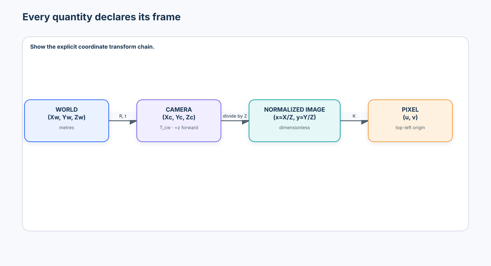
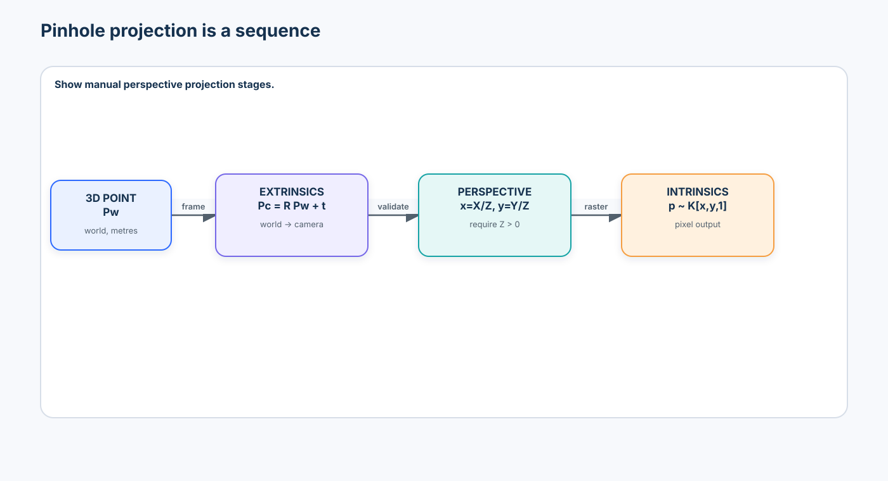
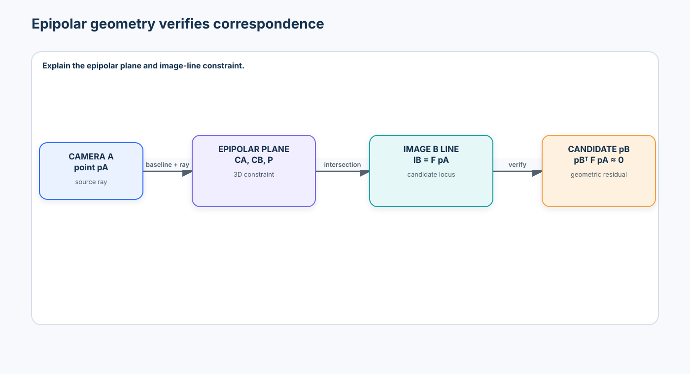
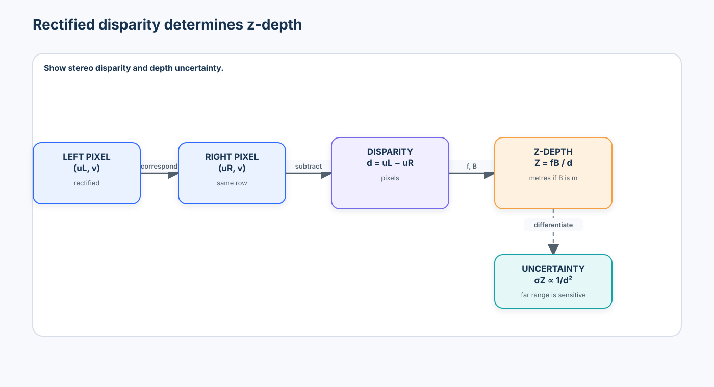
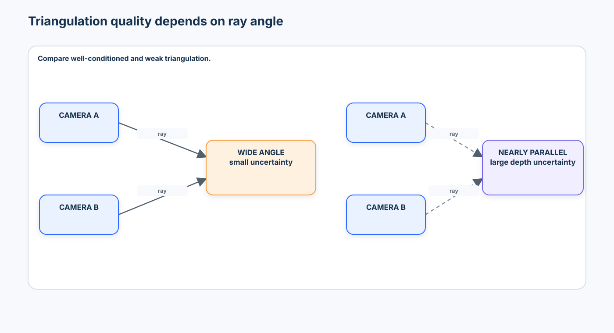
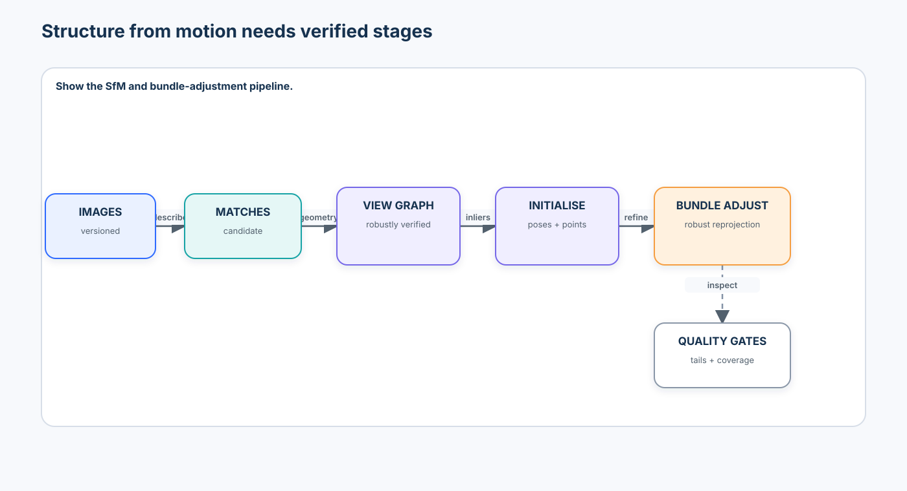
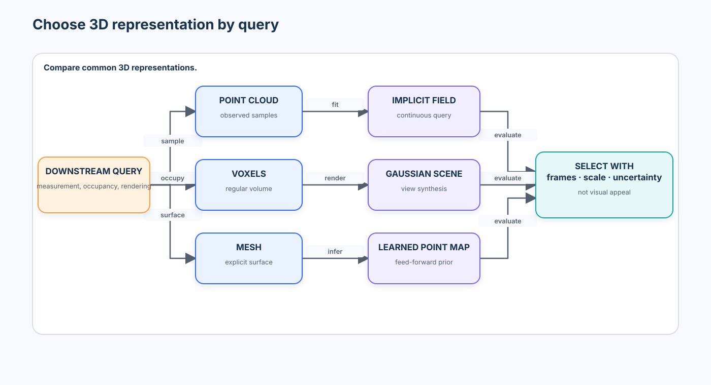
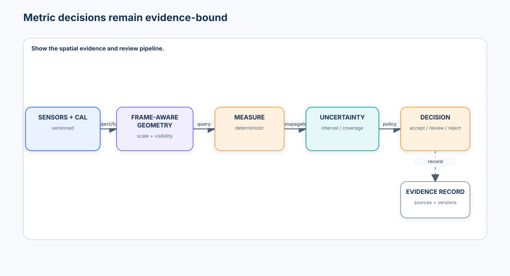

# Advanced 01 — 3D Vision & Spatial Intelligence: From Camera Geometry to Metric Scene Understanding

> **Central question:** How can a vision system recover and reason about the three-dimensional structure of the physical world from two-dimensional observations?

[← Intermediate 06 · Visual Agents](../../intermediate/06-visual-agents/README.md) · [Run the notebook](lab.ipynb) · [Advanced track](../README.md)

Images show appearance from one viewpoint. Spatial systems must also declare where a quantity lives, how the camera formed the observation, whether scale is metric, which measurements support a reconstruction, and how uncertainty changes the decision. This course moves from first-principles projective geometry to an evaluated, source-held-out spatial evidence pipeline.



## Learning contract

After this course, you should be able to:

- declare world, camera, normalized-image, and pixel coordinate frames without silently mixing conventions;
- use homogeneous coordinates and compose or invert rigid transforms with known direction and units;
- construct a pinhole camera matrix, project 3D points, and back-project pixels into rays or depth-conditioned points;
- distinguish world-to-camera extrinsics from a camera pose in world coordinates;
- explain lens distortion, calibration, viewpoint diversity, and mean/median/p95 reprojection error;
- derive epipolar lines from a fundamental matrix and use robust geometric verification to reject false matches;
- convert rectified disparity to depth and quantify how baseline, disparity error, and range affect uncertainty;
- triangulate noisy observations and identify geometrically weak ray configurations;
- distinguish relative depth, metric z-depth, and Euclidean range, then evaluate valid pixels and depth boundaries;
- estimate camera pose conceptually with PnP and explain structure from motion and bundle adjustment;
- create frame-aware point clouds and compare points, voxels, meshes, implicit fields, Gaussians, and learned point maps;
- compute metric distances, plane clearances, occlusion, and qualitative spatial relations with uncertainty;
- evaluate pose, projection, depth, and reconstruction separately on source-held-out data; and
- place classical geometry, optimization-based reconstruction, monocular foundation depth, and feed-forward 3D models in one governed production design.

### Prerequisites and transition

Complete the Beginner courses on [Vision Transformers](../../beginner/03-vision-transformers/README.md), [Object Detection](../../beginner/05-object-detection/README.md), [Segmentation](../../beginner/06-segmentation-promptable-segmentation/README.md), and [Tracking & Pose](../../beginner/08-tracking-keypoints-pose/README.md), plus Intermediate [Video-Language Understanding](../../intermediate/05-video-language-understanding/README.md) and [Visual Agents](../../intermediate/06-visual-agents/README.md).

```text
2D evidence contracts → coordinates and cameras → multi-view constraints
→ depth and pose → 3D reconstruction → metric spatial evidence
```

The Intermediate track asked which bounded evidence action to take next. Advanced 01 asks whether observations can be placed into one physically meaningful frame before an agent uses them.

### Scenario, success criteria, and boundaries

The notebook models a calibrated stereo inspection rig measuring a cube-shaped valve assembly above a factory floor. Site A constructs the geometry and calibration procedure. Site B selects matching, reconstruction-confidence, and clearance-review thresholds. Those choices are hashed and frozen before Site C is opened for reporting.

Success requires more than an attractive point cloud. The system must preserve frames and units, satisfy projection and transform invariants, reject correspondence outliers, report calibration tails, keep relative and metric depth contracts distinct, measure reconstruction and pose errors, attach uncertainty to clearance, and escalate when the physical decision is not robust to that uncertainty.

The default notebook is deterministic, credential-free, CPU-safe, and synthetic. It is a geometric-methodology lab, not evidence that a synthetic benchmark predicts a particular camera, depth model, or production site. Optional model adapters are disabled and revision-pinned. No remote code or weights run by default.

### Non-goals

This is not a survey of every SLAM package, a photogrammetry recipe, a neural-rendering course, a leaderboard reproduction, or proof that monocular depth is adequate for safety-critical metrology. Gaussian splatting, dynamic reconstruction, robotics, and language-aligned spatial models are bridges to later Advanced courses.

## 1. Spatial intelligence begins with contracts

Recognition can return “valve.” Metric reasoning asks: where is it, how far from the floor is it, which camera observed it, what units are used, and how uncertain is the answer?

```text
2D observation
  → camera model and calibration
  → correspondence or learned prior
  → depth and pose
  → shared 3D representation
  → measured relation + uncertainty
  → accept / review / reject
```

Every material geometric value needs at least:

```json
{
  "value": [0.18, -0.04, 2.35],
  "frame": "camera_left",
  "unit": "metre",
  "quantity": "xyz_point",
  "source": "stereo_pair_004",
  "uncertainty": {"sigma_xyz_m": [0.002, 0.002, 0.018]}
}
```

> **Course rule:** every geometric quantity must declare its coordinate frame, units, convention, and provenance.

## 2. Coordinate frames and conventions

Four spaces appear repeatedly:

```text
World coordinates
      ↓ world-to-camera extrinsics
Camera coordinates
      ↓ perspective division
Normalized image plane
      ↓ intrinsics and raster convention
Pixel coordinates
```

A world point in homogeneous coordinates is

$$
\mathbf{P}_w = [X_w,\,Y_w,\,Z_w,\,1]^T.
$$

Its numbers are meaningless without a frame. `[0, 0, 1]` could mean one metre in front of a camera, one millimetre above a robot base, or a coordinate expressed in a different handedness.

### Convention table

| Context | Handedness / axes | Camera forward | Image origin and y | Course policy |
| --- | --- | --- | --- | --- |
| This course / OpenCV-style camera math | right-handed camera frame by declared basis | `+z` | top-left; `+u` right, `+v` down | canonical notebook convention |
| OpenGL-style viewing | commonly right-handed world/view convention | camera looks along `-z` in view space | raster/API dependent | convert explicitly at boundary |
| Robotics frames | commonly REP-103 right-handed | sensor-frame dependent | optical frames have a separate convention | name parent/child frames |
| Image array | not a 3D frame | n/a | row increases down, column right | never treat row/column as x/y silently |

Libraries differ. Never repair a mirrored reconstruction by sprinkling minus signs into downstream code. Write a tested transform at the boundary.

### Homogeneous coordinates

Appending one coordinate lets translation join rotation inside a matrix:

$$
(x,y)\rightarrow(x,y,1), \qquad (X,Y,Z)\rightarrow(X,Y,Z,1).
$$

A rigid transform mapping coordinates from frame B into frame A is

$$
T_{AB}=
\begin{bmatrix}
R_{AB} & t_{AB}\\
0 & 1
\end{bmatrix}.
$$

If $T_{AB}$ maps B to A and $T_{BC}$ maps C to B, then $T_{AC}=T_{AB}T_{BC}$. Transform direction is part of the symbol, not a comment.

The notebook makes this executable with separate `FramedPoints` and `RigidTransform` contracts. A transform declares source frame, target frame, and translation unit; `transform_points` rejects a frame or unit mismatch before matrix multiplication. The negative test deliberately combines `1000 mm` points with a metre-valued translation and verifies rejection. Conversion, when intended, must be explicit at a system boundary rather than inferred from magnitudes.

## 3. The pinhole camera

For a camera-frame point $\mathbf{P}_c=(X,Y,Z)$ with $Z>0$, normalized image coordinates are

$$
x=\frac{X}{Z}, \qquad y=\frac{Y}{Z}.
$$

The division by depth creates perspective: equal physical lengths appear smaller farther away.



Camera intrinsics are

$$
K=
\begin{bmatrix}
f_x & s & c_x\\
0 & f_y & c_y\\
0 & 0 & 1
\end{bmatrix},
$$

where focal lengths are measured in pixels, $(c_x,c_y)$ is the principal point, and skew $s$ is usually near zero. World-to-camera extrinsics map

$$
\mathbf{P}_c=R\mathbf{P}_w+t.
$$

Projection combines both:

$$
\mathbf{p}\sim K[R\mid t]\mathbf{P}_w.
$$

The camera centre in world coordinates is $C_w=-R^Tt$. Confusing $t$ with the camera position is a common and consequential error.

### Projection invariants

The notebook implements `project_points` without starting from `cv2.projectPoints` and asserts that:

- a point on the optical axis projects to the principal point;
- multiplying a camera-ray point by positive scale leaves its pixel unchanged;
- points with non-positive camera z are rejected rather than projected behind the camera; and
- world-to-camera and camera-to-world transforms round-trip numerically.

## 4. Back-projection: a pixel is a ray

For homogeneous pixel $\mathbf{p}=(u,v,1)^T$,

$$
\mathbf{r}\propto K^{-1}\mathbf{p}.
$$

One pixel does not identify one 3D point. It identifies infinitely many positions along a ray. If the contract provides camera-axis z-depth $Z$, then

$$
\mathbf{P}_c=ZK^{-1}\mathbf{p}.
$$

If it provides Euclidean range $\rho$, normalize the ray and use $\rho\,\mathbf{r}/\|\mathbf{r}\|$. Away from the optical axis, z-depth and range differ. A field named `depth` without this definition is incomplete.

## 5. Distortion and calibration

Real lenses deviate from the pinhole model. Radial distortion bends straight lines outward (barrel) or inward (pincushion); tangential distortion captures decentring. A common model applies radial factors based on $r^2=x^2+y^2$ and tangential offsets before intrinsics map normalized coordinates to pixels.

Calibration estimates intrinsics and distortion from known target geometry:

```text
known target points → observed corners across diverse views
→ parameter estimate → reproject → inspect residuals and coverage
```

The lab uses a transparent linear projection-matrix estimate on synthetic 3D–2D correspondences, then shows why this is a teaching baseline rather than an intrinsic/distortion calibrator. Established tools such as OpenCV refine a nonlinear camera and distortion model over multiple target views.

For observed $\mathbf{p}_i$ and reprojected $\hat{\mathbf{p}}_i$,

$$
e_i=\|\mathbf{p}_i-\hat{\mathbf{p}}_i\|_2.
$$

Always report distribution and coverage, not only mean error. The notebook reports mean, median, and p95 for a controlled distortion-coverage experiment: central-only observations hide much of the injected edge distortion. It does **not** claim to fit and compare a weak near-frontal calibration against a diverse multi-view calibration. DLT is presented separately as projection estimation. A production calibration study should fit both view sets and evaluate held-out reprojection across the full sensor.

### Calibration failure modes

| Failure | Misleading symptom | Mitigation |
| --- | --- | --- |
| weak viewpoint diversity | low residuals near sampled poses | tilt, translate, and scale target coverage |
| target occupies a small area | good centre, poor edges | cover the full sensor |
| wrong square size | reprojection looks good, metric scale is wrong | record target version and verified units |
| blur or corner error | heavy-tailed residuals | quality gate corners and report p95 |
| resolution/crop change | principal point and focal length mismatch | version calibration by sensor mode |
| focus or zoom change | effective intrinsics drift | lock optics or recalibrate per state |

Low reprojection error on weak calibration views does not guarantee good geometry elsewhere.

## 6. Correspondence and geometric verification

Correspondence asks which observations came from the same physical scene point. Corners and local descriptors, learned local features, dense matching, and foundation features propose candidates. Similarity alone is not proof because repeated texture, symmetry, blur, lighting, and occlusion create plausible false matches.

```text
features A ↘              ↗ features B
            candidate matches
                    ↓
            geometric verification
                    ↓
             inliers + uncertainty
```

The lab injects false correspondences, estimates geometry with a transparent normalized eight-point algorithm, and applies RANSAC. A production system may use OpenCV, COLMAP, or a learned matcher, but it still needs explicit thresholds, degeneracy checks, provenance, and failure slices.

## 7. Epipolar geometry

Two camera centres and a 3D point define an epipolar plane. Its intersections with the image planes are epipolar lines.



For corresponding pixels $\mathbf{p}_A$ and $\mathbf{p}_B$,

$$
\mathbf{p}_B^T F\mathbf{p}_A=0.
$$

The fundamental matrix maps a point to a line, $\ell_B=F\mathbf{p}_A$, in pixel coordinates. With calibrated cameras,

$$
E=K_B^TFK_A, \qquad E=[t]_\times R.
$$

$F$ describes uncalibrated pixel geometry; $E$ describes calibrated normalized-camera geometry. A small algebraic residual is not yet a pixel distance, so the lab uses a symmetric/Sampson-style geometric residual for robust fitting.

## 8. Rectified stereo, disparity, and depth

Rectification moves epipolar lines onto common image rows. Disparity is

$$
d=u_L-u_R,
$$

and ideal rectified depth is

$$
Z=\frac{fB}{d},
$$

where $f$ is pixel focal length and $B$ is baseline in the output distance unit.



Large disparity means nearer depth. Small disparity means farther depth. With disparity uncertainty $\sigma_d$,

$$
\left|\frac{\partial Z}{\partial d}\right|=\frac{fB}{d^2},
\qquad
\sigma_Z\approx\frac{fB}{d^2}\sigma_d.
$$

At long range, tiny disparity errors produce large depth errors. Increasing baseline improves depth sensitivity, but increases occlusion, matching difficulty, rig size, and loss of shared field of view. There is no universal best baseline.

## 9. Triangulation and conditioning

Triangulation estimates a point whose projections agree with observations from multiple cameras. With noise, rays rarely intersect exactly. Linear DLT minimizes an algebraic objective; stronger systems minimize geometric reprojection error and propagate uncertainty.



The lab projects known points, adds pixel noise, triangulates them, and measures 3D and reprojection error. A Monte Carlo experiment demonstrates that wide intersection angles are better conditioned than nearly parallel rays. “Triangulated” is not equivalent to “trustworthy.”

## 10. Monocular depth contracts

A learned monocular model can infer dense structure from one RGB image, but its output contract matters:

| Contract | Valid claim | Invalid shortcut |
| --- | --- | --- |
| relative depth / disparity-like output | A is nearer than B; shape ordering | “A is 2.3 m away” without scale recovery |
| metric z-depth | camera-axis depth in declared units and camera model | Euclidean range without conversion |
| metric point map | per-pixel 3D coordinates in a declared frame | shared world coordinates without alignment |
| depth + uncertainty | predictive estimate plus stated uncertainty semantics | calibrated probability without validation |

A small nearby object and a large distant object can form similar projections. Learned priors reduce ambiguity statistically; they do not remove the need to validate camera, domain, scale, boundaries, and uncertainty.

### 2026 model landscape

| Family | Contract and contribution | Governance / selection notes |
| --- | --- | --- |
| Depth Anything V2 | strong general relative-depth family plus separately fine-tuned metric variants | Small code/weights are Apache-2.0; larger official weights carry non-commercial terms; pin processor, weights, and interpolation path |
| UniDepthV2 | monocular metric point/depth prediction with camera-aware representation and uncertainty output | evaluate zero-shot metric scale, camera shift, uncertainty calibration, license, and preprocessing |
| DUSt3R / MASt3R / MUSt3R | learned point maps and correspondence bridge pairwise/multi-view geometry | research code and checkpoint licenses can restrict commercial use; alignment still needs inspection |
| VGGT | feed-forward cameras, depth, point maps, and tracks for one or more views | one commercial checkpoint has distinct terms; memory grows with views and outputs still need geometric validation |
| VGGT-Ω | 2026 research system improving scalable static/dynamic reconstruction with register-mediated exchange | gated checkpoint, CUDA-scale runtime, and FAIR non-commercial research license; not the default lab |

This is a contract taxonomy, not a leaderboard. A relative-depth model, a metric monocular model, and a multi-view reconstructor solve different tasks.

## 11. Evaluating depth

Given valid ground-truth depth $D_i$ and prediction $\hat D_i$:

$$
\mathrm{AbsRel}=\frac{1}{N}\sum_i\frac{|D_i-\hat D_i|}{D_i},
$$

$$
\mathrm{RMSE}=\sqrt{\frac{1}{N}\sum_i(D_i-\hat D_i)^2}.
$$

Threshold accuracy can report the fraction satisfying

$$
\max\left(\frac{D_i}{\hat D_i},\frac{\hat D_i}{D_i}\right)<1.25.
$$

The valid mask must specify missing sensor values, range limits, crop, and occlusion policy. Evaluate object boundaries and thin structures separately because global averages can hide foreground/background bleeding. Relative predictions may be aligned by scale and shift for shape evaluation, but the resulting number must not be relabelled metric performance.

## 12. Pose, transform composition, and PnP

Camera pose is position plus orientation relative to a named frame. The same $R,t$ values can mean different directions. This course uses $T_{cw}$ for world-to-camera and $T_{wc}=T_{cw}^{-1}$ for camera pose in world.

For a rigid transform,

$$
T^{-1}=
\begin{bmatrix}
R^T & -R^Tt\\
0 & 1
\end{bmatrix}.
$$

Perspective-n-Point estimates camera pose from 3D points with corresponding 2D observations. The notebook optimizes a small six-degree pose after teaching the projection primitive, then reports rotation, translation, and reprojection error. Robust PnP additionally needs outlier handling and degeneracy checks.

## 13. Structure from motion and bundle adjustment

Structure from motion jointly recovers camera motion and sparse structure:

```text
images → features → matches → verified view graph
→ initialize cameras and points → add views → triangulate
→ bundle adjustment → inspect residuals and coverage
```



Bundle adjustment refines camera and point parameters by minimizing reprojection error:

$$
\min_{\{T_j\},\{P_i\}}
\sum_{(i,j)\in\mathcal O}
\rho\!\left(\|p_{ij}-\pi(T_j,P_i)\|^2\right),
$$

where $\rho$ is often a robust loss. Gauge freedom means an unanchored reconstruction can translate, rotate, and—under monocular geometry—scale without changing projections. Fix a reference frame and establish scale with a known baseline, object, depth sensor, or other metric constraint.

The notebook implements a compact reconstruction and point-only reprojection refinement with fixed calibrated cameras. This makes the objective visible without pretending to replace a complete COLMAP-style system.

## 14. Point clouds and frames

Back-projecting a depth image creates camera-frame points. To fuse cameras, transform every point into one declared world frame. Keep colors, confidence, source pixel, timestamp, and sensor version as attributes rather than discarding provenance.

Point clouds have no implicit surface. Density depends on range and sampling; occluded surfaces are missing; mixed frames can look plausible while being wrong. The lab voxelizes points, fits a plane with SVD, and measures component-to-plane clearance.

## 15. Choosing a 3D representation



| Representation | Strength | Limitation | Best-fit question |
| --- | --- | --- | --- |
| point cloud | direct measured samples; simple provenance | no explicit surface or topology | where were surfaces observed? |
| voxel / occupancy grid | regular neighbourhoods; collision queries | cubic memory with resolution | which volume is occupied? |
| mesh | explicit surface and connectivity | reconstruction/topology errors | what surface can be rendered or manufactured? |
| signed/occupancy implicit field | continuous surface queries | costly fitting/rendering; hidden uncertainty | where is the boundary at arbitrary resolution? |
| Gaussian scene | fast differentiable view synthesis | appearance quality can hide geometry error | how should a calibrated scene render? |
| learned point map / latent | feed-forward geometric priors | frame, scale, confidence, and domain need validation | what geometry can be inferred rapidly from views? |

Do not choose a representation because it produces the most compelling viewer. Choose it for the downstream query, scale, update pattern, uncertainty, interoperability, and audit needs.

## 16. Occlusion and visibility

Projection is many-to-one: multiple 3D points can share a pixel ray, and the nearest visible surface hides points behind it. A z-buffer keeps the nearest z-depth per pixel. Missing points behind a surface are not empty free space.

Visibility matters to matching, depth edges, fusion, change detection, and spatial language. “Behind” can mean farther along a camera ray, occluded in one view, or located behind an object in world coordinates; name the relation and frame.

## 17. Metric spatial reasoning

Once objects and surfaces share a metric frame, deterministic geometry should answer exact questions:

- Euclidean distance between two 3D landmarks;
- signed point-to-plane distance;
- height above a fitted floor;
- left/right, above/below, and in-front/behind in a named reference frame;
- overlap of 3D bounds; and
- whether a clearance threshold remains satisfied under uncertainty.

The course does not ask a language model to calculate these values. A VLM may propose entities or relations; calibrated geometry computes them, and evidence binds the result back to observations.



## 18. Uncertainty is part of the answer

Sources include calibration residuals, pixel localization, correspondence ambiguity, disparity noise, pose uncertainty, scale error, learned-model uncertainty, temporal misalignment, and domain shift. These errors are correlated; a single scalar confidence cannot describe all of them.

The notebook combines analytic stereo sensitivity with a deliberately partial Monte Carlo experiment. The clearance artifact labels its result `teaching_interval_under_point_noise_model` and records exactly what was included—synthetic point perturbation and floor-plane refitting—and excluded, including calibration covariance, correspondence bias, pose uncertainty, and systematic scale error. It is not presented as a complete 95% coverage interval for the measurement system. Under that stated model, a clearance estimate becomes a distribution and a decision interval:

```text
lower bound above limit → accept
interval crosses limit  → review
upper bound below limit → reject
```

This is a teaching policy, not a universal safety standard. Production limits must come from system hazard analysis and measurement-system validation.

## 19. Evaluation is multi-dimensional

| Layer | Measures | Important slices |
| --- | --- | --- |
| calibration | mean/median/p95 reprojection; spatial coverage | image centre vs edge, view angle, focus/resolution |
| correspondence | precision/recall, inlier rate, Sampson residual | repeated texture, occlusion, baseline, lighting |
| raw relative depth | rank correlation, pairwise ordering accuracy, scale/shift-invariant normalized shape error | object, boundary, source, valid mask |
| metric depth | AbsRel, RMSE in metres, $\delta_1$, edge RMSE | range, object, boundary, source, valid mask |
| pose | rotation error, translation error, AUC/threshold success | motion size, blur, overlap, sequence |
| reconstruction | accuracy, completeness, explicitly defined symmetric mean NN distance, F-score at stated tolerance | range, surface orientation, visibility |
| spatial decision | distance error, interval coverage, review/unsafe decision rate | clearance band, source, calibration version |
| systems | latency, memory, throughput, failure rate | view count, resolution, hardware, cold/warm |

The notebook avoids an ambiguous bare “Chamfer” label: `symmetric_mean_nn_distance_m` is the sum of prediction-to-reference and reference-to-prediction mean Euclidean nearest-neighbour distances. Squared-distance and differently normalized Chamfer conventions also exist. This metric can still hide local structure and density bias. F-score depends on a tolerance that must include units. Attractive novel views do not establish metric accuracy.

## 20. Source-held-out evaluation

The lab keeps source roles explicit:

```text
Site A → construct geometry and calibration procedure
Site B → select thresholds and mitigation
freeze configuration + hash
Site C → reporting only; no threshold or policy changes
```

Site C changes pixel noise, calibration bias, outlier rate, and geometry. In the parallel-stereo example, focal-length drift can preserve apparently good epipolar consistency while corrupting metric reconstruction scale; epipolar residuals alone therefore cannot certify calibration. The report separates reprojection, correspondence, depth, reconstruction, and clearance-decision failures so one aggregate cannot conceal the cause.

## 21. Failure taxonomy

| Failure | Evidence | Correct response |
| --- | --- | --- |
| frame mismatch | mirrored/shifted geometry despite plausible points | reject fusion; validate transform chain |
| unit mismatch | consistent 1000× scale error | enforce typed units at boundary |
| calibration drift | edge residual and p95 rise | quarantine sensor mode; recalibrate |
| repeated-texture match | low descriptor distance, high epipolar residual | geometric verification / review |
| weak baseline | unstable far depth | adjust rig or restrict range |
| relative-as-metric misuse | good ordering, wrong absolute clearance | require metric scale evidence |
| occlusion hallucinated as free space | missing surface interpreted as empty | preserve visibility/unknown state |
| source shift | Site C tail and decision error rise | review, collect data, revise in a new version |
| visually good, metrically wrong model | attractive rendering, poor geometry metrics | gate on task geometry, not aesthetics |

## 22. Technology landscape

| Tool | Role | What it makes easier | What it can hide |
| --- | --- | --- | --- |
| NumPy / SciPy | transparent projection, DLT, optimization, metrics | mechanics and assertions | production degeneracy and scale |
| OpenCV | calibration, feature geometry, PnP, stereo | mature primitives and common I/O | convention, default, and threshold choices |
| COLMAP | incremental/global SfM and multi-view stereo | end-to-end reconstruction baseline | feature/view-graph failure behind a final model |
| Open3D | RGB-D, clouds, registration, meshing, visualization | geometry containers and algorithms | unit/frame mistakes inside convenient objects |
| PyTorch3D | differentiable 3D structures and rendering | learning/rendering integration | build/device constraints and renderer conventions |
| Nerfstudio / gsplat | neural and Gaussian scene workflows | training, viewers, export | image quality mistaken for geometry quality |
| Depth Anything / UniDepth | monocular relative or metric priors | dense single-image estimates | scale/camera/domain contract mismatch |
| DUSt3R family / VGGT family | feed-forward multi-view geometry | fewer hand-built stages | memory, licenses, uncertainty, and opaque failures |

The core notebook uses standard NumPy, SciPy, pandas, Matplotlib, and Pillow. Optional OpenCV, Open3D, learned-depth, and feed-forward reconstruction paths belong in isolated environments and are not required to understand or execute the geometric primitives.

## 23. Optional model governance

The notebook declares immutable repository revisions:

```text
Depth Anything V2  a561b849ebae10a6f5ef49e26c83cbbcd36c71bf
UniDepth            8d8cfe4c7ee15297099983607febf0d4f32eb3d6
VGGT                a288dd0f14786c93483e45524328726ab7b1b4ce
VGGT-Ω              b2c61f6631d9f344a2d914bfba5d9529d6fc1d35
COLMAP              d3ccaf358e00936db2bd290f2623a652b00e80bb
Open3D              1a9eb990f9a20936c30c428568c602bdef760744
```

These pins describe sources reviewed for this lesson, not a promise that their dependencies interoperate. Before use, review checkpoint hash, license, gated access, remote code, preprocessing, camera convention, output units, valid-mask behavior, memory, target hardware, dataset rights, and domain evidence. `trust_remote_code=False` is the default where a common SDK path exists.

## 24. Enterprise architecture

```text
versioned sensors + calibration registry
  → timestamp / frame graph / synchronization
  → quality-gated observations
  → classical or learned geometry workers
  → alignment + uncertainty + visibility
  → spatial store / scene representation
  → deterministic measurement service
  → policy decision + human review
  → audit, drift monitoring, rollback
```

Production additions include immutable calibration versions, time synchronization, frame-graph validation, device health, data retention, privacy masking, model/checkpoint registry, hardware-specific benchmarks, safe degradation, review queues, and replayable evidence. A calibration update, model update, or unit/convention change creates a new evidence version; it must not silently rewrite old decisions.

## 25. Notebook journey

The lab runs in this order:

1. declare frames, units, camera models, and source roles;
2. build a cube/floor scene and manually project it;
3. back-project rays and compare z-depth with range;
4. inject radial distortion and show how central-only coverage hides edge residuals;
5. generate correspondences, outliers, epipolar lines, and RANSAC inliers;
6. sweep disparity, baseline, noise, and range;
7. triangulate and measure conditioning through Monte Carlo trials;
8. compare relative and metric depth contracts and boundary metrics;
9. recover pose and verify transform composition/inversion;
10. reconstruct and refine a multi-view point cloud;
11. voxelize, fit a floor, test occlusion, and measure clearance;
12. freeze Site B policy, report Site C, and save an evidence artifact; and
13. inspect optional tool/model adapters without executing them.

## 26. Review checkpoint

You should now be able to explain without code:

1. Why does a pixel identify a ray rather than a unique 3D point?
2. Why is camera translation in $[R\mid t]$ not usually the camera centre?
3. How can calibration have low mean reprojection error and still fail at image edges?
4. Why does similarity matching need epipolar verification?
5. Why does the same disparity error hurt far-depth estimates more?
6. Why can increasing stereo baseline both help and hurt?
7. Why may two rays yield an uncertain point even when triangulation returns a number?
8. Why can relative depth be excellent while metric clearance is wrong?
9. What gauge freedoms must an SfM system fix?
10. Why is an unseen region not equivalent to empty space?
11. Why can a visually convincing 3D rendering be metrically unsafe?
12. Which evidence must accompany a claim that two components are 8 cm apart?

## 27. Exercises

- **Implementation:** add tangential distortion and numerically invert the distortion for back-projection.
- **Diagnosis:** add an explicit, audited millimetre-to-metre conversion boundary and prove that implicit mixing remains rejected.
- **Experiment:** compare depth uncertainty across baseline, focal length, range, and pixel noise.
- **Evaluation:** add a surface-normal error slice and explain what symmetric mean nearest-neighbour distance missed.
- **Architecture:** design a calibration registry with device, resolution, focus state, timestamps, and rollback.
- **Governance:** write an acceptance policy for an optional metric-depth model without treating model confidence as calibrated uncertainty.

## 28. References

### Geometry, calibration, and reconstruction

- Hartley and Zisserman, [*Multiple View Geometry in Computer Vision*, 2nd edition](https://www.robots.ox.ac.uk/~vgg/hzbook/).
- Zhang, [A Flexible New Technique for Camera Calibration](https://doi.org/10.1109/34.888718), IEEE TPAMI, 2000.
- Fischler and Bolles, [Random Sample Consensus](https://doi.org/10.1145/358669.358692), CACM, 1981.
- Triggs et al., [Bundle Adjustment — A Modern Synthesis](https://doi.org/10.1007/3-540-44480-7_21), 2000.
- Schönberger and Frahm, [Structure-from-Motion Revisited](https://demuc.de/papers/schoenberger2016sfm.pdf), CVPR 2016, and the [COLMAP documentation](https://colmap.github.io/).
- OpenCV, [Camera calibration and 3D reconstruction API](https://docs.opencv.org/4.x/d9/d0c/group__calib3d.html).
- Zhou, Park, and Koltun, [Open3D: A Modern Library for 3D Data Processing](https://arxiv.org/abs/1801.09847) and [official documentation](https://www.open3d.org/docs/latest/).

### Learned depth and feed-forward geometry

- Yang et al., [Depth Anything V2](https://arxiv.org/abs/2406.09414), NeurIPS 2024, and the [official repository](https://github.com/DepthAnything/Depth-Anything-V2).
- Piccinelli et al., [UniDepthV2](https://arxiv.org/abs/2502.20110), 2025, and the [official repository](https://github.com/lpiccinelli-eth/UniDepth).
- Wang et al., [DUSt3R: Geometric 3D Vision Made Easy](https://arxiv.org/abs/2312.14132), CVPR 2024.
- Leroy et al., [Grounding Image Matching in 3D with MASt3R](https://arxiv.org/abs/2406.09756), ECCV 2024.
- Wang et al., [VGGT: Visual Geometry Grounded Transformer](https://arxiv.org/abs/2503.11651), CVPR 2025.
- Wang et al., [VGGT-Ω](https://arxiv.org/abs/2605.15195), CVPR 2026, with [official project page](https://vggt-omega.github.io/).

## 29. Transition to Advanced 02

This course establishes cameras, geometry, depth, pose, reconstruction, representation, metric relations, and uncertainty. Continue to [Advanced 02 · Neural Rendering & 3D Scene Representations](../02-neural-rendering-3d-scene-representations/README.md) to learn how NeRF-style fields and Gaussian primitives synthesize new views while keeping appearance, geometry, efficiency, and provenance accountable.
