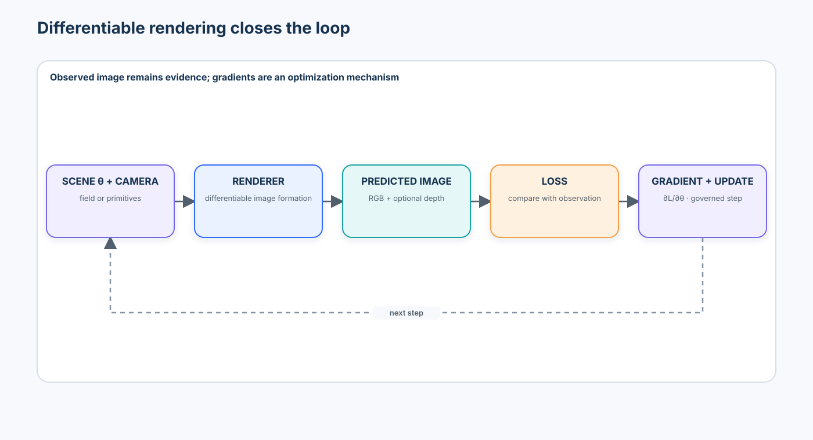
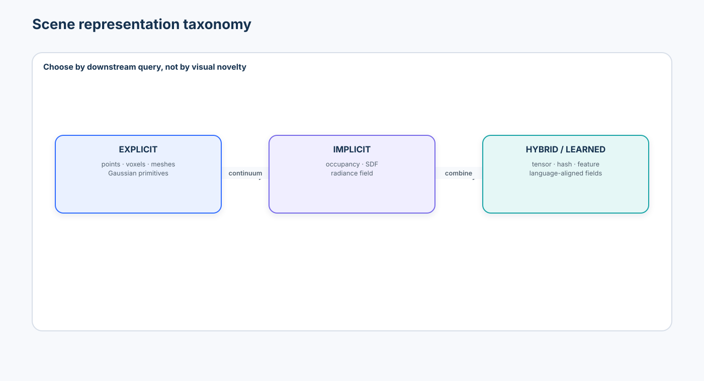
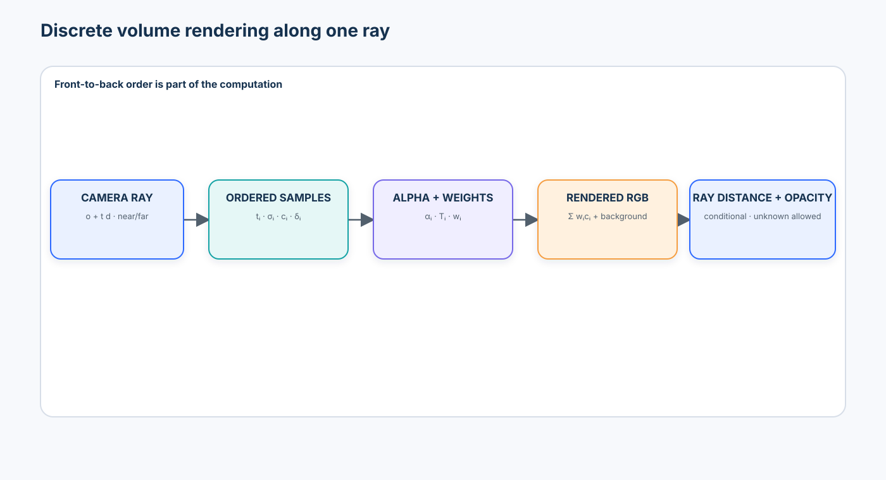
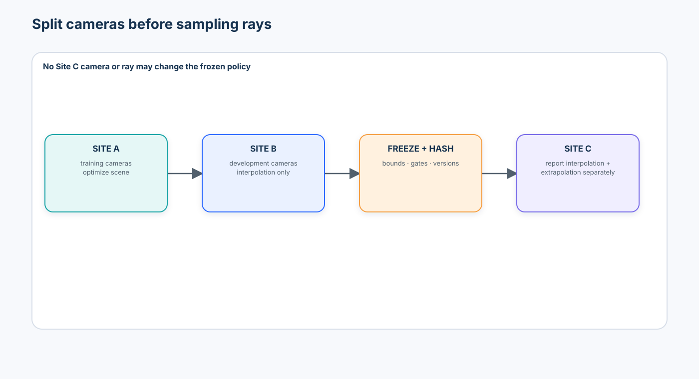
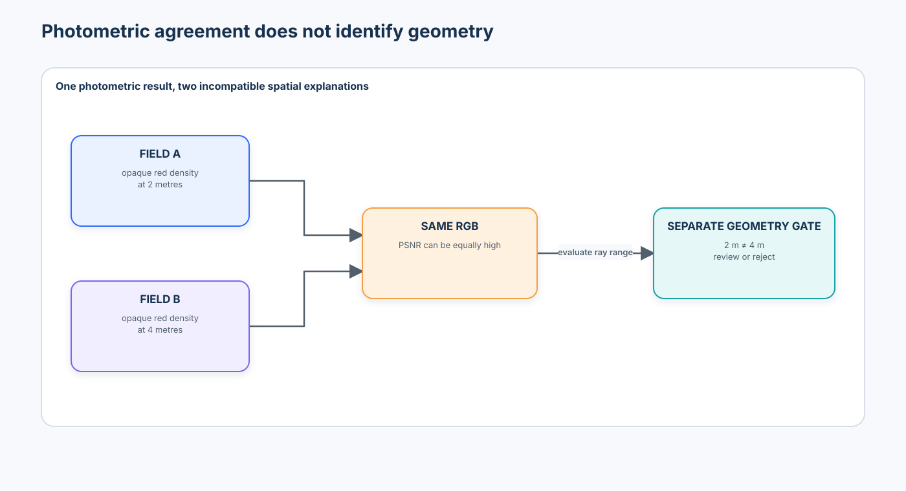
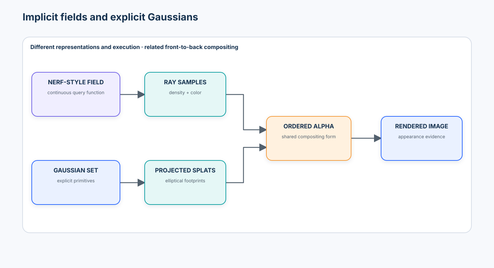
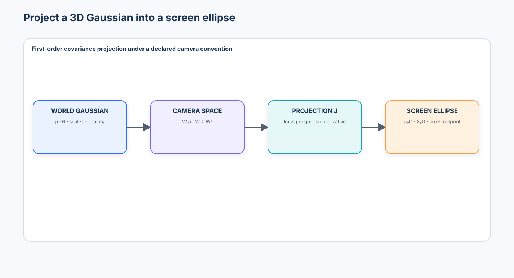
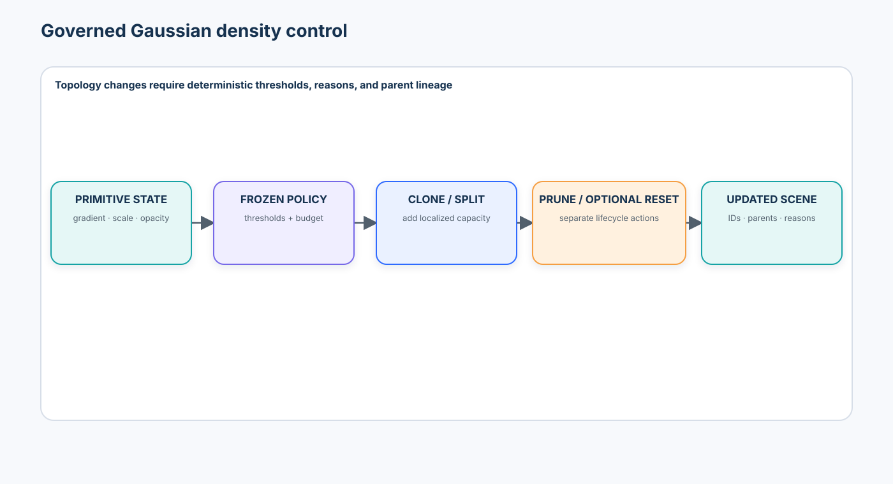

# Advanced 02 — Neural Rendering & 3D Scene Representations: From NeRFs to 3D Gaussian Splatting

> **Central question:** How can calibrated observations become a learnable scene representation for novel-view synthesis—and what evidence is required before treating that representation as physical geometry?

[← Advanced 01 · 3D Vision & Spatial Intelligence](../01-3d-vision-spatial-intelligence/README.md) · [Run the notebook](lab.ipynb) · [Advanced track](../README.md)

Advanced 01 recovered explicit, frame-aware geometry from calibrated observations. This course introduces a different reconstruction signal: render a predicted observation, compare it with the captured image, and optimize the scene representation through the image-formation process. That signal can produce remarkable novel views. It can also absorb pose, exposure, geometry, and appearance errors into a visually convincing but physically unreliable scene.



## Learning contract

After this course, you should be able to:

- distinguish explicit primitives, implicit functions, and hybrid learned scene representations;
- generate world-space camera rays with declared intrinsics, extrinsics, frame, unit, near bound, and far bound;
- derive discrete volume-rendering alpha, transmittance, weights, color, opacity, and expected depth;
- implement and assertion-test front-to-back compositing without a rendering framework;
- explain radiance fields, density, view-dependent color, Fourier features, hierarchical sampling, and empty-space skipping;
- train a bounded differentiable rendering parameter through an observable loss and gradient;
- separate camera-held-out interpolation from extrapolation and reject ray-level leakage;
- measure PSNR and SSIM for appearance while evaluating depth and geometry independently;
- demonstrate how similar rendered RGB can coexist with incompatible depth;
- explain NeRF failure modes including floaters, sparse-view ambiguity, pose error, exposure shift, and excessive appearance flexibility;
- construct an anisotropic 3D Gaussian from position, rotation, scale, opacity, and appearance;
- project a 3D covariance into a 2D ellipse with a camera-space Jacobian;
- implement a small CPU splatter and connect its alpha compositing to volume rendering;
- explain Gaussian densification, splitting, cloning, pruning, opacity reset, spherical harmonics, compression, and editability;
- compare NeRF-style fields with 3D Gaussian Splatting against quality, geometry, speed, memory, portability, and governance requirements;
- distinguish static reconstruction from dynamic, language-aligned, generative, and editable scene research; and
- produce a frozen-policy, source-held-out evidence artifact suitable for review—not a claim of certified metrology.

### Prerequisites and transition

Complete [Advanced 01](../01-3d-vision-spatial-intelligence/README.md). The Beginner courses on [Vision Transformers](../../beginner/03-vision-transformers/README.md), [Segmentation](../../beginner/06-segmentation-promptable-segmentation/README.md), and [Tracking & Pose](../../beginner/08-tracking-keypoints-pose/README.md), plus Intermediate [Video-Language Understanding](../../intermediate/05-video-language-understanding/README.md), provide useful context.

```text
calibrated images + cameras
  → rays and scene bounds
  → learnable field or primitives
  → differentiable image formation
  → held-out rendered observations
  → separate appearance and geometry evidence
```

### Scenario, success criteria, and boundaries

The notebook models a synthetic calibrated capture of a coated valve assembly. Site A provides training cameras. Site B provides development-only interpolation views for selecting bounds, opacity, and review rules. The policy is then hashed. Site C introduces camera extrapolation, pose perturbation, and exposure change and is used only for reporting.

Success requires correct compositing, camera-level split integrity, separate photometric and geometric metrics, explicit opacity/unknown handling, failure attribution, and a decision that can abstain. A pretty rendering is not success by itself.

The default notebook is deterministic, credential-free, synthetic, and CPU-safe. It uses NumPy, SciPy, pandas, Matplotlib, and Pillow. It does not train a production NeRF or invoke a CUDA Gaussian rasterizer. Nerfstudio, gsplat, Instant-NGP, the original 3DGS code, and PyTorch3D remain disabled, revision-pinned study paths. No remote code, model, dataset, viewer, or physical action runs by default.

### Non-goals

This is not a Nerfstudio tutorial, a catalogue of NeRF variants, a CUDA rasterizer implementation, a graphics survey, a benchmark reproduction, or proof that photometric reconstruction is adequate for measurement. Dynamic scenes, generative 3D, language-aligned fields, and editing are introduced as design extensions rather than fully reproduced systems.

## 1. Representation comes before renderer choice



| Family | Parameters live in | Examples | Strength | Failure boundary |
| --- | --- | --- | --- | --- |
| explicit | identifiable spatial elements | points, voxels, meshes, Gaussian primitives | inspectable, editable, spatially indexable | memory grows with detail; topology/coverage remain assumptions |
| implicit | a function queried at coordinates | occupancy, SDF, radiance field | continuous coordinates and compact inductive bias | expensive queries; geometry is indirect |
| hybrid / learned grid | spatial features plus a decoder | tensor fields, hash grids, feature fields | fast queries and adaptable capacity | discretization, collisions, and decoder behavior matter |
| language-aligned field | spatial representation plus semantic features | LERF-style fields, feature splats | open-ended spatial queries | language similarity is not object truth or authorization |

Neither explicit nor implicit is universally superior. Choose for the query: rendering, surface extraction, collision, editing, streaming, semantic search, or metric measurement.

## 2. Neural rendering is learned image formation

Neural rendering combines a learnable scene with a differentiable image-formation model:

```text
scene parameters θ + calibrated camera
  → predicted image Î
  → compare with observation I
  → loss L(Î, I)
  → ∂L/∂θ
  → update representation
```

The optimized variables might be neural-network weights, density values, feature-grid entries, Gaussian means, rotations, scales, opacities, or appearance coefficients. Differentiable does not mean identifiable: many parameter settings can explain the same images.

## 3. Cameras remain a hard contract

For pixel $p=(u,v,1)^T$, the camera-space direction is proportional to $K^{-1}p$. With world-to-camera rotation $R_{cw}$ and world-space camera centre $o_w=-R_{cw}^Tt_{cw}$,

$$
d_w=R_{cw}^T\frac{K^{-1}p}{\|K^{-1}p\|},
\qquad r(t)=o_w+t d_w.
$$

The ray record needs the pixel, camera ID, frame, direction normalization, distance unit, near/far bounds, capture ID, and calibration version. A ray generated from the wrong crop, distortion convention, or pose is not repaired by a more expressive renderer.

## 4. Near/far bounds define the rendered domain

Practical renderers do not sample $t\in(-\infty,\infty)$. They use a near/far interval, a bounding box, scene contraction, or an occupancy structure. Bounds that are too wide waste work and dilute samples; bounds that are too narrow clip supported geometry. Bounds selected after inspecting the test cameras leak evaluation information.

The notebook intersects rays with a declared world-space box and assertion-tests hits and misses. Units remain metres.

## 5. Radiance fields

A NeRF-style radiance field maps position and viewing direction to density and color:

$$
F_\theta(x,d)\rightarrow(\sigma,c).
$$

Conceptually, density should primarily describe spatial support, while color may depend on view direction to represent specularity and other non-Lambertian effects:

```text
position → density
position + direction → emitted color
```

If geometry is allowed to vary freely by view, or appearance has enough per-view capacity, inconsistent observations may be fitted without a stable surface.

## 6. Fourier features and spectral bias

Coordinate MLPs tend to learn low-frequency variation first. A positional encoding exposes multiple spatial frequencies, for example

$$
\gamma(x)=[x,\sin(2^0\pi x),\cos(2^0\pi x),\ldots,
\sin(2^{L-1}\pi x),\cos(2^{L-1}\pi x)].
$$

Higher frequencies increase representational bandwidth, not truth. They may also fit noise, pose errors, or unsupported high-frequency appearance.

## 7. Continuous volume rendering

Along a ray $r(t)=o+td$, the rendered color is

$$
C(r)=\int_{t_n}^{t_f}T(t)\sigma(r(t))c(r(t),d)\,dt,
$$

with

$$
T(t)=\exp\!\left(-\int_{t_n}^{t}\sigma(r(s))\,ds\right).
$$

$T(t)$ acts like the fraction of ray contribution not already attenuated under this rendering model. It should not be repurposed as a universally calibrated probability of a physical event.

## 8. Discrete volume rendering



For ordered samples $t_i$ with interval $\delta_i$,

$$
\alpha_i=1-\exp(-\sigma_i\delta_i),\qquad
T_i=\prod_{j<i}(1-\alpha_j),\qquad
w_i=T_i\alpha_i.
$$

Then

$$
\hat C=\sum_iw_ic_i+T_{N+1}c_{bg},
\qquad A=\sum_iw_i.
$$

The notebook implements this directly and tests an empty/empty/opaque-red/empty ray plus two semi-transparent layers. Ordering matters.

## 9. Rendered depth is conditional evidence

Expected depth is often computed as

$$
\hat D=\frac{\sum_iw_it_i}{\sum_iw_i},
$$

when accumulated opacity is nonzero. Broad or multimodal density can place this expectation between surfaces. A low-opacity ray must return `unknown` rather than an unquestioned distance. Median depth, expected depth, maximum-weight depth, and first-threshold depth answer different questions.

## 10. Photometric training and differentiability

Training samples pixels from posed images, renders their rays, and minimizes a color loss such as

$$
L_{rgb}=\|\hat C-C\|_2^2.
$$

Robust losses, masks, exposure models, regularizers, depth priors, and pose refinement may be added. Each changes what the optimization is permitted to explain. The notebook differentiates a one-parameter density model analytically, checks its gradient by finite differences, and shows the loss decreasing. This exposes the mechanism without pretending to reproduce a large GPU training run.

## 11. Hierarchical sampling and empty-space skipping

Uniform sampling spends work in empty space. Original NeRF-style hierarchical sampling uses a coarse pass to allocate more samples where weights are high. Modern systems also use proposal networks, occupancy grids, spatial trees, tensor decompositions, or multi-resolution hash grids.

Instant-NGP’s influential multi-resolution hash encoding maps a coordinate into features across several grid resolutions and uses a small decoder. It accelerated optimization and rendering substantially, but introduces hash collisions, CUDA-specific engineering, and new reproducibility variables. The notebook demonstrates allocation and query-count effects, not the CUDA kernel.

## 12. Camera-held-out evaluation



Randomly splitting rays from the same images leaks camera-specific pixels into evaluation. Split cameras first:

```text
Site A / training cameras → optimize scene
Site B / development cameras → select bounds and review policy
freeze policy + hash
Site C / test cameras → reporting only
```

Interpolation cameras lie within the training trajectory; extrapolation cameras lie outside it. Report them separately. A representation can interpolate well and fail immediately outside the capture hull.

## 13. Appearance metrics

For normalized images with $MAX_I=1$,

$$
\mathrm{PSNR}=10\log_{10}\frac{1}{\mathrm{MSE}}.
$$

PSNR is simple and alignment-sensitive. SSIM compares local luminance, contrast, and structure. LPIPS compares deep features and is useful when its model, preprocessing, version, and device are governed. They measure different aspects of appearance; none proves surface accuracy.

The default notebook implements PSNR and a clearly labelled global SSIM teaching statistic. Production comparison should use a tested standard implementation with declared window, range, border, and aggregation semantics. LPIPS remains optional.

## 14. Geometry needs its own evaluation

When reference geometry exists, evaluate depth, points, normals, or surfaces separately. Reuse Advanced 01 contracts: metric RMSE/AbsRel where valid, directional accuracy and completeness, explicitly defined symmetric mean nearest-neighbour distance, F-score at a stated tolerance, and slices by range, view support, material, boundary, and source.

## 15. Signature failure: good RGB, bad geometry



An opaque red layer at two metres and an opaque red layer at four metres can render almost the same red pixel. Their expected depths disagree by two metres. The notebook assertion-tests this counterexample and produces separate photometric and depth metrics.

> **Course rule:** novel-view appearance quality and metric geometry quality are separate release gates.

## 16. Pose and exposure can be absorbed

Pose error moves rays. Exposure variation changes target colors. A flexible field may create blurred density, floaters, duplicated surfaces, or per-view appearance to reduce RGB loss. Neural rendering does not make calibration errors disappear; it may hide them.

The notebook perturbs a held-out camera and compares pixel reprojection, PSNR, and geometry error. It also shows that per-view color correction can improve photometric fit without changing the wrong depth.

## 17. Floaters and unsupported density

Floaters are density in free space unsupported by stable multi-view geometry. Causes include sparse views, incorrect poses, transient objects, exposure inconsistency, reflections, bounds, and optimization ambiguity. Diagnose them with occupancy slices, depth variance, multi-view support, free-space constraints, and camera-held-out behavior—not screenshots alone.

## 18. From implicit fields to explicit Gaussians



| Dimension | NeRF-style field | 3D Gaussian Splatting |
| --- | --- | --- |
| scene | continuous queried function / learned grid | explicit set of Gaussian primitives |
| execution | samples along rays and integrates | projects primitives, bins/sorts, and rasterizes footprints |
| empty space | must skip or avoid queries | no primitive means little work there |
| editability | indirect unless structure is extracted | primitives are directly addressable |
| memory | network/grid dependent | grows with primitive count and attributes |
| geometry | density-derived and potentially ambiguous | primitive support is explicit but not automatically a surface |
| typical strength | continuous representation and mature field extensions | fast differentiable rendering and interactive rates on suitable GPUs |

Both use ordered opacity contributions. Their scene parameterization and renderer—not the compositing identity alone—create different trade-offs.

## 19. The 3D Gaussian primitive

A Gaussian contains a world-space mean $\mu$, opacity, appearance, and a positive-semidefinite covariance. A stable parameterization is

$$
\Sigma=RSS^TR^T,
$$

where $S$ is diagonal scale and $R$ is a rotation. This avoids directly optimizing an arbitrary invalid covariance. Isotropic scale produces sphere-like support; anisotropic scale produces an oriented ellipsoid that can approximate a surface patch with fewer primitives.

## 20. Projection into a screen-space ellipse



Near a camera-space mean $(x,y,z)$, perspective projection has Jacobian

$$
J=
\begin{bmatrix}
f_x/z & 0 & -f_xx/z^2\\
0 & f_y/z & -f_yy/z^2
\end{bmatrix}.
$$

With camera rotation $W$, a first-order screen covariance is

$$
\Sigma_{2D}=JW\Sigma_{3D}W^TJ^T.
$$

Near-plane clipping, numerical conditioning, antialiasing, distortion, and camera models complicate production rasterizers. The notebook computes this projection and visualizes the eigenvectors of the resulting ellipse.

## 21. Splatting and alpha compositing

Each projected Gaussian contributes an opacity-weighted elliptical kernel to nearby pixels. A renderer culls invisible primitives, bins them into tiles, orders contributors by depth, and composites front to back:

$$
C(p)=\sum_iT_i\alpha_i(p)c_i,
\qquad T_i=\prod_{j<i}(1-\alpha_j(p)).
$$

The CPU notebook renderer is intentionally tiny and transparent. It is a semantic test of projection, ellipse evaluation, depth ordering, and opacity—not a performance claim about gsplat or the original CUDA rasterizer.

## 22. Spherical harmonics and view-dependent appearance

3DGS commonly stores spherical-harmonic coefficients per primitive. View direction is evaluated against basis functions to produce color. Higher degree increases directional capacity and memory and may model specularity; it can also explain inconsistent observations while geometry remains wrong. The notebook compares degree-0 and degree-1 parameter counts and a bounded directional color example.

## 23. Adaptive density control



The original 3DGS process interleaves parameter optimization with density control:

- clone small primitives with large position gradients in under-reconstructed regions;
- split large primitives with large gradients into smaller support;
- prune very low-opacity, oversized, invalid, or unsupported primitives;
- optionally reset opacity to prevent early saturation from blocking redistribution.

These are state-changing topology operations. Record thresholds, step, source, parent IDs, random seed, before/after count, and reason code. The notebook applies a deterministic miniature lifecycle and verifies lineage.

## 24. Compression, streaming, and scale

Gaussian scenes may contain millions of primitives and many attributes. Compression approaches quantize attributes, prune redundancy, reduce or factor appearance coefficients, learn compact codebooks, or impose spatial hierarchies. Evaluate rate–distortion–speed jointly:

```text
artifact bytes + GPU memory + decode/upload time + render latency
  ↔ appearance quality + geometry quality + editability
```

A smaller file that expands beyond device memory is not deployment-ready. Large scenes also need level-of-detail, visibility streaming, chunk identity, update semantics, and deterministic composition across chunks.

## 25. Editing and provenance

Explicit primitives make selection and transformation convenient, but a rendered object is rarely a perfectly isolated set of Gaussians. Deleting or moving a semantic region may expose unseen background or leave appearance residues. Every edit should preserve source scene version, selector, transform, affected primitive IDs, editor identity, approval, and reversible lineage.

NeRF editing often requires deformation fields, semantic masks, distillation, mesh proxies, or retraining. In both families, “editable” does not mean physically consistent.

## 26. Dynamic scenes

Dynamic fields add time, deformation, scene flow, canonical spaces, or per-frame primitives. 4D Gaussian methods combine explicit Gaussians with time-dependent deformation or spacetime parameterization. They must handle motion, topology change, occlusion, temporal sampling, identity, and drift.

Dynamic-scene evaluation adds temporal consistency, motion accuracy, time extrapolation, and static/dynamic separation. This course previews these issues; Advanced 03 will study long-range dynamics and world models.

## 27. Semantic and language-aligned fields

Feature fields attach learned embeddings or semantic logits to spatial locations and render them into views. LERF-style systems distill language-aligned features into a radiance field; feature splats attach similar attributes to Gaussian primitives. They enable open-ended spatial queries, but similarity is model-dependent evidence—not a verified object, permission, or metric relation.

## 28. Technology landscape

| Tool / family | Best fit | What it makes easier | What it can hide |
| --- | --- | --- | --- |
| NumPy / SciPy lab | compositing, rays, optimization, covariance projection | mechanics, assertions, portable evidence | real CUDA memory and kernel behavior |
| Nerfstudio | capture processing, methods, viewers, evaluation, exports | integrated NeRF/GS experimentation | method mixtures, defaults, camera/data conversion, environment weight |
| gsplat | CUDA differentiable Gaussian rasterization | maintained Python API, packed rendering, densification, compression | kernel/camera conventions, memory behavior, hardware dependence |
| original 3DGS | reference reproduction | canonical method and viewers | older environment/submodules, custom license, production packaging |
| Instant-NGP / tiny-cuda-nn | fast hash-grid field research | optimized encodings and interactive workflow | NVIDIA/CUDA coupling and implementation-specific results |
| PyTorch3D | differentiable 3D operators and rendering | reusable tensor abstractions | build compatibility and mismatched renderer assumptions |

Use isolated environments for heavyweight tools. Pin code revision, submodules, data converter, CUDA/PyTorch versions, camera convention, dataset version, and artifact hashes. Code and trained-scene licenses require separate review.

## 29. State of the art, reviewed 2026-09-12

### Established foundations

- [NeRF](https://www.matthewtancik.com/nerf) established coordinate-based radiance fields trained through volume rendering from posed images.
- [Instant Neural Graphics Primitives](https://nvlabs.github.io/instant-ngp/) made multi-resolution hash encodings a central acceleration reference.
- [3D Gaussian Splatting](https://repo-sam.inria.fr/fungraph/3d-gaussian-splatting/) established anisotropic Gaussian primitives, adaptive density control, and visibility-aware rasterization as a major real-time radiance-field paradigm.

### Emerging engineering practice

- Nerfstudio packages data processing, multiple field/splat methods, viewers, evaluation, and export; its `Splatfacto` intentionally evolves beyond the original method.
- gsplat exposes actively maintained rasterization, densification, compression, camera-model, and distributed options. API breadth does not remove the need for locked parity tests.
- [2D Gaussian Splatting](https://arxiv.org/abs/2403.17888) and related surface-oriented approaches target geometry limitations of volumetric 3D Gaussians. They are alternatives to evaluate, not proof that all splats are metrically accurate.
- Hierarchical and compressed representations address large scenes, storage, and transmission, with rate–distortion–speed evaluation still essential.

### Research frontier

- Dynamic/4D Gaussians and fields model time and deformation but remain sensitive to temporal coverage and topology.
- Language-embedded radiance fields and feature splats connect open-vocabulary semantics with 3D locations; grounding and multiview consistency remain evaluation problems.
- Unposed and feed-forward reconstruction increasingly couples learned geometry with fast Gaussian initialization. Current results should be separated from calibrated posed-scene evidence.
- Ray-traced, relightable, physically based, and generative Gaussian systems expand appearance control while raising identifiability, edit provenance, and physical-validity questions.

No method is labelled “state of the art” without a task, split, metric, hardware, precision, data, and comparison class.

## 30. Evaluation matrix

| Layer | Metrics | Required slices |
| --- | --- | --- |
| camera / data | reprojection, pose perturbation, exposure statistics, capture coverage | camera, trajectory region, source, resolution |
| appearance | PSNR, standard SSIM, optional LPIPS, failure examples | interpolation vs extrapolation, material, edge, exposure |
| opacity / depth | accumulated opacity, expected/median depth, RMSE, unknown rate | view support, range, boundary, multimodal ray |
| geometry | accuracy, completeness, symmetric mean NN distance, F-score, normal error | range, surface orientation, support, source |
| Gaussian state | primitive count, invalid covariance, opacity distribution, scale tails | lifecycle step, region, lineage |
| systems | train/render time, warm/cold latency, memory, artifact size, throughput | resolution, view count, hardware, precision |
| governance | camera-split leakage, source/license completeness, reproducibility, review rate | site, artifact version, operator |

## 31. Failure taxonomy

| Failure | Observable evidence | Correct response |
| --- | --- | --- |
| rays split across train/test from one camera | suspiciously high held-out pixel score | split camera/capture identities first |
| wrong pose or intrinsics | reprojection shift, blur, floaters, duplicated structure | quarantine capture; recalibrate or jointly refine with limits |
| bounds clip or waste | missing surface or low occupied-sample ratio | re-estimate bounds on development data only |
| low opacity depth | numerical depth with little support | return unknown/review |
| RGB–geometry disagreement | good PSNR, poor metric depth/surface | fail geometry gate independently |
| exposure absorbed as geometry | per-view improvement but unstable surface | model appearance explicitly and inspect geometry |
| over-flexible directional color | high training fit, weak view transfer | regularize capacity and use held-out directions |
| Gaussian spikes / floaters | extreme scale, low support, depth artifacts | prune/regularize and inspect lineage |
| over-densification | memory/count rise with little quality benefit | freeze lifecycle threshold; rate–distortion review |
| test-tuned policy | Site C changes thresholds | invalidate report and create a new version |

## 32. Enterprise architecture and evidence

```text
capture registry + immutable calibration
  → validated camera-level split
  → versioned scene build in isolated runtime
  → appearance + geometry + systems evaluation
  → policy gate: accept / review / reject
  → signed scene artifact + lineage + rollback
  → monitored viewer or bounded downstream consumer
```

Persist capture IDs, camera model and calibration hashes, pose source, split role, bounds, code revisions, environment, renderer settings, random seeds, input checksums, loss history, topology events, metrics and slices, artifact checksum, license review, decision, and reviewer. Do not log private imagery more broadly than the approved retention policy permits.

## 33. Production upgrade path

| Teaching lab | Production requirement |
| --- | --- |
| synthetic static scene | consented/versioned capture, privacy controls, transient-object policy |
| exact cameras | calibration registry, pose QA, synchronization, rolling-shutter model |
| NumPy ray renderer | validated CUDA kernels, numeric parity fixtures, device/error handling |
| tiny splatter | tiled culling/sorting, antialiasing, camera-model parity, memory budgets |
| one-process artifact | job isolation, checkpoints, idempotency, retry/timeout policy, lineage store |
| global teaching SSIM | standard locked implementation and metric versioning |
| point-noise examples | validated uncertainty model and coverage study |
| one held-out source | multiple sites, capture paths, devices, operators, seasons, incidents |
| manual inspection | dashboards, alerts, rollback, access controls, audit retention |

## 34. Notebook journey

The notebook runs in this order:

1. declare camera, ray, scene, source, and unit contracts;
2. generate rays and intersect a metric scene box;
3. encode positions and implement volume rendering;
4. assertion-test known compositing answers and opacity-aware depth;
5. check a differentiable density update;
6. compare uniform, hierarchical, and occupied sampling;
7. enforce camera-held-out Site A/B/C roles;
8. compute appearance metrics and the RGB–geometry disagreement counterexample;
9. inject pose and exposure failures;
10. project anisotropic Gaussians and render a tiny splat scene;
11. apply lineage-preserving densification and pruning;
12. compare field/splat cost and evidence contracts;
13. freeze policy on Site B, report Site C, and save governed artifacts; and
14. inspect disabled optional integrations and the production upgrade map.

## 35. Explain without code

You should now be able to answer:

1. Why does differentiable rendering not guarantee a unique scene?
2. Why are near/far bounds part of the model contract?
3. What do density, alpha, transmittance, and a compositing weight each mean?
4. Why can expected depth lie where no physical surface exists?
5. Why must test splits happen by camera rather than ray?
6. Why can high PSNR coexist with wrong metric geometry?
7. How can pose or exposure errors become floaters or blurred density?
8. What changes when a radiance field becomes an explicit Gaussian set?
9. Why parameterize covariance through rotation and scale?
10. What evidence should justify densification or pruning?
11. Why can more spherical-harmonic capacity reduce geometry identifiability?
12. Why is a fast, beautiful viewer insufficient deployment evidence?

## 36. Exercises

- **Implementation:** add median rendered depth and compare it with expected and maximum-weight depth on a bimodal ray.
- **Diagnosis:** inject a crop/intrinsics mismatch and attribute the error before changing the scene.
- **Experiment:** sweep near/far bounds and report occupied-sample ratio, rendering error, and runtime together.
- **Geometry:** add a surface-normal metric and find a scene with good PSNR but poor normals.
- **Gaussian lifecycle:** add a maximum primitive budget and deterministic tie-breaking to density control.
- **Systems:** estimate artifact bytes for SH degrees 0–3, quantized attributes, and several primitive counts.
- **Architecture:** design a reversible edit log and authorization boundary for a shared spatial twin.
- **Governance:** write a release rule that cannot trade away a geometry violation for higher PSNR.

## 37. References

### Foundations and acceleration

- Mildenhall et al., [NeRF: Representing Scenes as Neural Radiance Fields for View Synthesis](https://arxiv.org/abs/2003.08934), ECCV 2020.
- Tancik et al., [Fourier Features Let Networks Learn High Frequency Functions in Low Dimensional Domains](https://arxiv.org/abs/2006.10739), NeurIPS 2020.
- Barron et al., [Mip-NeRF](https://arxiv.org/abs/2103.13415), ICCV 2021.
- Müller et al., [Instant Neural Graphics Primitives with a Multiresolution Hash Encoding](https://arxiv.org/abs/2201.05989), SIGGRAPH 2022; [official implementation](https://github.com/NVlabs/instant-ngp).

### Gaussian representations

- Kerbl et al., [3D Gaussian Splatting for Real-Time Radiance Field Rendering](https://repo-sam.inria.fr/fungraph/3d-gaussian-splatting/), ACM TOG 2023; [official implementation](https://github.com/graphdeco-inria/gaussian-splatting).
- Zwicker et al., [EWA Splatting](https://doi.org/10.1109/TVCG.2002.1021576), IEEE TVCG 2002.
- Huang et al., [2D Gaussian Splatting for Geometrically Accurate Radiance Fields](https://arxiv.org/abs/2403.17888), SIGGRAPH 2024.
- Kerbl et al., [A Hierarchical 3D Gaussian Representation for Real-Time Rendering of Very Large Datasets](https://repo-sam.inria.fr/fungraph/hierarchical-3d-gaussians/), ACM TOG 2024.
- Ali et al., [Compression in 3D Gaussian Splatting: A Survey of Methods, Trends, and Future Directions](https://arxiv.org/abs/2502.19457), 2025 survey.

### Dynamics, semantics, and tooling

- Wu et al., [4D Gaussian Splatting for Real-Time Dynamic Scene Rendering](https://arxiv.org/abs/2310.08528), CVPR 2024.
- Kerr et al., [LERF: Language Embedded Radiance Fields](https://arxiv.org/abs/2303.09553), ICCV 2023.
- [Nerfstudio documentation](https://docs.nerf.studio/) and [repository](https://github.com/nerfstudio-project/nerfstudio).
- [gsplat documentation](https://docs.gsplat.studio/main/) and [repository](https://github.com/nerfstudio-project/gsplat).
- [PyTorch3D documentation](https://pytorch3d.org/docs/).

## 38. Transition to Advanced 03

This course learns a static scene from calibrated observations and makes appearance/geometry disagreement explicit. Advanced 03 can now add time, state transition, prediction, and action relevance: dynamic scenes and world models must explain not only how a world looks from another view, but how it changes and whether that change supports a decision.
