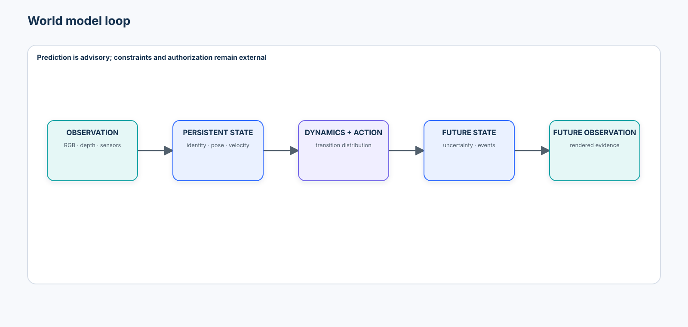
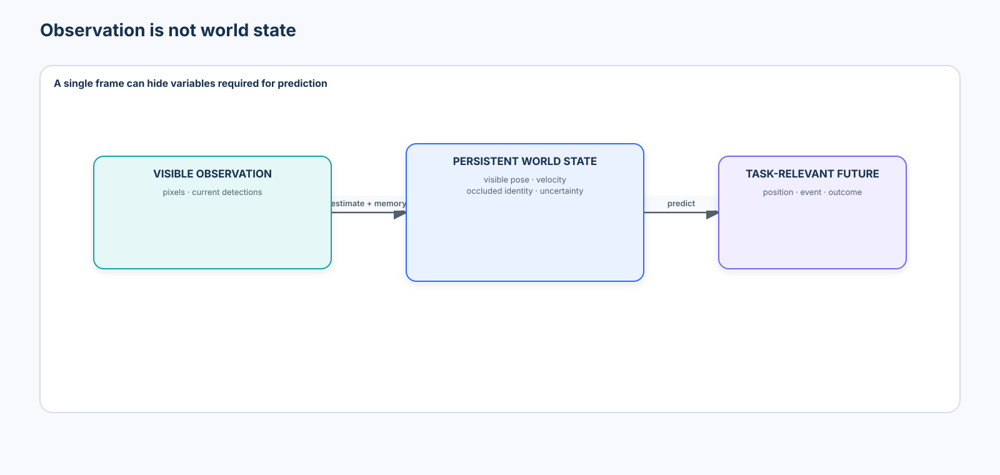
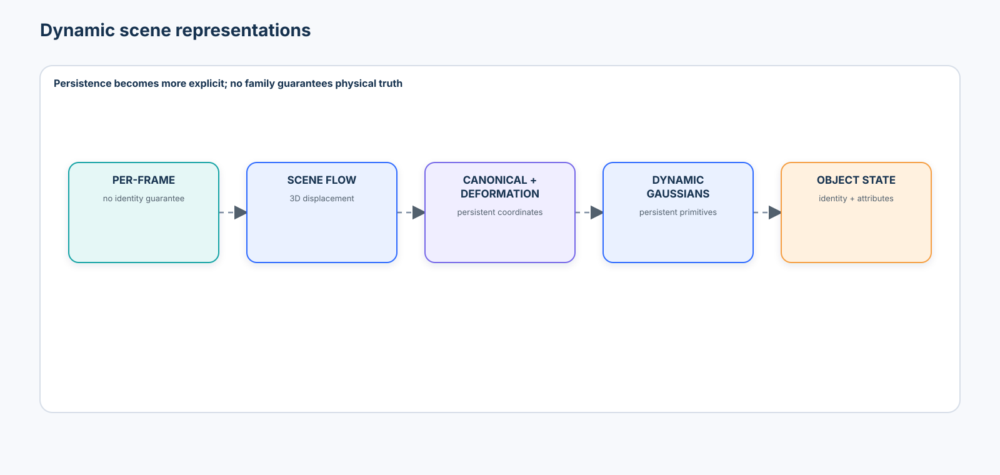
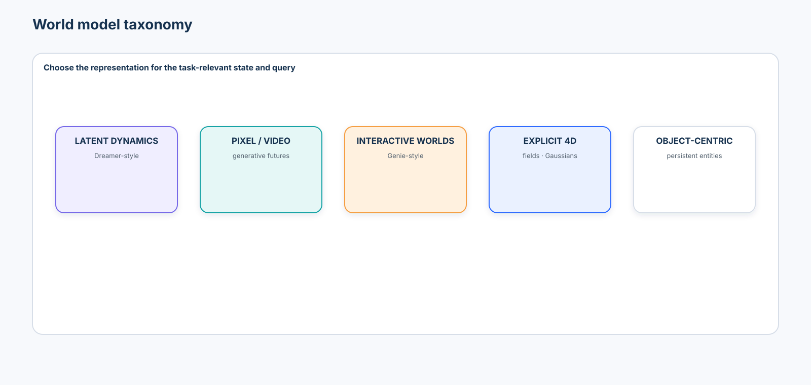
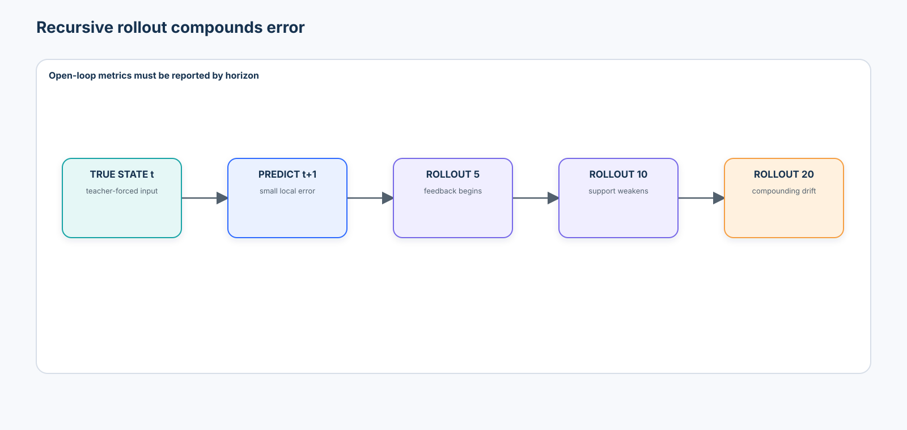
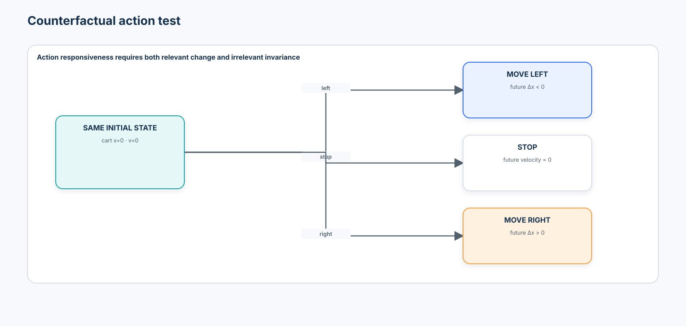
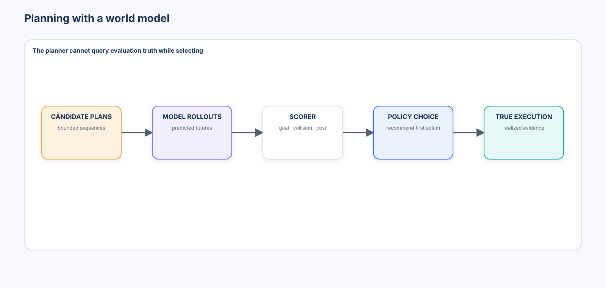
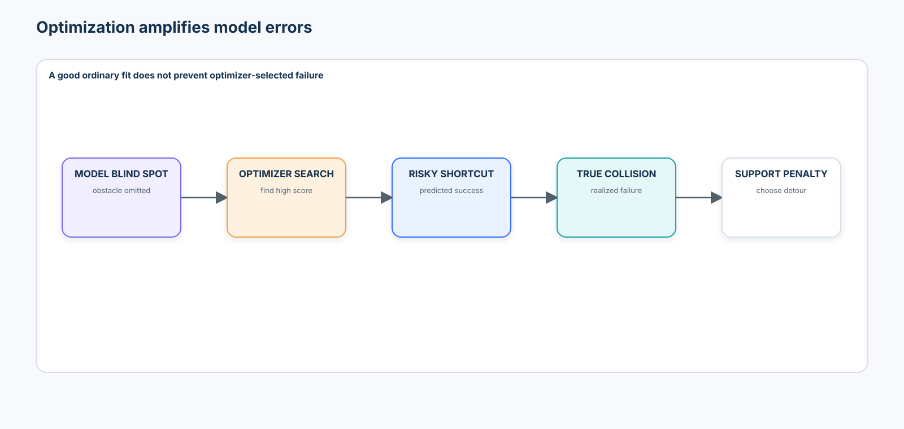

# Advanced 03 — Dynamic Scenes & World Models: From 4D Scene State to Action-Conditioned Futures

> **Central question:** How can a model represent the state of a changing physical world, predict how that state evolves, and distinguish passive future prediction from action-conditioned simulation?

[← Advanced 02 · Neural Rendering & 3D Scene Representations](../02-neural-rendering-3d-scene-representations/README.md) · [Run the notebook](lab.ipynb) · [Advanced track](../README.md)

Advanced 02 asked what static scene and camera could explain an observation. This course adds time, persistent state, actions, uncertainty, counterfactuals, and planning:

```text
current state + history + structured action + context
  → dynamics model
  → future-state distribution
  → future observation / event / reward predictions
  → independent constraints and realized-outcome checks
```



The governing lesson is simple:

> A visually convincing generated future is not evidence that the correct world state evolved, the action had the correct effect, or a plan is physically safe.

## Learning contract

After this course, you should be able to:

- define a world model operationally and distinguish it from a video generator, policy, reward model, and physical simulator;
- distinguish observations from latent or explicit state under partial observability;
- explain approximate Markov state, deterministic and stochastic transitions, observation models, and action representations;
- compare per-frame geometry, scene flow, canonical deformation, 4D fields/Gaussians, object-centric state, and scene-centric latent state;
- implement typed world, object, action, and observation contracts with declared units, IDs, bounds, and timestamps;
- keep a ground-truth simulator separate from an inference-visible `local_world_model_proxy`;
- fit and compare action-conditioned and action-ignorant one-step predictors;
- measure position/velocity error by rollout horizon rather than report only teacher-forced accuracy;
- test action responsiveness, wrong-action behavior, relevant sensitivity, irrelevant invariance, and object permanence;
- evaluate stochastic future coverage without rewarding invalid diversity;
- apply deterministic, task-specific physical consistency checks that model outputs cannot self-certify;
- distinguish passive prediction, model response to intervention, and validated real-world causal effect;
- use a world model for bounded model-predictive planning without conflating model, policy, reward, and execution;
- demonstrate planner exploitation of a model blind spot and mitigate it with support-aware scoring;
- freeze Site B policy before reporting a Site C dynamics shift; and
- produce an auditable world-model evidence artifact without authorizing physical action.

### Prerequisites and transition

Complete [Advanced 01](../01-3d-vision-spatial-intelligence/README.md) and [Advanced 02](../02-neural-rendering-3d-scene-representations/README.md). Revisit Beginner [Tracking, Keypoints & Pose](../../beginner/08-tracking-keypoints-pose/README.md) for identity through occlusion, Intermediate [Multimodal Reasoning & Verification](../../intermediate/02-multimodal-reasoning-verification/README.md) for relevant/irrelevant counterfactuals, [Video-Language Understanding](../../intermediate/05-video-language-understanding/README.md) for temporal evidence, and [Visual Agents](../../intermediate/06-visual-agents/README.md) for authorization boundaries.

```text
Advanced 01: metric geometry
  → Advanced 02: learned static scene and rendering
  → Advanced 03: persistent dynamic state and action-conditioned futures
  → Advanced 04: embodied perception and VLA systems (not implemented here)
```

### Scenario, success criteria, and boundaries

The notebook models an industrial workcell with a cart, containers, a valve, loading zones, and restricted obstacles. Site A constructs a deterministic transition corpus. Site B selects evaluation and support-aware planning policy. That policy is hashed before Site C introduces higher inertia persistence and actuator gain.

Success requires clean state/action contracts, no hidden evaluation-state leakage, action-sensitive predictions, error-versus-horizon reporting, identity persistence, valid stochastic coverage, independent physics checks, predicted-versus-realized plan outcomes, and earliest-failure attribution. Ordinary one-step accuracy or attractive frames are insufficient.

The default path is deterministic, credential-free, synthetic, CPU-safe, and non-actuating. It uses standard Python, NumPy, pandas, Matplotlib, Pillow, and scikit-learn APIs. It does not download a dataset, train a foundation world model, invoke a robot, or treat simulation as deployment authorization.

### Non-goals

This is not a video-generation showcase, causal-inference course, robotics controller, reinforcement-learning benchmark reproduction, Dynamic NeRF/4DGS implementation, or claim that a toy simulator represents real contact dynamics. DreamerV3, Genie 3, Cosmos 3, and Dynamic 3D Gaussians are governed case studies, not default dependencies.

## 1. An operational definition of a world model

A useful world model represents enough state and dynamics to predict task-relevant consequences of environment evolution and, where applicable, actions:

$$
s_{t+1}\sim p_\theta(s_{t+1}\mid s_{\le t},a_t,c),
\qquad
o_t\sim p(o_t\mid s_t).
$$

`state` may be explicit objects, a spatial field, a latent tensor, or a hybrid. `action` must have executable semantics for the intended embodiment. `context` can include task, environment, or calibration state. A video generator may be a component or useful world model for some queries, but plausible pixels alone do not establish sufficient state, action response, or planning validity.

## 2. Observation is not state



An observation $o_t$ is sensor output: RGB, depth, audio, text, or measurements. State $s_t$ is the information required to predict relevant futures. Two frames can look identical while hidden velocity, friction, a cabinet's contents, or an actuator delay differs.

```text
closed cabinet in RGB
  ≠ knowledge that the cabinet is empty

object not visible
  ≠ object deleted
```

Online state estimation may use observations up to time $t$ only. Giving it future frames, evaluation-only IDs, hidden simulator parameters, or Site C labels is leakage.

## 3. Partial observability and approximate Markov state

A perfect Markov state satisfies

$$
p(s_{t+1}\mid s_{\le t},a_t)=p(s_{t+1}\mid s_t,a_t).
$$

Learned states are approximations. Memory can preserve object identity, velocity, last-seen time, and uncertainty through occlusion. More history is useful only if it updates state without importing future evidence.

## 4. Dynamics and observation models

Deterministic dynamics use $s_{t+1}=f(s_t,a_t)$. Stochastic dynamics model a distribution $p_\theta(s_{t+1}\mid s_t,a_t)$. Measurement uncertainty concerns what the sensor observed; dynamics uncertainty concerns how the world may evolve. Declare them separately.

The observation model decodes or renders state. A predictor may have good state dynamics and imperfect rendering, or photorealistic rendering and wrong hidden state. Therefore evaluate the representation at the level where the claim is made.

## 5. Actions are structured interventions, not text prompts

Natural language such as “open the valve” may be a description, request, or semantic label. A physically grounded action interface may need target identity, displacement, joint trajectory, force, velocity, duration, contact mode, and timestamp.

The lab uses a bounded schema:

```json
{
  "kind": "move_right",
  "object_id": "cart_1",
  "duration_s": 1.0,
  "issued_at_s": 3.0
}
```

Observation of an open valve and intervention to open a valve are different conditioning events. A model's response to an intervention-like input is not proof of the real-world causal effect $p(Y\mid do(X))$.

## 6. Passive and action-conditioned dynamics

Passive prediction estimates $p(s_{t+1}\mid s_t)$: a ball falls or a cart coasts. Action-conditioned prediction estimates $p(s_{t+1}\mid s_t,a_t)$. An action-ignorant model may look strong when passive inertia dominates and still fail every counterfactual decision.

The signature diagnostic fixes the initial state and varies `move_left`, `move_right`, and `stop`. Correct futures must differ in the expected direction.

## 7. Dynamic 3D and 4D representations



| Representation | Persistent quantity | Strength | Failure boundary |
| --- | --- | --- | --- |
| per-frame geometry | none guaranteed | simple independent reconstruction | identity, storage, correspondence, temporal noise |
| scene flow | 3D displacement | explicit motion between frames | depth/ego-motion errors propagate |
| canonical space + deformation | canonical coordinate/object | correspondence and non-rigid change | topology change and canonical ambiguity |
| 4D field / dynamic Gaussians | time-conditioned field/primitives | view synthesis plus spatial dynamics | capture, compute, and physical validity remain concerns |
| object-centric state | persistent entities and attributes | action binding, identity, inspection | object discovery and non-object phenomena |
| scene-centric latent state | tensor/tokens/grid | flexible appearance and complex phenomena | opaque identity and intervention mapping |

For a canonical coordinate $x_c$, a deformation model may use $x_t=D_\theta(x_c,t)$. Scene flow describes $v_t=X_{t+1}-X_t$. Optical flow is image-plane motion; scene flow is 3D motion and depends on depth and camera calibration.

## 8. Camera motion versus object motion

Observed image motion may arise from ego-motion, scene motion, or both. Without calibrated camera motion or multi-view constraints, a model can attribute background motion to objects. The notebook includes a controlled projection example that subtracts known ego-motion before estimating object displacement.

## 9. Object-centric and scene-centric state

Object-centric state makes identity, position, velocity, orientation, and discrete modes explicit. Scene-centric latent state flexibly represents deformable and non-object phenomena. Neither wins universally: hybrid systems may keep inspectable objects and a residual scene field.



## 10. Autoregressive rollout and exposure bias

Training often predicts $t+1$ from a real state. Deployment feeds predictions back into the model:

```text
teacher forcing: true s_t → predicted s_t+1
open loop: predicted s_t → predicted s_t+1 → predicted s_t+2 → …
```

This distribution mismatch creates exposure bias. Small position or velocity errors compound, and a state may leave the data-supported region.



The notebook reports position and velocity RMSE at horizons 1, 5, 10, and 20. It does not rename a teacher-forced batch metric as rollout performance.

## 11. Error type must remain visible by horizon

Separate position, velocity, identity, appearance, geometry, and event error. A single video score cannot show whether the right container arrived at the wrong time, a visually similar container replaced it, or a collision was omitted.

For object position and velocity,

$$
e_p=\|\hat p-p\|_2,
\qquad e_v=\|\hat v-v\|_2.
$$

Event timing error is $\Delta t=t_{pred}-t_{true}$; report bias, MAE, and tail error over a declared event population.

## 12. Multiple futures and stochastic validity

At an intersection, left, right, stop, and continue may all be plausible. A deterministic mean trajectory can lie through an obstacle and match no valid mode. A stochastic model should cover valid modes, calibrate probabilities, and reject invalid futures.

The branching lab reports `valid_mode_coverage` and `invalid_future_rate`. Diversity without validity is not quality; predicting only the most common future is mode collapse.

## 13. Physical consistency is a checked contract

Task-specific invariants include bounds, maximum displacement, speed, collision, persistent ID, rigid size, support, and valve state. They are not a claim of universal physics. The deterministic `validate_rollout()` checker operates outside the model; generated output cannot self-certify.

## 14. Object permanence

An object may be visible, occluded, and visible again. A memory-aware estimator retains its identity and marks uncertainty/age; an observation-only baseline deletes it. Identity continuity must be measured independently from image reconstruction.

## 15. Action and counterfactual evaluation



The counterfactual matrix varies action, initial velocity, color, and irrelevant metadata. Actions and initial velocity should change dynamics; color and unrelated metadata should not. Report both relevant sensitivity and irrelevant invariance. Swapping action labels provides a structured wrong-action negative test.

`action_sensitivity_teaching` is explicitly a course statistic, not a standard benchmark. `action_consistency_rate` checks known action semantics in the controlled environment.

## 16. World model, policy, reward, and simulator are different

| Component | Question | Authority |
| --- | --- | --- |
| world model | what may happen? | proposes predicted futures |
| deterministic scorer / reward | how desirable is this predicted outcome? | assigns declared utility |
| policy / planner | what candidate should be selected? | recommends within allowed actions |
| true simulator / physical system | what actually happens? | produces realized outcome |
| trusted application | is execution authorized and verified? | enforces constraints and records evidence |

The notebook never lets the planner query evaluation truth while selecting a plan.

## 17. Model-predictive planning



Model-predictive control repeatedly observes, simulates bounded action sequences, chooses the first action, executes one authorized step, observes again, and replans. The lab demonstrates candidate scoring but does not operate a robot.

## 18. Optimization amplifies model errors



An optimizer searches for high-scoring predictions, including regions where the model is wrong. The lab's nominal planner finds a short route through an obstacle omitted by its model. Predicted success becomes a collision in the true simulator. This is the strongest course result:

```text
ordinary predictive fit + model blind spot + optimization
  → confidently selected impossible plan
```

## 19. Support-aware planning

The mitigation records data support over state-action regions and penalizes unsupported rollouts. It selects a longer observed detour. This reduces the demonstrated exploit; it does not prove universal safety. Epistemic uncertainty, ensembles, conformal methods, density estimates, and abstention are production options, each requiring calibration.

## 20. Source-held-out dynamics shift

Site A constructs the estimator and model. Site B selects thresholds, horizon, support bins, and planning penalty. A canonical JSON hash freezes policy. Site C then changes inertia persistence and actuator gain and remains reporting-only.

Report one-step error, horizon drift, action consistency, physics violations, and predicted-versus-realized plan outcomes. Do not tune on Site C.

## 21. Failure attribution

Attribute the earliest supported failure:

```text
state_estimation_failure
→ action_conditioning_failure
→ one_step_dynamics_failure
→ rollout_drift
→ object_identity_failure
→ physical_constraint_failure
→ uncertainty_failure
→ planning_model_exploitation
→ distribution_shift
```

Later failures may be consequences. A final collision should not hide that the earliest error was an unsupported model rollout.

## 22. Evaluation matrix

| Layer | Evidence | Important denominator/slice |
| --- | --- | --- |
| observation | PSNR/SSIM/perceptual quality | valid pixels, view/source |
| geometry | position/depth/shape error | valid state support and units |
| motion | velocity/trajectory/scene-flow error | horizon, speed, occlusion |
| identity | continuity/reacquisition | visible and hidden intervals |
| event | accuracy and timing | event class and time window |
| physics | task-specific violation rate | checks per rollout and type |
| action | response correctness/sensitivity | same-state counterfactual set |
| rollout | error versus horizon | open-loop, not teacher forced |
| uncertainty | calibration/support | supported versus unsupported region |
| planning | predicted versus realized utility | plan family and true execution |

No weighted sum should erase a failed release gate.

## 23. Technology landscape and 2026 state of the art

The landscape is better organized by state and use than by leaderboard:

| Family | Representative system | What it teaches | Production boundary |
| --- | --- | --- | --- |
| latent dynamics + imagination | DreamerV3 | learn compact dynamics and train behavior in imagined rollouts | RL stack, task reward, environment fidelity, and policy risk remain separate |
| dynamic canonical field | D-NeRF / Nerfies | canonical state plus time deformation | rendering quality is not action-conditioned physical prediction |
| persistent explicit 4D | Dynamic 3D Gaussians | stable primitives, motion, tracking, and view synthesis | multi-camera assumptions, unseen entrants, CUDA, and mixed transitive licenses |
| interactive generative environment | Genie 3 | real-time action-responsive generative worlds with minute-scale consistency | closed research system, constrained actions, finite duration, no exact-world guarantee |
| physical-AI foundation model | Cosmos 3 | unified reasoning, image/video/audio/action generation | large GPU/runtime surface, OpenMDW terms, model cards, guardrails, and task-specific validation |
| emerging explicit world-action model | 4DGS-WAM | reuse static 4D Gaussian background and predict object transformations/actions | August 2026 preprint; short-horizon research evidence, not established practice |

Established practice includes task-specific state-space models, simulators, tracking, system identification, and model-predictive control with explicit constraints. Emerging practice combines large video/action models with latent dynamics and physical-AI data. The research frontier connects persistent 3D/4D state, action generation, long memory, and planning. Open problems include long-horizon identity, contact-rich dynamics, calibrated uncertainty, causal transfer, multi-agent interaction, and sim-to-real evidence.

Google DeepMind reports Genie 3 at 720p and approximately 20–24 FPS with consistency for a few minutes, while explicitly documenting limited action spaces, multi-agent difficulty, imperfect real-location reproduction, and limited interaction duration. These are vendor-reported system properties, not results reproduced here.

NVIDIA describes Cosmos 3 as an omnimodal Physical AI family spanning reasoning, world generation, and action modes. The official repository documents Python-first Diffusers/Transformers paths plus vLLM-Omni, TensorRT-LLM, SGLang, and NIM serving surfaces. None is required for this CPU lab.

## 24. Optional integrations and license decisions

| Integration | Pin | Default | License / decision |
| --- | --- | --- | --- |
| DreamerV3 | `e3f02248693a79dc8b0ebd62c93683888ddaccfe` | disabled | MIT code; use an isolated RL environment and do not substitute its benchmark claims for this task |
| NVIDIA Cosmos 3 | `5a68d9d4d34c9ca2bdcb0a1d9bbbb3a2d1b8d497` | disabled | OpenMDW-1.1 plus downstream assets; review model cards, data, hardware, guardrails, and modality-specific runtime |
| Dynamic 3D Gaussians | `7dbbd4dec404308524ff402756bdb8143a2589b0` | disabled | repository code is partly MIT, while required rasterizer/adapted 3DGS components carry restrictive Inria terms |
| Genie 3 | official 2025 product/research page | case study only | no executable course dependency; access and capabilities are service/research governed |

Exact source revision does not pin remote model weights, container images, transitive packages, datasets, or licenses. Record each separately before use.

## 25. Safety and authorization boundary

```text
world-model rollout
  → candidate prediction
  → independent constraint verification
  → authorized policy decision
  → bounded execution
  → observed realized outcome
```

Never use `generated video → actuator`. Simulation success is evidence about a versioned simulator, not permission to act in a physical system.

## 26. Sim-to-real and synthetic data

World models can expand rare-event coverage and create controllable training cases. They can also amplify missing tails, unrealistic contact, texture shortcuts, model bias, and synthetic feedback loops. Sim-to-real gaps include friction, lighting, sensor noise, latency, wear, calibration, contact, and human behavior.

## 27. Governance and evidence contract

Record model and artifact revisions, training-data scope where known, state/action/observation schemas, horizon, rollout mode, seeds, sampling, environment version, constraint checker, support estimator, planner, frozen policy hash, and unresolved assumptions. The notebook emits `world_model_evidence.json` and `world_model_decision.csv` under ignored `.artifacts/`.

The artifact's `authorization` field is always `none`. Predicted success, a typed action, or a clean simulation receipt does not grant physical authority.

## 28. Anti-patterns

1. Calling every video generator a world model.
2. Evaluating only perceptual video quality.
3. Treating observation as complete state.
4. Letting online estimation see future or evaluation-only state.
5. Ignoring action conditioning or testing only ordinary passive motion.
6. Reporting teacher-forced accuracy as rollout performance.
7. Treating one future as certain or diversity as validity.
8. Inferring real causality from sequence or model response.
9. Deleting objects as soon as they are occluded.
10. Letting model outputs self-certify physical validity.
11. Giving the planner access to the true simulator during selection.
12. Optimizing against an unvalidated model without support/uncertainty controls.
13. Tuning policy on Site C.
14. Treating simulated success or generated video as authorization.

## 29. Production upgrade path

| Teaching component | Production upgrade |
| --- | --- |
| typed Python dataclasses | versioned schemas with compatibility and unit validation |
| synthetic 2D workcell | calibrated digital twin plus independently measured system identification |
| Ridge transition proxy | sequence model/latent dynamics with held-out embodiment and intervention evaluation |
| memory-by-last-observation | probabilistic filtering or learned state estimation with uncertainty and replay tests |
| occupancy support heuristic | calibrated ensembles/density/conformal support with OOD release gates |
| enumerated candidate plans | bounded MPC/trajectory optimizer with hard constraints, budgets, and stop conditions |
| local JSON evidence | immutable artifact store, lineage, approvals, rollback, drift alerts, and incident response |

Add concurrency, latency budgets, deterministic replay, dependency failures, schema migration, privacy, access controls, model monitoring, hardware-in-the-loop evaluation, safe rollback, and human approval before any physical path.

## 30. Exercises

1. Add a delayed `open_valve` transition and prove that a single observation is non-Markov.
2. Replace Ridge with a small scikit-learn MLP while preserving the exact inference/evaluation boundary.
3. Add event-time bias, MAE, and p95 for cart arrival.
4. Introduce a second occluding object and distinguish uncertain identity from deletion.
5. Add a calibrated ensemble support estimate and compare safe-work blocking with exploit prevention.
6. Extend the planner to replan after every true step without granting it hidden simulator state.
7. Design a dynamic-Gaussian adapter contract that preserves object identity and camera coordinates.
8. Write a release checklist for a warehouse pilot, including hardware-in-the-loop evidence and rollback.

## 31. What you should now be able to explain without code

- What makes a useful world model different from a video generator?
- Why can two identical images correspond to different predictive states?
- Why is hidden state necessary under partial observability?
- What does action conditioning add, and why is a text prompt not automatically a physical action?
- Why can one-step accuracy hide long-horizon failure?
- Why can a deterministic mean future be physically meaningless?
- How are object permanence, scene flow, and camera/object-motion separation connected?
- What does an action-ignorance test reveal?
- Why are relevant sensitivity and irrelevant invariance both necessary?
- How can a planner exploit a small model error?
- Why does support-aware planning reduce risk without proving safety?
- Why are a world model, policy, reward model, simulator, and authorization service separate?
- What evidence is required before using predicted futures in physical planning?

## 32. References

- Hafner et al., [Mastering Diverse Domains through World Models (DreamerV3)](https://arxiv.org/abs/2301.04104), 2023; updated Nature publication, 2025.
- Ha and Schmidhuber, [World Models](https://arxiv.org/abs/1803.10122), 2018.
- Pumarola et al., [D-NeRF: Neural Radiance Fields for Dynamic Scenes](https://arxiv.org/abs/2011.13961), CVPR 2021.
- Luiten et al., [Dynamic 3D Gaussians: Tracking by Persistent Dynamic View Synthesis](https://arxiv.org/abs/2308.09713), 2023.
- Li et al., [WorldModelBench: Judging Video Generation Models As World Models](https://proceedings.neurips.cc/paper_files/paper/2025/hash/4ec03ed08a3fcb59e1c815b5598beff1-Abstract-Datasets_and_Benchmarks_Track.html), NeurIPS 2025.
- Kang et al., [How Far Is Video Generation from World Model: A Physical Law Perspective](https://proceedings.mlr.press/v267/kang25g.html), ICML 2025.
- Google DeepMind, [Genie 3: A new frontier for world models](https://deepmind.google/blog/genie-3-a-new-frontier-for-world-models/), 2025.
- NVIDIA, [Cosmos 3: Omnimodal World Models for Physical AI](https://research.nvidia.com/labs/cosmos-lab/cosmos3/), 2026.
- Ma, Xu, and King, [4DGS-WAM: Bridging Past and Future with an Object-Centric World Action Model based on 4D Gaussian Splatting](https://arxiv.org/abs/2608.25956), 2026 preprint.
- Sutton and Barto, [Reinforcement Learning: An Introduction](http://incompleteideas.net/book/the-book-2nd.html), second edition.
- García et al., [A Comprehensive Survey on Safe Reinforcement Learning](https://jmlr.org/papers/v16/garcia15a.html), JMLR 2015.

## Final learning model

```text
observations
  → persistent state
  → action-conditioned future distribution
  → independent constraints and support
  → counterfactual plan comparison
  → authorized bounded action, if separately permitted
  → predicted-versus-realized evidence
```

Advanced 04 will connect this foundation to embodied perception and vision-language-action systems. It is intentionally not implemented here.
