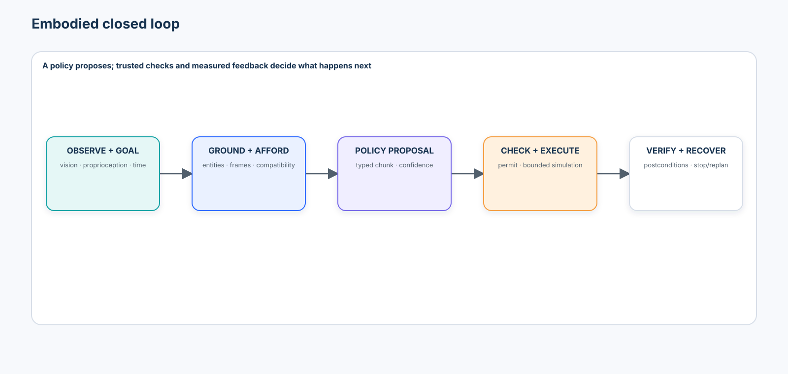
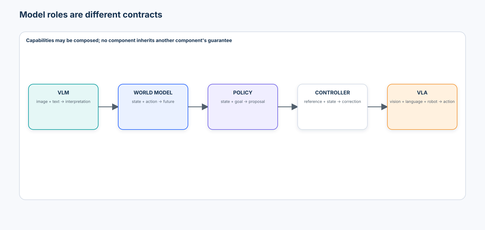
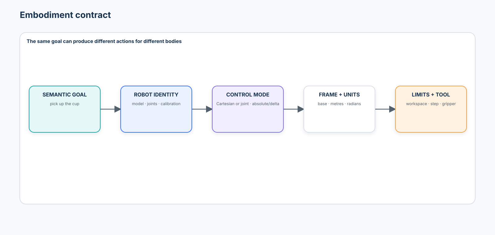
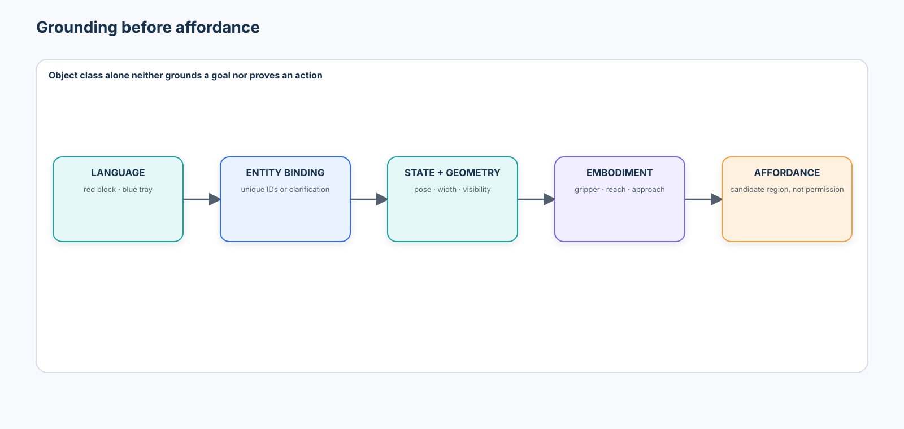
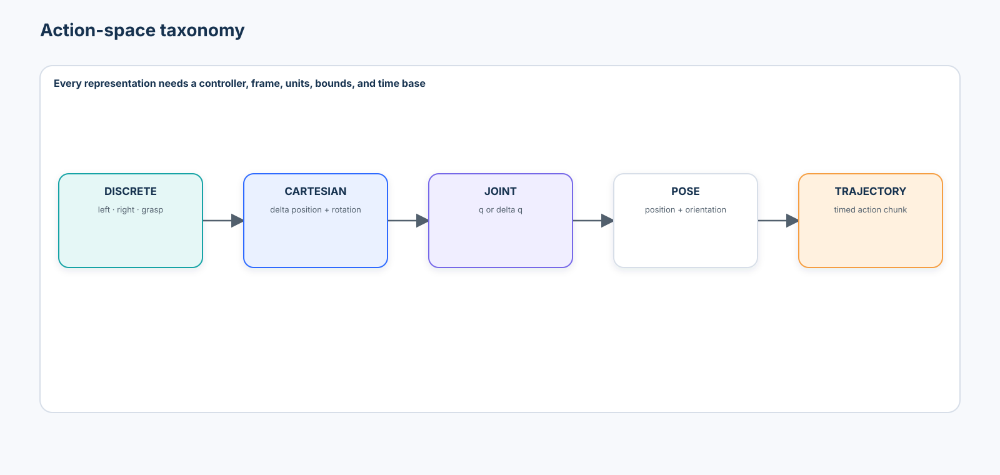
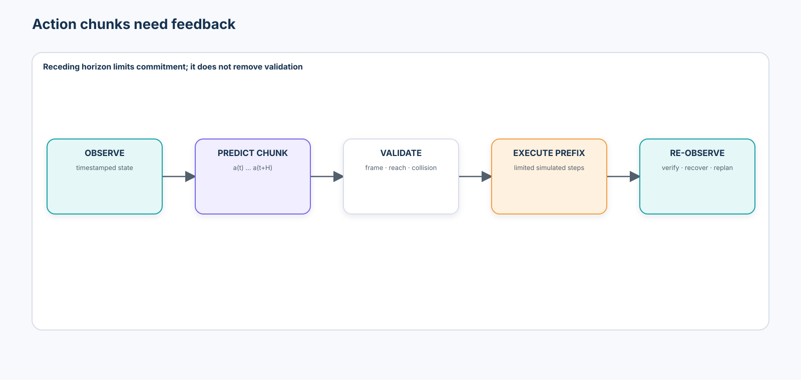
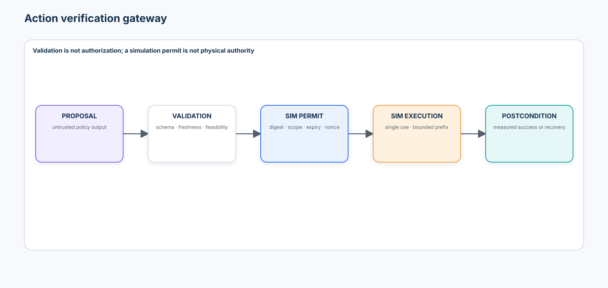
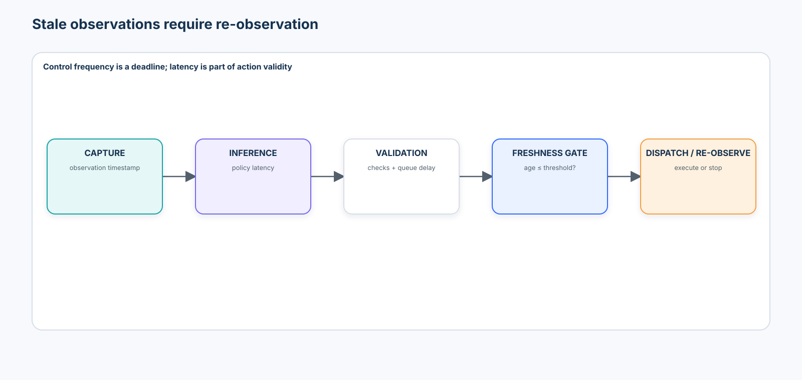

# Advanced 04 — Embodied Vision & Vision-Language-Action Models: From Visual Grounding to Closed-Loop Action

> **Central question:** How can a system convert multimodal observations and a goal into physically meaningful, embodiment-compatible actions while continuously verifying what actually happened?

[← Advanced 03 · Dynamic Scenes & World Models](../03-dynamic-scenes-world-models/README.md) · [Run the notebook](lab.ipynb) · [Advanced track](../README.md)

Advanced 03 asked what would happen if action $a$ were taken. This course asks which action should be proposed, checked, executed in a bounded environment, and verified:

```text
observation + goal + robot state + embodiment + constraints
  → grounded entities and affordances
  → policy proposal
  → independent feasibility and authorization boundary
  → bounded execution
  → new observation and postcondition evidence
  → continue, recover, clarify, or stop
```



The governing lesson is:

> Visual understanding, policy confidence, and simulated task success do not prove that an action is reachable, collision-free, fresh, authorized, or successful in the physical world.

## Learning contract

After this course, you should be able to:

- define embodied perception and distinguish VLMs, world models, policies, controllers, and VLAs;
- specify versioned embodiment, observation, frame, goal, affordance, action, and skill contracts;
- explain why proprioception and timestamps are part of the observation rather than optional metadata;
- bind language referents to physical entities and stop on unresolved ambiguity;
- derive affordances from object state, embodiment, and context rather than class labels alone;
- compare discrete, Cartesian, joint, pose, trajectory, absolute, delta, tokenized, continuous, diffusion, and hierarchical action representations;
- implement action normalization with an invertible, versioned conversion and quantify tokenization error;
- explain behavioral cloning, demonstration support, covariate shift, and compounding rollout error;
- compare open-loop action chunks with receding-horizon feedback under a controlled disturbance;
- apply deterministic reachability, frame, freshness, step-size, collision, and skill-precondition checks;
- keep an untrusted policy proposal separate from a single-use simulation permit and simulated executor;
- verify postconditions, attribute the earliest failure, and choose continue, recover, clarify, or stop;
- evaluate grounding, action error, task success, path quality, proposal violations, executed violations, safe-work blocking, intervention, recovery, latency, and embodiment shift;
- freeze Site B policy before reporting Site C results; and
- produce an auditable evidence artifact that explicitly grants **no physical authorization**.

### Prerequisites and transition

Complete [Advanced 01](../01-3d-vision-spatial-intelligence/README.md) for coordinate frames and [Advanced 03](../03-dynamic-scenes-world-models/README.md) for action-conditioned prediction. Revisit Beginner [Detection](../../beginner/05-object-detection/README.md), [Segmentation](../../beginner/06-segmentation-promptable-segmentation/README.md), and [Tracking, Keypoints & Pose](../../beginner/08-tracking-keypoints-pose/README.md); Intermediate [Vision-Language Models](../../intermediate/01-vision-language-models/README.md), [Reasoning & Verification](../../intermediate/02-multimodal-reasoning-verification/README.md), [Video-Language Understanding](../../intermediate/05-video-language-understanding/README.md), and [Visual Agents](../../intermediate/06-visual-agents/README.md).

```text
Advanced 01: metric geometry and frames
  → Advanced 02: learned spatial representations
  → Advanced 03: state and action-conditioned futures
  → Advanced 04: goal-conditioned embodied policy and verified feedback
  → Advanced 05: spatial intelligence and memory
```

### Scenario, success criteria, and boundaries

The notebook uses a credential-free 2D workcell proxy for the instruction “put the red block in the blue tray.” Site A supplies expert demonstrations for an `arm_A` embodiment. Site B selects all policy, normalization, freshness, chunk, and safety settings. The frozen policy is hashed before Site C introduces a different reach and gripper contract. A local deterministic grounding proxy and a small scikit-learn behavioral-cloning policy make the interfaces inspectable; neither is a foundation model or robotics benchmark.

The lab runs only a local simulator. No code connects to hardware, ROS, a robot SDK, a remote model, or a device. A proposal is not executable. A validation decision is not authorization. A single-use permit in the notebook is valid only for the named local simulation environment. The exported evidence says `"physical_authorization": "none"`.

### Non-goals

This is not a ROS, MuJoCo, ManiSkill, Isaac, LeRobot, OpenVLA, GR00T, Gemini Robotics, or $\pi$-model tutorial. It is not inverse kinematics, grasp synthesis, motion planning, reinforcement learning, contact dynamics, or sim-to-real validation. Named systems are architectural and tooling case studies. No foundation model controls hardware.

## 1. Embodied perception

Embodied perception estimates information because an agent must act through a particular body in a changing world. Recognition asks “what is present?” Embodied perception also asks “where is it in the robot frame, what interactions are possible for this embodiment, and what must be observed next?” The useful representation depends on the goal, controller, geometry, timing, and safety boundary.

Some actions are **epistemic** rather than immediately task-completing: move a wrist camera, change viewpoint, or pause to reduce occlusion before committing. Active perception should still use the same action, feasibility, authorization, and verification contracts; “look closer” is not exempt from collision or latency limits.

## 2. VLM, world model, policy, controller, and VLA



| Component | Core mapping | What it does **not** establish |
| --- | --- | --- |
| VLM | image + language $\rightarrow$ language or structured interpretation | executable motor semantics |
| world model | state + action $\rightarrow$ future distribution | which action should be selected or authorized |
| policy | state + goal $\rightarrow$ action proposal | controller stability or safety |
| controller | reference + measured state $\rightarrow$ actuator-level correction | semantic goal correctness |
| VLA | vision + language + robot context $\rightarrow$ embodied action representation | independent feasibility, permission, or success |

A real system may compose all five. A VLA can contain useful world knowledge without exposing an explicit transition model, and a VLM planner can select a skill without producing low-level control.

## 3. Embodiment

Embodiment is the physical and action interface through which the system interacts. A six-degree-of-freedom arm with a parallel gripper and a seven-degree-of-freedom arm with a suction tool do not share an action merely because the instruction is identical.

```text
semantic goal: “pick up the cup”
  ≠ embodiment-specific trajectory
```

Embodiment includes kinematics, controllable degrees of freedom, tool geometry, sensing, workspace, joint/velocity/force limits, controller mode, control frequency, calibration, and stop behavior.

## 4. The embodiment contract



```json
{
  "robot_id": "arm_A",
  "contract_version": "arm_A/cartesian_delta/v1",
  "joints": 6,
  "control_mode": "cartesian_delta",
  "action_frame": "robot_base",
  "workspace_m": {"x": [-0.6, 0.6], "y": [-0.5, 0.5], "z": [0.0, 0.8]},
  "max_translation_delta_m": 0.05,
  "gripper": {"type": "parallel", "max_width_m": 0.08},
  "control_frequency_hz": 10
}
```

Never interpret an action without the exact embodiment and conversion version used to produce it. A model checkpoint is not portable merely because tensor dimensions happen to match.

## 5. Observation and robot-state contracts

An embodied observation can contain RGB, depth, wrist and external cameras, joint positions and velocities, end-effector pose, gripper state, force/torque, tactile measurements, language goal, calibration ID, and timestamps.

```json
{
  "observation_id": "obs-0012",
  "timestamp_s": 12.4,
  "camera_frames": [{"camera_id": "overhead", "frame": "camera_overhead", "captured_at_s": 12.36}],
  "joint_positions_rad": [0.0, -0.4, 0.8, 0.0, 0.5, 0.0],
  "end_effector_position_m": [0.10, -0.05, 0.30],
  "end_effector_frame": "robot_base",
  "gripper_width_m": 0.04,
  "embodiment_version": "arm_A/cartesian_delta/v1"
}
```

Sensor timestamps, calibration identity, coordinate frames, units, missingness, and synchronization policy are part of the observation contract. “Latest” is not a timestamp.

## 6. Proprioception

Proprioception is the robot’s observation of its own configuration: joints, velocities, end-effector pose, tool state, and sometimes effort. The same image may require different actions if the gripper is already closed, a joint is near its limit, or the end effector is elsewhere outside the camera view.

```text
pixels alone ≠ complete robot state
```

The lab compares a vision-only behavioral-cloning proxy with a policy that includes current end-effector position and gripper state.

## 7. Coordinate frames return

Relevant frames include world, robot base, camera, end effector, tool, and object. If $\mathbf{p}_c$ is a point in a camera frame and $T_{bc}$ maps camera coordinates into the base frame,

$$
\tilde{\mathbf{p}}_b = T_{bc}\tilde{\mathbf{p}}_c.
$$

The transformation direction, handedness, units, calibration version, and timestamp must be explicit. Reuse Advanced 01’s rule: points, poses, and displacements are not frame-free numbers.

## 8. An action without a frame is invalid

```json
{"delta": [0.1, 0.0, 0.0]}
```

does not say whether the values are metres or radians, or whether the displacement is expressed in camera, base, world, or tool coordinates. The lab assertion-tests the valid form:

```json
{
  "translation_delta_m": [0.01, 0.0, 0.0],
  "frame": "robot_base",
  "control_mode": "cartesian_delta",
  "embodiment_version": "arm_A/cartesian_delta/v1"
}
```

## 9. Goal-conditioned perception

“Put the red block in the blue tray” requires language parsing, visual entities, identity, spatial state, and role binding. A detector output is not yet a grounded goal.

```text
language references
  → candidate physical entities
  → source-bound evidence
  → unique target and destination bindings
  → goal state
```

Grounding records the object IDs and evidence used, not only the final text.

## 10. Referent ambiguity

Two red blocks make “pick up the red block” ambiguous. The safe result is `clarification_required` or `review_required`, not a random binding. Confidence cannot resolve a missing identifier. The lab reports grounding accuracy on unambiguous cases, clarification recall on ambiguous cases, and the unsafe-action rate after ambiguity; the final value must be zero.

## 11. Affordances

An affordance describes interactions possible for a particular agent in the current state and context. A cup may be graspable, a button pressable, a drawer pullable, and free floor traversable. Object class alone is insufficient: state, geometry, approach, tool, and environment matter.

## 12. Embodiment-dependent affordances

$$
\mathcal{A}=f(\text{object geometry},\text{state},\text{embodiment},\text{context}).
$$

A 70 mm block may fit an 80 mm gripper and not a 45 mm gripper. A graspable object may still lack a collision-free approach. “Affordance predicted” and “action feasible” remain separate claims.

## 13. Affordance maps



```json
{
  "object_id": "red_block_1",
  "affordances": [{
    "type": "top_grasp",
    "region_frame": "robot_base",
    "region_center_m": [0.22, 0.10, 0.03],
    "compatible": true,
    "reason": "width_with_margin_within_gripper"
  }]
}
```

An affordance map should preserve candidate regions, reference frame, embodiment version, score semantics, and rejection reasons.

## 14. Action-space taxonomy



| Space | Example | Key contract |
| --- | --- | --- |
| discrete | `move_left`, `grasp` | vocabulary and transition semantics |
| Cartesian delta | $\Delta x,\Delta y,\Delta z,\Delta R$ | frame, units, step bounds, controller |
| joint absolute/delta | $q$ or $\Delta q$ | joint order, units, limits, timing |
| end-effector pose | position + orientation | frame, rotation representation, inverse kinematics |
| trajectory/chunk | $a_{t:t+H}$ | rate, timestamps, horizon, replanning policy |

Choosing an action space changes what the model must learn and what the controller must guarantee.

## 15. Absolute and delta actions

Absolute actions target a globally declared configuration; delta actions request a local correction. Absolute targets can preserve destination consistency but require calibration and feasible planning. Delta actions simplify local feedback yet accumulate drift and depend strongly on control rate. Neither is universally superior.

## 16. Cartesian and joint space

Cartesian commands describe desired tool motion. Joint commands describe robot configuration. Converting between them requires kinematics, limits, singularity handling, redundancy resolution, and collision checks. Do not silently ask a VLA to solve unspecified inverse kinematics.

## 17. End-effector pose and gripper action

An end-effector pose includes translation and orientation. Euler angles require order and convention; quaternions require component order, normalization, and sign-equivalence handling. A gripper signal may be width, effort, velocity, or a binary open/close command. Store it as a named channel with units and actuator semantics, not an anonymous last vector element.

## 18. Action chunking

Instead of one action, a policy can predict $a_{t:t+H}$. Chunking can create coherent motion and reduce inference frequency, but it also increases the period over which observations go stale. ACT is a canonical action-chunking case study; its reported results belong to its tasks, hardware, data, and evaluation protocol.

## 19. Open-loop chunks

Executing ten predicted steps without observing again assumes that the world follows the predicted path. If an object moves after step three, later actions can become invalid even when the initial chunk was reasonable. Chunk-level validation at generation time does not replace feedback.

## 20. Closed-loop and receding-horizon execution



```text
observe → propose short chunk → validate → execute prefix
    ↑                                  ↓
    └──────── verify and re-observe ───┘
```

The lab injects the same mid-trajectory disturbance into open-loop and receding-horizon rollouts and compares task success, path length, and intervention.

## 21. Behavioral cloning

Given demonstrations $D=\{(o_t,g,a_t)\}$, behavioral cloning estimates

$$
\pi_\theta(a_t\mid o_t,g).
$$

It is simple and scalable but learns the demonstration distribution, errors, conventions, and omissions. A low validation action loss does not prove closed-loop task success.

## 22. Demonstration distribution

Demonstrations cover states visited by the demonstrator under a particular embodiment, observation stack, controller, and collection policy. Split by episode, task, site, operator, object family, and embodiment as the claim requires; never scatter adjacent frames from one trajectory across train and test.

Record action units, frames, controller, frequency, latency, normalization, intervention labels, success definition, resets, failures, and dataset license. Removing failed demonstrations can also remove recovery knowledge.

## 23. Covariate shift

The expert-state distribution $d_{\pi_E}(s)$ differs from the learned-policy distribution $d_{\pi_\theta}(s)$. A small policy error moves the robot into a state absent from demonstrations, where the next error can be larger. The notebook compares teacher-forced action error with autonomous rollout success and plots support distance against error.

## 24. Action normalization

Translation in metres, rotation in radians, and gripper state have different scales. A versioned transformation stores raw action, normalized action, per-channel statistics/bounds, clipping policy, and inverse conversion. Evaluation converts back into physical units before reporting error and constraints.

## 25. Action tokenization

Tokenized VLA families quantize continuous channels and emit action tokens with a language-model-style objective. RT-2 and OpenVLA are important examples. Quantization provides architectural compatibility but introduces resolution, saturation, vocabulary, ordering, and de-tokenization contracts. The lab quantizes a bounded delta action, reconstructs it, and reports error in metres.

## 26. Autoregressive VLA policies

```text
image tokens + instruction tokens + robot state
  → multimodal transformer
  → action token 1, action token 2, …
  → deterministic de-tokenizer
```

Autoregression can reuse mature sequence-model tooling. It also creates decoding latency, error dependencies, and a temptation to treat syntactically valid tokens as physically valid actions.

## 27. Continuous action heads

A continuous head maps a fused representation directly to an action vector or distribution. It avoids quantization error but still needs explicit channel semantics, scaling, multimodality, uncertainty, and constraint handling. Mean-squared regression can average incompatible modes into a poor action.

## 28. Diffusion and flow action policies

A conditioned denoising or flow process can model a distribution over action trajectories. Diffusion Policy, Octo, and $\pi_0$ are useful case studies for multimodal continuous action generation; their objectives and architectures are not interchangeable. Multiple sampling steps, horizon choice, latency, warm starts, and receding-horizon execution are systems concerns—not implementation footnotes.

## 29. VLA architecture taxonomy

| Family | Representative lesson | Typical trade-off |
| --- | --- | --- |
| tokenized autoregressive actions | RT-2, OpenVLA | reuse VLM generation; quantization and sequential decoding |
| continuous action head | direct regression/distribution | direct physical units; mode averaging or distribution design |
| diffusion/flow trajectory | Diffusion Policy, Octo, $\pi_0$ | multimodal smooth chunks; iterative inference |
| hierarchical VLA | $\pi_{0.5}$-style semantic/low-level separation | long-horizon structure; interface and error-propagation burden |
| embodied reasoning + low-level policy | Gemini Robotics ER/VLA-style separation | inspectable plans and reusable skills; coordination and latency |

GR00T N1.6, Gemini Robotics 2, and other 2026 systems are fast-moving research/vendor systems. Their official reports and model cards describe capabilities; this course does not locally reproduce those claims or infer production readiness.

## 30. High-level and low-level action

“Grasp the cup” is a semantic skill request. A low-level Cartesian command is a timed vector of translations, rotations, and gripper state. A useful hierarchy can let a multimodal model select and parameterize an allow-listed skill while a trusted motion/control layer owns kinematics, collision checks, limits, and servoing.

## 31. Skill libraries

Example skills include `move_to`, `grasp`, `release`, `open_drawer`, and `press_button`. Each needs a schema, parameter bounds, allowed embodiments, preconditions, execution timeout, postconditions, recovery policy, and trace fields. Intermediate Visual Agents’ tool boundary becomes a physical-action boundary here.

## 32. Preconditions

Before `grasp`, the target must be uniquely identified, current, reachable, tool-compatible, and approachable without violating a restricted region. A policy proposing a grasp proves none of these. Preconditions are checked against trusted state and policy, not accepted from model-generated text.

## 33. Postconditions

After `grasp`, ask whether the object moved with the gripper, the gripper closed to a plausible width, the target remains associated, and the scene is safe. “Command issued” is an execution event; it is not task success.

## 34. Action verification and authorization



The lab separates:

1. `ActionProposal` from an untrusted local policy;
2. deterministic `ValidationDecision` with reason codes;
3. a trusted, digest-bound, expiring, single-use `SimulationPermit`;
4. a simulation-only executor;
5. postcondition evidence.

Mutation, expiry, environment mismatch, and replay invalidate the permit. A simulation permit cannot be promoted to a physical-device credential.

## 35. Reachability

The simplest checker tests whether the proposed target lies inside the embodiment workspace. Real reachability also depends on orientation, joint limits, collisions, singularities, payload, dynamics, and inverse-kinematics feasibility. The notebook labels its axis-aligned check as a teaching proxy, not a motion planner.

## 36. Collision constraints

The lab tests a line segment against a restricted rectangle before simulated execution. Production systems need robot geometry, swept volumes, self-collision, environment geometry, uncertainty margins, dynamic obstacles, and controller stopping distance. Policy outputs never self-certify collision safety.

## 37. Grasp affordance proxy

The controlled proxy combines object width, gripper aperture, clearance margin, reachability, and collision-free approach. It makes the dependency on object, state, embodiment, and context visible without pretending to solve contact mechanics or grasp stability.

## 38. Visual servoing

Visual servoing turns measured visual error into a small control correction and then observes again. It demonstrates why delta actions, camera calibration, latency, and control frequency interact. A correct sign with the wrong frame or stale image can move away from the target.

## 39. Latency and stale observations



If an observation captured at $t_o$ produces an action at $t_a$, age is $t_a-t_o$. Camera, synchronization, preprocessing, model, network, validation, controller, and actuation delays all contribute. The action records both timestamps, and the gateway rejects age beyond the Site B threshold.

## 40. Control frequency

At 1 Hz a system has one second between updates; at 50 Hz it has 20 ms for sensing, computation, validation, and dispatch. Higher frequency can improve responsiveness but increases compute and timing requirements. Action chunking, inference latency, controller bandwidth, actuator dynamics, and observation rate must be evaluated together on target hardware.

## 41. Policy confidence is not safety

The notebook creates a high-confidence action that crosses a restricted region. The independent checker rejects it. Calibration can help decide whether a policy knows what it knows; it cannot prove reachability, collision freedom, authorization, or postcondition success.

VLA uncertainty can come from ambiguous perception, multiple reasonable action modes, limited demonstrations, embodiment shift, dynamics, timing, or the action decoder itself. Evaluate calibration against a named event—such as “this proposed prefix completes the next verified subskill without intervention”—and slice it by task, object, source, and embodiment. Ensembles, distributional heads, conformal methods, or sampled trajectories can help expose uncertainty, but abstention and deterministic constraints still belong outside the policy.

## 42. Evaluation contract

Report at least:

| Layer | Metrics |
| --- | --- |
| grounding | unambiguous binding accuracy; ambiguity clarification recall; unsafe action after ambiguity |
| action prediction | translation vector MAE/RMSE in metres; gripper accuracy; tokenization reconstruction error |
| rollout | task success with denominator; path length; steps; time-to-completion; final goal distance |
| constraints | proposal violation rate; executed violation rate; false block / valid-work block rate |
| feedback | postcondition detection; intervention rate; recovery attempt and recovery success |
| timing | observation age; stale-block rate; end-to-end median/p90/p95 latency; deadline miss rate |
| shift | Site B and untouched Site C slices by object, source, goal, and embodiment |

Keep learned quality, deterministic safety checks, system reliability, and task outcomes separate. Report repeated episodes and uncertainty; one successful video is not an evaluation.

## 43. Evidence, tooling, and deployment boundary

The notebook writes a JSON evidence record and decision CSV with contract versions, split policy, frozen-policy hash, source slices, failure attribution, checked proposal traces, optional-tool manifests, unresolved assumptions, and `physical_authorization: none`. It does not store secrets, raw personal video, or hidden reasoning.

### Tooling review (reviewed 2026-09-17)

| Tool/system | Appropriate use | What it helps with | What it can hide / review before use |
| --- | --- | --- | --- |
| NumPy, pandas, scikit-learn | transparent CPU teaching path | contracts, deterministic geometry, Ridge behavioral cloning, metrics | not contact dynamics, real perception, or production control |
| [LeRobot](https://huggingface.co/docs/lerobot/) | standardized robot datasets, policy training/evaluation, supported hardware adapters | synchronized video/state/action data and common policy workflows | action schema, robot/calibration support, control timing, checkpoint/data licenses, hardware risk; pin source and model revisions |
| [robomimic](https://robomimic.github.io/docs/) | offline imitation/RL baselines and demonstration datasets | sequence datasets, BC/diffusion implementations, rollout evaluation | environment/version coupling, action normalization, dataset splits, simulator requirements |
| [MuJoCo](https://mujoco.readthedocs.io/) | contact-rich dynamics and control research | mature physics, model-based simulation, Python bindings | system identification, contact parameters, sensor/actuator fidelity, reality gap |
| [ManiSkill](https://maniskill.readthedocs.io/) | standardized manipulation simulation and demonstrations | Gymnasium interface, observation/control modes, CPU/GPU simulation | task/controller version, assets, replay preprocessing, benchmark protocol, sim-to-real gap |
| [OpenVLA](https://openvla.github.io/) / [openpi](https://github.com/Physical-Intelligence/openpi) / [Isaac GR00T](https://github.com/NVIDIA/Isaac-GR00T) | governed research reproduction in isolated accelerator environments | representative tokenized and flow/diffusion VLA families | substantial compute, remote/checkpoint code, preprocessing/action statistics, embodiment fit, model/data licenses, safety case |

Pinned source identities are in `constraints-tested.txt` and the notebook manifest. They identify reviewed code, not a promise that every checkpoint, dataset, asset, or transitive dependency shares the repository license.

### Current research map

- RT-2 introduced the influential action-as-text-token recipe; its 2023 paper reports its own robot evaluations.
- Open X-Embodiment and RT-X exposed the opportunity and schema difficulty of cross-embodiment training.
- ACT makes action chunking and compounding imitation error concrete.
- Diffusion Policy models conditioned action trajectories with receding-horizon execution.
- Octo provides an open generalist transformer/diffusion policy case study across heterogeneous observations and actions.
- OpenVLA provides an open 7B tokenized-action VLA and adaptation pipeline; “state of the art” wording on its launch page is a historical author claim, not a 2026 universal ranking.
- $\pi_0$ uses a VLM backbone with a flow-matching action expert; $\pi_{0.5}$ adds heterogeneous co-training and high-/low-level structure.
- NVIDIA GR00T N1.6 and Google DeepMind Gemini Robotics 2 are current 2026 family references. Use official reports/model cards and matched local evaluation; do not generalize showcase behavior into a deployment claim.

### Failure taxonomy

| Earliest failure | Example | Required response |
| --- | --- | --- |
| observation | stale frame or missing proprioception | re-observe / stop |
| grounding | two red blocks | clarify / review |
| affordance | gripper too narrow | reject / change tool |
| representation | wrong frame or normalization version | reject schema |
| policy | unsupported recovery state | stop or bounded recovery |
| feasibility | unreachable or colliding path | reject independently |
| authorization | missing, expired, replayed, or mutated permit | reject |
| execution | controller/device error | safe stop and trace |
| verification | postcondition absent or uncertain | recover or review |

### Production upgrade path

| Teaching component | Production upgrade |
| --- | --- |
| synthetic entities | calibrated multi-camera perception with uncertainty and identity management |
| axis-aligned workspace | robot model, IK, joint/velocity/force limits, singularity analysis |
| line/rectangle collision | uncertainty-aware swept-volume motion planning and safety-rated controls |
| Ridge behavioral clone | versioned policy trained on governed demonstrations with rollout evaluation |
| local simulation permit | external policy/approval service with device identity, audit, revocation, and least privilege |
| synchronous loop | deadline-aware concurrent runtime with watchdog, safe stop, and degraded modes |
| local JSON | immutable evidence store, signed releases, fleet monitoring, rollback, and incident response |

Before a physical pilot, add hazard analysis, safety-rated hardware and controller constraints, emergency stops, independent sensing where needed, calibration validation, hardware-in-the-loop tests, operator training, access control, cybersecurity, privacy review, staged rollout, monitoring, rollback, and incident response. Simulation success is only one input.

## Exercises

1. Add a camera-to-base transform with calibration uncertainty and reject actions whose uncertainty-expanded path intersects the restricted region.
2. Replace the axis-aligned reach check with a two-link planar inverse-kinematics check while preserving the action frame contract.
3. Change token vocabulary size and plot physical-unit quantization error and saturation.
4. Add a third red block and evaluate clarification precision and recall under imperfect detections.
5. Train on one gripper width, freeze every policy choice on Site B, and evaluate a held-out embodiment on Site C.
6. Add a failed-grasp recovery demonstration and compare teacher-forced action error with autonomous recovery success.
7. Model capture, inference, validation, and controller latency separately; compute deadline misses at 1, 10, and 50 Hz.
8. Design a production action permit that is device-bound, expiring, single-use, revocable, and externally issued.

## What you should now be able to explain without code

- Why does a correct visual description not imply a physically valid action?
- Why can the same instruction require different actions for two embodiments?
- Why is an action vector meaningless without frame, units, controller, and timing?
- Why must ambiguous referents lead to clarification rather than a confident guess?
- How is an affordance different from an object class?
- Why can low behavioral-cloning loss coexist with poor closed-loop success?
- What do action chunks gain, and what feedback do they postpone?
- Why can a high-confidence VLA action still be unreachable or unsafe?
- What is the difference between a validated proposal, a scoped permit, execution, and verified success?
- Why must Site C remain reporting-only after policy selection?
- What evidence is still missing after success in simulation?

## References

- Brohan et al., [RT-2: Vision-Language-Action Models Transfer Web Knowledge to Robotic Control](https://robotics-transformer2.github.io/), 2023.
- Open X-Embodiment Collaboration, [Open X-Embodiment: Robotic Learning Datasets and RT-X Models](https://robotics-transformer-x.github.io/), ICRA 2024.
- Zhao et al., [Learning Fine-Grained Bimanual Manipulation with Low-Cost Hardware](https://tonyzhaozh.github.io/aloha/), RSS 2023.
- Chi et al., [Diffusion Policy: Visuomotor Policy Learning via Action Diffusion](https://diffusion-policy.cs.columbia.edu/), RSS 2023 / IJRR 2024.
- Octo Model Team et al., [Octo: An Open-Source Generalist Robot Policy](https://octo-models.github.io/), RSS 2024.
- Kim et al., [OpenVLA: An Open-Source Vision-Language-Action Model](https://openvla.github.io/), 2024.
- Physical Intelligence, [$\pi_0$: A Vision-Language-Action Flow Model for General Robot Control](https://www.physicalintelligence.company/download/pi0.pdf), 2024.
- Physical Intelligence, [$\pi_{0.5}$: A Vision-Language-Action Model with Open-World Generalization](https://www.physicalintelligence.company/download/pi05.pdf), 2025.
- NVIDIA, [GR00T N1.6: An Improved Open Foundation Model for Generalist Humanoid Robots](https://research.nvidia.com/labs/gear/gr00t-n1_6/), 2025.
- Google DeepMind, [Gemini Robotics 2](https://deepmind.google/models/gemini-robotics/) and [robotics model cards](https://deepmind.google/models/model-cards/), accessed 2026-09-17.
- Hugging Face, [LeRobot documentation](https://huggingface.co/docs/lerobot/) and [LeRobotDataset v3.0](https://huggingface.co/docs/lerobot/lerobot-dataset-v3), accessed 2026-09-17.
- Pomerleau, [ALVINN: An Autonomous Land Vehicle in a Neural Network](https://proceedings.neurips.cc/paper/1988/hash/812b4ba287f5ee0bc9d43bbf5bbe87fb-Abstract.html), 1988.
- Ross, Gordon, and Bagnell, [A Reduction of Imitation Learning and Structured Prediction to No-Regret Online Learning](https://proceedings.mlr.press/v15/ross11a.html), AISTATS 2011.

## Final learning model

```text
timestamped observation + proprioception + goal + embodiment
  → grounded physical entities
  → embodiment-conditioned affordances
  → typed policy proposal
  → independent freshness / frame / reach / collision / skill checks
  → scoped simulation permit
  → bounded prefix execution
  → measured postconditions
  → continue / recover / clarify / stop
```

Advanced 05 will extend this loop with persistent spatial relations, scene graphs, navigation state, and queryable spatial memory.
