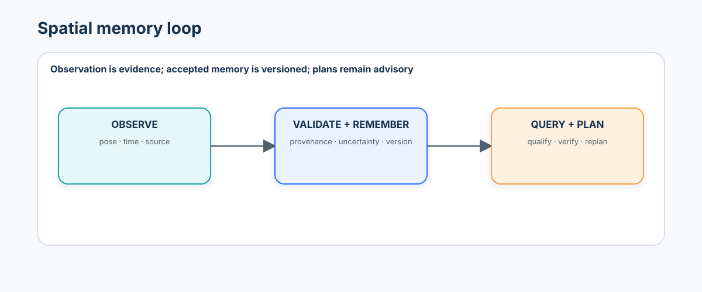
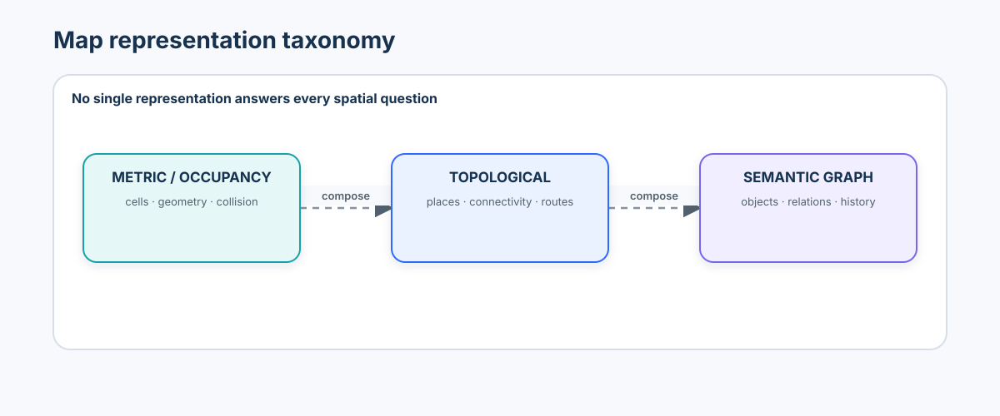
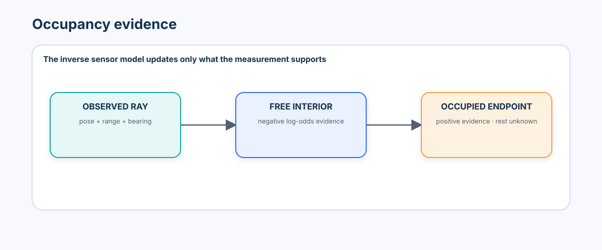
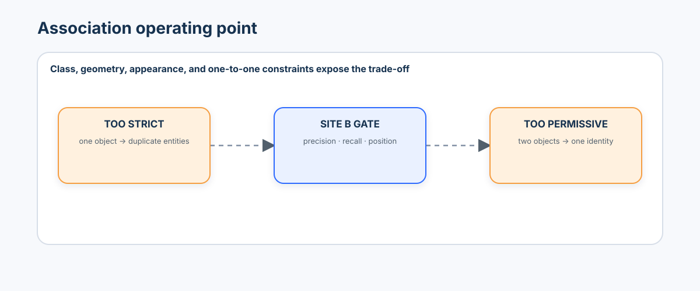
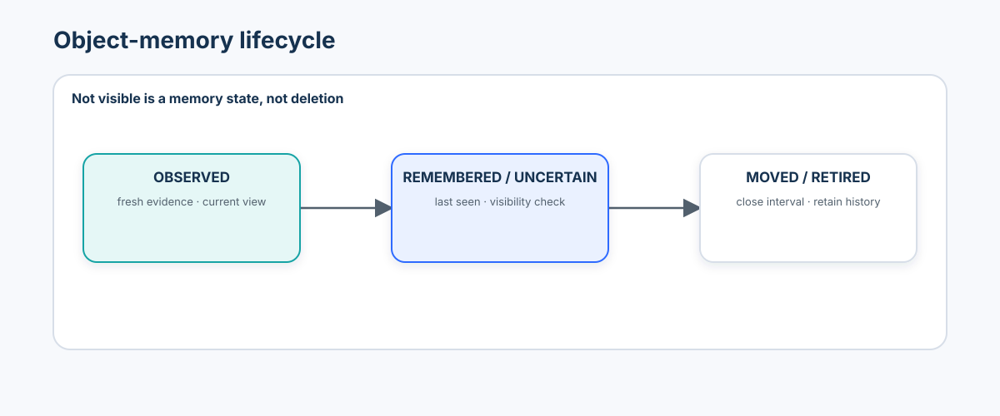
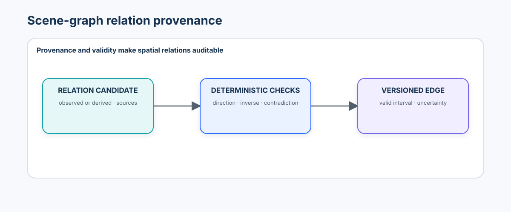
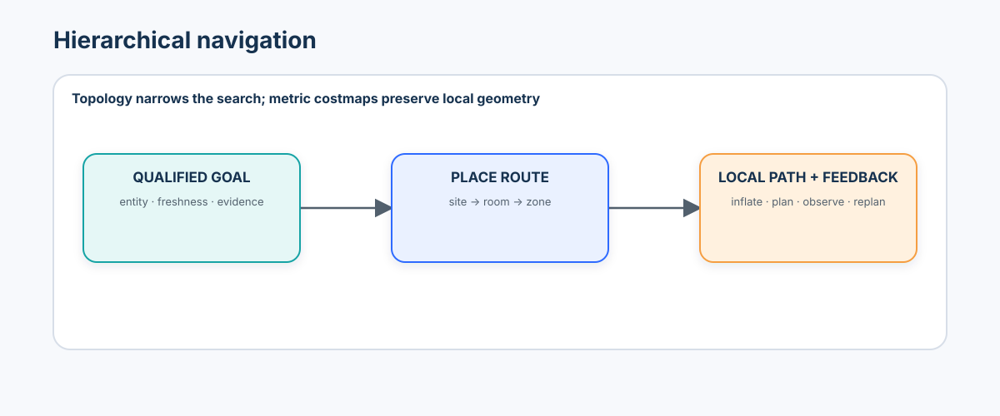
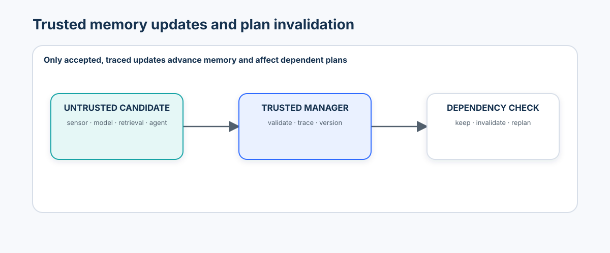

# Advanced 05 — Spatial Memory, Scene Graphs & Navigation: From Observations to Persistent World Knowledge

> **Central question:** What has the system learned about the environment over time, where are things relative to one another, what remains known when it is not visible, and how can that knowledge support navigation without turning stale memory into truth?

[← Advanced 04 · Embodied Vision & VLA Models](../04-embodied-vision-vla-models/README.md) · [Run the notebook](lab.ipynb) · [Advanced track](../README.md)

Advanced 04 closed the perception–action loop. This course gives that loop an explicit, queryable, versioned memory:

```text
timestamped observation + pose + provenance
  → localization and occupancy evidence
  → persistent object/place/relation memory
  → deterministic query and candidate retrieval
  → metric + topological planning
  → observe, verify, update, replan, or stop
```



The governing invariant is:

> What is not visible may still exist. What is remembered is not automatically current truth.

## Learning contract

After this course, you should be able to:

- distinguish a current observation, an estimated state, and persistent memory;
- declare coordinate frames, direction, units, timestamps, source, uncertainty, and status for spatial records;
- compose and test 2D poses; measure absolute and relative trajectory error; and explain drift and loop closure;
- update an occupancy grid with free, occupied, and unknown evidence without treating unobserved cells as free;
- compare metric, topological, semantic, object-centric, and scene-graph maps;
- associate repeated object observations with staged class, distance, and appearance gates;
- detect duplicate landmarks and identity merges, then tune association on development data only;
- model object permanence, last-seen time, negative evidence, moved objects, and historical location;
- create directional scene-graph relations with provenance, validity intervals, inverses, and contradiction checks;
- separate semantic candidate discovery from graph and geometry verification;
- implement deterministic current and historical spatial queries with uncertainty-aware answers;
- implement and test A*, explicit unknown-space policies, obstacle inflation, topological routing, and replanning;
- compare memory-assisted and memoryless object-goal navigation;
- evaluate localization, maps, identity, relations, queries, and navigation separately; and
- reject poisoned memory updates, version accepted changes, and invalidate plans that depend on superseded memory.

### Prerequisites and transition

Complete [Advanced 01](../01-3d-vision-spatial-intelligence/README.md) for frames and geometry, [Advanced 03](../03-dynamic-scenes-world-models/README.md) for persistent state, and [Advanced 04](../04-embodied-vision-vla-models/README.md) for bounded closed-loop action. Tracking and retrieval from Beginner 08 and Intermediate 04 are especially useful.

```text
metric geometry → persistent dynamic state → embodied action
  → spatial memory, scene graphs, and navigation
```

### Scenario, split, and authority boundary

The notebook builds **Persistent Spatial Memory for an Industrial Inspection Robot** in a deterministic 2D factory. Rooms, corridors, workstations, a charging station, a toolbox, a valve, containers, fixed obstacles, movable objects, and a dynamic obstacle make failures visible without a simulator download.

- **Site A** constructs memory and controlled examples.
- **Site B** selects association, freshness, loop-closure, and planning policies.
- **Site C** is reporting-only and introduces a shifted layout, similar rooms, a moved toolbox, a duplicate class, a narrow corridor, and a dynamic obstacle.

`TrueWorld` is evaluation-only. The learner-facing sensor returns limited field-of-view observations, relative positions, visible obstacles, and noisy odometry. Mapping, association, queries, and planning cannot access hidden truth. Every exported plan is advisory and local-simulation-only; the evidence artifact declares `"authorization": "none"` and `"physical_authorization": "none"`.

### Non-goals

This is not a SLAM-library tutorial, a ROS navigation deployment, a foundation-model benchmark, or a physical-robot commissioning guide. The lab makes core algorithms inspectable with NumPy, pandas, Matplotlib, scikit-learn, and NetworkX. Production systems require calibrated sensors, fault containment, hardware-specific costmaps/controllers, security review, and real-world validation.

## 1. Observation is not memory

An observation is bounded by a sensor pose, field of view, time, and occlusion. Memory combines accepted observations across time. Absence from one frame does not mean absence from the world; likewise, a remembered location can become stale.

```text
observation: “toolbox seen at t=12 s from camera_0”
memory:      “toolbox_7 last observed in bay_B, uncertainty 0.24 m”
truth claim: prohibited unless refreshed or explicitly qualified
```

## 2. The typed spatial-memory contract

Every memory element carries:

| Field | Purpose |
| --- | --- |
| identity and type | distinguish an observation ID from a persistent entity ID |
| value and frame | make coordinates interpretable |
| units and convention | prevent silent metric or handedness errors |
| observed/valid time | distinguish capture time from validity interval |
| source and method | retain provenance for review and rollback |
| uncertainty | constrain query wording and planning use |
| status | currently observed, remembered, uncertain, moved, conflicting, or retired |
| memory version | bind queries and plans to a specific state |

## 3. Frames, localization, and drift

The lab uses a right-handed planar convention: $x$ forward/east, $y$ left/north, yaw counter-clockwise, distance in metres, angle in radians. Transform names describe direction: $T^a_b$ maps coordinates from frame $b$ into frame $a$.

For pose $(x,y,\theta)$ and local point $(u,v)$:

\[
\begin{bmatrix}x_w\\y_w\end{bmatrix}=
\begin{bmatrix}x\\y\end{bmatrix}+
\begin{bmatrix}\cos\theta&-\sin\theta\\\sin\theta&\cos\theta\end{bmatrix}
\begin{bmatrix}u\\v\end{bmatrix}.
\]

The notebook asserts identity, inverse, and known-answer transform cases. No point enters a map until its frame is explicit.

Odometry integrates local motion and accumulates bias. Absolute trajectory error summarizes aligned global displacement; relative pose error isolates local motion consistency. Neither replaces task-level map or navigation evaluation.

## 4. Map representations



| Representation | Strong at | Weak at |
| --- | --- | --- |
| occupancy/metric | collision geometry, local planning | identity and semantic history |
| topological | scalable place connectivity | precise local motion |
| semantic | category-aware questions | persistent instance identity |
| object-centric | identity, movement, last seen | complete traversability |
| scene graph | relations, hierarchy, symbolic query | metric collision checking |

A dependable system composes representations; it does not force one map to answer every question.

## 5. Occupancy evidence and unknown space



For a cell $m_i$, log odds make sequential evidence additive:

\[
L_t(m_i)=L_{t-1}(m_i)+\log\frac{p(m_i\mid z_t)}{1-p(m_i\mid z_t)}-L_0(m_i).
\]

The lab clamps updates to avoid numerical certainty. A ray contributes free evidence only through observed space and occupied evidence at a valid return. Unobserved is a separate state—not a synonym for free. Planning therefore declares one of three policies: block unknown, penalize unknown, or explore it under a separate bounded objective.

## 6. SLAM, loop closure, and perceptual aliasing

SLAM jointly estimates trajectory and map. Loop closure proposes that a current place was seen before, then uses the constraint to reduce drift. A visually similar corridor can create a false closure that deforms the whole map.

```text
retrieval candidate
  → temporal separation check
  → geometric/structural consistency
  → uncertainty and residual gate
  → accepted loop constraint or rejection
```

Place recognition proposes; geometry verifies. The notebook deliberately injects a perceptual-aliasing failure and shows that a second structural signal rejects it.

## 7. Object identity and association

Object memory is not a bag of detections. Each sensor observation gets a unique observation ID. Association either links it to a persistent entity or creates a new one.



The staged policy is:

1. compatible class gate;
2. frame-aware distance gate widened by uncertainty;
3. appearance-distance gate;
4. one-to-one assignment within a timestamp;
5. explicit unmatched observation/entity handling.

Site B selects the operating point using duplicate rate, merge rate, identity precision/recall, and position error. Site C cannot change it.

## 8. Object permanence, freshness, and negative evidence



Useful states are `currently_observed`, `remembered`, `uncertain`, `moved`, `conflicting`, and `retired`. Freshness is object-type and task dependent: a fixed charging station can remain useful longer than a carried toolbox.

Negative evidence is admissible only if the object was expected to be visible: the viewpoint covers its predicted location, range is adequate, line of sight is not occluded, and the detector/sensor was operating. Otherwise “not detected” says almost nothing. A moved object closes the previous location interval and opens a new one; overwriting it would destroy historical queries.

## 9. Scene graphs and relation provenance



Nodes may represent objects, places, agents, observations, or viewpoints. Edges may express `in`, `contains`, `left_of`, `right_of`, `near`, `connected_to`, `visible_from`, or `observed_at`.

Direction matters: `toolbox in bay_B` is not `bay_B in toolbox`. The relation registry declares inverses and symmetry. It also declares which relations may be transitive. `left_of` can be transitive under a consistent axis and tolerance; `near` generally is not.

Every accepted edge carries:

- subject, predicate, object;
- observed or derived status;
- source observation IDs and derivation rule;
- confidence/uncertainty and coordinate frame where applicable;
- valid-from and valid-to times; and
- the memory version that accepted or retired it.

Contradiction checks reject impossible inverse pairs, incompatible current locations, self-relations, missing nodes, expired evidence, and invalid relation types.

## 10. Deterministic spatial queries

The query engine exposes typed operations rather than free-form graph guessing:

- `locate_object(entity_id, at_time=None)`;
- `objects_in_place(place_id, at_time=None)`;
- `near(entity_id, radius_m, at_time=None)`;
- `connected_places(place_id)`;
- `last_seen(entity_id)`; and
- `location_at(entity_id, timestamp_s)`.

Answers return evidence IDs, time, status, uncertainty, and memory version. A stale answer is phrased as “last observed in bay_B at 12 s; current location uncertain,” not “is in bay_B.”

## 11. Spatial RAG and language-aligned memory

Embeddings can retrieve “red maintenance case” as a candidate for `toolbox_7`, but similarity is not spatial truth. The safe pipeline is:

```text
language/image query → semantic candidate set
  → identity and authorization filters
  → graph/geometry/time verification
  → qualified answer with provenance
```

The notebook uses a local bag-of-words proxy only to teach this boundary. It is labeled `local_semantic_retrieval_proxy`, `foundation_model = False`, and is not a foundation-model or retrieval benchmark.

## 12. Place memory and hierarchy

Places form a hierarchy—site, floor, room, zone, workstation—and a connectivity graph. Metric coordinates answer “exactly where?” while topology answers “through which places?” Hierarchical planning first selects a place route, then solves local metric paths. This reduces global search while preserving obstacle-aware local execution.

## 13. Navigation and A*

For node $n$, A* prioritizes

\[
f(n)=g(n)+h(n),
\]

where $g$ is accumulated cost and $h$ is an admissible estimate to the goal. The lab includes a known-answer map, deterministic neighbor order, unreachable handling, and explicit start/goal validation.



Obstacle inflation represents robot footprint and localization uncertainty. A costmap can prefer clearance over the shortest geometric path. A path is still not execution: controllers, live collision checks, motion state, timing, and independent authorization remain outside this notebook.

## 14. Object-goal navigation and recovery

If a target has a fresh verified location, navigation can plan to a safe observation pose near it. If memory is stale, the plan should first verify the last-known location. A failure there updates memory, invalidates dependent plans, and transitions to memory-based search over likely places or active observation—not repeated blind execution.

Dynamic obstacles live in a short-horizon layer separate from persistent static memory. Replanning uses the newest admissible layer and records why the prior path became invalid.

## 15. Exploration, information gain, and visibility memory

Frontiers border known free and unknown space. A simple exploration utility balances information gain, travel cost, and risk. Active perception selects a viewpoint to reduce task-relevant uncertainty. Visibility memory records which cells or entities a viewpoint could actually verify; it supports principled negative evidence and avoids repeated uninformative views.

## 16. Evaluation without a composite score

| Layer | Minimum evidence |
| --- | --- |
| localization | ATE, RPE, drift by distance/time, loop-closure precision |
| occupancy | known-cell precision/recall or IoU, unknown-space preservation |
| object memory | precision/recall, duplicate rate, merge rate, identity accuracy, position error |
| relations | relation accuracy by type, contradiction rate, provenance completeness |
| freshness/history | stale-answer rate, freshness calibration, historical-query accuracy |
| query | answer accuracy, abstention/qualification rate, evidence completeness |
| navigation | success, path length, SPL, replans, collision-proxy violations, stale-memory failures |

For shortest-path length $l_i$, executed path length $p_i$, and success $S_i$:

\[
\mathrm{SPL}=\frac{1}{N}\sum_i S_i\frac{l_i}{\max(l_i,p_i)}.
\]

Keep the layers separate. A single “spatial intelligence score” can hide a perfect planner fed by a corrupt map, or a strong map paired with an unsafe policy.

## 17. Failure attribution

Attribute the earliest failed stage:

```text
sensor → transform/localization → mapping → association → memory lifecycle
  → relation validation → query → goal resolution → planning → execution feedback
```

The notebook reports examples for drift, false closure, duplicate entity, merged identity, stale location, relation contradiction, unknown-space misuse, narrow-corridor inflation, and dynamic-obstacle replanning.

## 18. Trusted memory manager and plan invalidation



Sensor, model, retrieval, and agent outputs are untrusted candidates. Only a trusted memory manager can accept an update after schema, frame, timestamp, source, uncertainty, authorization, and consistency validation.

Every accepted update creates a trace and increments the memory version. Plans record the version and the entities/edges/cells on which they depend. A moved object, new obstacle, retired relation, or superseding localization correction invalidates affected plans. A corrupted edge and a poisoned high-confidence update are deliberately rejected in the lab.

## 19. Tooling review

| Tool | Best fit | Review boundary |
| --- | --- | --- |
| NumPy / pandas / Matplotlib | inspectable geometry, evidence tables, plots | teaching scale, not a real-time robotics stack |
| NetworkX | transparent place/scene graphs and shortest paths | graph semantics, validity, and provenance remain application-owned |
| OpenCV / Open3D | calibrated perception and 3D geometry | frame, unit, build, and version parity |
| ROS 2 Nav2 / SLAM Toolbox / RTAB-Map | integrated costmaps, planning, control, and mapping | lifecycle, QoS, transforms, robot footprint, safety, and hardware validation |
| Hydra | real-time hierarchical 3D scene graphs | research-code maturity, sensor stack, semantics, and deployment support |
| Habitat-Lab | embodied-navigation simulation and benchmarks | simulator/dataset license, task protocol, and sim-to-real gap |
| ConceptGraphs / Open3DSG / 3D-Mem / MSGNav | open-vocabulary and multimodal 3D memory research | paper claims, checkpoints, data rights, GPU needs, and repository revision |

Optional systems are disabled and revision-governed in `constraints-tested.txt` and the notebook manifest. Their presence does not imply checkpoint rights, benchmark parity, production support, or physical authorization.

## 20. Practical lab sequence

The notebook follows this evidence path:

1. seed and authority contract;
2. `Pose2D` and transform known-answer tests;
3. noisy odometry with ATE/RPE;
4. ray evidence and log-odds occupancy assertions;
5. observation/entity distinction and object memory;
6. duplicate and merge failures plus Site-B threshold freeze;
7. permanence, negative evidence, moved-object history;
8. place graph and relation-provenance validation;
9. deterministic current/historical query engine;
10. semantic candidate retrieval followed by spatial verification;
11. A*, unknown-space policy, inflation, and topology;
12. stale object-goal failure, recovery, and dynamic replanning;
13. loop-closure aliasing and verification;
14. visibility memory and active perception;
15. frozen Site-C evaluation and stage-wise attribution;
16. poisoning rejection, memory trace, versioning, and plan invalidation; and
17. JSON/CSV enterprise evidence export.

## 21. Decision artifact

The final artifact does not say “deploy.” It records whether evidence supports continued simulation, bounded pilot preparation, additional mapping, identity review, sensor recalibration, or stop/escalate. Required fields include source split, frozen-policy hash, dependency/revision manifest, coordinate contract, map and memory versions, per-layer metrics, failure counts, unresolved assumptions, rejected updates, invalidated plans, and explicit absence of physical authority.

## 22. What you should now be able to explain without code

- Why is an unseen object not necessarily absent?
- Why is unknown occupancy not free space?
- How can a false loop closure corrupt more than one pose?
- Why can strict association create duplicates while permissive association merges identities?
- When is a missing detection valid negative evidence?
- Why is `near` usually not transitive?
- Why may semantic retrieval propose a candidate but not establish location?
- Why can a valid A* path still be unsafe or unexecutable?
- Why must a plan be invalidated after a relevant memory update?
- Why should localization, memory, query, and navigation evidence stay separate?

## 23. Sources and further reading

Primary and official sources are preferred; access dates and optional revisions are recorded in the notebook evidence.

- Sturm et al., [A Benchmark for the Evaluation of RGB-D SLAM Systems](https://jsturm.de/publications/data/sturm12iros.pdf).
- Anderson et al., [On Evaluation of Embodied Navigation Agents](https://arxiv.org/abs/1807.06757).
- [Navigation2 documentation](https://docs.nav2.org/) for costmaps, planners, lifecycle, and behavior trees.
- [NetworkX shortest-path reference](https://networkx.org/documentation/stable/reference/algorithms/shortest_paths.html).
- [Open3D documentation](https://www.open3d.org/docs/latest/) for 3D data processing.
- Hughes et al., [Hydra: A Real-time Spatial Perception System for 3D Scene Graph Construction and Optimization](https://github.com/MIT-SPARK/Hydra).
- Gu et al., [ConceptGraphs: Open-Vocabulary 3D Scene Graphs for Perception and Planning](https://github.com/concept-graphs/concept-graphs).
- Koch et al., [Open3DSG: Open-Vocabulary 3D Scene Graphs from Point Clouds with Queryable Objects and Open-Set Relationships](https://openaccess.thecvf.com/content/CVPR2024/html/Koch_Open3DSG_Open-Vocabulary_3D_Scene_Graphs_from_Point_Clouds_with_Queryable_CVPR_2024_paper.html).
- Yang et al., [3D-Mem: 3D Scene Memory for Embodied Exploration and Reasoning](https://openaccess.thecvf.com/content/CVPR2025/html/Yang_3D-Mem_3D_Scene_Memory_for_Embodied_Exploration_and_Reasoning_CVPR_2025_paper.html).
- Wang et al., [Open-Vocabulary Octree-Graph for 3D Scene Understanding](https://openaccess.thecvf.com/content/ICCV2025/html/Wang_Open-Vocabulary_Octree-Graph_for_3D_Scene_Understanding_ICCV_2025_paper.html).
- Madhavaram et al., [VIZOR: Viewpoint-Invariant Zero-Shot Scene Graph Generation for 3D Scene Reasoning](https://openaccess.thecvf.com/content/WACV2026/html/Madhavaram_VIZOR_Viewpoint-Invariant_Zero-Shot_Scene_Graph_Generation_for_3D_Scene_Reasoning_WACV_2026_paper.html).
- Huang et al., [MSGNav: Multi-modal 3D Scene Graph for Embodied Navigation](https://openaccess.thecvf.com/content/CVPR2026/html/Huang_MSGNav_Unleashing_the_Power_of_Multi-modal_3D_Scene_Graph_for_CVPR_2026_paper.html). Treat its reported benchmark results as author-reported research evidence, not deployment proof.

## 24. Next course

Advanced 06 will examine adaptation and continual spatial learning: how to update representations and policies across domains without erasing prior capability or silently corrupting memory.
