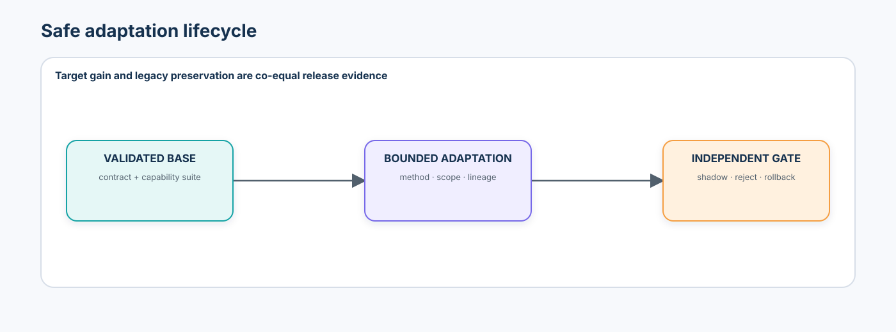
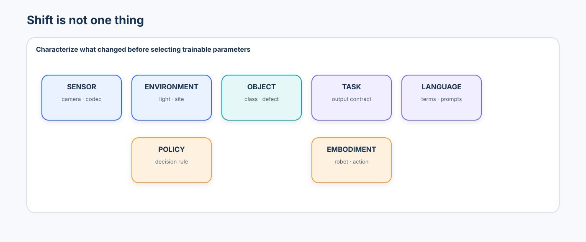
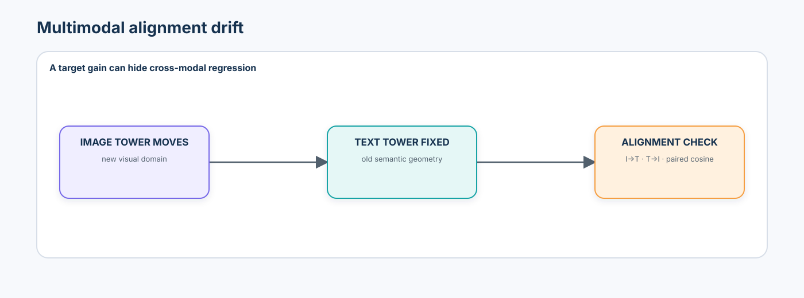
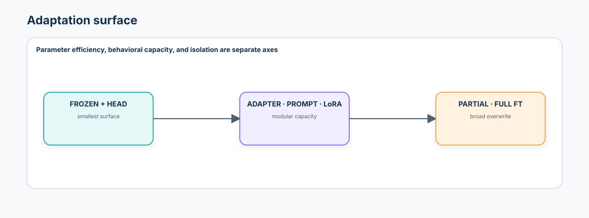
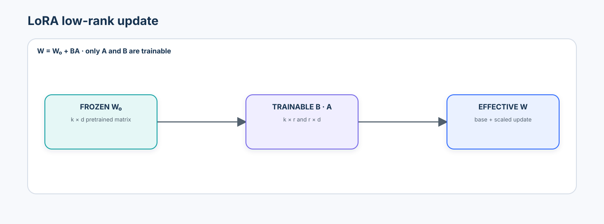
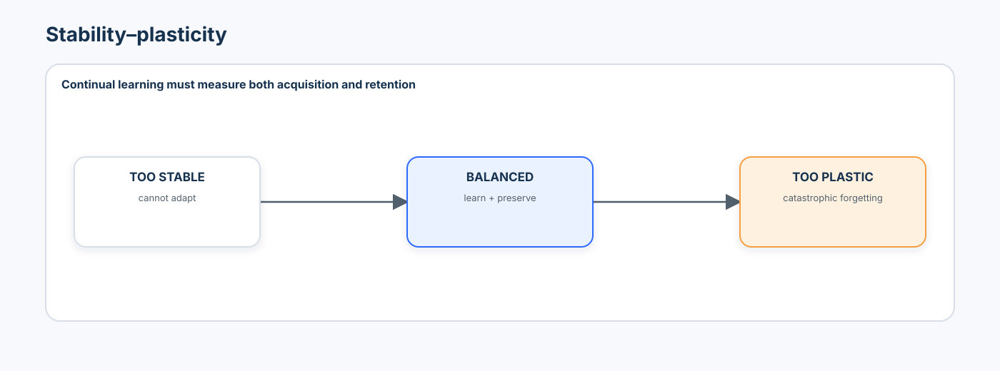
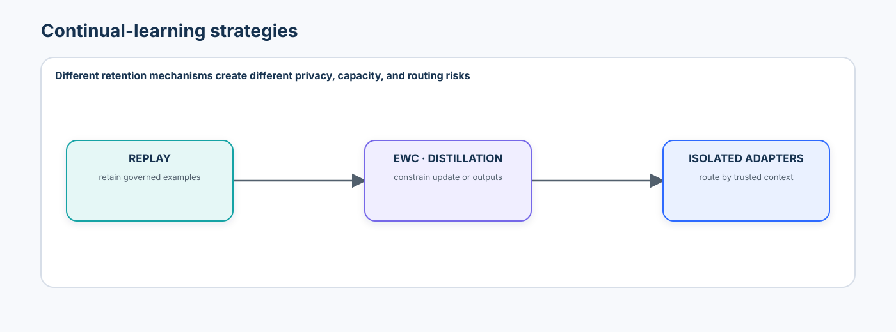
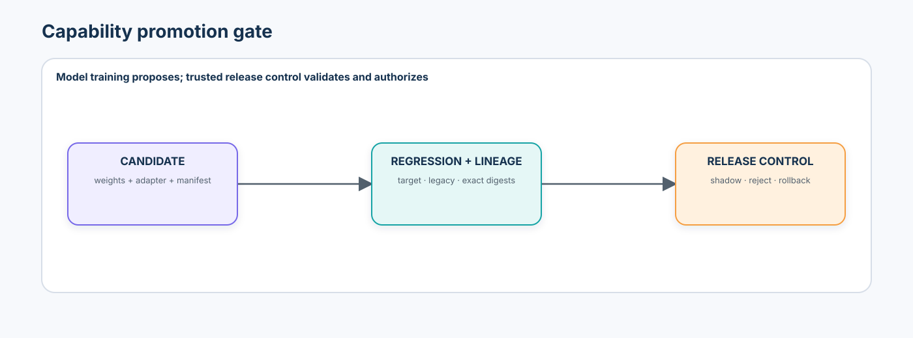

# Advanced 06 — Multimodal Adaptation & Continual Learning: From Domain Shift to Safe Capability Evolution

> How can a multimodal system acquire capability on a new domain, task, site, vocabulary, or embodiment without silently destroying what already worked?

This course connects adaptation research to an enterprise release lifecycle. The goal is not to produce a LoRA checkpoint. The goal is to make target improvement, legacy interference, multimodal alignment, continual-learning behavior, lineage, and rollback evidence measurable before promotion.



## Learning contract

By the end, you will be able to:

- distinguish transfer learning from continual learning and sensor, environment, object, task, language, policy, and embodiment shift;
- separate covariate, label, and concept change without calling every failure “domain shift”;
- define an adaptation objective that names both the capability to improve and the capabilities to preserve;
- implement frozen features, a linear probe, projector tuning, adapters, LoRA, partial unfreezing, and full fine-tuning on one controlled problem;
- derive LoRA parameter counts and treat rank and target modules as capacity and contract choices;
- measure transfer gain, negative transfer, legacy regression, forgetting, backward transfer, and forward-transfer evidence;
- diagnose representation, neighborhood, and cross-modal alignment drift;
- compare sequential fine-tuning, replay, EWC-style regularization, distillation, and parameter-isolated routing;
- govern replay data, adapters, candidate checkpoints, capability suites, promotion receipts, and rollback; and
- explain why a new-task metric or low adaptation loss is not enough to release a model.

### Prerequisites and transition

Complete [Beginner 09 — Vision Foundation Models](../../beginner/09-vision-foundation-models-open-vocabulary/README.md), [Intermediate 01 — Vision-Language Models](../../intermediate/01-vision-language-models/README.md), and [Advanced 05 — Spatial Memory, Scene Graphs & Navigation](../05-spatial-memory-scene-graphs-navigation/README.md). The earlier courses establish representation, alignment, evidence, held-out-source, model-governance, and persistent-state contracts. This course asks how those capabilities change over time.

### Scenario, success criteria, and boundaries

The notebook uses a small industrial dual encoder. Site A is the validated legacy factory, Site B is development-only for a new camera and terminology, and Site C is a stronger reporting-only shift. A deterministic local proxy makes image features, text concepts, adaptation surfaces, and interference inspectable. It is **not a foundation model, VLM benchmark, or production adaptation result**.

Success requires an immutable base contract, matched method comparison, explicit parameter scope, Site-B-only selection, frozen policy hashing before Site C, capability-family regressions, a continual-learning matrix, replay governance, and an application-owned promotion decision. No cell downloads weights, runs remote code, accesses personal data, or promotes a candidate.

## 1. Adaptation is a capability-preservation problem

The naive lifecycle—new data → fine-tune → deploy—asks only whether the candidate learned something new. A dependable lifecycle asks two questions:

1. What target capability improved?
2. What validated capability changed, for whom, under which source, and by how much?

```text
validated base → characterize shift → choose adaptation surface
  → train candidate → new-domain evaluation + legacy suite
  → interference analysis → promote / reject / roll back
```

The governing lesson is:

> Improvement on the new task is not sufficient evidence that adaptation succeeded.

## 2. Shift taxonomy



| Shift | Example | First question | Adaptation may be insufficient when |
| --- | --- | --- | --- |
| sensor | new camera, codec, resolution, spectrum | did the input contract change? | calibration or capture is invalid |
| environment | lighting, background, geography | is the intended relation stable? | shortcuts dominate training evidence |
| object/class | new product or defect | does the output vocabulary expand? | labels or ontology are inconsistent |
| task | classification → retrieval | did the output contract change? | the representation lacks needed detail |
| language | terminology, synonym, language | did text geometry or tokenization change? | policy meaning changed too |
| policy | scratch >5 mm becomes >3 mm | is perception still correct? | a deterministic business rule should change |
| embodiment | new robot or action interface | do action units and affordances match? | controller or hardware validation is missing |

Do not treat these as interchangeable. The same object under new lighting differs from a new class; new vocabulary differs from a new safety rule.

## 3. Covariate, label, and concept change

Covariate shift is often written as

\[
p_{\text{train}}(x) \ne p_{\text{target}}(x),
\]

while the desired conditional relationship is assumed to remain sufficiently stable. A new camera or background can approximate this case, but the assumption must be tested rather than declared.

Label-prior shift changes class frequencies. Concept change alters the relationship or decision itself. If a business rule changes from “review scratches above 5 mm” to “review above 3 mm,” retraining the visual encoder is not the first answer. Preserve perception evidence and version the policy.

## 4. Multimodal shift has multiple surfaces

A vision-language system may shift in its image encoder, text encoder, projector, tokenizer, retrieval corpus, prompt vocabulary, output schema, or cross-modal alignment. Classification can remain stable while retrieval degrades; retrieval can improve while calibration worsens. Evaluate each family separately.



## 5. Base-model and capability-suite contracts

Before adaptation, record at least:

```json
{
  "model_id": "local_tiny_dual_encoder",
  "revision": "sha256:...",
  "processor_revision": "synthetic-features-v1",
  "weights_hash": "...",
  "training_scope_known": true,
  "capability_suite_version": "advanced06-suite-v1",
  "license": "repository teaching code / synthetic data"
}
```

The capability baseline is immutable evidence across legacy classification, image→text retrieval, text→image retrieval, paired similarity, calibration, robustness, and the new domain. You cannot measure forgetting against a moving baseline.

## 6. State the adaptation objective

Use a two-sided objective:

```text
improve: Site B defect macro F1 and image→text retrieval
preserve: Site A accuracy, bidirectional retrieval, calibration, and robustness
```

“Improve validation loss” is not a release objective. It omits source, population, metric direction, tolerance, and the capabilities that adaptation may damage.

## 7. Start with the smallest justified intervention



1. **Frozen embedding baseline:** reuse representation and fit a new decision layer.
2. **Linear probe:** asks whether needed information is already linearly accessible.
3. **Head/projector tuning:** adjusts a narrow bridge or output surface.
4. **Adapter or prompt:** adds modular capacity while freezing the backbone.
5. **LoRA:** learns a low-rank update to selected matrices.
6. **Partial fine-tuning:** unfreezes selected blocks.
7. **Full fine-tuning:** maximizes flexibility and overwrite risk.

If a frozen representation meets the target contract, a larger update surface needs a concrete justification.

## 8. Linear probes and frozen embeddings

```text
image → frozen encoder → trainable linear head
```

A strong probe suggests that representation already contains useful information. A weak probe does not prove full fine-tuning is required: the head, sampling, label quality, normalization, task definition, and source split may be wrong.

## 9. Full and partial fine-tuning

Full fine-tuning updates most model parameters. It offers capacity but increases optimizer memory, overfitting, legacy interference, and checkpoint-management cost. Partial tuning—final blocks, projector, or head—sits between frozen reuse and full overwrite. Report exact trainable names and counts; “partially frozen” is not reproducible.

## 10. Adapters and prompts

An adapter inserts a small bottleneck and residual merge around a frozen layer. Separate `site_A` and `site_B` adapters can isolate parameters, but routing must be trusted and evaluated. Wrong routing is a failure mode, not a harmless fallback.

Visual prompt tuning prepends learned tokens to frozen image tokens. Text prompt or prefix tuning alters language conditioning. A prompt can change behavior without changing the backbone, but prompt adaptation is not identical to representation adaptation and does not eliminate forgetting or routing errors.

## 11. LoRA mechanics



For pretrained \(W_0\in\mathbb{R}^{k\times d}\), LoRA uses

\[
W = W_0 + \Delta W,\qquad \Delta W = BA,
\]

where \(A\in\mathbb{R}^{r\times d}\), \(B\in\mathbb{R}^{k\times r}\), and \(r\ll\min(d,k)\). A full update has \(kd\) parameters; LoRA has \(r(d+k)\), excluding any trained bias or saved modules.

The notebook implements `lora_parameter_count()` and checks ranks 1, 2, 4, 8, and 16. Rank is capacity control, not a quality guarantee. Too little rank can under-adapt; more rank raises capacity, memory, and possible interference.

## 12. Target modules are part of the contract

Attention Q/K/V, output projections, MLPs, vision towers, text towers, and multimodal projectors affect different behavior. Record target names, rank, scaling, dropout, initialization, merge state, and base-checkpoint digest. “LoRA r=8” is incomplete.

In a VLM, projector-only tuning can be economical when visual and language representations remain useful but their bridge is mismatched. It cannot repair every tower-level or perception failure.

## 13. Adaptation method matrix

| Method | Backbone overwritten | Trainable footprint | Modular artifact | Main risk |
| --- | ---: | ---: | ---: | --- |
| linear probe | no | tiny | yes | insufficient capacity |
| projector/head | narrow surface | low | usually | alignment distortion |
| adapter/prompt | no | low | yes | routing and interference |
| LoRA | effective low-rank update | low | yes | target/rank mismatch |
| partial FT | yes | medium | usually no | selective forgetting |
| full FT | yes | high | no | broad regression |

Forgetting risk is contextual. A small adapter can still produce large behavioral change; full fine-tuning with replay can preserve more than poorly configured PEFT.

## 14. Transfer gain and legacy regression

For target capability metric \(M\):

\[
G_{\text{new}} = M_{\text{adapted,new}}-M_{\text{base,new}}.
\]

For legacy capability \(j\):

\[
R_j = M_{\text{adapted},j}-M_{\text{base},j}.
\]

Negative \(R_j\) is regression when higher is better. For losses or latency, reverse or normalize direction explicitly. Never average unlike units into a vague “adaptation score.”

## 15. Representation and neighborhood drift

For fixed legacy input \(x\), compare \(z_{\text{base}}(x)\) and \(z_{\text{adapted}}(x)\) using cosine movement, distance, and top-k neighbor overlap. Drift is diagnostic, not automatically bad: useful adaptation often changes representations. Ask whether the change improves intended structure while preserving required neighborhoods and modality alignment. The lab makes this concrete with a frozen no-movement control, a bounded adapter, and broader projector tuning that gains target capability while retaining fewer legacy neighbors. Minimum drift is not the goal; useful plasticity with retained validated structure is.

## 16. Negative transfer and low-loss traps

Adaptation can underperform the frozen base on the target because data are sparse, labels noisy, optimization unstable, capacity mismatched, or the assumed shift wrong. Low training loss can coexist with poor held-out capability or severe legacy regression. The notebook deliberately compares two low-loss candidates with different retrieval retention.

## 17. Continual learning and the stability–plasticity problem

Continual learning handles a sequence of experiences rather than one adaptation event. Distinguish:

- **task-incremental:** task identity is available at inference;
- **domain-incremental:** input context changes but output space remains shared, without task identity at inference; and
- **class-incremental:** the output space grows and all classes must remain distinguishable.



Too stable means no useful learning. Too plastic means interference and forgetting.

## 18. Forgetting, backward transfer, and forward transfer

For capability \(A\), with higher-is-better metric:

\[
F_A=M_{A,\text{best previous}}-M_{A,\text{current}}.
\]

Backward transfer asks how learning later experiences changes earlier ones; the change can be positive. Forward transfer compares learning a future task after prior experience with learning it from the original base. State the reference point, task identity assumptions, and aggregation.

Metric direction is a hard contract, not an implicit convention:

```python
MetricSpec(name="macro_f1", direction="higher_is_better")
MetricSpec(name="ece", direction="lower_is_better")
```

A single `signed_improvement(current, reference, metric_spec)` function makes positive mean improvement for every metric. The notebook assertion-tests that rising accuracy and falling ECE are positive, while rising latency is negative. Every forgetting/BWT/FWT record stores the metric, direction, reference semantics, reference value, current value, and signed delta. Its forward-transfer value is explicitly a proxy because the tiny lab does not train a separate single-task control.

The central artifact is an evaluation matrix:

| Evaluated experience | after A | after B | after C |
| --- | ---: | ---: | ---: |
| A | measured | measured | measured |
| B | baseline/probe | measured | measured |
| C | baseline/probe | baseline/probe | measured |

## 19. Replay buffer contract and rehearsal

Replay mixes new examples with governed samples from earlier experiences. It is a strong baseline, not a free solution.

```json
{
  "buffer_version": "3",
  "selection_method": "class_source_balanced",
  "capacity": 50,
  "source_domains": ["A", "B"],
  "content_policy": "synthetic_non_personal",
  "digest": "sha256:..."
}
```

The notebook sweeps 0, 10, 50, and 200 retained examples and reports target plasticity, legacy retention, memory cost, and training time. Its selector balances both source and class and exports a membership audit. Random, class-balanced, and source-class-balanced replay encode different representativeness assumptions; a class-balanced buffer can still omit a legacy source. Production replay also requires privacy, consent, retention, deletion, licensing, and representativeness controls.

## 20. Regularization and distillation

Elastic Weight Consolidation (EWC) penalizes movement of parameters estimated to matter to previous tasks:

\[
L = L_{\text{new}}+\frac{\lambda}{2}\sum_iF_i(\theta_i-\theta_i^*)^2.
\]

The diagonal Fisher estimate and \(\lambda\) are approximations and hyperparameters. Distillation instead asks the candidate to preserve an earlier model’s outputs. It can preserve mistakes, depends on calibration and temperature, and does not replace old-domain evidence.

## 21. Parameter isolation and routing



Task/domain-specific adapters or prompt pools isolate parameters. Composition can share capabilities, but router identity, fallback behavior, capacity growth, adapter compatibility, and unknown domains require evaluation. Domain labels supplied by model text are untrusted; routing should use authenticated deployment context or a separately evaluated detector. The notebook evaluates correct routing, deliberate misrouting, unknown-domain abstention, ambiguous-domain abstention, and capability under the wrong adapter.

## 22. Continual vocabulary and alignment

Adding classes or terminology changes candidate vocabularies and decision geometry. Version tokenization, prompt templates, class definitions, synonyms, and unknown policy. A VLM may retain image classification while losing bidirectional retrieval, so forgetting must be reported by capability family.

## 23. Capability regression suite

At minimum, evaluate:

| Family | Metrics and slices |
| --- | --- |
| target | Site B/C macro F1, recall, retrieval |
| legacy | Site A accuracy/F1 and robustness |
| alignment | image→text, text→image, paired cosine |
| geometry | embedding drift, neighbor retention |
| calibration | ECE, abstention/review policy |
| continual | accuracy matrix, forgetting, BWT/FWT reference |
| systems | trainable parameters, artifact bytes, latency, memory |
| governance | manifest completeness, data rights, replay policy, rollback readiness |

Use repeated seeds or confidence intervals when sampling and optimization variability could change the decision.

## 24. Site A/B/C discipline

Site A establishes legacy capability. Site B selects method, rank, replay size, thresholds, and gate tolerances. A canonical policy is hashed. Site C is then reporting-only: no method, rank, prompt, threshold, buffer, epoch, seed, or decision-rule changes.

The held-out source tests generalization under this frozen policy. It is not a second development set.

## 25. Promotion and rollback are trusted application decisions



The training job produces a candidate and evidence. It cannot promote itself. A trusted release service verifies exact base/candidate digests, suite version, data manifests, metric directions, thresholds, unresolved risks, approvals, and rollback target.

Each required check resolves to `PASS`, `FAIL`, or `MISSING`. Only a complete all-`PASS` suite may produce `promote_to_shadow`; missing capability evidence produces `needs_review`, while a failed metric, suite mismatch, frozen-policy violation, or absent rollback artifact produces `reject`. The notebook assertion-tests all five cases. Absence of regression evidence is not evidence of no regression.

Possible decisions are `promote_to_shadow`, `reject`, `needs_review`, and `rollback`. Notebook success grants no production authority.

## 26. Artifact lineage

An adaptation artifact binds:

- base model, processor, tokenizer, and code revisions;
- adapter configuration and merge state;
- training, replay, and evaluation dataset manifests;
- split roles and frozen policy hash;
- optimizer, seed, environment, and trainable parameter names;
- capability-suite version and complete metric slices;
- candidate digest, decision, reviewer, and rollback target.

Adapters are not portable by name alone. Loading one onto the wrong base revision is a contract violation.

## 27. Failure taxonomy

| Failure | Evidence | Response |
| --- | --- | --- |
| wrong shift diagnosis | target failure remains after training | repair data/contract before more capacity |
| new-task overfit | train loss falls, Site B/C does not | simplify, improve data, regularize |
| legacy forgetting | negative legacy regression / forgetting | replay, isolation, regularization, reject |
| alignment drift | classification stable, retrieval drops | constrain tower/projector update; re-evaluate |
| vocabulary drift | prompt/class revision changes scores | version vocabulary; re-freeze threshold |
| router error | correct adapter exists but is not selected | validate trusted routing and unknown fallback |
| replay bias | retained set omits sources/classes | governed selection and slice audit |
| stale base/adapter pair | digest mismatch | block load or promotion |
| test tuning | Site C changes policy | invalidate report and create new version |
| rollback gap | prior artifact cannot be restored | stop promotion |

## 28. Tooling review

| Tool | Best fit | Review boundary |
| --- | --- | --- |
| PyTorch | transparent primitive implementation and controlled training | determinism, device parity, optimizer state, export behavior |
| Hugging Face PEFT | LoRA, adapters, prompt and related PEFT configurations | exact stable version, target-module names, base/adapter pairing, merge/export, license |
| Transformers / Accelerate | real pretrained multimodal training | processor/checkpoint revision, remote code, distributed state, data collators |
| Avalanche | continual-learning scenarios, strategies, metrics, and benchmarks | scenario definition, task identity, stream construction, metric semantics |
| MLflow / model registries | experiment and artifact lineage | authentication, immutable digests, stage permissions, rollback verification |
| W&B / TensorBoard | training and regression observability | sensitive examples, retention, tenant controls, reproducibility beyond dashboards |

The default lab implements the primitives directly with PyTorch, NumPy, pandas, scikit-learn, and Matplotlib. Optional ecosystems remain disabled and revision governed; a code revision does not grant rights to every model, dataset, or transitive artifact.

## 29. State of the art and research frontier

**Established practice:** frozen-feature baselines, full/partial tuning, LoRA/adapters/prompts, replay, distillation, EWC-style regularization, per-capability regression suites, and immutable model lineage.

**Rapidly consolidating:** richer low-rank parameterizations and initialization, visual/multimodal prompt learning, prompt pools for rehearsal-free continual learning, adapter composition, and foundation-model continual-learning protocols.

**Research frontier:** task-free multimodal streams, continual pretraining at foundation scale, privacy-preserving or data-free retention, router stability across unknown domains, semantic-base/new trade-offs, model merging without interference, and evaluation that jointly covers alignment, generation, grounding, retrieval, calibration, and safety.

No method is “state of the art” without a specific scenario, stream, backbone, data-access constraint, metric, split, hardware, and comparison class.

## 30. Practical lab sequence

1. seed, environment, and local-proxy boundary;
2. typed base-model, shift, capability-suite, replay, and candidate contracts;
3. Site A/B/C multimodal data with reporting-only Site C;
4. base dual-encoder training and immutable capability baseline;
5. frozen embeddings and linear-probe baseline;
6. exact LoRA math, parameter counts, and rank sweep;
7. matched projector, adapter, prompt, LoRA, partial, and full fine-tuning;
8. transfer-gain, legacy-regression, parameter, timing, and artifact comparison;
9. three-control representation drift, neighborhood retention, and bidirectional alignment checks;
10. low-loss / poor-retention counterexample and failure attribution;
11. A→B→C sequential learning with direction-aware forgetting/BWT/FWT evidence;
12. source-class-balanced replay sweep plus EWC, distillation, and router failure comparisons;
13. Site-B candidate and gate freeze, followed by untouched Site-C reporting;
14. fail-closed capability promotion/rejection/review scenarios, including missing evidence; and
15. JSON/CSV evidence export with optional-tool manifests and unresolved assumptions.

## 31. Production upgrade path

| Notebook | Production upgrade |
| --- | --- |
| synthetic features | consented, licensed, source-versioned multimodal datasets |
| tiny dual encoder | pinned foundation checkpoint and processor in isolated training |
| single-process loops | distributed checkpoints, resumability, data-loader lineage, failure recovery |
| in-memory replay | encrypted governed store with retention/deletion and sampling audits |
| trusted site labels | authenticated deployment context or separately evaluated router |
| point estimates | repeated runs, uncertainty, subgroup/source slices, change budgets |
| local files | immutable registry, signatures, access controls, SBOM, rollback drills |
| policy function | separation of duties, approval receipt, shadow/canary stages, monitored rollback |

## 32. Exercises

### Implementation

1. Target LoRA at the text tower instead of the image tower and compare alignment drift.
2. Add a rank-16 candidate without changing Site-C policy; explain the capacity and selection consequences.
3. Implement class-and-source-balanced reservoir replay and version its manifest.
4. Add a task-specific adapter and an explicit unknown-domain abstention route.

### Diagnosis

5. Create two runs with similar target loss but different legacy retrieval and identify the earliest failed capability.
6. Inject a wrong base-model digest into an adapter manifest and prove the loader blocks it.
7. Change Site C terminology without changing images; separate language shift from visual shift.
8. Compare cosine drift, neighbor retention, and retrieval change; explain why none alone proves harm.

### Architecture judgment

9. Decide between more labels, frozen reuse, LoRA, replay, or separate specialists under a privacy-constrained replay policy.
10. Design a rollback receipt bound to the candidate digest, capability suite, policy version, approver, and expiry.

## 33. What you should now be able to explain without code

- Why can adaptation loss fall while production capability gets worse?
- Why is a new camera different from a new policy threshold?
- When does a linear probe argue against full fine-tuning?
- Why does low rank not imply low forgetting?
- How can classification stay stable while image-text retrieval regresses?
- Why is representation drift diagnostic rather than automatically harmful?
- What information must a forgetting number name?
- Why can replay improve retention yet create privacy and sampling risks?
- When does adapter isolation still fail?
- Why must Site C remain reporting-only?
- Why can a training job propose but not authorize promotion?

## 34. References

Primary research and official documentation:

- Hu et al., [LoRA: Low-Rank Adaptation of Large Language Models](https://arxiv.org/abs/2106.09685).
- Jia et al., [Visual Prompt Tuning](https://www.ecva.net/papers/eccv_2022/papers_ECCV/html/4175_ECCV_2022_paper.php).
- Chen et al., [AdaptFormer](https://proceedings.neurips.cc/paper_files/paper/2022/hash/69e2f49ab0837b71b0e0cb7c555990f8-Abstract-Conference.html).
- Khattak et al., [MaPLe: Multi-modal Prompt Learning](https://openaccess.thecvf.com/content/CVPR2023/html/Khattak_MaPLe_Multi-Modal_Prompt_Learning_CVPR_2023_paper.html).
- Kirkpatrick et al., [Overcoming catastrophic forgetting in neural networks](https://doi.org/10.1073/pnas.1611835114).
- Li and Hoiem, [Learning without Forgetting](https://arxiv.org/abs/1606.09282).
- Rolnick et al., [Experience Replay for Continual Learning](https://arxiv.org/abs/1811.11682).
- van de Ven, Tuytelaars, and Tolias, [Three types of incremental learning](https://www.nature.com/articles/s42256-022-00568-3).
- Wang et al., [Learning to Prompt for Continual Learning](https://openaccess.thecvf.com/content/CVPR2022/html/Wang_Learning_To_Prompt_for_Continual_Learning_CVPR_2022_paper.html).
- Smith et al., [CODA-Prompt](https://openaccess.thecvf.com/content/CVPR2023/html/Smith_CODA-Prompt_COntinual_Decomposed_Attention-Based_Prompting_for_Rehearsal-Free_Continual_Learning_CVPR_2023_paper.html).
- Roth et al., [A Practitioner’s Guide to Continual Multimodal Pretraining](https://papers.neurips.cc/paper_files/paper/2024/file/f1a6a2cdc7e65dbb4579e78f97cd2665-Paper-Datasets_and_Benchmarks_Track.pdf).
- [Hugging Face PEFT LoRA documentation](https://huggingface.co/docs/peft/main/package_reference/lora).
- [Avalanche continual-learning documentation](https://avalanche.continualai.org/).

## 35. Next course

Advanced 07 will build on this lifecycle to study robustness and uncertainty: corruptions, distribution shift, calibration, OOD evidence, and failure recovery under a frozen release contract.
