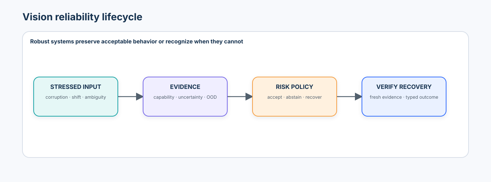
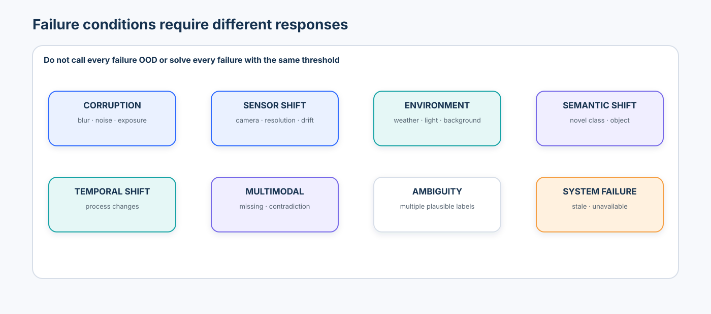
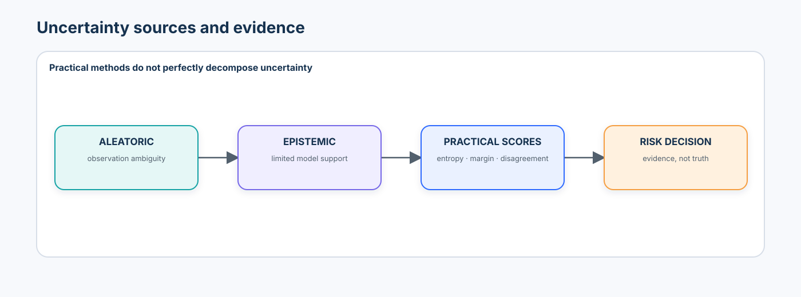
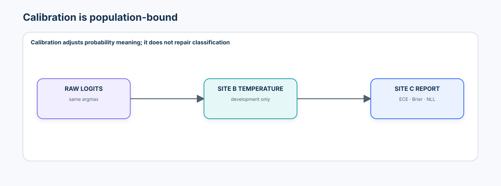
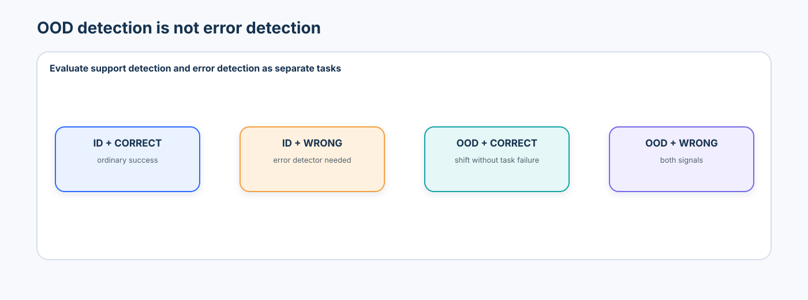
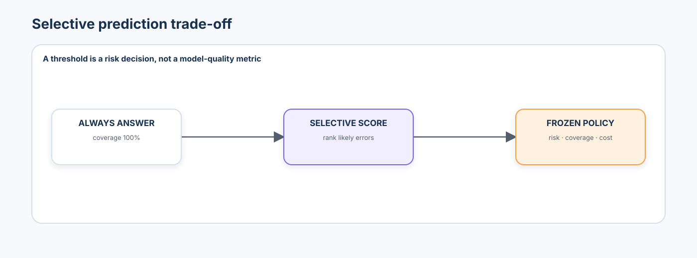
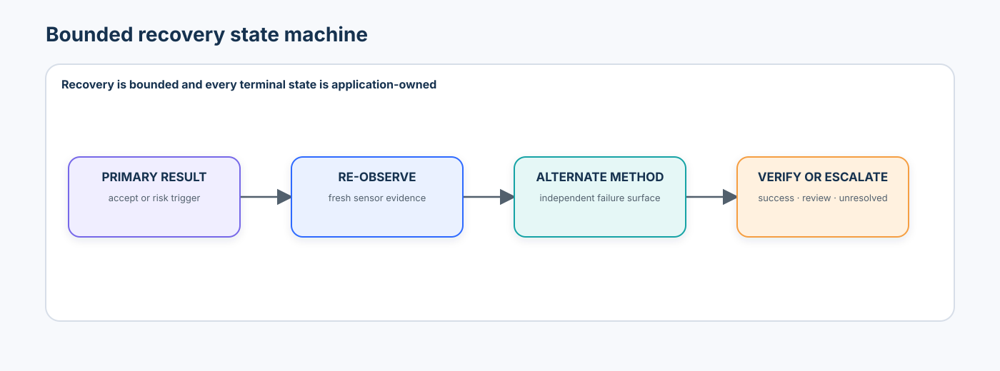
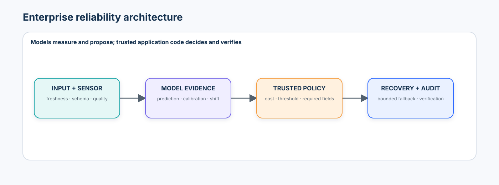

# Advanced 07 — Robustness, Uncertainty & Failure Recovery: From Distribution Shift to Risk-Aware Vision Systems

> A robust system is not one that always produces an answer. It preserves acceptable behavior—or recognizes when it cannot.

Advanced 06 asked whether a capability survives adaptation. Advanced 07 asks what happens when the world, sensor, data stream, model dependency, or operating assumptions differ from validation. The course keeps five ideas separate: **robustness**, **uncertainty evidence**, **calibration**, **OOD/shift evidence**, and **recovery**. None substitutes for the others.



## Learning contract

After this course, you should be able to:

- define robustness by task, perturbation, severity, population, and metric;
- measure corruption curves, worst slices, shift degradation, false confidence, and calibration under shift;
- distinguish ambiguity, aleatoric uncertainty, epistemic uncertainty, softmax confidence, ensemble disagreement, and model support;
- implement reliability diagrams, ECE, Brier score, NLL, temperature scaling, energy, centroid, and regularized Mahalanobis scores;
- evaluate OOD detection and error detection as separate binary tasks with explicit score orientation;
- construct split-conformal prediction sets and state the exchangeability assumption behind marginal coverage;
- select abstention thresholds with risk–coverage and cost evidence rather than accuracy alone;
- detect missing, stale, contradictory, and unavailable inputs or dependencies;
- design bounded re-observation, alternate-method, graceful-degradation, and human-review paths; and
- prove recovery with independent post-recovery evidence instead of treating an attempted fallback as success.

### Prerequisites and transition

Complete [Advanced 06](../06-multimodal-adaptation-continual-learning/README.md) first. Reuse its Site A/B/C split discipline, direction-aware metrics, immutable policy hash, fail-closed evidence gate, lineage, and non-authorizing model boundary. Earlier foundations come from [Beginner 01](../../beginner/01-modern-computer-vision-foundations/README.md), [Beginner 09](../../beginner/09-vision-foundation-models-open-vocabulary/README.md), [Intermediate 02](../../intermediate/02-multimodal-reasoning-verification/README.md), [Intermediate 05](../../intermediate/05-video-language-understanding/README.md), and [Intermediate 06](../../intermediate/06-visual-agents/README.md).

### Scenario, success criteria, and boundaries

A procedural three-class inspection system is validated at Site A. Site B is development-only: it selects temperature, OOD threshold, conformal quantile, recovery limits, and cost policy. Site C is reporting-only and cannot change any rule. The CPU notebook uses small synthetic images and a tiny local CNN ensemble. Its numbers are teaching measurements—not claims about a foundation model, commercial inspection line, or physical safety system.

Success means the lab exposes degradation by corruption/severity, false-confidence cases, calibration shift, OOD/error differences, risk–coverage trade-offs, and attempted-versus-verified recovery. It exports structured evidence with `authorization: none`.

### Non-goals

- an FGSM/PGD or adversarial-attack survey;
- a corruption leaderboard or universal “robustness score”;
- proof that softmax, ensembles, dropout, energy, distance, or conformal sets solve safety;
- live sensor control, physical actuation, or automatic production authorization; or
- a claim that aleatoric and epistemic uncertainty can always be decomposed perfectly.

## 1. Reliability changes the system boundary

The naive system is `input → model → prediction`. An operational reliability system is:

```text
input
  ↓
sensor and schema validation
  ↓
primary prediction + observable evidence
  ↓
calibration + uncertainty + shift/OOD diagnostics
  ↓
trusted risk policy
  ├── accept
  ├── abstain
  ├── re-observe
  ├── alternate method
  ├── degrade gracefully
  └── human review
  ↓
independent recovery verification
```

The model produces measurements and proposals. Trusted application code validates required fields, applies the frozen policy, bounds retries, selects a typed terminal state, and records evidence. Confidence never grants authority.

## 2. Failure conditions require different responses



| Family | Examples | Useful first evidence | Possible response |
| --- | --- | --- | --- |
| input corruption | blur, noise, exposure, compression, occlusion | corruption/severity slice | re-observe or alternate preprocessing |
| sensor shift | new camera, resolution, calibration drift | sensor contract and source slice | block, recalibrate, alternate sensor |
| environment shift | lighting, weather, background | capability plus shift evidence | review or validated alternate path |
| semantic shift | unseen class or novel object | near-OOD and open-set evidence | abstain; expand taxonomy offline |
| temporal shift | process or population changes | time/source monitoring | investigate and revalidate |
| multimodal failure | missing or contradictory modality | modality presence and agreement | degrade explicitly or review |
| ambiguity | several plausible labels | entropy, margin, prediction set | set-valued output or review |
| system failure | stale state, unavailable model/tool | freshness and dependency health | bounded retry, fallback, unresolved |

Calling all eight “OOD” destroys failure attribution.

## 3. Robustness is task-specific

“The model is robust” is incomplete. A claim must name:

```text
task + population + perturbation + severity + metric + operating policy
```

A classifier can tolerate JPEG-like quantization yet collapse under motion blur. A detector can preserve class confidence while localization degrades. A tracker can keep per-frame accuracy while identity switches increase. Robustness must follow the output contract.

## 4. Corruption families and severity curves

The lab implements Gaussian noise, blur, brightness, contrast, compression proxy, and occlusion at severities 1–5. Report the full curve, not only clean versus corrupted.

For metric (M) and corruption (c), a local trapezoidal summary is:

$$
\operatorname{AUC}_{\text{degradation},c}
=
\int_{s=0}^{5} \left(M_{\text{clean}}-M_{c,s}\right)\,ds.
$$

This is explicitly a **course-local summary**, not a standard benchmark metric. Preserve per-severity results because an average can hide catastrophic high-severity collapse. Report mean performance, worst corruption, and worst severity together.

## 5. Known corruption and natural shift are different

Controlled corruptions isolate mechanisms. Naturally occurring shifts—new factory, scanner, geography, product line, or process—mix several causes. Site C represents held-out operational shift; it is never a second development set.

Shift detection asks whether the input distribution changed. Capability evaluation asks whether the task still works. Large feature drift need not imply task failure, and a small drift score need not imply safety.

## 6. Ambiguity, aleatoric uncertainty, and epistemic uncertainty



**Aleatoric uncertainty** is associated with the observation or data-generating process: noise, occlusion, motion blur, or overlapping classes. More training data may not remove it.

**Epistemic uncertainty** is associated with limited model knowledge or support: unseen objects, sparse regions, or a new camera. More relevant evidence may reduce it.

These are useful conceptual categories, not perfectly observable labels. Predictive entropy, margins, ensembles, and dropout are evidence about predictive behavior; they do not uniquely identify the source of uncertainty.

The notebook makes that limitation executable with three labelled development slices: **ambiguous but familiar**, **clean but unsupported**, and **corrupted plus unsupported**. It compares entropy, ensemble disagreement, embedding distance, the selected OOD score, and task error side by side. No single scalar reliably explains *why* a system is uncertain.

## 7. Confidence is not uncertainty

Maximum softmax probability is the baseline:

$$
C(x)=\max_k p(y=k\mid x).
$$

Softmax normalizes relative logits. It does not prove the input resembles training data. The signature notebook failure is a **wrong, high-confidence** case.

For probabilities (p_k), predictive entropy is:

$$
H[p]= -\sum_k p_k\log p_k.
$$

The top-two margin is:

$$
m=p_{(1)}-p_{(2)}.
$$

High entropy and small margin often indicate ambiguity, but some OOD examples remain low entropy and high margin.

## 8. Ensembles and MC dropout

For (M) independently initialized models:

$$
p(y\mid x)\approx\frac{1}{M}\sum_{m=1}^{M}p_m(y\mid x).
$$

Measure vote disagreement, predictive variance, and ensemble entropy across clean, ambiguous, shifted, and OOD slices. Deep ensembles are a strong practical baseline but multiply training, storage, and inference cost.

MC dropout keeps dropout active at inference and performs several stochastic passes. It is a useful proxy experiment, not universally calibrated Bayesian inference. Neither method catches every failure.

## 9. Calibration is population-dependent

Roughly, among predictions assigned confidence 0.8, a calibrated system is correct about 80% of the time on the evaluated population.



A reliability diagram compares mean confidence and empirical accuracy per bin. Expected Calibration Error is:

$$
\operatorname{ECE}=\sum_b\frac{|B_b|}{N}\left|\operatorname{acc}(B_b)-\operatorname{conf}(B_b)\right|.
$$

ECE depends on binning and sample size. It is not sufficient alone.

The multiclass Brier score is:

$$
\operatorname{BS}=\frac{1}{N}\sum_i\sum_k(p_{ik}-y_{ik})^2,
$$

and negative log-likelihood is:

$$
\operatorname{NLL}=-\frac{1}{N}\sum_i\log p(y_i\mid x_i).
$$

Both are lower-is-better proper scoring rules; NLL punishes confident errors especially strongly.

## 10. Temperature scaling and frozen calibration

Temperature scaling applies:

$$
p_T(y\mid x)=\operatorname{softmax}(z/T).
$$

Select (T>0) on Site B, hash the policy, and freeze it before Site C. Positive temperature does not change `argmax`, so calibration may improve while accuracy remains identical. Calibration is not model correction.

The signature experiment reports ECE, Brier, and NLL on Sites B and C before and after scaling. It also reports classwise ECE because an aggregate can hide one dangerously overconfident class.

## 11. What OOD means operationally

OOD is not a universal property independent of task. The practical question is:

> Does this input appear sufficiently unlike validated support that additional caution is warranted?

Distinguish near OOD (similar domain, novel class), far OOD (unrelated input), and operational shift (relevant domain outside validated support). Far-OOD success alone is weak production evidence.

## 12. Transparent OOD scores

The notebook compares:

- **MSP/entropy:** output-space baselines;
- **centroid or kNN distance:** distance from known embeddings;
- **regularized Mahalanobis distance:** covariance-aware support evidence;
- **energy:** a logit-space score.

For embedding (z), class center (mu), and regularized covariance (Sigma+\lambda I):

$$
D_M(x)=\sqrt{(z-\mu)^T(\Sigma+\lambda I)^{-1}(z-\mu)}.
$$

For logits and score temperature (T_s):

$$
E(x)=-T_s\log\sum_k e^{z_k/T_s}.
$$

Score orientation must be explicit. `MetricSpec` records whether task metrics are higher- or lower-is-better. A separate `ScoreSpec` records the raw OOD orientation and permitted normalization—for example, raw MSP is lower-is-more-OOD and becomes `1 - MSP`, while distance is already higher-is-more-OOD. Scores enter AUROC, AUPR, thresholding, and policy only after this explicit normalization. No method is claimed universally superior.

## 13. OOD metrics and threshold policy

With OOD defined as the positive class, report AUROC, AUPR, and FPR at 95% TPR. The positive-class convention matters: different implementations use different score orientations and names.

AUROC ranks cases; it does not choose an operating threshold. Site B chooses a threshold against a risk objective such as 95% OOD recall, then reports ID false-reject rate. The notebook assertion-tests an adversarial threshold of negative infinity: it attains 100% OOD recall by also rejecting 100% of ID inputs. A detector that rejects everything is not useful.

## 14. OOD detection is not error detection



An OOD input may still be classified correctly, and an in-distribution input may be wrong. Therefore evaluate:

- **support detection:** OOD versus ID;
- **error detection:** incorrect versus correct prediction; and
- **task capability:** the original classification/detection/segmentation metric.

Use uncertainty as a score for error-detection AUROC and risk–coverage, but never rename it task accuracy.

## 15. Conformal prediction sets

Instead of forcing one label, split conformal classification can return a set (C(x)). With a fitted model, an exchangeable calibration set, and significance (alpha), finite-sample marginal coverage targets:

$$
\Pr\{Y_{n+1}\in C(X_{n+1})\}\ge 1-\alpha.
$$

The notebook implements a simple score (1-p_y), uses the finite-sample corrected empirical quantile, and reports coverage plus mean set size. Coverage is marginal, not automatically class-conditional, subgroup-conditional, or valid after arbitrary shift. Site C explicitly tests the assumption boundary.

## 16. Selective prediction and risk–coverage



For accepted set (A_\tau):

$$
\operatorname{coverage}(\tau)=\frac{|A_\tau|}{N},
\qquad
\operatorname{selective\ risk}(\tau)=\frac{\sum_{i\in A_\tau}\mathbf{1}[\hat y_i\ne y_i]}{|A_\tau|}.
$$

Always report both. Zero risk at zero coverage is useless. Threshold selection belongs to Site B and a declared cost model, not to Site C or a prettier curve.

The empty accepted set is a mathematical boundary, not a perfect result:

$$
|A_\tau|=0
\quad\Longrightarrow\quad
\operatorname{coverage}(\tau)=0,
\qquad
\operatorname{selective\ risk}(\tau)=\operatorname{undefined}.
$$

The notebook stores that risk as `NaN`, reports accepted count and coverage separately, and keeps its expected cost undefined. The Site-B optimizer first enforces `minimum_required_coverage = 0.55`, then compares finite-risk candidates. Known-answer assertions cover all accepted, none accepted, one wrong accepted, and one correct accepted.

## 17. Cost-sensitive risk policy

A frozen teaching policy assigns explicit costs to wrong acceptance, false rejection, human review, re-observation, and unresolved outcomes. The values are demonstration assumptions, not universal business costs.

Required evidence is tri-state:

```text
PASS
FAIL
MISSING
```

Missing calibration, OOD, freshness, dependency, or recovery-verification evidence cannot silently become `accept`.

## 18. Sensor and multimodal validation

Validate before model inference where possible:

- schema, shape, dtype, finite range, and timestamp;
- exposure, saturation, blur, occlusion, and frame continuity;
- modality presence and clock alignment; and
- contradiction between independent modalities.

A missing modality can permit an explicitly validated degraded mode. A contradictory modality should not be averaged away. Stale evidence remains stale even when confidence is high.

## 19. Graceful degradation

Graceful degradation means reducing capability explicitly while preserving the remaining contract. Examples:

- classification without localization only if downstream policy accepts that reduced contract;
- conservative prediction set instead of one class;
- lower operating speed under poor visibility;
- cached reference data only when freshness permits; or
- human review when no validated automated path remains.

It does not mean silently returning a lower-quality answer under the original label.

## 20. Bounded recovery



The lab compares three policies:

1. **always answer:** maximum coverage, hidden risk;
2. **abstain only:** blocks risky cases but attempts no recovery; and
3. **bounded recovery:** at most one fresh re-observation and one alternate method, then verified success, human review, or unresolved.

Stable logical operation IDs survive retry; attempt IDs do not. Dependency denial or invalid input is terminal. Unknown external outcome requires reconciliation before retry.

## 21. Re-observation and alternate methods

Re-observation is useful when the failure may be transient: blur, occlusion, bad exposure, or dropped frames. A retry budget and freshness deadline prevent loops.

An alternate method should have a meaningfully different failure surface—for example, an ensemble or embedding-distance classifier rather than the same model with a renamed threshold. Correlated fallbacks do not provide independent evidence.

## 22. Recovery verification

Attempted recovery is not successful recovery. The executable path enforces two stages:

```text
bounded_recovery_policy(case without labels or verifier)
        ↓ candidate or terminal non-success
independent finalizer + verification receipt
        ↓ verified recovery or human review
```

A verified outcome requires:

- fresh and schema-valid replacement evidence;
- a completed alternate result when that path was used;
- policy checks rerun on the recovered result;
- a task-quality or simulated oracle check in the teaching lab; and
- an explicit terminal state.

The recovery candidate records method, prediction, and decision support. The separate receipt records `verification_source = synthetic_evaluation_oracle` and `verified_success`. Candidate confidence or support can admit a candidate to verification but cannot certify success. Assertion-backed counterexamples cover confident-but-wrong fallback, uncertain-but-correct fallback that remains subject to the declared support rule, and correct fallback with independent verification.

Report `attempted`, `verified_success`, `false_success_claim`, `unresolved`, `human_review`, and `valid_work_blocked` separately. A fallback failure cannot return the original risky prediction.

## 23. Recovery evaluation

Measure:

| Family | Metrics |
| --- | --- |
| task | accuracy/F1 by source, corruption, severity, class |
| calibration | ECE, classwise ECE, Brier, NLL |
| OOD | AUROC, AUPR, FPR@95 TPR, ID false-reject rate |
| error detection | AUROC, risk–coverage, coverage at target risk |
| conformal | marginal coverage, mean set size, empty/full-set rate |
| recovery | attempts, verified-success rate, false-success claims, unresolved rate |
| operations | retries, latency distribution, dependency failures, human-review load |
| governance | policy completeness, Site-C freeze, lineage, authorization state |

Do not collapse these into one reliability score.

## 24. Monitoring after release

Offline validation becomes a versioned monitoring contract:

- source and sensor health;
- confidence and prediction-set distribution;
- calibration proxies only where delayed labels exist;
- embedding/feature shift;
- abstention, retry, fallback, review, and unresolved rates;
- confirmed task outcomes by important slice; and
- policy, model, processor, threshold, and calibration revisions.

Shift alerts trigger investigation; they do not prove capability failure or authorize retraining.

## 25. Enterprise reference architecture



The trusted application—not the model—owns required evidence, score orientation, policy version, cost assumptions, retry budget, terminal state, and recovery verification. Durable records bind model/processor digest, source role, calibration version, OOD threshold, conformal quantile, policy hash, observation timestamp, attempts, decision, and unresolved risks.

## 26. Technology landscape reviewed 2026-09-20

| Tool | Best fit | Useful strengths | Review boundary |
| --- | --- | --- | --- |
| PyTorch + scikit-learn | transparent local primitives | logits, dropout, ensembles, metrics, curves | developer owns metric orientation, splits, calibration, and policy |
| [TorchUncertainty](https://github.com/torch-uncertainty/torch-uncertainty) | integrated uncertainty-aware training/evaluation | calibration, proper scores, OOD and selective metrics | Lightning/config coupling, exact revision, method assumptions, checkpoint/data rights |
| [OpenOOD](https://github.com/Jingkang50/OpenOOD) | standardized near/far/covariate-shift OOD research | many post-hoc/training methods and benchmark protocols | dataset definitions, score convention, aging environment paths, production mismatch |
| [Alibi Detect](https://github.com/SeldonIO/alibi-detect) | drift and outlier components | online/offline detectors and monitoring integrations | reference windows, multiple testing, adaptation, state, alert semantics |
| [MAPIE](https://github.com/scikit-learn-contrib/MAPIE) | conformal prediction workflows | classification/regression conformal methods | exchangeability, calibration split, version-specific API, conditional coverage gaps |
| [RobustBench](https://github.com/RobustBench/robustbench) | standardized adversarial/common-corruption research | model zoo, protocol, unaggregated corruption results | this course is not attack-centered; preprocessing, dataset, threat model, checkpoint rights |
| [FiftyOne](https://docs.voxel51.com/) | visual slice inspection and review | sample-level errors, embeddings, human queues | access control, dataset governance, plugin/version pinning, metrics remain portable |

The notebook implements primitives first and keeps all optional integrations disabled. Exact reviewed source revisions live in `constraints-tested.txt` and the evidence artifact.

## 27. Established practice, emerging practice, and research frontier

**Established practice:** corruption/source slices, held-out calibration, proper scoring rules, ensembles, explicit abstention, risk–coverage, dependency health, bounded retries, human review, and fail-closed recovery.

**Emerging engineering practice:** uncertainty-aware multimodal systems, near-OOD protocols with covariate-shifted ID controls, set-valued prediction, foundation-feature support diagnostics, and recovery policies evaluated end to end.

**Research frontier:** conditional conformal guarantees under nonstationarity, open-world multimodal calibration, semantic versus covariate OOD separation, calibrated generative/spatial uncertainty, efficient ensemble approximations, and recovery evaluation without an immediate oracle.

No method is state of the art without naming the task, dataset/support definition, split, score orientation, metric, operating threshold, model/checkpoint, preprocessing, and target environment.

## 28. Failure taxonomy and mitigations

| Failure | Misleading shortcut | Required response |
| --- | --- | --- |
| high-confidence OOD | trust MSP | compare support and task evidence; abstain when policy requires |
| good AUROC, bad threshold | deploy ranking metric | select threshold on Site B with false-reject cost |
| perfect recall by rejecting all | optimize OOD recall alone | report ID rejection and enforce an operating contract |
| lower ECE, same errors | claim model fixed | state calibration-only effect |
| aggregate calibration hides class | report one ECE | class/source slices and sample counts |
| conformal under shift | quote nominal coverage | report observed Site C coverage and assumption violation |
| shift alert | infer accuracy collapse | obtain labelled/delayed capability evidence |
| retry loop | keep re-observing | bounded attempts and terminal unresolved state |
| fallback returns answer | mark recovered | independent verification and false-success counter |
| missing evidence | default accept | `MISSING` is non-accepting |
| Site C tuning | improve reporting result | invalidate report and create a new policy version |

## 29. Practical lab sequence

1. environment, optional-tool manifest, and synthetic/non-production boundary;
2. typed source, metric, sensor, policy, decision, and recovery contracts;
3. procedural Site A/B/C images and immutable source-role manifest;
4. tiny CNN ensemble, clean baseline, embeddings, and MC-dropout passes;
5. six corruptions × five severities with curves and worst-slice evidence;
6. ambiguous, near-OOD, far-OOD, operational-shift, stale, missing, contradictory, and unavailable cases;
7. MSP, entropy, margin, disagreement, energy, centroid, and Mahalanobis scores plus a three-slice failure-source comparison;
8. manual ECE/Brier/NLL, reliability diagrams, classwise slices, and Site-B temperature scaling;
9. OOD metrics/thresholds and separate error-detection metrics;
10. conformal prediction sets and coverage under reporting-only shift;
11. risk–coverage with undefined empty-set risk, minimum coverage, cost-sensitive policy, and missing-evidence assertions;
12. always-answer versus abstain-only versus bounded recovery;
13. label-free recovery proposals, independent verification receipts, adversarial recovery assertions, and failure attribution; and
14. governed JSON/CSV evidence with no production authorization.

## 30. Production upgrade path

| Notebook | Production requirement |
| --- | --- |
| procedural 16×16 images | licensed, consented, source/time/site-isolated datasets |
| one deterministic run | repeated seeds, intervals, incident and subgroup slices |
| tiny ensemble | pinned checkpoints/processors, target-hardware cost and parity |
| synthetic OOD | task-specific near/far/operational support definition |
| immediate labels | delayed-outcome joins and label-quality governance |
| in-memory policy | authenticated versioned policy service with separation of duties |
| simulated re-observation | sensor orchestration, deadline, idempotency, reconciliation |
| local artifacts | signed registry, retention controls, audit, rollback and recovery drills |

## 31. Exercises

### Implementation

1. Add motion blur while preserving the severity contract.
2. Compare diagonal and full regularized Mahalanobis distance.
3. Implement adaptive or regularized conformal sets and compare set size.
4. Add an uncertainty-aware segmentation slice without renaming pixel uncertainty as image uncertainty.

### Diagnosis

5. Find a low-entropy OOD example and explain why entropy failed.
6. Show a class with worse calibration after global temperature scaling.
7. Construct a high OOD score that remains task-correct and an ID error that OOD scoring misses.
8. Inject a fallback failure and prove the original prediction is not released.

### Architecture judgment

9. Choose between an ensemble, MC dropout, distance score, conformal set, or human review under a strict latency budget.
10. Design a policy for missing modalities versus contradictory modalities.
11. Specify which recovery actions require external approval in an embodied system.
12. Define monitoring that distinguishes shift alarms, confirmed capability loss, and recovery incidents.

## 32. What you should now be able to explain without code

- Why can clean accuracy remain high while operational reliability is poor?
- Why is softmax confidence not proof of in-distribution support?
- Why can temperature scaling improve calibration without fixing one prediction?
- Why can an OOD input be correct and an ID input be wrong?
- Why does AUROC not select a deployment threshold?
- What assumptions support conformal marginal coverage, and what changes under shift?
- Why is zero selective risk meaningless at zero coverage?
- Why is an attempted fallback not a recovered outcome?
- Why must Site C remain reporting-only?
- Which decisions belong to trusted application code rather than a model score?

## 33. References

### Robustness and shift

- Hendrycks and Dietterich, [Benchmarking Neural Network Robustness to Common Corruptions and Perturbations](https://openreview.net/forum?id=HJz6tiCqYm).
- Koh et al., [WILDS: A Benchmark of in-the-Wild Distribution Shifts](https://proceedings.mlr.press/v139/koh21a.html).
- Taori et al., [Measuring Robustness to Natural Distribution Shifts in Image Classification](https://papers.nips.cc/paper/2020/hash/d8330f857a17c53d217014ee776bfd50-Abstract.html).

### Uncertainty and calibration

- Guo et al., [On Calibration of Modern Neural Networks](https://proceedings.mlr.press/v70/guo17a.html).
- Lakshminarayanan, Pritzel, and Blundell, [Simple and Scalable Predictive Uncertainty Estimation using Deep Ensembles](https://papers.nips.cc/paper/2017/hash/9ef2ed4b7fd2c810847ffa5fa85bce38-Abstract.html).
- Gal and Ghahramani, [Dropout as a Bayesian Approximation](https://proceedings.mlr.press/v48/gal16.html).
- Ovadia et al., [Can You Trust Your Model's Uncertainty? Evaluating Predictive Uncertainty Under Dataset Shift](https://papers.nips.cc/paper/2019/hash/8558cb408c1d76621371888657d2eb1d-Abstract.html).

### OOD, selective prediction, and conformal sets

- Hendrycks and Gimpel, [A Baseline for Detecting Misclassified and Out-of-Distribution Examples](https://openreview.net/forum?id=Hkg4TI9xl).
- Liu et al., [Energy-based Out-of-distribution Detection](https://proceedings.neurips.cc/paper/2020/hash/f5496252609c43eb8a3d147ab9b9c006-Abstract.html).
- Geifman and El-Yaniv, [Selective Classification for Deep Neural Networks](https://proceedings.neurips.cc/paper/2017/hash/4a8423d5e91fda00bb7e46540e2b0cf1-Abstract.html).
- Romano, Sesia, and Candès, [Classification with Valid and Adaptive Coverage](https://proceedings.neurips.cc/paper/2020/hash/244edd7e85dc81602b7615cd705545f5-Abstract.html).
- Angelopoulos and Bates, [A Gentle Introduction to Conformal Prediction and Distribution-Free Uncertainty Quantification](https://doi.org/10.48550/arXiv.2107.07511).

### Current official tooling

- [TorchUncertainty documentation](https://torch-uncertainty.github.io/).
- [OpenOOD official repository](https://github.com/Jingkang50/OpenOOD).
- [Alibi Detect documentation](https://docs.seldon.ai/alibi-detect/).
- [MAPIE documentation](https://mapie.readthedocs.io/).
- [RobustBench official repository](https://github.com/RobustBench/robustbench).

## 34. Next course

Advanced 08 moves from reliability evidence into efficient spatial inference: profiling, view/token budgets, quantization, compilation, streaming memory, and edge constraints. Reliability gates remain part of every optimization decision.
