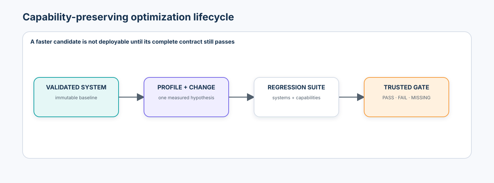
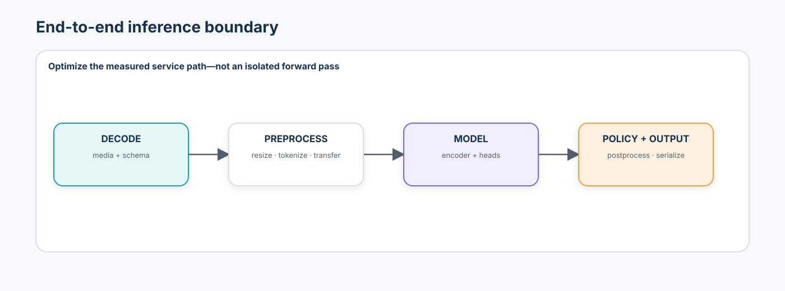
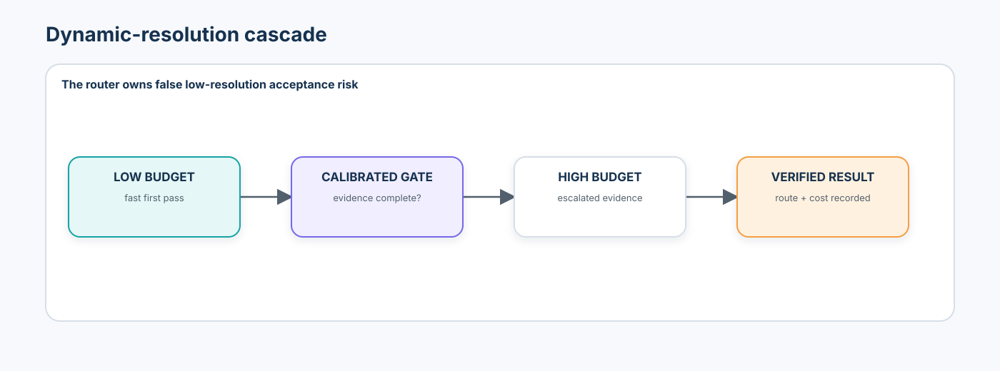
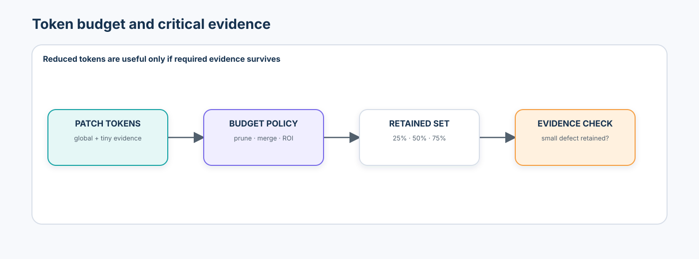
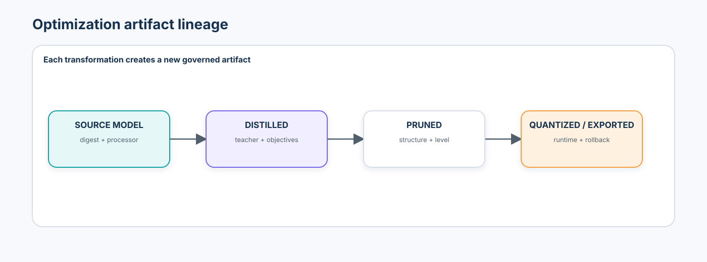
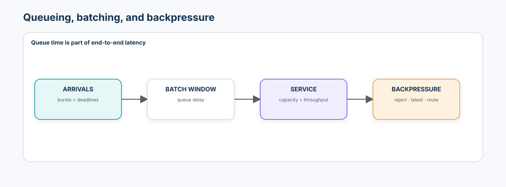
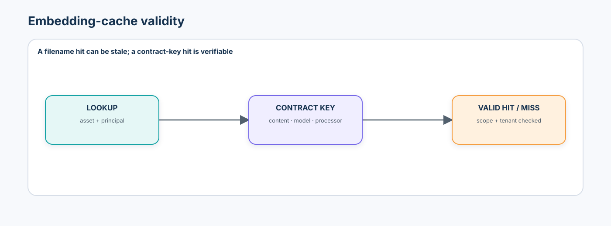
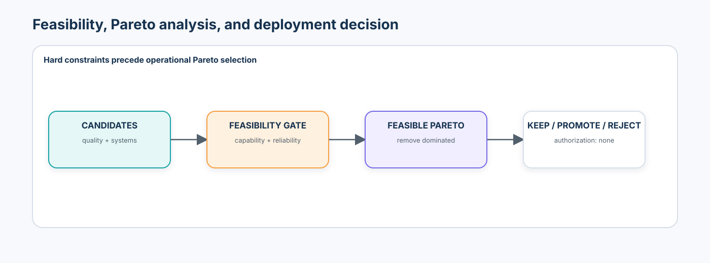

# Advanced 08 — Efficient Spatial & Multimodal Inference: From Profiling to Edge-Aware Deployment

> Performance optimization is a model change whenever it can alter observable behavior.

Advanced 07 established how to recognize unsupported inputs, calibrate decisions, abstain, and verify bounded recovery. Advanced 08 asks whether those capabilities and safeguards survive when a validated spatial or multimodal system is made faster, smaller, cheaper, or easier to deploy.

The central question is not “How do I make PyTorch faster?” It is:

> How do we reduce latency, memory, compute, bandwidth, and energy without silently changing what the system can see, retrieve, reason about, or safely decide?



## Learning contract

After this course, you should be able to:

- specify an inference workload before quoting a benchmark;
- separate cold start, queueing, preprocessing, model, transfer, postprocessing, and policy latency;
- report p50, p95, p99, maximum, throughput, peak memory, artifact size, and benchmark context;
- explain why FLOPs, parameter count, sparsity, and lower precision do not guarantee latency improvement;
- evaluate resolution, region, visual-token, frame, retrieval, and text-context budgets as capability choices;
- compare PTQ, QAT, structured pruning, layer/head dropping, distillation, compilation, batching, and caching;
- verify numeric and task parity after export or runtime transformation;
- model saturation, backpressure, deadlines, and observation freshness;
- detect stale or unauthorized cache reuse;
- identify Pareto-efficient candidates without inventing one universal efficiency score; and
- reject a fast candidate when critical-slice, retrieval, calibration, reliability, or lineage evidence fails or is missing.

### Prerequisites and transition

Complete [Advanced 07](../07-robustness-uncertainty-failure-recovery/README.md) first. Reuse its metric-direction contracts, calibration and OOD policy, `PASS` / `FAIL` / `MISSING` evidence, Site A/B/C discipline, and non-authorizing recovery boundary. This course also reconnects [efficient CNN systems](../../beginner/02-modern-cnn-architectures-efficient-vision/README.md), [vision-token cost](../../beginner/03-vision-transformers/README.md), [retrieval infrastructure](../../beginner/07-visual-embeddings-metric-learning-retrieval/README.md), [tracking](../../beginner/08-tracking-keypoints-pose/README.md), [foundation interfaces](../../beginner/09-vision-foundation-models-open-vocabulary/README.md), [VLM token budgets](../../intermediate/01-vision-language-models/README.md), [multimodal RAG](../../intermediate/04-multimodal-retrieval-rag/README.md), [video backpressure](../../intermediate/05-video-language-understanding/README.md), and [bounded agents](../../intermediate/06-visual-agents/README.md).

### Scenario, success criteria, and boundaries

The notebook optimizes a small multimodal inspection proxy that supports classification, small-defect evidence, and bidirectional image–text retrieval. Site A fixes the reference capability. Site B selects resolution, token retention, quantization, pruning, distillation, cascade, batching, cache, and deployment thresholds. Site C changes defect mix, request load, and repetition rate, and is reporting-only.

Success means finding an operating point that satisfies every required systems and capability constraint. A candidate that is fastest but loses a tiny defect, retrieval geometry, calibration, or required evidence must be rejected.

The notebook is credential-free, deterministic, CPU-safe, and intentionally small. Its timings are **teaching measurements on the notebook host**, not claims about a GPU, NPU, mobile device, production server, or safety-critical inspection line. It exports evidence with `authorization: none`.

### Non-goals

- a CUDA kernel, TensorRT, ONNX, or vendor-specific tutorial;
- a claim that FP32 → INT8 is automatically faster or behaviorally equivalent;
- a single accuracy, FLOP, sparsity, or latency leaderboard;
- proof of energy use from a compute proxy;
- heavyweight VLM, 4K video, or real-device benchmarking in CI; or
- production authorization, physical control, or a universal deployment threshold.

## 1. Begin with a workload contract

An inference number is uninterpretable without its workload. Record:

| Dimension | Examples |
| --- | --- |
| input | resolution, aspect ratio, regions, frames, text length, retrieved items |
| traffic | batch, concurrency, arrival distribution, burstiness, repetition |
| target | CPU/GPU/NPU, memory, precision support, power and thermal envelope |
| service | online, streaming, offline, interactive, deadline, freshness |
| capability | classification, localization, retrieval, grounding, calibration, OOD behavior |
| measurement | warm-up, repetitions, synchronization, percentiles, included stages |

“12 ms” is not a workload contract.

## 2. Measure the whole system boundary



The user-visible path is often:

```text
decode → preprocess → transfer → model → postprocess → trusted policy → serialize
```

Model latency can fall while end-to-end latency stays flat because the bottleneck moves to media decode, data transfer, retrieval, postprocessing, or queueing. Preserve stage-level measurements and re-profile after every substantial change.

## 3. Latency, throughput, warm-up, and timing correctness

For observed latencies \(L_1,\ldots,L_n\), report a distribution—not only the mean:

$$
L_{p50}=Q_{0.50}(L),\quad
L_{p95}=Q_{0.95}(L),\quad
L_{p99}=Q_{0.99}(L).
$$

Throughput is completed work per unit time:

$$
\operatorname{throughput}=\frac{N_{\text{completed}}}{\Delta t}.
$$

Latency and throughput are related but not interchangeable. Batching may increase throughput while raising per-request latency. Always distinguish:

- first request and cold-start cost;
- requests 2–5 or compilation/cache warm-up;
- steady-state percentiles;
- service time versus queue time; and
- synchronous CPU timing versus asynchronous accelerator timing.

Accelerator benchmarks must synchronize the device around measured regions. Otherwise host timers can stop before device work completes.

Very short CPU regions are also fragile. Time many forward calls inside each measured region, normalize per batch afterward, and report the median, p95, IQR, repetition count, inner-loop count, and raw timed-region duration. In this course, measured host timing is diagnostic evidence only. Frozen release gates use a deterministic service-and-queue model so operating-system jitter cannot change the pedagogical decision. Production replaces both with synchronized target-hardware and load-test evidence.

## 4. Profile before optimizing

Profiling asks where time, memory, and transfers are spent. The loop is:

```text
immutable baseline → stage profile → bottleneck hypothesis → one change → re-profile
```

Operator traces are useful, but a fast kernel cannot repair a slow decoder or an overloaded queue. Report the environment, inputs, threads, batch, concurrency, repetitions, warm-up, and profiler overhead.

## 5. Memory has several meanings

Parameter memory is approximately:

$$
M_{\text{params}}=N_{\text{params}}\times \text{bytes per parameter}.
$$

Deployment memory also includes activations, temporary workspaces, runtime state, decoded media, caches, request queues, and model replicas. Peak resident memory is not the model file size. A smaller checkpoint can still require a large activation peak.

## 6. FLOPs, MACs, and sparsity are proxies—not runtime

Latency depends on arithmetic intensity, memory traffic, kernel launch overhead, vectorization, tensor shapes, operator support, compilation, and hardware. Lower MACs can be slower when the alternative introduces many small or poorly supported operations.

Unstructured sparsity records zeros; it does not change dense tensor shapes. Real speedup requires runtime and hardware support. Structured pruning of channels, heads, or blocks more directly changes shapes, but can remove larger units of capability.

## 7. Input resolution is an evidence budget

Reducing image size lowers convolutional work and visual-token count. For patch size \(P\), an \(H\times W\) image has roughly:

$$
N=\frac{H}{P}\frac{W}{P}
$$

visual tokens, and naive self-attention interaction cost grows as \(O(N^2)\). But small objects and fine boundaries may disappear before aggregate accuracy moves.

Always sweep resolution against:

- task metric;
- small-object or thin-structure recall;
- retrieval and grounding;
- calibration and reliability thresholds;
- latency, input bytes, and peak memory.

## 8. Dynamic resolution and cascades



A cascade can run a low-resolution model first, then invoke high resolution for difficult cases. Its router needs its own metrics:

- escalation rate;
- false low-resolution acceptance;
- latency and quality by route;
- expected compute under the real request mix; and
- calibration of the routing signal.

The router is a model or policy surface. A confident low-resolution pass can be wrong precisely because the missing evidence was never observed.

## 9. Visual-token, region, and early-exit budgets

Token pruning removes selected tokens. Token merging combines similar tokens. Region-of-interest inference spends compute on proposed areas. Early exiting gives easy inputs fewer layers. All four are conditional-compute policies.



Measure token count, compute proxy, latency, critical-evidence retention, small-object recall, dense-task quality, retrieval, and calibration. Low attention or salience is not proof that a token is unnecessary. Dense prediction can require spatial structure that image classification does not.

An early-exit rule must use calibrated development evidence and be revalidated after compression. Compare permanent layer dropping with input-dependent early exit.

## 10. Quantization is a capability change

Quantization maps values to a lower-precision representation. PTQ uses a trained model plus representative calibration data; QAT exposes training to quantization effects. Calibration data comes from Site B, never final Site C.

Review:

- weights versus activations;
- static versus dynamic activation scales;
- symmetric versus asymmetric representations;
- per-tensor versus per-channel granularity;
- outlier-sensitive channels and tokens;
- weight-only versus weight-and-activation formats; and
- actual target support for FP16, BF16, INT8, INT4, FP8, or FP4.

Lower precision can reduce storage without improving latency on unsupported hardware. Equal accuracy can hide worse ECE, retrieval, small-defect recall, or OOD-score behavior.

## 11. Pruning curves need measured shapes and behavior

Sweep structured pruning levels rather than celebrating the largest sparsity value. Report effective tensor/operation reduction, latency, peak memory, task quality, critical slices, and calibration.

Attention-head importance on one development distribution does not prove global irrelevance. Head or block removal must be tested on legacy and shifted slices. Layer dropping creates one permanently smaller model; early exit creates input-dependent depth.

## 12. Distillation must preserve every claimed capability

For teacher \(f_T\) and student \(f_S\), a local multimodal objective may combine:

$$
L=\lambda_{task}L_{task}+\lambda_{logit}L_{logit}+\lambda_{align}L_{align}.
$$

This is a teaching formulation, not a universal objective. A student can match teacher classification while damaging image→text retrieval, text→image retrieval, calibration, dense evidence, or OOD behavior. Teacher mistakes can also be transferred.



## 13. Compilation, graph coverage, dynamic shapes, and parity

Compilation may apply constant folding, dead-code elimination, fusion, kernel selection, and memory planning. Fusion can reduce launches and intermediate traffic without reducing theoretical FLOPs.

`torch.compile` can optimize captured regions while graph breaks run eagerly. `torch.export` requires a single exportable graph and does not support graph breaks. Therefore, “compiled” is not evidence that the whole program was optimized.

Declare shapes as static, bounded dynamic, or fully dynamic. A deployment artifact must bind source digest, export format, opset/runtime, precision, shape policy, optimization profile, and target. Compare with the reference using maximum and mean absolute difference, task disagreement, and capability metrics. Exact floating-point equality is not always required; behavioral evidence is. A tiny numeric difference can still flip an argmax at a decision boundary, so small numeric error does not imply behavioral parity.

## 14. Batching, queueing, and saturation



End-to-end latency is:

$$
L_{total}=L_{queue}+L_{service}.
$$

Sweep batch 1, 2, 4, and 8 while measuring throughput, per-request p50/p95, and peak memory. For dynamic batching, include the wait window. Increase arrival rate until queue depth, p95, timeout rate, or deadline misses reveal saturation.

When arrival rate exceeds capacity, choose an explicit policy: reject, drop stale frames, reduce quality under a validated degraded contract, batch, or route elsewhere. An unbounded queue turns overload into stale work.

## 15. Video inference reuses time—with staleness risk

A 30 FPS input does not always require 30 full-model evaluations per second. Systems can sample frames, track between detections, trigger on events, select keyframes, or reuse temporal features. Measure event recall, identity stability, compute proxy, and state staleness.

Decision freshness is:

$$
Age_{decision}=t_{decision}-t_{capture}.
$$

Processing every queued frame may be worse than keeping the newest relevant frame, but dropped frames can hide short events. The policy must match the operational objective.

## 16. Caches need validity, lineage, and authorization



Caches can store decoded media, tensors, image/text embeddings, retrieval results, visual tokens, temporal state, or generated prefixes. A safe embedding key includes:

```text
content digest + encoder revision + processor revision + configuration
+ tenant + authenticated principal + authorization scope
```

Report hit rate, **valid** hit rate, stale-hit rate, miss rate, and latency saved. A high hit rate with poor invalidation is a failure. Embeddings and tokens remain sensitive artifacts; they are not anonymous and must not cross tenants or principals simply because content hashes match.

## 17. Edge/cloud partitioning changes capability and privacy

Edge inference can reduce network dependence and keep raw data local, but faces memory, power, thermal, operator, and update constraints. Cloud inference supports larger models and centralized operations but adds bandwidth, connectivity, and queue latency.

Possible partitions include cheap edge filtering followed by cloud reasoning, or an edge encoder followed by cloud retrieval. Compare raw images, compressed crops, and embeddings for bandwidth, downstream capability, leakage, and authorization. A network outage must enter an explicit degraded mode; the system cannot pretend a cloud result exists.

Measure joules/request or power directly when hardware permits. FLOPs are not energy. Short-burst timing is not sustained thermal behavior.

## 18. Quality and efficiency are both multidimensional

Quality may include accuracy, recall, retrieval, grounding, calibration, OOD behavior, small-object evidence, and temporal consistency. Efficiency may include latency, throughput, memory, artifact size, tokens, bandwidth, and direct energy.



Candidate A dominates B when A is no worse on every selected dimension and better on at least one. The notebook preserves two deliberately different flags:

```text
global_pareto_efficient
→ unconstrained non-domination for teaching and diagnosis

feasible_pareto_efficient
→ non-domination only after every hard capability, reliability,
  evidence, and resource constraint passes
```

Operational selection uses only the feasible frontier. A globally efficient candidate can still have zero small-defect recall and is never promoted through Pareto membership. Missing quality evidence is `MISSING`, not an assumed pass.

## 19. Optimization can invalidate reliability policy

Quantization, pruning, distillation, or compilation can preserve accuracy while changing confidence, embedding distance, energy scores, or ensemble disagreement. Re-evaluate calibration, OOD, abstention, and early-exit thresholds. If they change, create a new policy version. Do not reuse Advanced 07 thresholds blindly.

Each candidate runs the capability regression suite:

```text
legacy tasks + critical slices + bidirectional retrieval + calibration
+ OOD/error behavior + held-out source + required evidence completeness
```

## 20. Multimodal inference is resource allocation

Under fixed compute, a system chooses among image tokens, video frames, retrieved evidence, text context, model depth, and tool calls. Static budgets are simple but wasteful on easy requests. Adaptive budgets need a tested router.

Define gold critical evidence for synthetic tasks—small defect region, relevant retrieval item, or important event—and report:

$$
EvidenceRetention=
\frac{\text{required evidence preserved}}
{\text{required evidence}}.
$$

This is a course-local diagnostic unless mapped to an established task metric. The stronger question is: **which computation can be removed without removing evidence required by the decision?**

## 21. Artifact lineage, governance, and release boundary

Every optimized artifact records:

- parent/source digest and ordered transformations;
- resolution, token, precision, pruning, distillation, compiler, and cache configuration;
- framework/runtime/operator versions and hardware compatibility;
- benchmark environment and capability suite;
- expected benefit and known risks;
- rollback artifact and policy version; and
- evaluation evidence with no implicit production authority.

The optimization job proposes an artifact. A trusted release service verifies lineage, signature, compatibility, complete evidence, objective improvement, and rollback readiness. Its explicit decision is `PROMOTE_OPTIMIZED`, `KEEP_REFERENCE`, `REJECT`, or `MISSING_EVIDENCE`; none is production authorization. An eligible optimized candidate must provide a declared minimum service-latency or artifact-size benefit. If it does not, keeping the reference is the successful outcome. Model code cannot self-promote.

## 22. Failure taxonomy

| Failure | Earliest evidence | Required response |
| --- | --- | --- |
| input-budget failure | critical feature lost after resize/crop | restore budget or validated cascade |
| token/ROI failure | gold evidence removed | change selector; fail candidate |
| quantization failure | parity, slice, calibration regression | change scheme/QAT/exclusions or reject |
| pruning failure | shape reduction without acceptable capability | choose lower level or reject |
| distillation failure | task preserved, retrieval/alignment lost | add capability objective or reject |
| compilation parity failure | output/task disagreement | isolate unsupported graph/runtime |
| cache invalidation failure | stale or cross-scope hit | correct key and purge affected entries |
| queueing failure | tail latency, timeout, freshness collapse | capacity/backpressure policy |
| memory-budget failure | peak exceeds target | memory plan, smaller state, reject |
| unsupported runtime | fallback or missing operator | explicit compatible target or reject |
| composition failure | individual changes pass; combined fails | evaluate the ordered composition |
| reliability regression | ECE/OOD/abstention drift | recalibrate on Site B and version policy |

## 23. Technology landscape reviewed 2026-09-20

| Tool | Best fit | Useful strengths | Review boundary |
| --- | --- | --- | --- |
| [PyTorch compile/export/profiler](https://docs.pytorch.org/) | transparent reference and graph capture | eager baseline, operator traces, Inductor, export graph | graph breaks, recompilation, dynamic shapes, backend availability, parity |
| [torchao](https://github.com/pytorch/ao) | PyTorch-native quantization and sparsity | weight/activation quantization, low-bit and sparse primitives | recipe maturity, target kernels, model support, numerical regression |
| [ExecuTorch](https://docs.pytorch.org/executorch/stable/) | PyTorch edge deployment | export, backend lowering, memory planning, mobile/embedded runtime | backend-specific quantizer/operator support and device validation |
| [ONNX Runtime](https://onnxruntime.ai/docs/) | portable CPU/GPU/mobile runtime | graph optimization, execution providers, static/dynamic quantization | export/operator parity, provider partitioning, shape and calibration policy |
| [TensorRT / Torch-TensorRT](https://docs.nvidia.com/deeplearning/tensorrt/latest/) | NVIDIA GPU and Jetson deployment | mixed/low precision, fusion, tactic selection, dynamic profiles | NVIDIA stack, engine compatibility, target-specific benchmarks |
| [OpenVINO + NNCF](https://docs.openvino.ai/) | Intel CPU/GPU/NPU | conversion, PTQ/QAT, weight compression, target plugins | exact device/plugin, conversion fidelity, calibration and dynamic shapes |
| [Core ML Tools](https://apple.github.io/coremltools/docs-guides/) | Apple on-device inference | conversion, quantization, palettization, pruning, app integration | OS/device targets, compute units, preprocessing, on-device profiling |
| [NVIDIA Triton](https://docs.nvidia.com/deeplearning/triton-inference-server/) | managed model serving | dynamic batching, queue policy, multi-model scheduling, analyzers | server/GPU operational weight, tenant isolation, end-to-end SLOs |
| [LiteRT](https://ai.google.dev/edge/litert) | Android and embedded deployment | compact runtime and hardware delegates | delegate/operator coverage, conversion, quantization, device parity |

The notebook implements portable primitives with PyTorch, NumPy, pandas, scikit-learn, and Matplotlib. Optional runtimes remain disabled. Exact reviewed revisions are recorded in `constraints-tested.txt`; a code license never grants rights to every checkpoint, calibration dataset, vendor component, or device SDK.

## 24. Established practice, emerging practice, and research frontier

**Established practice:** representative workloads, end-to-end percentiles, warm-up separation, target-hardware benchmarking, PTQ/QAT, structured compression, distillation, export parity, load tests, cache invalidation, Pareto analysis, and capability regression.

**Emerging engineering practice:** visual-token reduction in VLMs, adaptive resolution/frame/retrieval budgets, low-bit multimodal deployment, reusable multimodal prefixes, edge/cloud partitioning, and policy-aware dynamic inference.

**Research frontier:** query-conditioned evidence-preserving token pruning, adaptive cross-modality budget allocation, reliable router calibration under shift, compressed-model OOD/calibration theory, hardware-aware multimodal architecture search, and verified energy/quality control under nonstationary load.

Recent 2026 work such as IF-Prune, V2Drop, TransPrune, Dyna-ViT, and Edge-RecViT is included as a research map—not as a universal recommendation. State of the art requires a named task, model, benchmark, token/quality budget, hardware, runtime, measurement protocol, and failure slices.

## 25. Practical lab sequence

1. environment manifest, seeds, CPU teaching-measurement notice, and optional-runtime governance;
2. typed workload, source, metric, artifact, cache, and tri-state deployment contracts;
3. synthetic Site A/B/C images, text descriptions, critical defect regions, repeated assets, and request streams;
4. immutable tiny dual-encoder reference with capability and system evidence;
5. stage profiler plus repeated inner-loop host benchmarks with cold-start, median, p95, IQR, and timed-region duration;
6. resolution sweep and dynamic-resolution cascade with false low-resolution acceptance;
7. visual-token sweep and a low-salience critical-defect pruning failure;
8. INT8-like PTQ proxy with task, retrieval, artifact, latency, and calibration regression;
9. structured pruning curve with actual shape reduction;
10. task-only versus multimodal distillation and a classification-preserved/retrieval-lost failure;
11. compilation/export proxy, graph-coverage contract, numeric parity, behavioral parity, and a near-boundary argmax-flip counterexample;
12. batch sweep, dynamic-batch queue simulation, saturation, deadlines, and backpressure;
13. digest-bound embedding cache plus filename-key stale-cache and cross-principal reuse attacks;
14. periodic versus adaptive temporal reuse with event recall and staleness;
15. feasibility gate, global and feasible Pareto frontiers, and a minimum-benefit comparison against the reference;
16. fast-but-unsafe and same-accuracy/calibration failures;
17. frozen Site-B policy hash, reporting-only Site C evaluation, and composition failure; and
18. governed JSON/CSV artifacts with `PROMOTE_OPTIMIZED` / `KEEP_REFERENCE` / `REJECT` / `MISSING_EVIDENCE`, transformation lineage, rollback, and `authorization: none`.

## 26. Production upgrade path

| Notebook | Production requirement |
| --- | --- |
| procedural small images | licensed source/time/site-isolated data with true tiny-object prevalence |
| repeated CPU host timers + deterministic service simulation | target-device synchronized profiler and representative load generator; gates use measured target evidence |
| memory/artifact proxies | device process telemetry, runtime workspaces, caches, replicas, and system memory |
| manual INT8-like proxy | supported backend quantizer, representative calibration, QAT when justified |
| transparent pruning | hardware-supported structures and kernel evidence |
| tiny student | production teacher/student checkpoints and every claimed capability suite |
| queue simulator | deployed server, network, concurrency, cancellation, timeout, and overload tests |
| in-memory cache | authenticated, encrypted, tenant-bound cache with retention and purge controls |
| compute proxy for video | real decoder, tracker, event, thermal, power, and freshness measurements |
| local evidence files | signed artifact registry, immutable evaluation bundle, staged rollout, rollback drill |

## 27. Exercises

### Implementation

1. Add a calibrated early-exit head and compare input-dependent compute with permanent layer dropping.
2. Implement per-channel instead of per-tensor quantization and inspect outlier channels.
3. Add token merging and compare it with pruning at equal retained-token budgets.
4. Export the tiny model with `torch.export`; declare and test a bounded dynamic batch dimension.

### Diagnosis

5. Construct a candidate with fewer MACs but worse p95 and attribute the overhead.
6. Find two candidates with equal classification and different retrieval or ECE.
7. Make a valid content hit invalid by changing only the processor revision.
8. Show how a large batch improves throughput but violates the interactive latency SLO.

### Architecture judgment

9. Choose edge, cloud, or hybrid placement for a privacy-sensitive inspection workflow.
10. Design a Site-B calibration sample for a rare low-light small-defect slice.
11. Decide whether to drop frames, lower quality, reject, or route during overload.
12. Define which transformations require a new reliability policy and rollback artifact.

## 28. What you should now be able to explain without code

- Why can lower FLOPs fail to reduce latency?
- Why are cold start and steady state separate operating facts?
- Why can average accuracy remain stable while small-defect evidence collapses?
- Why is a low-attention visual token not necessarily expendable?
- Why can 80% sparsity yield no runtime speedup?
- Why can INT8 preserve accuracy while changing reliability?
- Why is task-only teacher agreement insufficient for a multimodal student?
- Why does dynamic batching trade queue delay for throughput?
- Why is a cache hit not necessarily a valid hit?
- Why can a globally Pareto-efficient candidate still be deployment-ineligible?
- Why is the feasible Pareto frontier computed only after hard gates?
- Why can `KEEP_REFERENCE` be the correct optimization decision?
- Why must Site C remain reporting-only after optimization?
- Why does an optimized artifact need its own lineage, policy, and rollback evidence?

## 29. References

### Dynamic inference and token budgets

- Rao et al., [DynamicViT: Efficient Vision Transformers with Dynamic Token Sparsification](https://arxiv.org/abs/2106.02034).
- Bolya et al., [Token Merging: Your ViT But Faster](https://arxiv.org/abs/2210.09461).
- Yin et al., [A-ViT: Adaptive Tokens for Efficient Vision Transformer](https://openaccess.thecvf.com/content/CVPR2022/html/Yin_A-ViT_Adaptive_Tokens_for_Efficient_Vision_Transformer_CVPR_2022_paper.html).
- Jiang et al., [Token-Efficient VLM: High-Resolution Image Understanding via Dynamic Region Proposal](https://openaccess.thecvf.com/content/ICCV2025/html/Jiang_Token-Efficient_VLM_High-Resolution_Image_Understanding_via_Dynamic_Region_Proposal_ICCV_2025_paper.html).
- Sun et al., [IF-Prune: Information-Flow Guided Token Pruning for Efficient Vision-Language Models](https://openaccess.thecvf.com/content/CVPR2026/html/Sun_IF-Prune_Information-Flow_Guided_Token_Pruning_for_Efficient_Vision-Language_Models_CVPR_2026_paper.html).
- Chen et al., [Variation-aware Vision Token Dropping for Faster Large Vision-Language Models](https://openaccess.thecvf.com/content/CVPR2026/html/Chen_Variation-aware_Vision_Token_Dropping_for_Faster_Large_Vision-Language_Models_CVPR_2026_paper.html).

### Compression and distillation

- Hinton, Vinyals, and Dean, [Distilling the Knowledge in a Neural Network](https://arxiv.org/abs/1503.02531).
- Han et al., [Deep Compression](https://arxiv.org/abs/1510.00149).
- Jacob et al., [Quantization and Training of Neural Networks for Efficient Integer-Arithmetic-Only Inference](https://openaccess.thecvf.com/content_cvpr_2018/html/Jacob_Quantization_and_Training_CVPR_2018_paper.html).
- Xiao et al., [SmoothQuant: Accurate and Efficient Post-Training Quantization for Large Language Models](https://proceedings.mlr.press/v202/xiao23c.html).

### Systems and official tooling

- PyTorch, [`torch.compile` and graph-break guidance](https://docs.pytorch.org/tutorials/intermediate/torch_compile_tutorial).
- PyTorch, [`torch.export` tutorial](https://docs.pytorch.org/tutorials/intermediate/torch_export_tutorial.html).
- ExecuTorch, [How ExecuTorch works](https://docs.pytorch.org/executorch/stable/intro-how-it-works).
- ONNX Runtime, [quantization and validation guidance](https://onnxruntime.ai/docs/performance/model-optimizations/quantization.html).
- NVIDIA TensorRT, [performance benchmarking](https://docs.nvidia.com/deeplearning/tensorrt/latest/performance/benchmarking.html).
- NVIDIA Triton, [dynamic batching and queue policy](https://docs.nvidia.com/deeplearning/triton-inference-server/user-guide/docs/user_guide/batcher.html).
- OpenVINO, [model optimization](https://docs.openvino.ai/).
- Apple Core ML Tools, [model optimization](https://apple.github.io/coremltools/docs-guides/source/opt-overview.html).

## 30. Next course

[Advanced 09 — Production Spatial AI Operations & Observability](../09-production-spatial-ai-operations-observability/README.md) moves from one optimized artifact to immutable deployment manifests, calibration and frame registries, capability SLOs, delayed-outcome observability, progressive delivery, stateful rollback, incident recovery, and audit.
