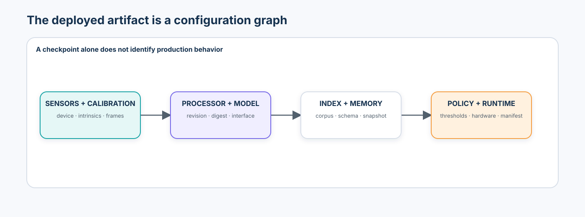
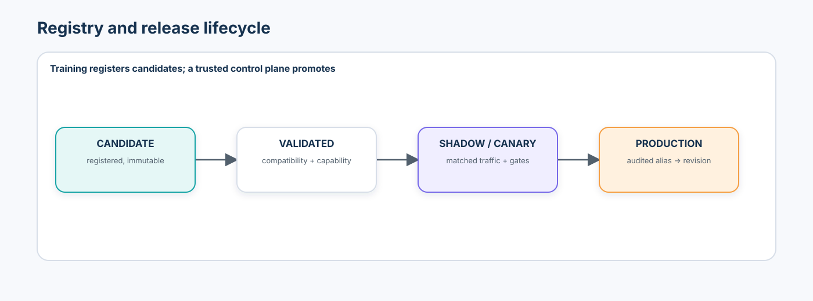
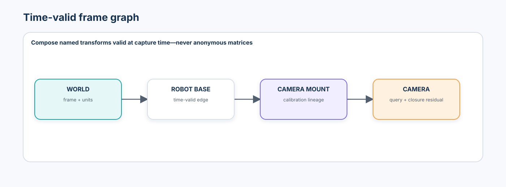
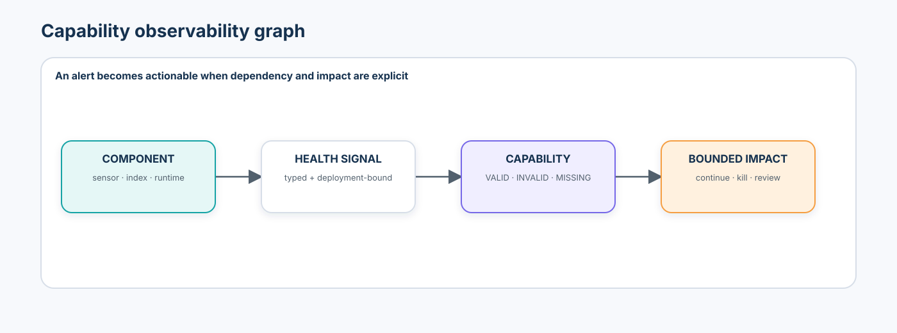
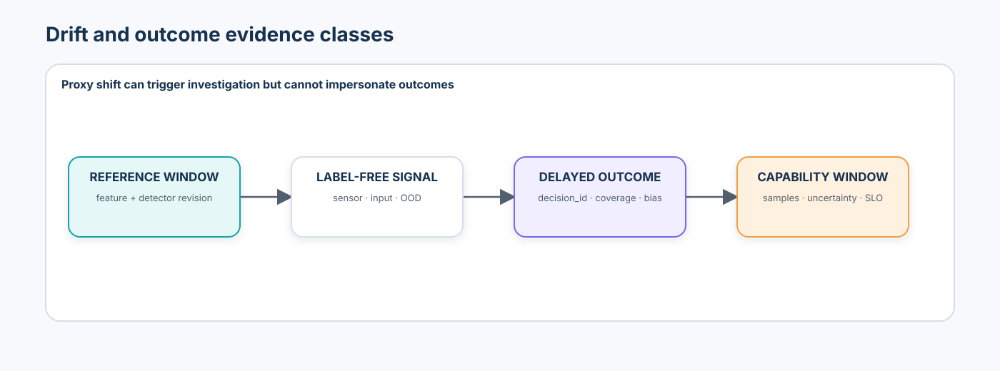
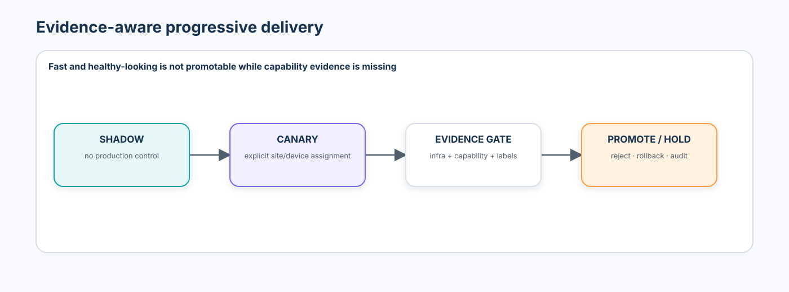
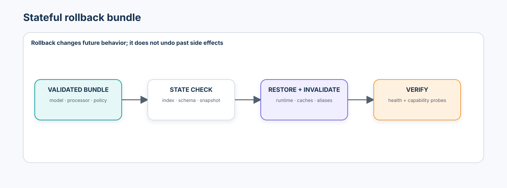
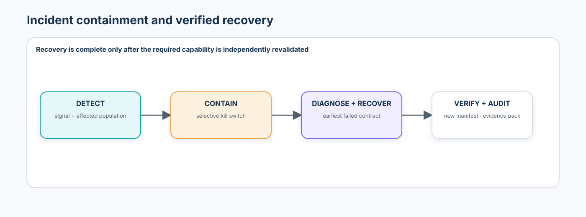

# Advanced 09 — Production Spatial AI Operations & Observability: From Deployment Contracts to Incident Recovery

> **Central question:** How can an organization operate a spatial or multimodal AI system over time while knowing exactly what is deployed, which assumptions it depends on, whether those assumptions still hold, what changed when behavior degrades, and how to recover without creating a second uncontrolled failure?

[← Advanced 08 · Efficient Spatial & Multimodal Inference](../08-efficient-spatial-multimodal-inference/README.md) · [Run the notebook](lab.ipynb) · [Advanced track](../README.md)

Advanced 08 produced a validated runtime artifact. Advanced 09 operates the complete system around it. The deployment is not only a checkpoint or endpoint; it is an immutable configuration graph joining sensors, calibration, frames, processors, models, indexes, memory, policy, runtime, hardware, and thresholds.

> Production correctness is a property of the deployed system configuration, not the model checkpoint alone.



## Learning contract

After this course, you should be able to:

- construct immutable deployment and rollback manifests with content digests and compatibility evidence;
- separate model, processor, sensor, calibration, frame-graph, retrieval-index, memory-schema, policy, runtime, and hardware registry semantics;
- resolve transforms at observation time, detect expired paths, and measure translation and rotation cycle closure;
- distinguish infrastructure health, component health, capability health, and business outcome evidence;
- define capability SLIs/SLOs with direction, population, window, minimum labels, and uncertainty;
- instrument structured events, metrics, logs, traces, and decision/outcome records without storing private reasoning;
- monitor sensor quality, calibration, frame graphs, models, retrieval, spatial memory, runtime, and hardware as separate surfaces;
- distinguish data, sensor, calibration, spatial, representation, retrieval, memory, policy, runtime, and outcome drift;
- join delayed outcomes by stable decision ID and report label coverage, delay, duplicates, and selection bias;
- design shadow and canary gates that respect capability-label delay;
- diagnose the earliest contract violation rather than blaming the final model output;
- selectively disable affected capabilities through a trusted kill switch;
- explain why stateful rollback may require a model, processor, policy, index, schema, cache, and memory snapshot;
- verify recovery independently and produce an incident evidence pack, postmortem, and corrective actions; and
- map these primitives to current registry, telemetry, lineage, progressive-delivery, and robotics tooling without confusing a tool installation with operational correctness.

### Prerequisites and transition

Complete [Advanced 08](../08-efficient-spatial-multimodal-inference/README.md) first. This course reuses the complete Advanced track: coordinate and calibration contracts from [Advanced 01](../01-3d-vision-spatial-intelligence/README.md), scene artifacts from [Advanced 02](../02-neural-rendering-3d-scene-representations/README.md), state transitions from [Advanced 03](../03-dynamic-scenes-world-models/README.md), bounded action from [Advanced 04](../04-embodied-vision-vla-models/README.md), persistent memory from [Advanced 05](../05-spatial-memory-scene-graphs-navigation/README.md), evolution and rollback from [Advanced 06](../06-multimodal-adaptation-continual-learning/README.md), risk-aware recovery from [Advanced 07](../07-robustness-uncertainty-failure-recovery/README.md), and deployment lineage from Advanced 08. It also reconnects [reasoning verification](../../intermediate/02-multimodal-reasoning-verification/README.md), [multimodal RAG](../../intermediate/04-multimodal-retrieval-rag/README.md), and [visual agents](../../intermediate/06-visual-agents/README.md).

### Scenario, success criteria, and boundaries

The notebook operates a deterministic multi-camera inspection proxy. Classification can remain valid while camera movement breaks metric position. A retrieval index can answer successfully while serving an old document revision. A runtime can remain numerically correct while queue delay makes observations stale.

Site A establishes validated baselines. Site B selects calibration warning/invalid thresholds, SLOs, canary rules, kill-switch behavior, and recovery checks. Those policies are hashed and frozen before Site C introduces camera movement, index lag, delayed labels, and a runtime tail-latency regression. Site C is reporting-only.

Success is a traceable, capability-specific operating decision: identify the earliest invalid contract, contain only affected capabilities, recover the correct dependency, verify recovery, create a new immutable manifest, and preserve an audit pack. The notebook is synthetic, credential-free, CPU-safe, and non-authorizing. It does not control a camera, robot, production release, or external incident system.

### Non-goals

- a generic Kubernetes, MLflow, Prometheus, Grafana, or cloud-provider tutorial;
- a claim that one drift score proves capability failure or health;
- storing raw sensitive imagery or hidden model reasoning as observability;
- automatic retraining or self-promotion by a model/training job;
- implying that rollback reverses already executed physical or human side effects; or
- presenting the teaching SLOs, alert severities, and capability budgets as universal standards.

## 1. The deployment unit is a configuration graph

```text
model + processor + sensors + calibration + frame graph
+ retrieval index + memory schema + policy + runtime + hardware
```

Changing a threshold, processor, calibration, index, or runtime creates a new deployment identity even when weights are unchanged. Every production decision must bind to exactly one immutable manifest.

| Manifest field | Why it matters |
| --- | --- |
| model + processor | weights alone do not define resize, crop, normalization, tiling, sampling, or tokenization |
| sensor + calibration | nominally identical cameras can have different serials, focus, firmware, and intrinsics |
| frame graph | metric results depend on named, directed, time-valid transforms and units |
| index + memory | answers and persistent state depend on corpus, encoder, ACL, schema, association, and snapshot versions |
| policy | thresholds, fallback order, retry/review limits, SLO gates, and kill-switch state alter behavior |
| runtime + hardware | compiler, precision, operators, firmware, drivers, thermals, and shapes affect performance and numerics |

## 2. Immutability, identity, and registries



Registry records use immutable revision IDs and digests. Mutable aliases such as `candidate` or `production` may point to immutable versions, but alias reassignment is itself an audited control-plane event. A useful taxonomy is:

```text
Model · Processor · Sensor · Calibration · Frame graph
Retrieval index · Memory schema/snapshot · Policy · Runtime · Hardware
```

Lifecycle state is evidence, not authority:

```text
candidate → validated → shadow → canary → production → retired
```

A training or optimization job can register a candidate. It must not promote itself.

## 3. Calibration is a versioned, expiring artifact

A calibration record binds sensor identity, resolution/focus state, intrinsics, distortion, method, validity interval, reference observations, residual statistics, and artifact digest. `created_at` alone is insufficient.

Camera movement, focus/zoom, temperature, vibration, resolution changes, or replacement can invalidate calibration. For a known landmark with observed image point $p$ and projected point $\hat p$:

$$
e=\lVert p-\hat p\rVert_2.
$$

Monitor median, p95, maximum, trend, sample count, and persistence. One noisy landmark does not invalidate the system; persistent evidence can move calibration through `healthy → warning → invalid`.

Keep the measurement and policy state separate:

```text
p95 residual → instantaneous_status → persistence counters → operational_status
```

For the lab policy, `< 2 px` is `healthy`, `2–4 px` is a `warning_candidate`, and `≥ 4 px` is an `invalid_candidate`. Two consecutive warning-or-worse candidates produce operational `warning`; two consecutive invalid candidates produce operational `invalid`. Telemetry exports both states and both streak counters, so a single high residual that has not yet satisfied persistence cannot look like a threshold bug.

When calibration is invalid, metric geometry fails closed. Explicitly validated non-metric classification may remain available. This is capability-selective graceful degradation, not silent continuation.

## 4. Time-valid frame graphs



Each transform edge records source frame, target frame, transform, units, convention, validity interval, calibration lineage, and provenance. `resolve_transform(source, target, timestamp)` composes only valid edges. If no valid path exists, return `MISSING`—never an identity transform.

Historical observations use transforms valid at capture time, not today's calibration. For a cycle $A\rightarrow B\rightarrow C\rightarrow A$, composition should approximate identity. Translation and rotation closure residuals make configuration inconsistency observable.

ROS 2 `tf2` is a useful production mapping because it explicitly handles transforms across both space and time; the notebook implements the primitive directly so validity and failure semantics remain visible.

## 5. Compatibility is deterministic

The configuration graph should reject combinations such as:

- new camera + old calibration;
- new encoder + old retrieval index;
- old model + new processor;
- old runtime artifact + incompatible hardware; or
- rollback model + unreadable current memory schema.

Matching vector dimensions, file names, or interface signatures are not sufficient compatibility evidence. The notebook builds explicit compatibility checks and a complete rollback bundle.

Deployment readiness answers three independent questions:

| Layer | Question | Example result |
| --- | --- | --- |
| structural compatibility | Do the model, processor, runtime, index, schema, sensor, and calibration identities agree? | `PASS` |
| temporal validity | Is the bound calibration valid at the observation timestamp? | `FAIL` after expiry |
| operational health | What does current persisted evidence say? | `PASS`, `WARNING`, `FAIL`, or `MISSING` |

A structurally compatible manifest can therefore be temporally invalid or operationally unhealthy. The notebook asserts all three cases rather than collapsing them into one boolean.

## 6. Capability dependency and impact analysis



Calibration health is not model health. Capabilities—not components—are the operational promise.

For example:

```text
Metric position
├── sensor
├── intrinsics/extrinsics
├── frame graph
├── geometry model
└── runtime

Classification
├── processor
├── classifier
└── runtime
```

If extrinsics become invalid, metric position and cross-camera fusion become `INVALID`; classification may remain `VALID`. Do not stop unrelated capability automatically, and do not silently continue affected capability.

## 7. Infrastructure SLOs and capability SLOs

Infrastructure indicators include availability, p95 latency, queue depth, deadline misses, and peak memory. Capability indicators include small-defect recall, metric position error, retrieval recall, calibration error, abstention, false recovery, and evidence completeness.

An SLI is measured; an SLO is required. A capability SLO records:

```text
name · metric direction · target · population · window
minimum labels · confidence/uncertainty · evidence class
```

The course uses a **capability budget** to mean allowed degradation relative to a validated baseline. This is a local policy construct, not a standardized industry metric. Error-budget reasoning needs caution when labels are delayed, incomplete, or selected.

## 8. Immediate versus delayed evidence



Immediate label-free evidence includes sensor quality, schema, feature/prediction shift, OOD, abstention, index freshness, and runtime health. Delayed label-aware evidence includes recall, calibration, false-positive rate, geometry error, and recovery success.

Every decision receives a stable `decision_id`. Later outcomes join to that ID—not a nearby timestamp. Report label coverage, delay, unmatched decisions, duplicate outcomes, and how the labeled subset was selected. If reviewers mostly label uncertain cases, labeled performance is not whole-population performance.

## 9. Observability across the spatial stack

An actionable observability graph is:

```text
component → health signal → dependent capability → user/business impact
```

| Surface | Representative signals | Common confusion |
| --- | --- | --- |
| input | resolution, aspect ratio, brightness, blur, compression, schema | input drift is not confirmed capability loss |
| sensor | frame/drop rate, clock drift, exposure, focus, temperature, availability | sensor degradation can look like model drift |
| calibration/frame graph | reprojection tails, expired/missing transforms, closure residual | classifier health does not validate metric geometry |
| model | prediction/confidence/embedding distributions, OOD, abstention, fallback | proxies do not replace delayed outcomes |
| retrieval | latency, no result, ACL filtering, index lag, citation verification, Recall@K | successful retrieval can still be stale or incomplete |
| memory | duplicate/merge/stale rates, contradictions, associations, updates | entity-count change has several possible causes |
| runtime | cold start, p50/p95/p99, throughput, queue, timeouts, memory, deadlines | always bind to deployment, runtime, and hardware fingerprints |

## 10. Drift needs a taxonomy

Track data, sensor, calibration, spatial, representation, retrieval, memory, policy, runtime, and business/outcome drift separately. Every detector records feature definition, detector revision, reference/current windows, sample counts, and threshold provenance.

Drift means investigate; it does not automatically mean rollback or retrain. No detected drift does not prove health. Confirm the affected capability and inspect upstream dependencies before choosing mitigation.

## 11. Structured telemetry and correlation

Use stable `request_id`, `observation_id`, `decision_id`, and `deployment_id` across logs, traces, events, and outcomes. Structured events should carry typed fields such as calibration ID, sensor ID, population, status, measured value, and policy revision rather than requiring log-string parsing.

OpenTelemetry maps well to correlated traces, metrics, logs, events, and resource identity. Prometheus maps well to bounded operational metrics, but unbounded object IDs, user IDs, document text, or request text must not become labels. High-cardinality or sensitive detail belongs in access-controlled logs/traces or governed evidence storage.

Observability does not justify unlimited retention. Prefer quality scores, digests, source classes, aggregate metrics, and failure categories when raw images, video, faces, documents, embeddings, or location traces are unnecessary.

## 12. Shadow and canary are evidence stages



Shadow candidates receive production-like inputs but do not control production decisions. They cannot reproduce closed-loop behavior or physical consequences. Canary candidates serve an explicitly assigned site/device/traffic group with rollback capability. Keep control and canary populations unambiguous.

Canary gates cover infrastructure, capability, reliability, sensor slices, fallback, and review load. Healthy latency does not authorize promotion while required labels are delayed. If capability labels arrive after 24 hours, a ten-minute proxy-only run cannot silently waive that requirement.

## 13. Kill switches belong to a trusted control plane

A kill switch can disable a specific capability, model path, or automated action without shutting down the whole service. Calibration failure may disable metric geometry while retaining classification. The model cannot enable or disable its own safety controls. Every evaluation and change is audited with actor, reason, policy, previous/new state, and affected deployment.

OpenFeature is one useful mapping for typed flag evaluation, contextual targeting, and telemetry hooks. It does not decide which spatial capability is safe or who is authorized to change it.

## 14. Rollback is a configuration operation



Rollback restores a previously validated configuration, not merely old weights. A rollback manifest can bind model, processor, runtime, policy, calibration compatibility, index, memory schema/snapshot, and cache invalidation rules.

```text
MODEL-ONLY ROLLBACK                    STATEFUL ROLLBACK
old model + current processor          old model + compatible processor
current runtime + current schema       compatible runtime + readable snapshot
                ↓                                      ↓
          INCOMPATIBLE                              COMPATIBLE
```

Stateful systems are harder. If v2 wrote memory schema v3 while v1 expects v2, options include a backward-compatible reader, governed migration, snapshot restore, or degraded stateless mode. Some side effects are forward-only: a sent ticket, executed physical action, or completed human decision is history. Rollback changes future behavior; it does not undo the past.

A fleet also has a convergence contract. If 70% of replicas serve manifest `043` while 30% still serve individually valid manifest `042`, the incident is `deployment_convergence_failure`: valid artifact does not imply correctly deployed fleet.

## 15. Recovery targets the actual failure



Recovery options include disable capability, switch sensor/model, recalibrate, rebuild index, restore memory snapshot, or require human review. The right action follows the earliest contract violation:

```text
sensor → calibration → processor → model → geometry/retrieval/memory → policy
```

After recovery, rerun health checks, compatibility checks, calibration probes, and capability probes. A command succeeding is not proof that capability recovered.

## 16. Signature incidents

### Camera movement

```text
camera moved → reprojection residual persists → metric geometry invalid
→ trusted control plane kills metric capability → recalibrate
→ register calibration + new manifest → independent landmark verification
→ restore capability
```

Classification may remain healthy throughout.

### Stale retrieval index

```text
source revision advances → index version lags → current-only answers disabled
→ rebuild → verify corpus/encoder/chunking/ACL versions → restore
```

### Runtime tail regression

```text
runtime or driver changes → p99/queue rise → observations become stale
→ contain traffic → restore validated runtime bundle → load/capability probes
```

The model can be numerically correct while the system fails operationally.

## 17. Incident contracts

An incident is an observed or strongly evidenced condition requiring coordinated response because service, capability, safety, integrity, or compliance expectations are violated. Not every anomaly is an incident.

Teaching severities are:

- `SEV-1`: unsafe or critical capability compromised;
- `SEV-2`: major capability degradation;
- `SEV-3`: degradation with bounded fallback; and
- `SEV-4`: investigation/non-critical anomaly.

These are examples, not universal organizational definitions. Record first bad event, first detectable signal, alert, acknowledgement, containment, mitigation, recovery, and closure. With a single synthetic incident, report durations rather than claiming a meaningful mean MTTD/MTTR.

## 18. Alerts, runbooks, and evidence packs

An alert names what changed, where, when, affected deployment/population/capability, evidence, and runbook. “Model drift detected” is not actionable.

A versioned runbook records trigger, initial checks, affected capabilities, containment, diagnosis, recovery options, verification, and escalation. An incident evidence pack includes the deployment manifest, telemetry snapshot, affected decisions, sensor/calibration/frame state, model/runtime/policy revisions, timeline, mitigation, and verification.

## 19. Trigger, root cause, and corrective action

For a bumped camera:

```text
trigger: camera moved
root cause: no calibration-drift gate allowed metric decisions to continue
```

Postmortems cover impact, timeline, detection, root cause, contributing factors, what worked, what failed, and corrective actions without blame. Corrective actions need owners, due dates, verification criteria, and linkage to the incident—not a vague promise to “monitor more.”

## 20. Site A/B/C operating methodology

Site A creates reference distributions, valid calibration, compatibility fixtures, and baseline capability. Site B selects thresholds, persistence, minimum samples, SLOs, canary rules, and runbook policy. Freeze and hash that policy. Site C introduces shift once, reports the frozen result, and cannot tune detectors, thresholds, or recovery rules.

This prevents an operations course from disguising test-set tuning as incident response.

## 21. Enterprise tooling map (reviewed September 2026)

| Operational primitive | Useful mapping | What it does not guarantee |
| --- | --- | --- |
| immutable model versions/aliases/tags | [MLflow Model Registry](https://mlflow.org/docs/latest/ml/model-registry/workflow/) | complete spatial configuration, approval separation, calibration/index compatibility |
| time-aware transform lookup | [ROS 2 tf2](https://docs.ros.org/en/ros2_documentation/kilted/Tutorials/Intermediate/Tf2/Time-Travel-With-Tf2-Cpp.html) | correct frames, calibrated sensors, valid business capability |
| traces, metrics, logs, resources | [OpenTelemetry](https://opentelemetry.io/docs/concepts/observability-primer/) | spatial semantic conventions or capability SLO correctness |
| bounded operational metrics | [Prometheus instrumentation guidance](https://prometheus.io/docs/practices/instrumentation/) | safe high-cardinality evidence retention or root-cause attribution |
| lineage jobs/runs/datasets/facets | [OpenLineage object model](https://openlineage.io/docs/spec/object-model/) | model/sensor/frame semantics unless explicitly extended and governed |
| build/source provenance | [SLSA 1.2 provenance](https://slsa.dev/spec/v1.2/provenance) | model capability, calibration, data rights, or deployment authorization |
| typed feature/kill-switch evaluation | [OpenFeature](https://openfeature.dev/docs/reference/concepts/evaluation-api/) | safety policy, ownership, or a trustworthy provider configuration |
| progressive traffic release | [Kubernetes canary guidance](https://kubernetes.io/docs/tutorials/stateless-application/canary-deployment/) | capability-label sufficiency, state compatibility, or closed-loop equivalence |
| delayed-label monitoring | [NannyML documentation](https://docs.nannyml.com/cloud/model-monitoring/quickstart) and Evidently | direct proof when assumptions, support, labels, or sampling are inadequate |

Use signed artifact and provenance systems where required, but verify the configuration graph and capability evidence independently. A dashboard is a view, not the contract.

## 22. Established practice, emerging practice, and open problems

**Established practice:** immutable artifacts, separated environments and release authority, structured telemetry, bounded metric cardinality, time-aware transforms, explicit compatibility, controlled canaries, versioned runbooks, rollback drills, incident timelines, and post-recovery verification.

**Emerging practice:** standardized AI/agent telemetry conventions, multimodal evaluation traces, performance estimation with delayed labels, capability-aware progressive delivery, and cross-registry lineage spanning models, indexes, calibration, and memory.

**Research frontier:** calibrated monitoring under severe selection bias, fleet-scale spatial consistency, causally useful drift attribution, safe continual updates to stateful memories, closed-loop shadow evaluation, and formal guarantees for partial capability degradation.

## 23. Failure taxonomy

| Failure | Earliest useful evidence | Incorrect reflex | Bounded response |
| --- | --- | --- | --- |
| sensor/focus shift | focus proxy, frame/drop/exposure signal | retrain model | inspect sensor and source first |
| camera movement | persistent reprojection + frame inconsistency | lower confidence threshold | kill metric capability and recalibrate |
| stale transform | observation time outside edge validity | substitute identity/latest transform | return `MISSING` and review |
| stale index | source/index revision lag | blame generator | disable current-only answer; rebuild |
| memory/schema mismatch | reader/writer contract failure | load old weights only | compatible reader, migrate, snapshot, or stateless mode |
| policy drift | unreviewed threshold/flag revision | treat as model drift | restore policy and audit control-plane change |
| runtime regression | deployment-bound p99/queue/freshness | assume numeric correctness is enough | restore runtime bundle and load-test |
| split-brain deployment | expected versus observed manifest distribution | accept each replica because its manifest is valid | stop promotion, converge fleet, then rerun probes |
| delayed-label gap | low coverage/high delay | promote on proxy evidence | hold until declared evidence policy is satisfied |

## 24. Practical lab map

The notebook:

1. defines registry records, immutable manifests, SLOs, decisions, outcomes, alerts, and incident events;
2. builds Site A/B/C fixtures and freezes Site-B policy;
3. separates structural compatibility, calibration time validity, and current operational health;
4. resolves time-valid frame transforms and tests stale/missing/cycle failures;
5. simulates calibration residuals and a persistence-aware health state machine;
6. computes capability impact from dependencies and applies a trusted selective kill switch;
7. emits structured telemetry and demonstrates unsafe metric-cardinality choices;
8. separates drift families and reference/current windows;
9. joins delayed outcomes by decision ID and quantifies coverage, delay, duplication, and selection bias;
10. evaluates capability SLOs with minimum-sample and evidence-class rules;
11. holds an otherwise healthy canary when capability evidence is missing;
12. rejects model-only rollback and validates a complete stateful bundle;
13. rehearses camera-movement, stale-index, and runtime-regression incidents;
14. verifies recovery independently, creates a new manifest, and detects a 70/30 split-brain fleet;
15. exports an audit pack with instantaneous and persisted calibration state; and
16. reports Site C once with `authorization: none`.

## 25. Production upgrade checklist

| Teaching proxy | Production requirement |
| --- | --- |
| in-memory registries | authenticated, authorized, durable registries with immutable revisions, signatures, retention, backup, and audit |
| synthetic landmarks | surveyed fixtures or validated natural landmarks with uncertainty and tamper/change management |
| local clock | synchronized device/service time with documented skew, monotonic duration clocks, and clock-health monitoring |
| deterministic samples | representative, consented, minimized production telemetry with sampling and retention policy |
| local decision/outcome join | durable identifiers, idempotent outcome ingestion, duplicate handling, late-arrival policy, and bias audits |
| teaching thresholds | statistical validation on target populations plus owners, review dates, and change control |
| notebook control plane | least-privilege signed release/flag service with separation of duties and break-glass procedure |
| local incident drill | on-call ownership, escalation, communications, legal/security paths, DR objectives, and recurring exercises |
| JSON evidence pack | access-controlled tamper-evident store with retention, legal holds, redaction, and export audit |

## 26. Exercises

- Add rotation closure error and a covariance-aware landmark residual.
- Add a second sensor and prove that invalid camera-17 extrinsics do not disable camera-18 classification.
- Inject clock skew and distinguish event-order failure from actual latency regression.
- Add an outcome source that disproportionately labels abstentions; compute slice coverage and state the selection limitation.
- Design an index/model compatibility matrix that rejects a same-dimension but different-semantic encoder.
- Add a reversible memory migration and prove that rollback does not discard observations created after the snapshot.
- Write a canary policy with one proxy-only hold and one delayed-label promotion path.
- Build a disaster-recovery drill that restores registries, memory snapshot, audit log, and control-plane state with explicit RPO/RTO.

## 27. What you should now be able to explain without code

1. Why is a model revision not a deployment identity?
2. Why must a historical observation use a historical transform?
3. Why is a missing frame path not an identity transform?
4. How can classification be healthy while metric position is unsafe?
5. Why does input drift not prove capability loss?
6. Why does no drift alert not prove health?
7. What do label coverage and selection bias change about a recall estimate?
8. Why can a successful retrieval still be operationally wrong?
9. Why can a numerically correct model fail because of runtime queueing?
10. Why is shadow success weaker than closed-loop canary evidence?
11. Why should a kill switch disable a capability rather than always stopping everything?
12. Why is rollback more than loading old weights?
13. Which side effects cannot be rolled back?
14. Why must recovery be independently verified?
15. What is the difference between an incident trigger and its root cause?
16. Why should a Site C incident not be used to retune Site-B policy?
17. What evidence belongs in an incident pack, and what sensitive data should be minimized?
18. Which operational decisions must remain outside the model?

## 28. References

### Spatial and robotics operations

- ROS 2, [Introduction to tf2](https://docs.ros.org/en/rolling/Concepts/Intermediate/About-Tf2.html) and [time-aware transform tutorial](https://docs.ros.org/en/ros2_documentation/kilted/Tutorials/Intermediate/Tf2/Time-Travel-With-Tf2-Cpp.html).
- OpenCV, [camera calibration and 3D reconstruction](https://docs.opencv.org/4.x/d9/d0c/group__calib3d.html).
- Quigley et al., [ROS: an open-source Robot Operating System](https://www.willowgarage.com/sites/default/files/icraoss09-ROS.pdf).

### Reliability, drift, and observability

- Sculley et al., [Hidden Technical Debt in Machine Learning Systems](https://papers.nips.cc/paper/5656-hidden-technical-debt-in-machine-learning-systems).
- Breck et al., [The ML Test Score](https://research.google/pubs/the-ml-test-score-a-rubric-for-ml-production-readiness-and-technical-debt-reduction/).
- OpenTelemetry, [observability primer](https://opentelemetry.io/docs/concepts/observability-primer/) and [semantic conventions](https://opentelemetry.io/docs/concepts/semantic-conventions/).
- Prometheus, [instrumentation](https://prometheus.io/docs/practices/instrumentation/) and [metric/label naming](https://prometheus.io/docs/practices/naming/).
- NannyML, [model monitoring quickstart and delayed-label context](https://docs.nannyml.com/cloud/model-monitoring/quickstart).

### Registry, lineage, delivery, and governance

- MLflow, [Model Registry workflows](https://mlflow.org/docs/latest/ml/model-registry/workflow/).
- OpenLineage, [object model](https://openlineage.io/docs/spec/object-model/) and [facets](https://openlineage.io/docs/spec/facets/).
- SLSA, [version 1.2 provenance](https://slsa.dev/spec/v1.2/provenance).
- OpenFeature, [evaluation API](https://openfeature.dev/docs/reference/concepts/evaluation-api/) and [hooks](https://openfeature.dev/docs/reference/concepts/hooks/).
- Kubernetes, [canary deployment guidance](https://kubernetes.io/docs/tutorials/stateless-application/canary-deployment/).
- NIST, [AI Risk Management Framework](https://www.nist.gov/itl/ai-risk-management-framework).

## 29. Advanced track completion

You can now trace a complete spatial-AI lifecycle:

```text
geometry → learned scenes → dynamic state → embodied action
→ persistent memory → adaptation → reliability → efficient inference
→ registration → deployment → observation → diagnosis → recovery → audit
```

The durable lesson is not that every system needs every tool. It is that every claimed capability needs a declared configuration, observable dependencies, time-valid evidence, bounded authority, and a recovery path that can be verified.
