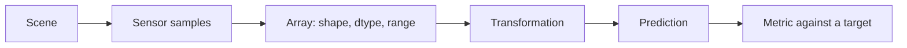

# Image fundamentals: pixels, ranges, and a measurable baseline

## Learning objectives

By the end of this lesson, you can:

- explain an image as an array with spatial, channel, dtype, and range semantics;
- trace how a threshold converts intensities into a binary decision;
- measure segmentation with intersection over union (IoU), precision, and recall;
- diagnose dtype/range mismatch and distribution shift; and
- define when a deterministic baseline is useful and when it is insufficient.

## Why it matters

Imagine a quality-control camera that must isolate a bright circular component from a dark work surface. A neural network might eventually be justified, but a threshold baseline is faster to build and easier to inspect. It reveals whether illumination, representation, or evaluation is the real problem before model complexity obscures it.

**Success criterion:** achieve IoU of at least 0.95 on the controlled synthetic scene, then explain why the same threshold fails after an illumination shift.

**Non-goal:** this lesson does not claim thresholding is a general object-segmentation solution.

**Risk boundary:** the generated images contain no personal or sensitive data. A real camera workflow would need purpose limitation, retention controls, access rules, and an explicit review of whether image collection is justified.

## Prerequisites

You should be comfortable with basic Python and NumPy indexing. No calculus, GPU, downloaded model, dataset, or API key is required.

## Mental model

An image pipeline is a chain of contracts:



A correct-looking array can still violate the next stage's contract. A model or threshold calibrated for floating-point values in `[0, 1]` will behave differently if it receives unsigned integers in `[0, 255]`.

## Foundations and mechanics

A grayscale image with height `H` and width `W` is commonly represented as an `H × W` array. A color image is commonly `H × W × C`, where channel meaning depends on the color space and library convention. Shape alone does not specify channel order, dtype, numeric range, transfer function, or physical meaning.

The baseline predicts foreground at pixel `(i, j)` when intensity `I(i, j)` meets threshold `t`:

```text
prediction(i, j) = I(i, j) >= t
```

IoU measures overlap between predicted mask `P` and target mask `T`:

```text
IoU = |P ∩ T| / |P ∪ T|
```

Precision asks how many predicted foreground pixels were correct; recall asks how much of the target foreground was recovered. Looking at all three distinguishes over-segmentation from under-segmentation.

## Architecture choices

| Approach | Strength | Limitation | Use when |
| --- | --- | --- | --- |
| Fixed threshold | Transparent, fast, no training data | Brittle under lighting and background changes | The signal is stable and separable |
| Adaptive/local threshold | Handles gradual illumination variation | Still assumes local intensity contrast | Lighting varies spatially but foreground contrast remains |
| Classical features + classifier | Works with modest labeled data; inspectable features | Feature design can be brittle | Geometry or texture is known and bounded |
| Learned segmentation | Can model complex appearance | Needs representative labels, compute, monitoring, and robust evaluation | Simpler baselines fail on justified complexity |

## Worked scenario and implementation

The reusable [`lab.py`](lab.py) creates a dark image with a bright circular component, adds seeded noise, applies thresholds, and calculates pixel-level metrics. The [guided notebook](image_fundamentals.ipynb) first establishes a baseline, sweeps thresholds, then injects a darker illumination condition.

The pipeline is intentionally NumPy-only. Framework-free code makes dtype, range, shape, prediction, and metric behavior visible before higher-level APIs package those mechanics.

## Experiments and evaluation

Run at least these comparisons:

1. Sweep thresholds `0.30`, `0.45`, `0.60`, and `0.75` on the baseline scene.
2. Apply the selected threshold after reducing scene brightness by 35%.
3. Recalibrate the threshold and compare whether the mitigation restores IoU without excessive false positives.

Do not select and report a threshold on the same examples when estimating generalization. A production evaluation set should represent cameras, lighting, materials, operating conditions, and important failure slices that were not used for tuning.

## Failure modes and mitigations

- **Range mismatch:** treating `[0, 255]` integers as `[0, 1]` floats invalidates thresholds. Validate dtype and range at the boundary.
- **Illumination shift:** a fixed threshold can lose recall as foreground darkens. Improve acquisition controls, normalize carefully, or use an approach designed for variability.
- **Background confusion:** bright background regions reduce precision. Add spatial or shape constraints only when they follow from the problem contract.
- **Metric blindness:** aggregate IoU can hide important slices. Report precision, recall, per-condition metrics, and representative visual errors.
- **Data leakage:** tuning on test images inflates results. Separate development, validation, and final evaluation data by the real unit of independence, such as camera, site, or time window.

## Production upgrade path

| Prototype | Production control |
| --- | --- |
| Implicit input assumptions | Validate schema, shape, channel order, dtype, range, and camera metadata |
| One synthetic scene | Versioned, representative data with source and consent records |
| Threshold selected once | Calibrated release candidate with slice-based acceptance gates |
| Notebook metric | Traced metric definitions, monitoring, alerts, and reviewable error samples |
| Direct rollout | Shadow evaluation, staged deployment, rollback, and a safe fallback |

## Exercises

1. Implementation: add a function that converts RGB to luminance and document the assumed channel order.
2. Diagnosis: pass a `uint8` image directly to `segment`. Explain why validation rejects it and repair the boundary.
3. Experiment: increase noise and chart IoU across thresholds.
4. Architecture: define the evidence that would justify replacing thresholding with a learned segmenter.
5. Responsible use: write a retention and human-review policy for a real camera scenario.

## References

- [NumPy: array data types](https://numpy.org/doc/stable/user/basics.types.html)
- [scikit-image: image data types and values](https://scikit-image.org/docs/stable/user_guide/data_types.html)
- [OpenCV thresholding tutorial](https://docs.opencv.org/4.x/d7/d4d/tutorial_py_thresholding.html)
- [Jaccard, “The Distribution of the Flora in the Alpine Zone” (1912)](https://www.jstor.org/stable/2256461) — origin of the Jaccard similarity measure underlying IoU.
- [NIST AI Risk Management Framework](https://www.nist.gov/itl/ai-risk-management-framework)
