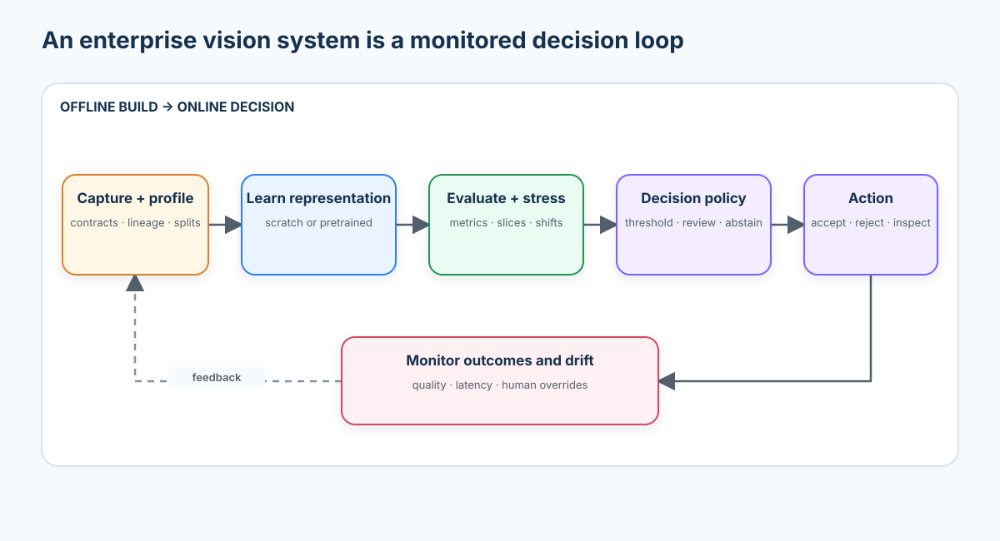
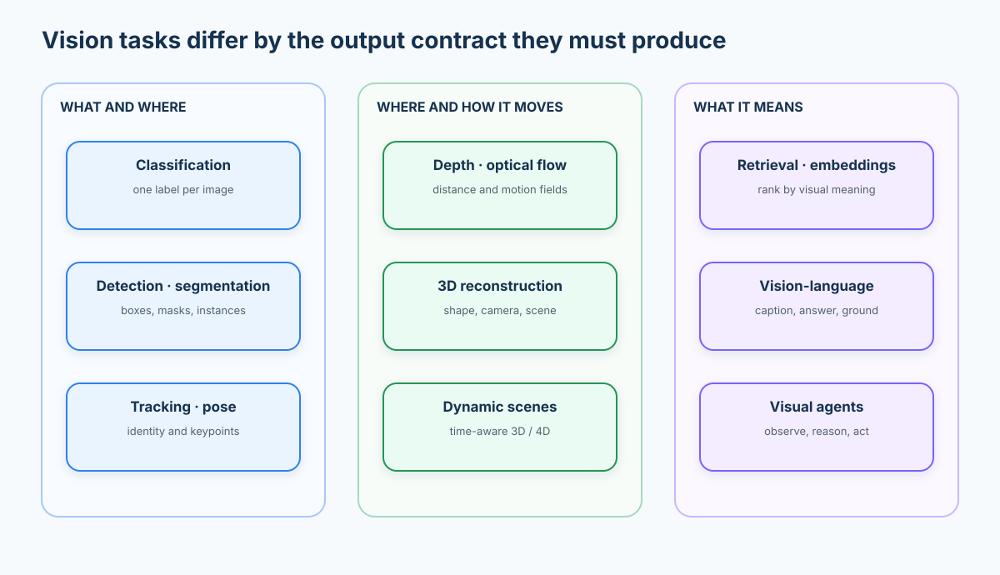
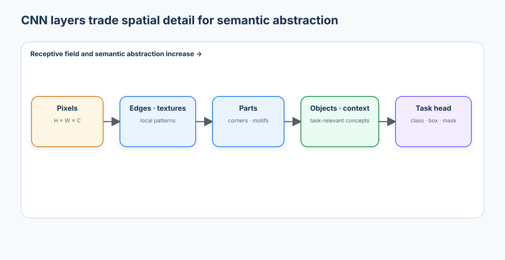
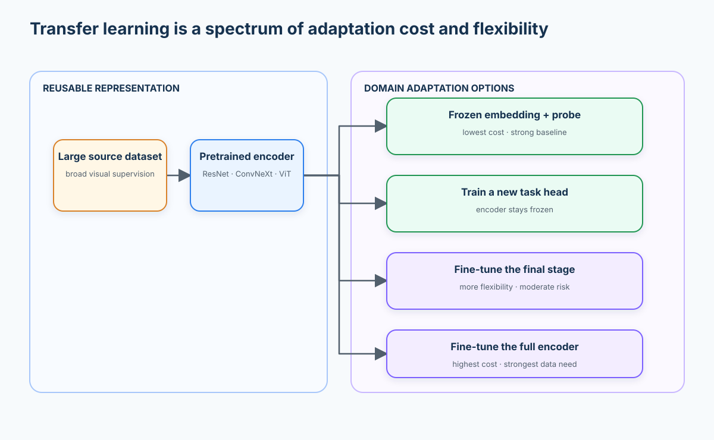
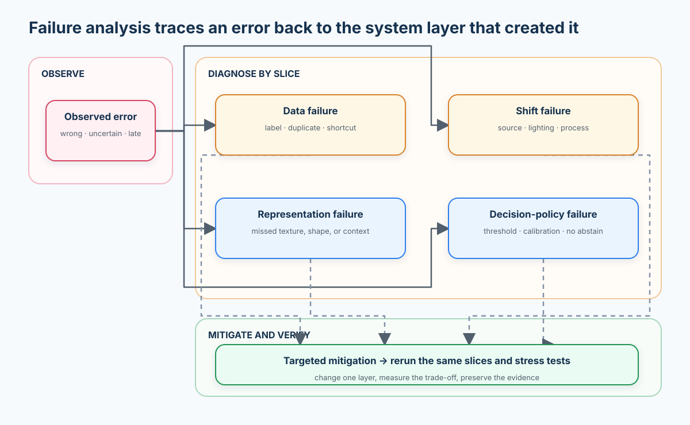
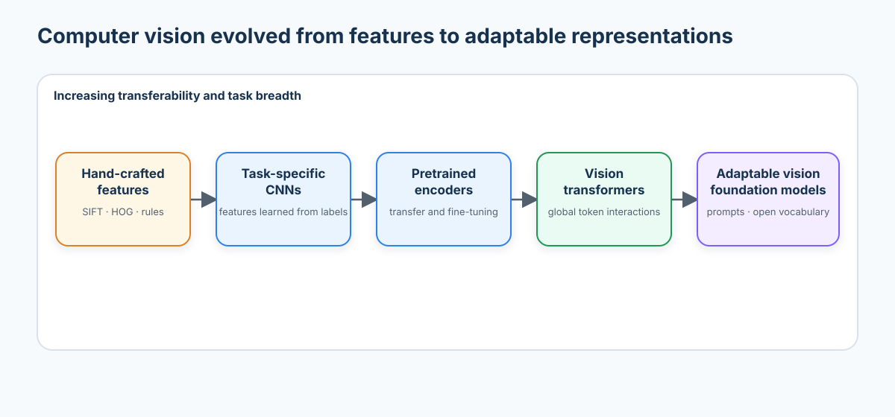

# Course 01 — Modern Computer Vision Foundations

> From pixels to learned representations: build an auditable visual-quality system, compare a CNN trained from scratch with real pretrained encoders, stress it under source shift, and decide what is safe to automate.

**Level:** Beginner · **Estimated time:** 8–10 hours · **Lab:** [`lab.ipynb`](lab.ipynb) · **Prerequisites:** Python, NumPy, basic machine learning, and introductory PyTorch

## Why this course exists

Computer vision is not “load an image, call a model, report accuracy.” A production system begins with an output contract, learns a useful representation, turns model scores into decisions, and keeps measuring the conditions under which those decisions fail.

This course builds that mental model before later courses specialize in detection, segmentation, transformers, multimodal models, 3D, or embodied systems. The running scenario is an enterprise visual-quality gate with five outcomes:

1. `Normal`
2. `Surface Defect`
3. `Structural Defect`
4. `Contamination`
5. `Unknown / Ambiguous`

You will work with a deterministic, procedurally generated industrial dataset. It is deliberately designed with multiple capture sources, a duplicate, a tempting background shortcut, ambiguous cases, and a held-out source shift. The images are synthetic; the models, optimization, embeddings, measurements, and failures are real.

## Learning outcomes

By the end, you can:

- frame a vision problem by its input, output, annotation, metric, and decision cost;
- inspect every conversion from a Pillow image to a normalized PyTorch tensor and diagnose common contract failures;
- verify manual convolution against PyTorch, inspect learned filters and feature maps, and measure receptive fields;
- build and train a compact CNN from scratch in PyTorch;
- use real torchvision `ResNet-18` and `ConvNeXt-Tiny` pretrained weights as visual encoders;
- compare frozen transfer, partial fine-tuning, and scratch training without conflating validation and test data;
- inspect embeddings with cosine similarity, nearest neighbours, PCA, and dataset-intelligence flags;
- find duplicate leakage, class/source imbalance, shortcut learning, and domain shift;
- measure calibration under shift and choose abstention thresholds from automation, safety, review-load, and cost trade-offs;
- use a bounded Grad-CAM diagnostic to test whether a CNN is responding to the component or its background;
- write an evidence-backed enterprise recommendation with risk boundaries and monitoring requirements; and
- place CNNs and transfer learning in the 2026 landscape of self-supervised, promptable, open-vocabulary, multimodal, spatial, and embodied vision.

## Course map

| Stage | Question | Evidence produced |
| --- | --- | --- |
| Frame | What output and decision does the system owe? | task contract and error-cost assumptions |
| Profile | Is the data trustworthy and representative? | class/source counts, hashes, image contracts |
| Learn | Which representation works with this data budget? | scratch CNN and two pretrained encoders |
| Inspect | What geometry and evidence did the model learn? | nearest neighbours, PCA, dataset flags, feature maps, Grad-CAM |
| Stress | Where does performance and confidence break? | source slices, shifted test, calibration, failure gallery |
| Decide | What should be automated or reviewed? | policy curves, expected cost, abstention threshold, risk memo |



## 1. Vision is an output-contract problem

The first architecture decision is not CNN versus transformer. It is the output the downstream process needs. Classification returns a label; detection returns a variable set of boxes and labels; semantic segmentation returns a dense class map; instance segmentation must also separate individual objects. A technically impressive model is still the wrong system if its output cannot support the decision.



### Task taxonomy

| Task | Input | Output contract | Annotation | Typical metrics | Example use |
| --- | --- | --- | --- | --- | --- |
| Image classification | image | one or more labels | image labels | macro F1, AUROC, calibration | defect family triage |
| Object detection | image | boxes, labels, scores | boxes | mAP, recall at IoU | count missing parts |
| Semantic segmentation | image | class per pixel | class masks | mIoU, Dice | damaged surface area |
| Instance segmentation | image | object masks + identities | instance masks | mask mAP | separate overlapping items |
| Panoptic segmentation | image | semantic + instance map | panoptic masks | PQ | complete scene parsing |
| Keypoint / pose | image or video | landmark coordinates | keypoints | OKS, PCK | worker posture |
| Tracking | video | persistent object IDs | tracks | HOTA, IDF1 | flow through a line |
| Optical flow | image pair | motion vector per pixel | flow field | EPE | motion estimation |
| Depth estimation | image(s) | metric or relative depth | depth | AbsRel, RMSE | robotic clearance |
| 3D reconstruction | views / video | geometry + cameras | poses, depth, meshes | Chamfer, reprojection | digital twins |
| Anomaly detection | image | anomaly score or mask | usually normal data; optional masks | AUROC, AUPRO | rare defect discovery |
| Retrieval | image or text | ranked items | pairs / relevance | Recall@K, mAP | find similar failures |
| OCR / document vision | image | text + layout | text, boxes, structure | CER, WER, field F1 | serial-number capture |
| Captioning / VQA | image + prompt | text | captions / answers | task-specific accuracy plus human eval | inspection assistance |
| Grounding | image + phrase | regions or masks | phrase-region pairs | grounding accuracy, IoU | “show the crack” |
| Video understanding | video + query | class, event, text, or time span | clips / events / text | task-specific | incident review |
| Vision-language-action | observations + instruction | actions | demonstrations / reward | success rate, safety violations | robot manipulation |

### A task contract template

Write these before choosing a model:

```text
Input unit:        one component image from one camera station
Output unit:       five-class probability vector + review decision
Decision latency:  batch/offline for this course; define online SLO later
Costly error:      a structural defect predicted as Normal
Uncertain case:    Unknown/Ambiguous or confidence below threshold → human review
Evaluation unit:   component, grouped by capture source
Deployment shift:  new facility lighting, camera, compression, surface finish
```

## 2. From pixels to representations

An RGB image loaded by Pillow or NumPy usually has shape `H × W × C`, unsigned 8-bit values, and range `[0, 255]`. PyTorch convolution expects batches in `N × C × H × W`, usually floating point. A preprocessing contract therefore specifies:

- colour order and alpha handling;
- spatial policy: resize, crop, pad, or preserve aspect ratio;
- numerical range and normalization statistics;
- expected channel count;
- training-only augmentation; and
- whether inference preprocessing is byte-for-byte equivalent.

Silent contract violations often produce plausible tensors and poor models. Examples include BGR/RGB swaps, applying normalization twice, stretching a rectangular object, leaking random augmentation into validation, or using preprocessing inconsistent with pretrained weights.

### The executable image-tensor contract

The notebook makes each boundary visible rather than treating `transforms.ToTensor()` as magic:

```text
Pillow RGB image
    ↓ np.asarray
NumPy H × W × C · uint8 · [0, 255]
    ↓ astype(float32) / 255
NumPy H × W × C · float32 · [0, 1]
    ↓ torch.from_numpy(...).permute(2, 0, 1)
PyTorch C × H × W
    ↓ (x - channel_mean) / channel_std
normalized PyTorch tensor
```

At each stage the lab prints shape, dtype, minimum/maximum, per-channel mean/standard deviation, and a named pixel. It then demonstrates four failure contracts:

| Failure | Tensor still valid? | What changes | Correct control |
| --- | --- | --- | --- |
| RGB/BGR swap | yes | red and blue semantics exchange | declare colour order at ingestion |
| HWC passed as CHW | often | convolution interprets height as channels | assert rank and channel position |
| Double normalization | yes | values move far outside the trained distribution | centralize preprocessing once |
| Forced square resize | yes | geometry and defect thickness distort | crop/pad or document distortion tolerance |

### Convolution and inductive bias

For a 2D input $X$ and kernel $K$, a single-channel cross-correlation at location $(i,j)$ is:

$$
Y_{i,j}=\sum_m\sum_n K_{m,n}X_{i+m,j+n}.
$$

Deep-learning libraries call this operation convolution even though the kernel is not flipped. Three properties made CNNs unusually effective:

- **local connectivity:** nearby pixels interact first;
- **weight sharing:** the same detector is reused across the image; and
- **translation equivariance:** shifting the input approximately shifts the feature map.

These are inductive biases: assumptions that reduce the amount of data needed. They are useful when a pattern matters regardless of location, but can be harmful when absolute position or global context is essential.

For kernel size $k$, padding $p$, dilation $d$, stride $s$, and input size $n$, the output size is:

$$
\left\lfloor \frac{n+2p-d(k-1)-1}{s}+1 \right\rfloor.
$$

The notebook computes a Sobel-like response twice: once with explicit nested loops and once with `torch.nn.functional.conv2d`. An assertion proves numerical equivalence before the course moves to filters learned by gradient descent. After training, the same section visualizes the scratch CNN’s first-layer kernels and activation maps so learners can connect the primitive to the network.

### Receptive fields

The theoretical receptive field is the input region that can affect a feature. Starting with receptive field $r_0=1$ and jump $j_0=1$:

$$
j_l=j_{l-1}s_l, \qquad r_l=r_{l-1}+(k_l-1)d_lj_{l-1}.
$$

Stacking two `3×3` stride-one convolutions yields a `5×5` receptive field while inserting a nonlinearity between them. Downsampling expands receptive field quickly but removes spatial detail. Detection and segmentation architectures therefore combine multiple scales or restore resolution with decoders.

The lab calculates the theoretical field directly from the scratch network’s `Conv2d` and `MaxPool2d` modules, captures activations at successive convolution stages, and backpropagates from one feature-map location to show the empirical input support. The empirical support can be smaller than the theoretical field because nonlinearities suppress some paths.



Early layers often respond to local contrast, edges, and textures. Later layers combine these into parts and task-relevant concepts. “Often” matters: a model can instead learn background colour, watermark position, camera artefacts, or any easier feature correlated with the label.

## 3. Representation learning and transfer

Training from scratch asks one dataset to teach both a visual vocabulary and the target task. Transfer learning starts from an encoder whose weights already capture broadly reusable patterns, then adapts it to the target domain.



| Mode | What is trained? | Best when | Main risk |
| --- | --- | --- | --- |
| Frozen embeddings + linear probe | small external classifier | little labelled data; fast baseline | representation may miss domain-specific cues |
| Frozen encoder + neural head | new task head | labels are limited and domain is fairly close | head overfits shortcuts |
| Partial fine-tuning | head + final encoder stage | moderate data and measurable domain gap | catastrophic drift or overfitting |
| Full fine-tuning | all weights | substantial clean data and compute | cost, instability, erased generality |

The lab compares all but full fine-tuning. `ResNet-18` provides a strong residual CNN baseline; `ConvNeXt-Tiny` modernizes a pure CNN with design choices informed by transformers. Both use official torchvision weights and preprocessing metadata. No model outputs are mocked.

### Bridge from CNNs to vision transformers

| Property | Classical CNN | Modern CNN, such as ConvNeXt | Vision Transformer |
| --- | --- | --- | --- |
| Locality | built into kernels | built in, with larger/deeper stages | induced by patches or learned attention patterns |
| Weight sharing | convolution kernels | convolution kernels | shared token projections and attention blocks |
| Global interaction | indirect through depth/downsampling | indirect, often with larger effective fields | direct through self-attention |
| Data efficiency | relatively strong | strong | often depends heavily on pretraining and augmentation |
| Scaling | good | very good | excellent at large data/compute scale |
| Spatial bias | strong | strong but modernized | weaker by default; architecture/pretraining supplies structure |

If CNNs are so effective, why did transformers become central to vision foundation models? This course leaves that as an evidence question for Course 03: compare interaction range, scaling, pretraining, transfer, and systems cost rather than repeating “attention is all you need.”

### Embeddings are useful beyond classification

An encoder maps an image $x$ to a vector $z=f_\theta(x)$. After L2 normalization, cosine similarity is the dot product:

$$
\operatorname{sim}(z_i,z_j)=\frac{z_i^Tz_j}{\lVert z_i\rVert_2\lVert z_j\rVert_2}.
$$

The same embeddings can support nearest-neighbour inspection, retrieval, clustering, weak labelling, duplicate discovery, drift monitoring, and multimodal retrieval. PCA in the lab is a diagnostic projection—not proof that the full high-dimensional representation is linearly separable.

The lab converts those ideas into a dataset-intelligence table. For every sample it records its nearest neighbour, similarity, label agreement, source agreement, prediction margin, and maximum similarity to training data. These signals surface:

- exact or near-duplicate candidates;
- possible mislabels or inherently ambiguous pairs;
- hard, low-margin examples;
- out-of-distribution candidates far from training support; and
- neighbourhoods dominated by one source, a warning that the representation may encode a camera or factory shortcut.

## 4. Augmentation, invariance, and shortcut risk

Augmentation asserts that a transformation should preserve the label. Every transform is therefore a domain claim.

| Transform | Intended invariance | Usually safe when | Unsafe example |
| --- | --- | --- | --- |
| Horizontal flip | left/right symmetry | components are orientation-free | text or handed assemblies |
| Small rotation | camera roll | orientation is not diagnostic | gravity-dependent defects |
| Colour jitter | illumination variation | colour is incidental | heat/contamination colour is causal |
| Random crop | partial visibility | target remains observable | crop removes the defect |
| Blur / compression | capture degradation | deployment contains it | hairline cracks disappear |
| Cutout / erasing | occlusion robustness | objects can be partly hidden | erases a tiny positive signal |
| MixUp / CutMix | smoother class boundaries | labels combine meaningfully | precise localisation or rare anomalies |

Apply transformations only to training data. Keep a clean validation set for model selection and a held-out test set for the final estimate. Add explicit stress sets for known operational shifts instead of hiding them inside one aggregate metric.

## 5. Data quality, leakage, and shortcut learning

### Leakage checklist

- Split by the unit that can repeat: patient, product, video, burst, facility, or time window.
- Hash exact bytes or normalized pixels to catch duplicates across splits.
- Detect near duplicates and adjacent video frames with perceptual similarity or embeddings.
- Fit normalization, PCA, feature selection, and thresholds using training data only.
- Never tune on the final test set.
- Keep source metadata; aggregate accuracy cannot reveal a failed camera or factory.

### Shortcut learning

A shortcut is predictive in the development data but not causally tied to the intended concept. In this lab, training sources contain a class-correlated background tint. A scratch CNN can exploit it. The held-out facility removes that correlation, exposing the failure. The mitigation is not automatically “a larger model”; it may be better data balance, background randomization, source-aware splits, tighter crops, or a causal capture redesign.

### Why the default dataset is procedural

The official [MVTec Anomaly Detection dataset](https://www.mvtec.com/research-teaching/datasets/mvtec-ad) is an excellent research benchmark with 15 categories, more than 5,000 high-resolution images, and pixel-precise anomaly masks. Its `CC BY-NC-SA 4.0` terms make it an inappropriate default to redistribute inside an enterprise-oriented repository, and its anomaly protocol does not directly supply this course’s five decision classes. The lab therefore generates a small auditable dataset locally. MVTec AD remains a valuable optional noncommercial extension; review its current licence before use.

### Optional real-world extension: VisA

The [Visual Anomaly (VisA) dataset](https://registry.opendata.aws/visa/) is a better licensing fit for an optional industrial extension: its official AWS entry and [Amazon research repository](https://github.com/amazon-science/spot-diff) identify 12 object subsets, image- and pixel-level annotations, and a `CC BY 4.0` dataset licence. It is not redistributed here.

Use one subset—such as `candle`, `capsules`, or `cashew`—to keep the exercise bounded:

1. download VisA directly from its official no-account AWS Open Data resource;
2. record the access date, archive checksum, licence, and selected subset;
3. profile real resolutions, corrupt files, label counts, and acquisition variation;
4. build a grouped split without using the test set for threshold selection;
5. extract frozen ResNet-18 embeddings and fit a normal/anomaly probe;
6. inspect nearest-neighbour disagreements, low-support samples, and source/appearance clusters; and
7. compare the real-data failure slices with the clean procedural experiment.

The notebook includes an opt-in adapter activated by `CV_VISA_DIR=/path/to/VisA/<subset>`. It does nothing by default, preserving credential-free execution.

## 6. Metrics are decision proxies

Let $TP$, $FP$, $TN$, and $FN$ describe a binary decision:

$$
\text{precision}=\frac{TP}{TP+FP},\qquad
\text{recall}=\frac{TP}{TP+FN},\qquad
F_1=2\frac{\text{precision}\,\text{recall}}{\text{precision}+\text{recall}}.
$$

For multiclass quality inspection:

- **accuracy** answers how often the top class is correct, but hides imbalance;
- **macro F1** weights each class equally and exposes weak rare classes;
- **per-class recall** is essential for costly defect misses;
- **confusion matrix** shows which classes exchange errors;
- **negative-class recall** measures how many true `Normal` items are preserved;
- **defect recall** collapses the four non-normal outcomes into the safety question “did we catch it?”;
- **review rate** measures operational load under an abstention policy;
- **expected cost** applies business weights to each error type; and
- **latency / throughput / memory** determine deployability.

Metrics must be reported by source, class, and shift. Confidence is not correctness: neural softmax scores may be miscalibrated, especially after distribution shift. Calibration, threshold selection, and abstention are decision-layer work, not model accuracy.

### Calibration under shift

For confidence bins $B_m$, expected calibration error is:

$$
\operatorname{ECE}=\sum_{m=1}^{M}\frac{|B_m|}{n}
\left|\operatorname{acc}(B_m)-\operatorname{conf}(B_m)\right|.
$$

A reliability diagram compares mean confidence with empirical accuracy in each bin. ECE compresses that diagram into one number, so report both: ECE depends on binning and can hide class- or source-specific problems. The notebook compares known-source validation with degraded `Factory_C`, then plots correct/incorrect confidence histograms. The intended observation is not a guaranteed numeric drop; it is whether accuracy, ECE, and overconfidence move differently under the measured shift.

### Abstention is an operating policy

For each confidence threshold, the notebook measures:

- automation rate and human-review rate;
- automatic defect false-negative rate;
- operational defect recall, treating reviewed defects as intercepted;
- automatic false-positive rate; and
- expected cost under explicit example weights.

The cost weights are a scenario assumption, not a universal truth. The threshold is selected on validation evidence, then evaluated unchanged on clean and shifted `Factory_C`. This separation turns “pick 0.70” into a reviewable policy design.

## 7. Failure analysis as an engineering loop



1. Save the sample, label, source, prediction, confidence, preprocessing version, and model version.
2. Slice errors by class, source, lighting, resolution, and confidence.
3. Decide whether the likely cause is data, representation, shift, or decision policy.
4. Change one system layer.
5. Rerun the same clean and shifted evaluations.
6. Record the trade-off; never erase a regression with a new aggregate average.

Useful failure buckets include label ambiguity, exact/near duplicate leakage, missing context, background shortcut, underrepresented source, low-resolution signal, preprocessing mismatch, overconfident shift error, threshold error, and unacceptable latency.

### A small explanation diagnostic

The notebook applies Grad-CAM to one correct and one incorrect scratch-CNN prediction. It overlays a coarse class-sensitive heatmap and asks whether the response covers the defect/component or the label-correlated background. Grad-CAM is a post-hoc diagnostic, not causal proof, a fairness certificate, or an authorization signal. Use it to generate testable data hypotheses, then verify those hypotheses with interventions and slices.

## 8. Modern tooling review

The notebook intentionally uses widely adopted libraries with transparent APIs: `numpy`, `Pillow`, `matplotlib`, `pandas`, `scikit-learn`, `torch`, and `torchvision`.

| Layer | Common tools | What to review before adoption |
| --- | --- | --- |
| Image I/O / classical CV | [Pillow](https://pillow.readthedocs.io/), [OpenCV](https://docs.opencv.org/) | colour order, codec behaviour, native dependencies |
| Training | [PyTorch](https://pytorch.org/docs/stable/), [torchvision](https://docs.pytorch.org/vision/stable/), [timm](https://huggingface.co/docs/timm/) | model licence, preprocessing, weight provenance, determinism |
| Transformers / multimodal | [Transformers](https://huggingface.co/docs/transformers/), [OpenCLIP](https://github.com/mlfoundations/open_clip) | remote code, prompt sensitivity, tokenizer and checkpoint pairing |
| Augmentation | [torchvision transforms](https://docs.pytorch.org/vision/stable/transforms.html), [Albumentations](https://albumentations.ai/docs/) | label/mask alignment and invalid invariances |
| Annotation | [CVAT](https://docs.cvat.ai/), [Label Studio](https://labelstud.io/guide/) | ontology versioning, review workflows, access control |
| Dataset inspection | [FiftyOne](https://docs.voxel51.com/), [DVC](https://dvc.org/doc) | lineage, large-media storage, privacy |
| Metrics / experiments | [TorchMetrics](https://lightning.ai/docs/torchmetrics/), [MLflow](https://mlflow.org/docs/latest/), [Weights & Biases](https://docs.wandb.ai/) | offline mode, retention, sensitive samples, reproducibility |
| Vector search | [FAISS](https://faiss.ai/), [Qdrant](https://qdrant.tech/documentation/), [Milvus](https://milvus.io/docs) | filter semantics, index recall, deletion, tenancy |
| Serving | [ONNX Runtime](https://onnxruntime.ai/docs/), [TensorRT](https://docs.nvidia.com/deeplearning/tensorrt/), [OpenVINO](https://docs.openvino.ai/) | operator support, quantization drift, hardware benchmarks |
| Monitoring | OpenTelemetry + model/data monitors | privacy, slice coverage, outcome delay, alert ownership |

Tooling is not evidence. Evaluate model quality, operational fit, security posture, maintenance activity, licence, export path, and total system cost on your data.

## 9. State of the art to know in 2026



This is an orientation map, not a leaderboard. Representative primary sources:

| Direction | Representative work | Why it matters | Where this curriculum returns to it |
| --- | --- | --- | --- |
| Modern CNNs | [ConvNeXt](https://arxiv.org/abs/2201.03545), [ConvNeXt V2](https://arxiv.org/abs/2301.00808) | competitive convolutional design and self-supervised co-design | modern architectures |
| Vision transformers | [ViT](https://arxiv.org/abs/2010.11929), [Swin Transformer](https://arxiv.org/abs/2103.14030) | token-based global interaction and hierarchical attention | vision transformers |
| Self-supervised encoders | [DINOv2](https://arxiv.org/abs/2304.07193), [DINOv3](https://ai.meta.com/research/publications/dinov3/) | reusable visual features with less task-specific labelling | self-supervised learning |
| Image-text representation | [CLIP](https://arxiv.org/abs/2103.00020), [SigLIP 2](https://arxiv.org/abs/2502.14786) | open-vocabulary retrieval, classification, and multimodal grounding | vision-language models |
| Promptable segmentation | [Segment Anything](https://arxiv.org/abs/2304.02643), [SAM 2](https://arxiv.org/abs/2408.00714) | promptable masks for images and video | foundation segmentation |
| Open-vocabulary detection | [Grounding DINO](https://arxiv.org/abs/2303.05499) | detect categories expressed in language | open-vocabulary vision |
| General 3D geometry | [VGGT](https://arxiv.org/abs/2503.11651) | infer cameras, depth, point maps, and tracks jointly | spatial intelligence |
| Video world models | [V-JEPA 2](https://arxiv.org/abs/2506.09985) | predictive visual representations for understanding and planning | world models |
| Vision-language-action | [RT-2](https://arxiv.org/abs/2307.15818) | connect web-scale vision-language knowledge to robot actions | embodied intelligence |

The durable idea is broader than any checkpoint: modern systems learn reusable representations and adapt them through probes, fine-tuning, prompts, retrieval, or action policies. They do not remove the need for data contracts, failure slices, thresholds, monitoring, privacy, or governance.

## 10. Practical lab: enterprise visual quality inspection

Open [`lab.ipynb`](lab.ipynb) and run top to bottom. The notebook contains every line of teaching code; there is no parallel `lab.py`.

### What the lab does

- generates and saves the five-class dataset with three capture sources;
- profiles labels, sources, shape, channels, and exact hashes;
- traces one image through Pillow, NumPy, float conversion, channel permutation, and normalization;
- demonstrates RGB/BGR exchange, wrong channel order, double normalization, and aspect-ratio distortion;
- catches and removes a deliberate train/validation duplicate;
- verifies manual convolution against `conv2d`, then visualizes learned filters, activations, and receptive fields;
- trains a compact CNN from scratch;
- extracts real `ResNet-18` and `ConvNeXt-Tiny` embeddings using official weights;
- trains frozen linear probes and partially fine-tunes ResNet’s final stage;
- visualizes nearest neighbours and PCA;
- flags embedding-space duplicate, mislabel, hard-example, OOD, and source-cluster candidates;
- evaluates clean, source-sliced, and shifted performance;
- plots reliability diagrams, confidence histograms, ECE, and abstention/cost curves;
- overlays Grad-CAM on correct and incorrect examples;
- surfaces confident mistakes and a failure gallery;
- compares accuracy, macro F1, defect recall, review rate, runtime, and parameter cost; and
- saves a JSON enterprise decision artifact.

### Run locally

From the repository root:

```bash
make setup
source .venv/bin/activate
python -m pip install -r curriculum/beginner/01-modern-computer-vision-foundations/requirements.txt
jupyter lab curriculum/beginner/01-modern-computer-vision-foundations/lab.ipynb
```

The requirements file uses [`constraints-tested.txt`](constraints-tested.txt) to reproduce the tested scientific stack. The first execution downloads official torchvision weights. A CPU-friendly configuration is the default. Set `CV_FULL_RUN=1` before starting Jupyter for more generated samples and training epochs. The default is for learning and CI, not benchmarking.

Tested on:

- Python 3.13 locally and in GitHub Actions;
- NumPy 2.5.2, Pillow 12.3.0, Matplotlib 3.11.1, pandas 3.0.5;
- scikit-learn 1.9.0; and
- PyTorch 2.13.0 with torchvision 0.28.0.

### Success criteria

A sound result is not “the largest number wins.” Your final recommendation must:

- use the untouched held-out source for the final comparison;
- report macro F1 and defect recall, not accuracy alone;
- measure performance under a documented visual shift;
- report calibration and confidence behaviour under that shift;
- define an `Unknown/Ambiguous` and low-confidence human-review route;
- justify the selected threshold with automation, safety, review-load, and cost curves;
- explain at least three failure examples;
- state whether the evidence supports a pilot, a limited assistive workflow, or no deployment; and
- list monitoring signals and rollback triggers.

### Non-goals and risk boundaries

This course does not validate a safety-critical inspection system, certify synthetic data realism, or establish production thresholds. The generated dataset contains no real factory diversity, rare-event frequency, economic cost model, or human-review study. Do not deploy its models. Use the workflow on licensed, representative, access-controlled data with domain experts.

## 11. Production upgrade path

| Notebook element | Production upgrade |
| --- | --- |
| Generated files + pandas metadata | versioned object storage, immutable manifests, lineage |
| In-process PyTorch training | reproducible jobs, signed environments, experiment tracking |
| One random seed | repeated runs, confidence intervals, power analysis |
| Simple source split | time/source/entity-grouped validation protocol |
| Reliability diagram + binned ECE | repeated calibration, class/source calibration, selective-risk curves |
| Local JSON decision | model card, approval record, risk register |
| Manual failure gallery | searchable error store and slice dashboards |
| Synthetic stress transform | replayed production corruptions and shadow traffic |
| Python inference timing | target-hardware profiling and load tests |
| Local model weights | registry, provenance, vulnerability scanning, rollback |

Monitor input validity, source mix, embedding drift, class/review rates, latency, confidence, human overrides, delayed outcomes, and subgroup regressions. Alerts need an owner and an action. A drift chart without a response policy is decoration.

## 12. Exercises

### Beginner

1. Change the kernel in the convolution section and explain its response.
2. Add a `90°` rotation augmentation. Decide whether it preserves the label contract.
3. Compare micro and macro F1 when one class is made rare.

### Intermediate

4. Replace the random split with a time-ordered split inside each source.
5. Add perceptual-hash detection and compare it with the embedding flags.
6. Calibrate one model with temperature scaling using validation data only, then recompute ECE under shift.
7. Change the policy cost weights and explain why the selected threshold moves.

### Advanced / enterprise

8. Complete the VisA extension and document data rights, checksum, lineage, split policy, and deletion policy.
9. Add a self-supervised or image-text encoder through `timm` or `transformers`; preserve its official preprocessing.
10. Export the chosen encoder/head through ONNX and measure quality and latency drift.
11. Design a shadow-mode evaluation with human reviewers and delayed ground truth.
12. Write a one-page model card and rollback runbook for the pilot.

## References

### Foundations

- LeCun et al., [Gradient-Based Learning Applied to Document Recognition](http://yann.lecun.com/exdb/publis/pdf/lecun-01a.pdf), 1998.
- Krizhevsky, Sutskever, and Hinton, [ImageNet Classification with Deep Convolutional Neural Networks](https://proceedings.neurips.cc/paper/2012/hash/c399862d3b9d6b76c8436e924a68c45b-Abstract.html), 2012.
- He et al., [Deep Residual Learning for Image Recognition](https://arxiv.org/abs/1512.03385), 2015.
- Geirhos et al., [Shortcut Learning in Deep Neural Networks](https://www.nature.com/articles/s42256-020-00257-z), 2020.
- Recht et al., [Do ImageNet Classifiers Generalize to ImageNet?](https://arxiv.org/abs/1902.10811), 2019.
- Guo et al., [On Calibration of Modern Neural Networks](https://proceedings.mlr.press/v70/guo17a.html), 2017.
- Selvaraju et al., [Grad-CAM: Visual Explanations from Deep Networks via Gradient-based Localization](https://openaccess.thecvf.com/content_iccv_2017/html/Selvaraju_Grad-CAM_Visual_Explanations_ICCV_2017_paper.html), 2017.
- Zou et al., [SPot-the-Difference Self-Supervised Pre-training for Anomaly Detection and Segmentation](https://arxiv.org/abs/2207.14315), 2022; [official VisA dataset registry](https://registry.opendata.aws/visa/).

### Practical APIs

- [PyTorch documentation](https://pytorch.org/docs/stable/)
- [torchvision models and pretrained weights](https://docs.pytorch.org/vision/stable/models.html)
- [torchvision ResNet](https://docs.pytorch.org/vision/stable/models/resnet.html)
- [torchvision ConvNeXt](https://docs.pytorch.org/vision/stable/models/convnext.html)
- [scikit-learn metrics](https://scikit-learn.org/stable/api/sklearn.metrics.html)
- [scikit-learn PCA](https://scikit-learn.org/stable/modules/generated/sklearn.decomposition.PCA.html)

## What you should now be able to explain without code

Answer each question in two or three sentences, using evidence from the lab where useful:

1. Why might 97% validation accuracy still produce an unsafe inspection system?
2. Why can a pretrained encoder outperform a CNN trained specifically for your dataset?
3. What is the difference between a feature map and an embedding?
4. Why can confidence increase while reliability decreases?
5. Why must train/test splitting sometimes happen by factory rather than by image?
6. What does a receptive field tell us—and what does it not tell us?
7. Why is the highest-accuracy model not automatically the best deployment choice?
8. What changes as we move from task-specific CNNs toward foundation vision models?

If any answer depends only on a metric value or library name, revisit the corresponding experiment. Then use the [Learning Hub checkpoint](../../../hub/index.html#checkpoint) to defend the output contract, split policy, representation choice, shift result, review threshold, and pilot recommendation.

---

**One+i Engineering Field Guide** · Course 01 of the Computer Vision curriculum · See the [curriculum map](../../README.md)
