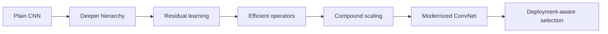

# Course 02 — Modern CNN Architectures & Efficient Vision

> From ResNet to ConvNeXt and deployment-aware model selection

Modern convolutional networks are not a single architecture family marching toward “more accuracy.” They are a set of design choices about optimization, spatial hierarchy, compute, memory, and the hardware on which inference must run. This course turns those choices into a reproducible selection process.

The central question is practical:

> Which visual backbone should an engineering team choose for a cloud GPU service, a factory CPU workstation, or an edge device—and what evidence makes that choice defensible?

Course 01 introduced the end-to-end computer-vision system. Course 02 goes one layer deeper: it explains why modern CNN blocks work, compares five pretrained backbones under one controlled probe, partially fine-tunes two contrasting models, profiles real execution, tests robustness, and selects models against explicit deployment contracts.

## Course status

| Attribute | Value |
| --- | --- |
| Level | Beginner |
| Format | Theory + one self-contained notebook + checkpoint |
| Estimated time | 8–10 hours |
| Runtime | CPU-safe default; CUDA and Apple Silicon acceleration when available |
| Tested stack | Python 3.13, PyTorch 2.13, torchvision 0.28, scikit-learn 1.9 |
| Architecture/tooling review | 2026-09-01; primary papers and official SDK documentation |
| Data | Deterministic synthetic industrial inspection dataset generated in the notebook |
| Pretrained models | Official `torchvision` weights; no hidden local modules |

## Learning outcomes

By the end, you should be able to:

1. distinguish vanishing gradients from the degradation problem;
2. explain how identity shortcuts change the optimization problem;
3. trace spatial resolution and channel width through a residual stage;
4. distinguish a ResNet basic block from a bottleneck block;
5. estimate parameters and multiply–accumulate operations for convolutional blocks;
6. explain grouped and depthwise-separable convolutions;
7. explain what squeeze-and-excitation learns to reweight;
8. describe EfficientNet compound scaling across depth, width, and resolution;
9. explain MobileNetV3’s inverted residuals, linear bottlenecks, and hardware-aware design;
10. describe ConvNeXt as a modernized pure convolutional network;
11. separate parameter count, MACs, activation memory, latency, and throughput;
12. benchmark batch-1 latency without timing warm-up or asynchronous work by mistake;
13. compare backbones with the same dataset, split, preprocessing policy, and probe;
14. test whether resolution helps small-defect recall enough to justify its cost;
15. partially fine-tune a selected stage without silently changing the whole experiment;
16. measure representation drift after fine-tuning;
17. evaluate blur, low-light, compression, noise, resolution, and source shift;
18. identify Pareto-efficient models rather than ranking by accuracy alone;
19. choose a model against a written deployment contract; and
20. explain why a benchmark result must be rerun on target hardware before procurement or release.

## Prerequisites

Complete [Course 01 — Modern Computer Vision Foundations](../01-modern-computer-vision-foundations/) or be comfortable with tensors, convolution, feature maps, embeddings, train/validation/test splits, precision/recall/F1, transfer learning, calibration, and source-aware evaluation.

No cloud account, API key, or private dataset is required.

## The architecture progression

This progression is not a claim that each family replaces the previous one. ResNets remain valuable baselines; MobileNet-style models target constrained devices; EfficientNet formalizes scaling; and ConvNeXt shows how far a pure ConvNet can go when its macro- and micro-design are modernized.

## 1. Depth, optimization, and the degradation problem

“Deep networks are hard to train” hides two different problems.

**Vanishing or exploding gradients** concern signal propagation. Repeated Jacobian multiplication can drive gradients toward zero or infinity. Initialization, normalization, activation choice, and architectural paths all influence it.

**Degradation** is an optimization observation: a deeper plain network can achieve *higher training error* than a shallower counterpart, even though the deeper model could in principle represent the shallower solution. This is not overfitting—the failure is already visible on the training set. The original ResNet work framed residual learning as a way to make the identity solution easier to reach.

For a residual block,

$$
\mathbf{y}=\mathcal{F}(\mathbf{x};\theta)+\mathbf{x}.
$$

If the desired transformation is close to identity, the residual branch only needs to learn the correction $\mathcal{F}(\mathbf{x})\approx 0$. The shortcut also creates a direct route for forward activations and backward gradients.

When the spatial size or channel count changes, the identity path no longer has a compatible shape. A projection shortcut restores compatibility:

$$
\mathbf{y}=\mathcal{F}(\mathbf{x};\theta)+\mathbf{W}_s * \mathbf{x},
$$

where $\mathbf{W}_s$ is commonly a $1\times1$ convolution with the required stride.

### Basic blocks, bottlenecks, and stages

- A **basic block** usually contains two $3\times3$ convolutions. It is easy to inspect and is used by smaller ResNets such as ResNet-18.
- A **bottleneck block** uses $1\times1$ compression, $3\times3$ spatial processing, and $1\times1$ expansion. It is the standard unit in larger ResNets such as ResNet-50.
- A **stage** repeats blocks at one spatial scale. The first block in a new stage often downsamples while increasing channels.

Ignoring bias and normalization, a dense convolution with kernel $K_h\times K_w$, input channels $C_{in}$, output channels $C_{out}$, and output map $H_o\times W_o$ has

$$
\text{parameters}=K_hK_wC_{in}C_{out},
$$

$$
\text{MACs}=H_oW_oK_hK_wC_{in}C_{out}.
$$

A bottleneck that maps $C$ channels through an internal width $B$ and expands to $E$ channels has approximately

$$
CB + 9B^2 + BE
$$

convolution parameters. This makes the expensive $3\times3$ operator act on a narrower representation.

## 2. Efficient convolutional operators

### Grouped convolution

With $G$ groups, channels are partitioned into $G$ independent convolution problems. The dense-convolution parameter count becomes

$$
\frac{K_hK_wC_{in}C_{out}}{G}.
$$

Grouping reduces theoretical work, but it can also reduce communication across channel groups. Later pointwise convolutions or channel-mixing operations are therefore important.

### Depthwise-separable convolution

A depthwise layer applies one spatial filter per input channel, followed by a $1\times1$ pointwise layer that mixes channels:

$$
\text{parameters}_{dw+pw}=K_hK_wC_{in}+C_{in}C_{out}.
$$

Compared with $K_hK_wC_{in}C_{out}$ for dense convolution, this can be dramatically smaller. Yet lower MACs do **not** guarantee lower latency. Kernel implementation, memory movement, tensor shape, parallelism, compiler fusion, and the target accelerator all matter. The notebook measures this discrepancy rather than treating FLOPs as elapsed time.

### Squeeze-and-excitation

Squeeze-and-excitation (SE) turns a feature map into channel statistics, learns interactions among those statistics, and gates the original channels:

$$
\mathbf{z}_c=\frac{1}{HW}\sum_{i=1}^{H}\sum_{j=1}^{W}\mathbf{x}_{cij},
\qquad
\widetilde{\mathbf{x}}_c=\sigma(g(\mathbf{z}))_c\mathbf{x}_c.
$$

SE is channel attention: it answers “which channels are useful for this input?” It does not directly provide spatial attention or a causal explanation.

## 3. Three modern design families

### MobileNetV3: design for measured mobile behavior

MobileNetV3 combines depthwise operators, inverted residuals, linear bottlenecks, SE, hardware-aware architecture search, and efficient nonlinearities. An inverted residual expands a narrow input into a wider hidden space, performs depthwise spatial processing, then projects back to a narrow output. The final projection is linear because a nonlinear activation in a low-dimensional bottleneck can destroy information.

The important systems lesson is not “MobileNet is always fastest.” It is that the architecture was designed with target-device latency in the objective. Your runtime, operator library, quantization mode, and input size may still change the ranking.

### EfficientNet: scale the network as a system

Increasing only depth, width, or image resolution eventually produces diminishing returns or a severe compute bill. EfficientNet scales all three dimensions with a compound coefficient $\phi$:

$$
d=\alpha^{\phi},\qquad
w=\beta^{\phi},\qquad
r=\gamma^{\phi},
$$

subject to an approximate compute constraint such as

$$
\alpha\beta^2\gamma^2\approx 2.
$$

This is a design rule, not a promise that every balanced scaling choice is optimal on every dataset. Resolution is especially consequential for small defects: it may reveal evidence while also increasing activation memory and latency roughly with image area.

### ConvNeXt: a ConvNet for the modern training era

ConvNeXt is a **pure convolutional network**, not “a transformer with convolutions.” Its redesign incorporates lessons made prominent by Vision Transformers while retaining convolutional operators:

- patch-like stem and a revised stage-compute ratio;
- large-kernel depthwise convolution;
- inverted bottlenecks with pointwise channel mixing;
- fewer normalization and activation layers;
- LayerNorm in the block design; and
- a strong modern training recipe.

This distinction matters. Similar macro-design choices do not make the underlying token-mixing operation the same. ConvNeXt uses learned local convolutional kernels and their hierarchical composition; a standard ViT uses global self-attention among tokens.

The 2026 lesson is broader than any one leaderboard: mature CNNs remain strong deployment baselines, while frontier work increasingly combines architecture, training recipe, compiler behavior, quantization, and target-hardware measurements. Stable families in `torchvision` are ideal for a controlled beginner benchmark; they should not be mistaken for an exhaustive list of current research models.

### 2026 architecture radar

- **Established deployment baselines:** residual networks, MobileNetV3, EfficientNet, and ConvNeXt have stable implementations, documented weights, and well-understood trade-offs. They form the reproducible benchmark in this course.
- **Modern successors:** EfficientNetV2 adds training-aware scaling and fused mobile inverted bottlenecks; ConvNeXt V2 co-designs the architecture with masked-autoencoder pretraining and Global Response Normalization. These are extension candidates, not silently mixed into the core comparison.
- **Emerging systems practice:** reparameterized blocks, sparsity, quantization, dynamic resolution, and compiler-aware search can change the deployed graph substantially. Claims must name the exported graph, precision, runtime, and hardware.
- **Transition frontier:** convolution–attention hybrids and token-based models blur some macro-design boundaries while preserving different mixing operators. Course 03 compares those mechanisms directly.

## 4. The five-backbone comparison

| Backbone | Primary idea | Expected strength | Likely trade-off |
| --- | --- | --- | --- |
| ResNet-18 | Basic residual blocks | Simple, robust baseline | Less representational capacity |
| ResNet-50 | Bottleneck residual blocks | Stronger hierarchical features | More compute than ResNet-18 |
| MobileNetV3-Large | Hardware-aware inverted residuals | Small model, mobile-oriented operators | Runtime depends strongly on backend |
| EfficientNet-B0 | MBConv + compound scaling | Balanced accuracy/efficiency baseline | Resolution and operator support matter |
| ConvNeXt-Tiny | Modernized pure ConvNet | Strong modern representation | Larger file and heavier compute |

The notebook uses official pretrained weights and replaces each classification head with an identity mapping. A single logistic-regression probe is trained on the resulting embeddings. This controls the classifier family and optimization budget so the comparison focuses more clearly on representation quality. It does not make the encoders identical: their pretraining recipes, default resolutions, dimensions, and inductive biases still differ.

## 5. Measure the thing you actually care about

These quantities are related but not interchangeable:

| Quantity | What it measures | What it misses |
| --- | --- | --- |
| Parameters | Learned scalar count | Runtime activations and operator efficiency |
| MACs | Approximate arithmetic work | Memory traffic, launch overhead, fusion, backend quality |
| Activation memory | Intermediate tensor footprint estimate | Allocator behavior and framework overhead |
| Latency | Time for one timed request | Sustained capacity under batching/concurrency |
| Throughput | Items processed per unit time | Per-request waiting time |
| Peak device memory | Allocator high-water mark | Host memory and deployment packaging |

A useful latency protocol includes:

1. evaluation mode and inference mode;
2. fixed input shapes and dtype;
3. warm-up runs before measurement;
4. synchronization around asynchronous accelerator work;
5. repeated measurements rather than one sample;
6. median plus a tail percentile such as p90 or p95;
7. batch 1 for interactive/edge latency and a larger batch for throughput; and
8. hardware, software versions, power mode, and thread settings in the report.

The notebook records both measured and estimated quantities. Its measurements characterize the machine running the notebook—not a phone, production GPU, or factory workstation that has not been tested.

## 6. Resolution is an architecture decision

For a stride-$S$ encoder, a small object that spans fewer than $S$ input pixels can be poorly represented after early downsampling. Increasing resolution can preserve evidence, but it also grows intermediate feature maps. If both spatial dimensions are multiplied by $q$, early activation elements and many convolution MACs grow approximately with $q^2$.

Course 02 therefore runs a resolution sweep and reports:

- macro F1;
- small-defect recall;
- batch-1 latency;
- estimated activation memory; and
- the quality gain per additional millisecond.

The default run uses bounded resolutions so it remains practical on CPU. Set `CV_FULL_RUN=1` before executing the notebook to use the larger 128/224/320 sweep and longer timing loops.

## 7. Fine-tuning and representation drift

A frozen probe asks whether a pretrained representation already separates the new classes. Partial fine-tuning asks whether adapting the last stage improves the task enough to justify more training and a less stable representation.

For the same ordered examples, representation drift can be summarized with cosine similarity:

$$
\text{drift}(i)=1-\frac{\mathbf{e}^{(0)}_i\cdot\mathbf{e}^{(1)}_i}
{\lVert\mathbf{e}^{(0)}_i\rVert_2\lVert\mathbf{e}^{(1)}_i\rVert_2}.
$$

Low drift does not imply “no learning,” and high drift does not imply “better learning.” Interpret it together with clean quality, shifted quality, nearest-neighbor consistency, and class/source separation.

## 8. Robustness as a benchmark suite

The deployment benchmark covers:

- clean held-out-factory data;
- blur;
- low light;
- JPEG compression;
- sensor-like noise;
- resolution degradation; and
- a combined stress condition.

These corruptions are controlled tests, not a complete model of the physical world. They reveal sensitivity and support regression testing. They do not replace trials with real cameras, optics, materials, production lines, and operators.

## 9. Pareto fronts and deployment contracts

A model is Pareto-dominated when another option is at least as good on every chosen objective and strictly better on one. For quality $Q$ to maximize and cost $C$ to minimize, model $a$ dominates model $b$ when

$$
Q_a\ge Q_b,\qquad C_a\le C_b,
$$

with at least one strict inequality.

The notebook plots clean F1, defect recall, robust F1, latency, and model size rather than compressing everything into one unexplained score.

It then evaluates three illustrative contracts:

| Deployment | Priorities | Hard constraints to customize |
| --- | --- | --- |
| Cloud GPU service | robust quality and batch throughput | quality floor, memory envelope |
| Factory CPU workstation | low batch-1 latency and reliability | latency ceiling, recall floor |
| Edge camera | package size, memory, and predictable batch-1 latency | strict size/latency limits, minimum recall |

The included thresholds are teaching defaults calibrated to the observed run. A real contract must be written with product, safety, operations, and hardware owners before selection.

## Notebook

Open [lab.ipynb](lab.ipynb).

The notebook is a single, inspectable implementation with no `lab.py` or hidden course code. It will:

1. generate a source-aware industrial image dataset;
2. visualize residual, bottleneck, depthwise, and SE behavior;
3. contrast shallow, deep-plain, and residual optimization;
4. verify manual parameter/MAC calculations;
5. load five official pretrained backbones;
6. run a controlled frozen-probe benchmark;
7. profile batch-1 latency and batched throughput;
8. inspect operator-level behavior with `torch.profiler`;
9. sweep input resolution;
10. partially fine-tune ResNet-18 and ConvNeXt-Tiny;
11. measure representation drift;
12. evaluate the standardized robustness suite;
13. construct Pareto fronts; and
14. emit a machine-readable deployment decision record.

Generated artifacts are written to `.artifacts/architecture_benchmark/` and are intentionally excluded from version control.

## Tooling review

| Tool | Use in this course | When to choose it |
| --- | --- | --- |
| `torchvision.models` | Canonical builders, weights, transforms, model metadata | Controlled experiments with maintained PyTorch reference models |
| `timm` | Reviewed, not required by the notebook | Broader research model coverage and feature-extraction helpers |
| `torch.profiler` | Operator time, shapes, and memory inspection | Diagnose where execution time goes after macro benchmarking |
| `torch.utils.benchmark` / `time.perf_counter` | Repeatable micro/macro timing | Compare small operators or end-to-end inference with a written protocol |
| ONNX Runtime | Deployment candidate, not required here | Portable CPU/GPU execution after numerical parity checks |
| ExecuTorch / platform runtimes | Edge deployment candidates | Measure on the actual mobile/embedded target and supported operators |
| `torch.compile` | Optional optimization path | Re-benchmark after compilation; compilation and warm-up are separate costs |

Tool choice is part of the experiment. Export or compilation can change kernels, memory layouts, fusion, quantization, and therefore the ranking. Never report eager-mode laptop timing as a universal architecture property.

## Common mistakes

- Calling degradation “overfitting” when training error is worse.
- Treating a projection shortcut as an identity shortcut.
- Reporting FLOPs as milliseconds.
- Timing model construction, weight download, preprocessing, or warm-up unintentionally.
- Comparing each backbone with a different classifier or data split.
- Letting the held-out factory leak into model or threshold selection.
- Selecting by average F1 while a safety-critical defect class has poor recall.
- Claiming an edge deployment from a desktop CPU benchmark.
- Fine-tuning the entire model when the experiment claims to adapt only the last stage.
- Calling ConvNeXt a transformer.

## What you should now be able to explain without code

You should be able to answer:

> How is the degradation problem different from vanishing gradients?

> Why can an identity shortcut make a deep model easier to optimize?

> Why can a model with fewer FLOPs run more slowly?

> Why is a frozen linear probe useful for comparing encoders—and what does it fail to control?

> Why might higher resolution improve small-defect recall but make deployment worse?

> What is the difference between parameter count, activation memory, latency, and throughput?

> Why can partial fine-tuning improve clean validation F1 while weakening robustness?

> What does it mean for a backbone to be Pareto-efficient?

> Why must the final benchmark run on the target device and runtime?

> If modern CNNs are this capable and efficient, why did Vision Transformers become so important?

## References

### Architecture papers

- He et al., [Deep Residual Learning for Image Recognition](https://openaccess.thecvf.com/content_cvpr_2016/html/He_Deep_Residual_Learning_CVPR_2016_paper.html), CVPR 2016.
- Hu et al., [Squeeze-and-Excitation Networks](https://openaccess.thecvf.com/content_cvpr_2018/html/Hu_Squeeze-and-Excitation_Networks_CVPR_2018_paper.html), CVPR 2018.
- Sandler et al., [MobileNetV2: Inverted Residuals and Linear Bottlenecks](https://openaccess.thecvf.com/content_cvpr_2018/html/Sandler_MobileNetV2_Inverted_Residuals_CVPR_2018_paper.html), CVPR 2018.
- Howard et al., [Searching for MobileNetV3](https://openaccess.thecvf.com/content_ICCV_2019/html/Howard_Searching_for_MobileNetV3_ICCV_2019_paper.html), ICCV 2019.
- Tan and Le, [EfficientNet: Rethinking Model Scaling for Convolutional Neural Networks](https://proceedings.mlr.press/v97/tan19a.html), ICML 2019.
- Tan and Le, [EfficientNetV2: Smaller Models and Faster Training](https://proceedings.mlr.press/v139/tan21a.html), ICML 2021.
- Liu et al., [A ConvNet for the 2020s](https://openaccess.thecvf.com/content/CVPR2022/html/Liu_A_ConvNet_for_the_2020s_CVPR_2022_paper.html), CVPR 2022.
- Woo et al., [ConvNeXt V2: Co-designing and Scaling ConvNets with Masked Autoencoders](https://arxiv.org/abs/2301.00808), CVPR 2023.

### Official tooling

- PyTorch, [torchvision models and pre-trained weights](https://docs.pytorch.org/vision/stable/models.html).
- PyTorch, [`torch.profiler`](https://docs.pytorch.org/docs/stable/profiler.html).
- PyTorch, [Profiler recipe](https://docs.pytorch.org/tutorials/recipes/recipes/profiler_recipe.html).
- PyTorch, [`torch.compile` end-to-end tutorial](https://docs.pytorch.org/tutorials/intermediate/torch_compile_full_example.html).
- Hugging Face, [`timm` feature extraction](https://huggingface.co/docs/timm/feature_extraction).

## Next course

Course 03 — Vision Transformers will begin with the closing question: if convolutional hierarchies are so effective, what new scaling and representation behavior does token-based self-attention unlock?
