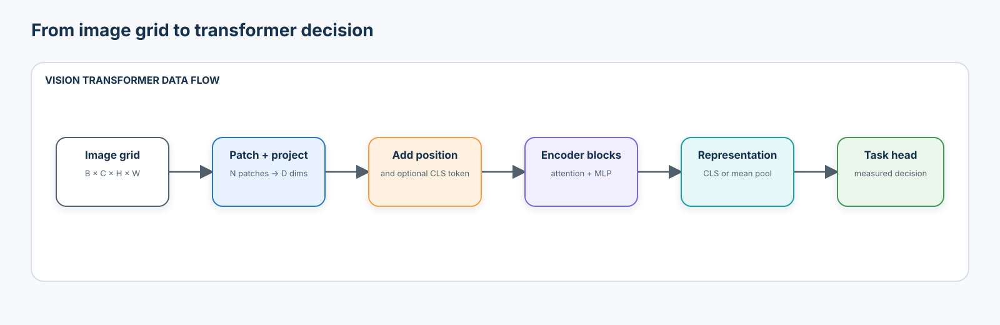
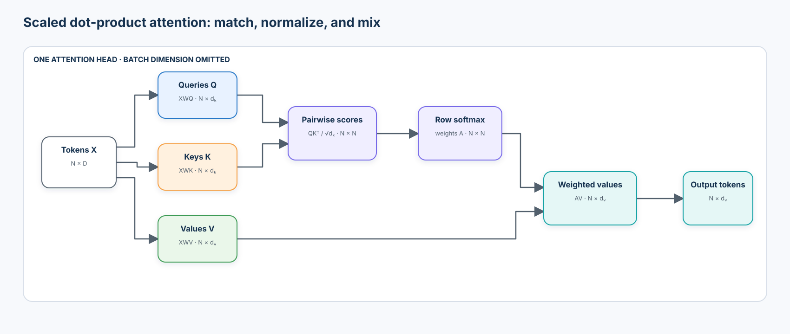
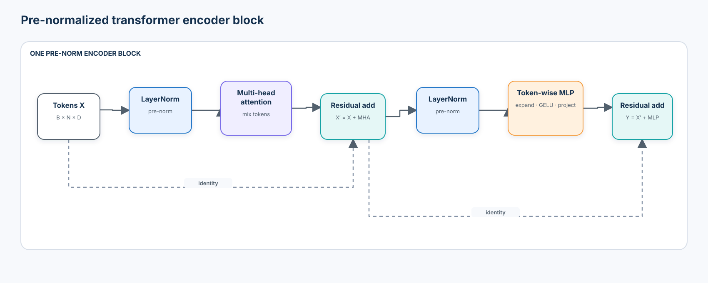
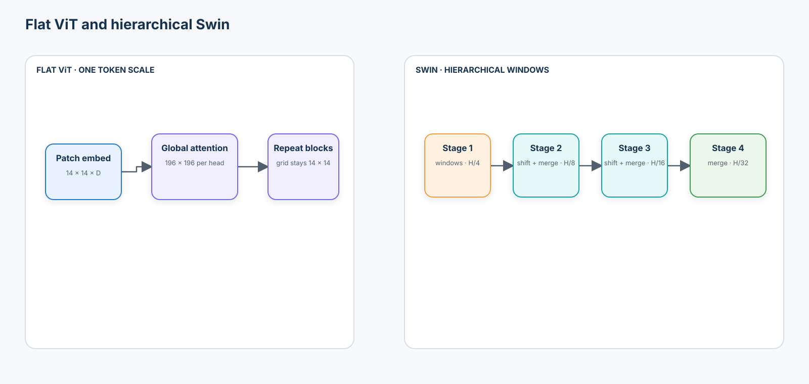
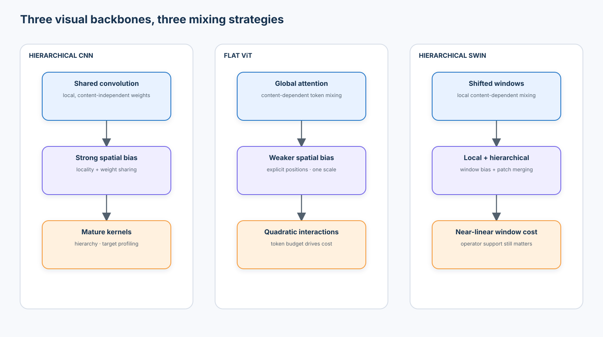

# Course 03 — Vision Transformers

> From image patches to global visual representations

Vision Transformers (ViTs) change the basic unit of visual computation. A convolutional network repeatedly applies learned spatial filters to local neighborhoods; a ViT first turns an image into a sequence of patch tokens, adds position information, and lets content-dependent attention mix those tokens. The result is not automatically better, more global, or more interpretable. It is a different set of inductive biases, scaling costs, and deployment choices.

The central question is:

> What changes when an image becomes a token sequence and content-dependent attention replaces primarily convolutional locality?

Course 02 established architecture and systems measurement. Course 03 uses the same discipline to build attention by hand, implement a small ViT, compare four official pretrained backbones under one probe, measure token and latency costs, test patch-size and resolution shift, and inspect attention without presenting it as a causal explanation.

## Course status

| Attribute | Value |
| --- | --- |
| Level | Beginner |
| Format | Theory + one self-contained notebook + checkpoint |
| Estimated time | 8–10 hours |
| Runtime | CPU-safe default; CUDA and Apple Silicon acceleration when available |
| Tested stack | Python 3.13, PyTorch 2.13, torchvision 0.28, scikit-learn 1.9 |
| Architecture/tooling review | 2026-09-01; primary papers and official SDK documentation |
| Data | Deterministic synthetic industrial inspection dataset generated in the notebook |
| Pretrained models | Official `torchvision` weights; no private data, API key, or hidden local module |

## Learning outcomes

By the end, you should be able to:

1. explain which convolutional biases help when data is limited;
2. describe what locality and translation equivariance do—and do not—guarantee;
3. patchify an image and calculate its token count;
4. explain why patch size is an information and compute bottleneck;
5. prove numerically that non-overlapping patch projection equals a strided convolution;
6. distinguish patch content from positional information;
7. compare absolute position embeddings, relative position bias, and interpolation;
8. derive query, key, and value tensors from token embeddings;
9. compute scaled dot-product attention by hand;
10. verify the manual result with PyTorch;
11. trace all tensor shapes through multi-head attention;
12. explain why multiple heads can learn different interaction patterns without guaranteeing semantic specialization;
13. calculate the quadratic token-interaction cost of global attention;
14. explain pre-normalization, residual paths, and the MLP sublayer;
15. implement patch embedding, position embeddings, attention, blocks, and pooling directly in PyTorch;
16. distinguish a class token from mean pooling;
17. explain why early ViTs depended strongly on data scale and pretraining;
18. describe how the DeiT training recipe improved data efficiency;
19. compare flat ViT representations with hierarchical feature maps;
20. explain windowed and shifted-window attention in Swin;
21. compare CNN, ViT, and Swin inductive biases without caricaturing them;
22. run a controlled frozen-probe comparison across four official backbones;
23. measure macro F1, per-class recall, small-defect recall, and source-shift behavior;
24. profile median, p90, p95, throughput, parameters, model size, and token interactions;
25. measure how patch size changes quality, latency, memory, and lost detail;
26. adapt learned position embeddings when input resolution changes;
27. visualize attention as a model-internal interaction diagnostic, not a causal explanation; and
28. choose an architecture against an explicit quality, resolution, and systems contract.

## Prerequisites

Complete [Course 02 — Modern CNN Architectures & Efficient Vision](../02-modern-cnn-architectures-efficient-vision/) or be comfortable with feature maps, embeddings, residual blocks, transfer learning, frozen probes, source-aware splits, macro F1, latency percentiles, and Pareto trade-offs.

No transformer experience is required.

## The representation shift

A CNN and a ViT can both learn local and long-range structure. The useful distinction is how that structure is encouraged.

- A convolution starts with strong spatial priors: local connectivity, weight sharing, and translation equivariance before downsampling or boundary effects.
- A standard ViT starts with weaker spatial priors after patchification. Its token mixing is content-dependent, while explicit position information restores spatial order.
- A hierarchical transformer such as Swin reintroduces locality, stages, and multiscale features through windows, shifted windows, and patch merging.

The slogan “CNNs are local, transformers are global” is incomplete. Deep CNN receptive fields can cover the image; global ViT attention may still concentrate locally; and windowed transformers deliberately restrict each attention operation. Architecture describes available paths and biases, not the behavior of every trained model.

## 1. From pixels to patch tokens

For an image with height $H$, width $W$, channels $C$, and square patch size $P$, a non-overlapping patch grid contains

$$
N=\frac{H}{P}\frac{W}{P}
$$

patches when both spatial dimensions are divisible by $P$. A $224\times224$ image with $16\times16$ patches produces

$$
N=\frac{224}{16}\frac{224}{16}=14\times14=196
$$

patch tokens. A classification token makes the transformer sequence length $197$.

Each patch contains $P^2C$ scalar values. Flattening a patch and applying a learned projection $\mathbf{E}\in\mathbb{R}^{P^2C\times D}$ creates a $D$-dimensional token:

$$
\mathbf{z}_i=\operatorname{vec}(\mathbf{x}_i)\mathbf{E}+\mathbf{b}.
$$

The same operation can be implemented as `Conv2d(C, D, kernel_size=P, stride=P)`. The notebook copies one linear projection into the convolution weights and verifies element-wise equivalence.

### Patch size is a bottleneck

| Input | Patch | Patch tokens | Global attention score entries per head |
| --- | ---: | ---: | ---: |
| $224\times224$ | 32 | 49 | 2,401 |
| $224\times224$ | 16 | 196 | 38,416 |
| $224\times224$ | 8 | 784 | 614,656 |

Smaller patches preserve finer evidence and create more interaction opportunities, but token count grows with $1/P^2$ and the dense attention matrix grows with $1/P^4$. Larger patches are cheaper but may combine a tiny defect with mostly normal pixels before the first transformer block sees it. Patch size therefore changes both the compute graph and the information presented to it.

## 2. Position: identical content, different place

Self-attention alone is permutation-equivariant: reordering the input tokens reorders the outputs but does not identify which token came from the upper-left or lower-right. A ViT adds position information to patch embeddings:

$$
\mathbf{z}_0=[\mathbf{x}_{class};\mathbf{x}_1\mathbf{E};\ldots;\mathbf{x}_N\mathbf{E}]+\mathbf{E}_{pos}.
$$

Common designs include:

- **learned absolute embeddings**, one vector per sequence position;
- **fixed sinusoidal encodings**, computed from position rather than learned as a lookup table;
- **relative position bias**, which changes attention logits according to displacement between query and key locations; and
- **position interpolation**, which reshapes a learned patch grid, resizes it, and flattens it for a new resolution.

Interpolation is an adaptation rule, not evidence that a model is resolution-invariant. A higher-resolution input changes token count, attention cost, apparent object scale, and the distribution presented to the pretrained encoder. Quality must be measured again.

## 3. Scaled dot-product attention

Given token matrix $\mathbf{X}\in\mathbb{R}^{N\times D}$, learned projections produce

$$
\mathbf{Q}=\mathbf{X}\mathbf{W}_Q,\qquad
\mathbf{K}=\mathbf{X}\mathbf{W}_K,\qquad
\mathbf{V}=\mathbf{X}\mathbf{W}_V.
$$

Scaled dot-product attention is

$$
\operatorname{Attention}(\mathbf{Q},\mathbf{K},\mathbf{V})=
\operatorname{softmax}\left(\frac{\mathbf{Q}\mathbf{K}^{\mathsf T}}{\sqrt{d_k}}\right)\mathbf{V}.
$$

The dot product asks how strongly each query matches each key. Division by $\sqrt{d_k}$ keeps score magnitude from growing simply because the head dimension is large. Row-wise softmax converts scores into normalized mixing weights. Multiplying by $\mathbf{V}$ creates a content-dependent weighted combination for each output token.

For batch $B$, heads $h$, tokens $N$, and head dimension $d_h=D/h$:

| Tensor | Shape |
| --- | --- |
| Input | $B\times N\times D$ |
| Q, K, V after head split | $B\times h\times N\times d_h$ |
| Attention logits and weights | $B\times h\times N\times N$ |
| Concatenated head output | $B\times N\times D$ |

The notebook computes a four-token example using matrix multiplication and softmax, then verifies the result with `torch.nn.functional.scaled_dot_product_attention`.

### Multi-head attention

Each head has its own projections, so heads can learn different token relationships. Their outputs are concatenated and projected:

$$
\operatorname{MHA}(\mathbf{X})=\operatorname{Concat}(head_1,\ldots,head_h)\mathbf{W}_O.
$$

Different heads do not necessarily correspond to stable human concepts. Heads can be redundant, compensate for one another, or change behavior across inputs. Visual inspection is a hypothesis generator, not a proof of specialization.

## 4. The quadratic interaction bill

Dense global attention materializes $N\times N$ pairwise scores per head. Ignoring constants and projection layers, token mixing scales as

$$
\mathcal{O}(N^2D).
$$

At patch size 16:

| Resolution | Patch grid | Patch tokens | Score entries per head | Increase vs 224 |
| --- | ---: | ---: | ---: | ---: |
| 224 | $14\times14$ | 196 | 38,416 | 1.0× |
| 384 | $24\times24$ | 576 | 331,776 | 8.6× |
| 768 | $48\times48$ | 2,304 | 5,308,416 | 138.2× |

Image area grows quadratically with resolution; global attention interaction count grows approximately with the square of image area. Kernel fusion and optimized scaled-dot-product attention can reduce realized memory traffic, but they do not erase the algorithmic scaling. Always report the framework, precision, backend, batch, resolution, and whether attention weights were explicitly returned.

## 5. The pre-normalized encoder block

A common pre-norm encoder block is

$$
\mathbf{X}'=\mathbf{X}+\operatorname{MHA}(\operatorname{LN}(\mathbf{X})),
$$

$$
\mathbf{Y}=\mathbf{X}'+\operatorname{MLP}(\operatorname{LN}(\mathbf{X}')).
$$

The MLP is applied independently at every token position, usually expanding the channel dimension, applying GELU, and projecting back. Attention mixes information across tokens; the MLP transforms the representation within each token. Residual paths preserve a direct route around both sublayers.

The notebook implements `PatchEmbed`, `MultiHeadSelfAttention`, `TransformerBlock`, and `TinyViT` directly. Shape assertions make the contract executable. This educational model is small enough to train on CPU and is not presented as production evidence.

### Classification token or mean pooling?

- A **class token** is a learned vector inserted into the sequence. Its final representation is trained to aggregate information for prediction.
- **Mean pooling** averages the final patch-token representations. It has no dedicated aggregation token and can be effective in many training recipes.

The choice interacts with pretraining and architecture. Do not change pooling on a pretrained checkpoint unless the checkpoint or a validated adaptation procedure supports it.

## 6. Why early ViTs needed data and recipe

Convolution gives useful visual structure before learning begins. A standard ViT has weaker built-in locality and translation bias, so it often needs more data, stronger augmentation, regularization, or pretraining to learn robust spatial structure.

The original ViT results showed strong transfer after large-scale pretraining. DeiT then demonstrated that a carefully designed ImageNet-only recipe—augmentation, regularization, repeated augmentation, optimization choices, and transformer-specific distillation—could make training substantially more data-efficient. The lesson is not “ViTs cannot learn on small datasets.” It is that architecture rankings depend heavily on pretraining data, objective, recipe, and adaptation method.

## 7. From flat ViT to hierarchical Swin

A vanilla ViT keeps one patch scale across its encoder. This is simple and useful for global representations, but dense prediction often benefits from feature maps at multiple spatial resolutions.

Swin introduces:

1. non-overlapping local attention windows;
2. shifted windows in alternating blocks so information crosses previous window boundaries;
3. patch merging between stages; and
4. a hierarchical increase in channel width as spatial resolution falls.

Window attention changes global $N^2$ interaction growth to a cost that is approximately linear in image size for a fixed window size, while shifted windows allow cross-window communication over depth. It also reintroduces local and multiscale biases. Swin is a transformer family, but not a flat global-attention ViT.

## 8. CNN, ViT, and Swin without slogans

| Property | Hierarchical CNN | Flat ViT | Hierarchical Swin |
| --- | --- | --- | --- |
| Basic unit | Feature-map location | Patch token | Windowed patch token |
| Token/spatial mixing | Shared convolution kernels | Global content-dependent attention | Local shifted-window attention |
| Built-in locality | Strong | Weak after patchification | Stronger through windows |
| Translation behavior | Equivariant before boundary/stride effects | Learned through data and positions | Window/shift design plus learning |
| Multiscale hierarchy | Native stages | Usually one token scale | Native patch-merging stages |
| Long-range path | Grows through depth/receptive field | One global attention layer | Grows across shifted windows and stages |
| Position information | Implicit grid and kernel application | Explicit absolute/relative design | Relative window bias and hierarchy |
| Resolution cost | Often near-linear in pixels per layer | Global attention can grow quadratically in tokens | Approximately linear in pixels for fixed windows |
| Small-data behavior | Often strong bias/variance trade-off | Usually recipe/pretraining sensitive | Intermediate, recipe dependent |
| Dense prediction fit | Strong multiscale backbone | Requires token-to-map adaptation | Designed as a general-purpose hierarchy |
| Deployment reality | Mature kernels across runtimes | Backend and sequence length matter | Window partition/shift support matters |

No column is universally best. The correct comparison fixes the downstream data, split, preprocessing, probe or fine-tuning budget, resolution policy, and systems measurement protocol.

## 9. Controlled pretrained benchmark

The lab compares four official `torchvision` encoders:

| Backbone | Design role | Official weights used | Representation |
| --- | --- | --- | --- |
| ResNet-50 | Residual CNN baseline | `ResNet50_Weights.IMAGENET1K_V2` | Global average pooled feature |
| ConvNeXt-Tiny | Modernized convolution | `ConvNeXt_Tiny_Weights.IMAGENET1K_V1` | Final pooled feature |
| ViT-B/16 | Flat global-attention transformer | `ViT_B_16_Weights.IMAGENET1K_V1` | Class token |
| Swin-T | Hierarchical shifted-window transformer | `Swin_T_Weights.IMAGENET1K_V1` | Final pooled feature |

Each encoder receives the same generated images, source-aware split, $224\times224$ tensor contract, ImageNet normalization, frozen weights, logistic-regression probe family, and evaluation slices. The probe reports:

- macro F1;
- per-class recall;
- defect recall;
- small-defect recall; and
- held-out-source performance.

This is still not a perfectly isolated architecture experiment. The checkpoints differ in parameter count, representation width, pretraining recipe, augmentation, and upstream accuracy. Results support a model-selection decision for this lab; they do not identify a universal winner or establish a causal architecture effect.

## 10. Systems evidence

The notebook records:

- parameter count and serialized state size;
- median, p90, p95, and IQR batch-1 latency after warm-up;
- batched throughput;
- peak accelerator memory when available;
- patch/token count;
- an attention-interaction estimate; and
- environment, precision, resolution, and backend.

A single timing is fragile. Percentiles and distributions expose scheduler noise, cold starts, kernel initialization, and tail behavior. Measurements from the notebook runtime are demonstrations only; production decisions require the exported graph, intended precision, exact device, sustained load, and thermal conditions.

### Patch-size and resolution experiments

The tiny educational ViT compares patches 32, 16, and 8 at a bounded resolution. It records token count, validation quality, training time, latency, and an attention-memory estimate. The expected lesson is a trade-off, not monotonic improvement.

The pretrained transformer experiment evaluates lower, native, and higher resolutions. Learned absolute position embeddings are bicubically interpolated as a two-dimensional grid. Quality and latency are remeasured because interpolation only fixes the tensor shape contract.

## 11. Attention visualization and attention distance

The notebook reproduces a pretrained ViT encoder pass and requests per-head attention weights from selected layers. It verifies that the manually traversed encoder produces the same final representation as the official forward path before using those weights.

For a patch-query distribution $a_{ij}$ and spatial distance $d(i,j)$, one descriptive statistic is expected attention distance:

$$
D_i=\sum_j a_{ij}d(i,j).
$$

Averaging across queries, samples, or heads can show whether later layers tend to mix across wider spatial ranges. It does not say that a long-distance edge caused the classifier decision.

The gallery includes correct, incorrect when available, small-defect, large-defect, and held-out-source examples. Raw class-token attention is overlaid on the image and labeled as an **interaction diagnostic**. Attention can route information without being a faithful attribution. Residual paths, MLPs, value vectors, downstream probe weights, and cross-layer mixing all affect the prediction. For explanation work, compare multiple methods and perform perturbation or counterfactual tests.

## 12. 2026 architecture radar

The core lab stays intentionally small. These developments matter for the next design review:

- **Established:** ViT and hierarchical/windowed transformers remain standard backbone concepts with stable implementations and well-understood scaling trade-offs.
- **Resolution-flexible practice:** native-resolution packing and flexible-patch designs such as NaViT and FlexiViT challenge the assumption that every image must be forced into one square crop.
- **Efficient attention practice:** fused scaled-dot-product attention, compilation, mixed precision, token pruning, local/global hybrids, and backend-specific kernels can change realized cost. Algorithm names alone do not predict latency.
- **Foundation-backbone frontier:** self-supervised systems such as DINOv3 scale ViT and ConvNeXt backbones into transferable dense feature extractors. Course 04 evaluates objectives and frozen representations rather than treating those results as an architecture-only comparison.
- **Multimodal transition:** modern VLMs increasingly use dynamic or native-resolution visual tokenization. Token budget becomes a joint vision-language systems constraint, not merely an image-classification detail.

Any “state of the art” claim must name the task, split, metric, model/weight version, resolution, precision, hardware, test-time policy, and comparison class. Author-reported results and locally reproduced results must remain separate.

## 13. Tooling review

| Tool | Best fit | Strength | Limitation / review question |
| --- | --- | --- | --- |
| PyTorch + torchvision | This course’s transparent baseline | Official models, transforms, attention primitives, profiling | Smaller model catalog than research-focused libraries |
| `timm` | Broad backbone research and controlled model creation | Large, consistent model/weight catalog | Model names, recipes, licenses, and preprocessing must be pinned |
| Hugging Face Transformers | Foundation and multimodal model workflows | Model cards, processors, Hub integration, ViT/Swin/DINO-family APIs | Generic abstractions can hide resolution and output contracts |
| `torch.profiler` | Operator and trace diagnosis | CPU/GPU events, shapes, memory, schedules | Profiling overhead; not a substitute for production load testing |
| ONNX Runtime / OpenVINO / TensorRT / Core ML | Deployment validation | Graph optimization and target runtimes | Export parity and operator support must be tested per target |
| ExecuTorch | PyTorch edge/mobile path | On-device-oriented export/runtime | Hardware coverage and delegated operators determine real behavior |

The executable notebook uses common `torch`, `torchvision`, `scikit-learn`, `pandas`, `NumPy`, `Pillow`, and Matplotlib APIs. Optional toolchains belong in a deployment extension only after the eager PyTorch evidence is reproducible.

## 14. Enterprise decision frame

Before selecting a transformer backbone, write the contract:

- minimum macro F1 and defect/small-defect recall;
- allowed training, factory, camera, and time sources;
- native capture resolution and smallest relevant evidence;
- maximum batch-1 p95 latency and memory on the target device;
- throughput under sustained load;
- export/runtime/precision constraints;
- acceptable abstention and human-review capacity;
- source-shift and calibration release gates; and
- monitoring, rollback, retention, and privacy requirements.

Then ask whether the benchmark actually measured those conditions. A high-quality ViT probe at 224 pixels does not prove that an 8-pixel defect survives production resizing. A fast Swin eager run on a laptop does not prove edge-runtime operator support. A bright attention overlay does not authorize automation.

## What you should now be able to explain without code

1. Why does a $224\times224$ image create 196 tokens with $16\times16$ patches?
2. Why can reducing patch size by half increase global-attention interactions by about sixteen times?
3. Why is a patch projection equivalent to a strided convolution?
4. What information is missing if position embeddings are removed?
5. What do queries, keys, and values each contribute to attention?
6. Why divide attention logits by $\sqrt{d_k}$?
7. Why can a deep CNN represent long-range structure even without global attention?
8. Why did training recipe and pretraining scale matter so much for early ViTs?
9. How do shifted windows let Swin communicate across window boundaries?
10. Why is raw attention not automatically a causal explanation?
11. Why does interpolating position embeddings not guarantee resolution robustness?
12. Why is the highest-F1 backbone not automatically the best deployment choice?

## Non-goals and evidence limits

- The synthetic inspection data teaches controlled mechanisms; it does not certify a factory system.
- The tiny ViT demonstrates optimization and patch-size trade-offs; it is not a production architecture benchmark.
- The four-backbone probe is a local comparison, not a universal ranking of CNNs and transformers.
- ImageNet weights can encode upstream biases and may transfer poorly to specialized domains.
- Attention maps are internal interaction summaries, not sufficient explanations or safety evidence.
- CPU-friendly timing is pedagogical evidence. Remeasure exports on the target hardware.

## Course deliverables

Running `lab.ipynb` from top to bottom produces:

- patchification and patch-projection equivalence checks;
- a hand-computed and PyTorch-verified attention example;
- a trained tiny ViT and patch-size comparison;
- a controlled four-backbone frozen-probe benchmark;
- per-class, small-defect, and source-shift evaluation;
- latency distributions and token/interaction estimates;
- a resolution-shift experiment with position interpolation;
- attention galleries and layer/head attention-distance summaries; and
- `.artifacts/vision_transformer_benchmark/transformer_decision.json` with assumptions, evidence, limitations, and the selected candidate.

## Next course

Course 04 — Self-Supervised Visual Representation Learning moves from architecture to learning objective: contrastive, masked, and teacher–student pretraining; collapse prevention; frozen probing; dense versus global features; and the transition to modern vision foundation backbones.

## Primary references

- Dosovitskiy et al., [An Image Is Worth 16×16 Words: Transformers for Image Recognition at Scale](https://openreview.net/forum?id=YicbFdNTTy), ICLR 2021.
- Vaswani et al., [Attention Is All You Need](https://papers.nips.cc/paper/7181-attention-is-all-you-need), NeurIPS 2017.
- Touvron et al., [Training data-efficient image transformers & distillation through attention](https://proceedings.mlr.press/v139/touvron21a.html), ICML 2021.
- Liu et al., [Swin Transformer: Hierarchical Vision Transformer Using Shifted Windows](https://openaccess.thecvf.com/content/ICCV2021/html/Liu_Swin_Transformer_Hierarchical_Vision_Transformer_Using_Shifted_Windows_ICCV_2021_paper.html), ICCV 2021.
- Beyer et al., [FlexiViT: One Model for All Patch Sizes](https://arxiv.org/abs/2212.08013), 2022.
- Dehghani et al., [Patch n' Pack: NaViT, a Vision Transformer for any Aspect Ratio and Resolution](https://arxiv.org/abs/2307.06304), 2023.
- Jain and Wallace, [Attention is not Explanation](https://aclanthology.org/N19-1357/), NAACL 2019.
- Abnar and Zuidema, [Quantifying Attention Flow in Transformers](https://aclanthology.org/2020.acl-main.385/), ACL 2020.
- Siméoni et al., [DINOv3](https://ai.meta.com/research/publications/dinov3/), Meta AI, 2025.
- PyTorch, [`torch.nn.MultiheadAttention`](https://docs.pytorch.org/docs/stable/generated/torch.nn.MultiheadAttention.html) and [scaled dot-product attention tutorial](https://docs.pytorch.org/tutorials/intermediate/scaled_dot_product_attention_tutorial.html).
- torchvision, [`vit_b_16`](https://docs.pytorch.org/vision/stable/models/generated/torchvision.models.vit_b_16.html) and [model/weight documentation](https://docs.pytorch.org/vision/stable/models.html).
- Hugging Face, [`timm` documentation](https://huggingface.co/docs/timm/index) and [Vision Transformer documentation](https://huggingface.co/docs/transformers/model_doc/vit).

