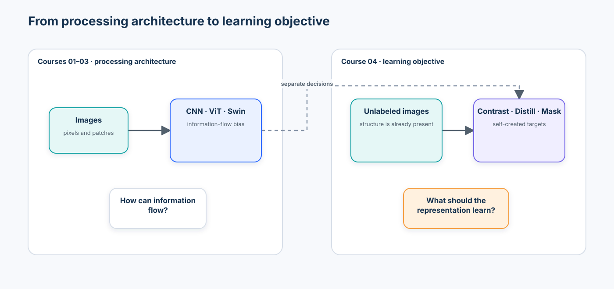
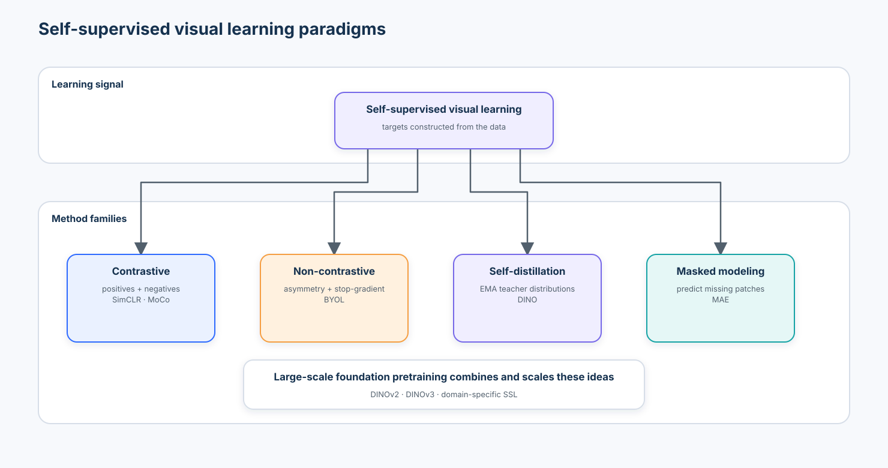
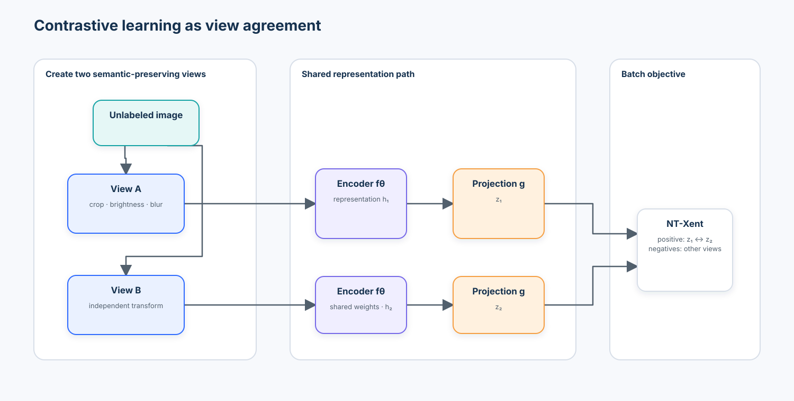
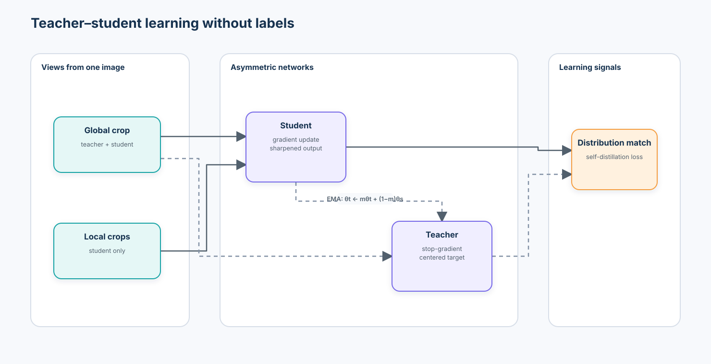
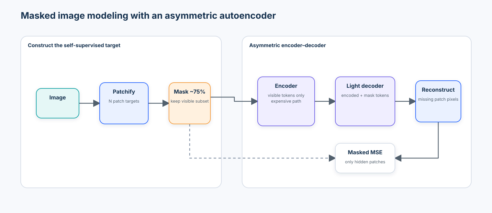
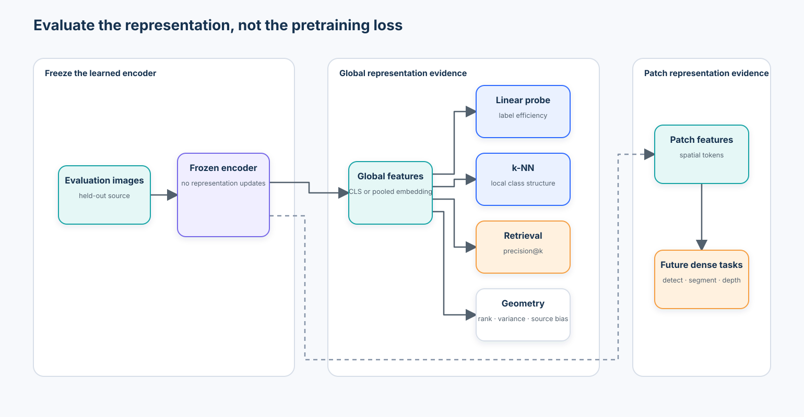

# Course 04 — Self-Supervised Visual Representation Learning

> From contrastive learning to DINO and masked image modeling

The central question is:

> How can a model learn useful visual representations without requiring a human label for every image?

Courses 01–03 asked how a vision model should process information through convolution, hierarchy, patches, and attention. Course 04 changes the axis of design. Architecture determines how information **can** flow; the learning objective determines what the representation is encouraged to preserve, ignore, separate, and reconstruct.



```text
Courses 01–03                         Course 04

How should a model                    How should a model
PROCESS visual information?           LEARN useful representations?

CNN · ViT · Swin          →           contrast · distill · mask
```

This is not a catalogue of SimCLR, MoCo, BYOL, DINO, MAE, and DINOv2. It is a study of learning paradigms. Representative systems make the mechanics concrete; the decision unit remains the objective, data, invariance policy, evaluation protocol, compute budget, and downstream task.

## Course status

| Attribute | Value |
| --- | --- |
| Level | Beginner |
| Format | Technical chapter + one self-contained notebook + checkpoint |
| Estimated time | 9–12 hours |
| Runtime | CPU-safe bounded default; CUDA and Apple Silicon acceleration when available |
| Tested stack | Python 3.13, PyTorch 2.13, torchvision 0.28, scikit-learn 1.9 |
| Research/tooling review | 2026-09-01; primary papers, model cards, and official SDK documentation |
| Data | Deterministic procedural industrial-inspection corpus generated in the notebook |
| External services | None in the default path; no credentials or hidden local module |
| Foundation-model extension | Optional official DINOv2 `torch.hub` path, disabled during credential-free validation |

## Learning outcomes

By the end, you should be able to:

1. explain why human labels are a scalability bottleneck;
2. define self-supervised learning precisely;
3. distinguish supervised, semi-supervised, weakly supervised, unsupervised, and self-supervised learning;
4. distinguish pretext-task success from reusable-representation quality;
5. explain invariance and equivariance;
6. identify positive and negative pairs;
7. derive and implement InfoNCE/NT-Xent;
8. explain how temperature changes the similarity distribution;
9. diagnose representation collapse quantitatively;
10. treat augmentation as part of the learning objective;
11. explain SimCLR through encoder, projection head, views, and in-batch negatives;
12. explain why MoCo introduced a momentum encoder and queue;
13. explain why explicit negatives are not always required;
14. describe BYOL-style online and target networks without claiming one universal collapse explanation;
15. implement an exponential-moving-average teacher update;
16. explain self-distillation, centering, sharpening, and multi-crop training in DINO;
17. explain why DINO attention maps are not segmentation ground truth;
18. describe DINOv2 as a general-purpose frozen-feature case study;
19. place DINOv3 in the 2026 foundation-backbone landscape without reproducing its training claims locally;
20. explain masked image modeling and MAE's asymmetric encoder–decoder;
21. compare contrastive, teacher–student, and reconstruction-style objectives;
22. distinguish global from patch-level features;
23. evaluate frozen features with a linear probe;
24. evaluate local geometry with k-nearest neighbours;
25. measure retrieval precision rather than inspect only attractive neighbours;
26. use clustering and two-dimensional projections cautiously;
27. build label-efficiency curves at 1%, 5%, 10%, 25%, and 100%;
28. compare random, supervised ImageNet, and domain-SSL representations under one protocol;
29. separate class structure from camera/source structure;
30. explain how SSL enables vision foundation models;
31. select an SSL approach based on domain gap, data, compute, privacy, and downstream tasks;
32. define production evidence, lineage, and monitoring requirements; and
33. explain what evidence would justify domain-specific SSL rather than reusing a pretrained encoder.

## Prerequisites, success criteria, and boundaries

Complete [Course 03 — Vision Transformers](../03-vision-transformers/) or be comfortable with embeddings, cosine similarity, frozen encoders, train/test splits, augmentation, CNNs, ViTs, linear probes, and source shift.

The course succeeds when you can implement the core objective, inspect its matrices, measure collapse, evaluate features independently from pretraining loss, identify an invalid invariance, and produce a bounded representation decision. It does **not** reproduce foundation-scale training, certify a factory model, benchmark DINOv2/DINOv3, or imply that unlabeled data is ungoverned data.

The lab represents a 100,000-image archive with a small deterministic proxy so every default cell runs without credentials. Its measured values teach the protocol; they are not production or published benchmark results.

## 1. What is self-supervised learning?

| Paradigm | Human labels | Training signal |
| --- | ---: | --- |
| Supervised | Required | Ground-truth label |
| Semi-supervised | Some | Labels plus unlabeled data |
| Weakly supervised | Imperfect or coarse | Tags, boxes, reports, heuristics, or noisy metadata |
| Unsupervised | None | Structure in the observed data |
| Self-supervised | None manually required for pretraining | Targets or relationships constructed from the data itself |

Self-supervised learning (SSL) is usually placed inside unsupervised representation learning, but its mechanism is specific:

> The data provides its own supervisory signal.

Two transformed views of one image can define a positive relationship. Masked patches can become prediction targets. A slowly moving teacher can supply a distribution for a student. Labels may still be used later to evaluate, probe, fine-tune, or govern the learned representation. “Self-supervised” does not mean “no labels anywhere in the lifecycle.”

```text
Images → human annotation → labels → supervised objective → representation

Images → structure already in data → self-supervised objective → representation
                                                     ↘ many downstream tasks
```

## 2. Enterprise motivation: labels are scarce, images are not

A manufacturer may retain 20 million inspection images but only 40,000 adjudicated defects. A retailer may hold hundreds of millions of product images with incomplete categories. Medical archives may contain millions of scans whose labels require specialist time. Satellite systems collect continuously while reliable event labels remain sparse.

```text
Unlabeled governed domain corpus
              ↓
Self-supervised pretraining
              ↓
Reusable domain representation
       ↙             ↓             ↘
classification    detection      retrieval
```

The value proposition is not “labels are obsolete.” SSL can reduce how many labels are needed, make unlabeled history useful, and create one encoder for several tasks. Labels remain necessary for task definition, safety evidence, failure analysis, and many release decisions.

Unlabeled corpora still require provenance, permission, retention rules, privacy review, duplicate control, site/time documentation, and contamination analysis. The absence of a class label does not remove legal or ethical obligations.

## 3. Representations are task-dependent objects

For an encoder

$$
\mathbf{h}=f_\theta(\mathbf{x}),
$$

the goal is not merely to make $\mathbf{h}$ useful for one known label. A reusable representation may need semantic structure, discrimination, transferability, robustness, useful geometry, locality, and calibrated sensitivity to small evidence.

There is no universally good representation. A global embedding that retrieves product identity may discard a hairline defect. A patch feature that preserves location may be less convenient for catalogue-level retrieval. Representation quality is conditional on downstream tasks and operating conditions.

### Pretext task versus representation objective

A pretext task is the executable training problem—match views, predict a teacher distribution, or reconstruct masked pixels. The representation objective is the structure we hope this task induces. Low pretext loss is not proof of transfer. Evaluation must freeze or adapt the encoder and test the target behavior separately.

## 4. Invariance, equivariance, and the augmentation contract

Let $\mathbf{x}'=t(\mathbf{x})$ for transformation $t$. An invariant representation seeks

$$
f_\theta(t(\mathbf{x}))\approx f_\theta(\mathbf{x}).
$$

An equivariant representation instead seeks a predictable transformed output:

$$
f_\theta(t(\mathbf{x}))\approx t'(f_\theta(\mathbf{x})).
$$

Invariance is useful when the transformation changes nuisance factors. Equivariance is critical when spatial change must remain visible for detection, segmentation, pose, depth, or correspondence.

Every augmentation states what the model should ignore. That makes augmentation part of the objective, not generic decoration.

| Transformation | Component identity | Defect identity | Risk |
| --- | --- | --- | --- |
| Small crop/translation | Usually preserved | May remove a tiny defect | Check retained evidence |
| Mild brightness | Often preserved | Can hide low-contrast damage | Bound the intensity range |
| Blur | Often preserved | Can erase scratches | Validate by defect size |
| Horizontal flip | Depends on part symmetry | May preserve texture damage | Reject for orientation-coded parts |
| Strong colour jitter/grayscale | May preserve geometry | Can destroy contamination colour | Domain-invalid when colour is causal |

The notebook trains the same tiny contrastive architecture with weak, domain-valid, and domain-invalid policies. The comparison is deliberately controlled so augmentation semantics—not a different encoder—explain the change.

## 5. A paradigm map, not a method catalogue



| Paradigm | Self-created signal | Representative systems | Structural risk |
| --- | --- | --- | --- |
| Instance discrimination / contrastive | Pull two views together; compare against other instances | SimCLR, MoCo | False negatives, augmentation mistakes, batch/dictionary dependence |
| Non-contrastive | Predict a stop-gradient target for another view | BYOL | Collapse prevention depends on interacting asymmetries and optimization |
| Teacher–student self-distillation | Match student and slowly updated teacher distributions | DINO | Sharpening/centering stability, teacher lag, multi-crop cost |
| Masked image modeling | Predict hidden visual content | MAE | Pixel reconstruction may emphasize nuisance detail |
| Foundation pretraining | Scale and combine strong objectives, data curation, and distillation | DINOv2, DINOv3 | Data lineage, compute, access, license, domain transfer, evaluation breadth |

## 6. Instance discrimination and contrastive geometry



```text
Image A ─ augmentation 1 → A₁ ┐
                               ├ positive pair: pull together
Image A ─ augmentation 2 → A₂ ┘

Image B and other images       → negatives: keep distinguishable
```

After $L_2$ normalization, cosine similarity is a dot product:

$$
\operatorname{sim}(\mathbf{z}_i,\mathbf{z}_j)
=\frac{\mathbf{z}_i^\mathsf{T}\mathbf{z}_j}
{\lVert\mathbf{z}_i\rVert_2\lVert\mathbf{z}_j\rVert_2}.
$$

For positive pair $(i,j)$, an InfoNCE/NT-Xent term is

$$
\mathcal{L}_i=-\log
\frac{\exp(\operatorname{sim}(\mathbf{z}_i,\mathbf{z}_j)/\tau)}
{\sum_{k\ne i}\exp(\operatorname{sim}(\mathbf{z}_i,\mathbf{z}_k)/\tau)}.
$$

The numerator rewards the positive. The denominator includes the positive and all eligible negatives. Self-similarity is masked out. The symmetric batch loss treats both views as anchors.

The notebook prints and asserts every stage:

```text
2B × D embeddings
      ↓ normalize
2B × 2B cosine matrix
      ↓ mask diagonal and divide by τ
positive index for each row
      ↓ row-wise cross entropy
symmetric NT-Xent loss
```

### Temperature is geometry, not decoration

Small $\tau$ sharpens the softmax and magnifies similarity differences; large $\tau$ produces a softer distribution. This changes gradients and the pressure placed on hard negatives. The lab plots probabilities for $\tau\in\{0.05,0.1,0.5,1.0\}$ rather than treating temperature as a magic constant.

### SimCLR as the main case study

SimCLR combines strong two-view augmentation, a shared encoder $f$, a projection head $g$, and in-batch negatives. The loss is applied to $\mathbf{z}=g(f(\mathbf{x}))$, while downstream tasks typically use the pre-projection representation $\mathbf{h}=f(\mathbf{x})$. The projection head lets the training objective shape a dedicated space without requiring the reusable feature to satisfy every contrastive constraint directly.

Larger batches provide more in-batch negatives, but also increase memory and can raise false-negative risk when semantically similar instances are treated as different. Batch size, data diversity, temperature, and augmentation policy are coupled choices.

### MoCo and the historical negative-dictionary problem

MoCo decoupled the number of negatives from the current batch:

```text
query encoder → query
                    ↘ contrast against a queue
momentum key encoder → keys → FIFO dictionary
```

The key encoder changes slowly, making queued representations more consistent even though they were produced in earlier steps. This is a design response to expensive large batches—not a universal reason to add a queue to modern systems.

## 7. Collapse: when every image becomes the same point

If every input maps to one vector, pair agreement can become trivial under a poorly constrained objective. Useful diagnostics include:

- feature-wise standard deviation;
- covariance and off-diagonal covariance;
- singular-value spectrum;
- mean pairwise cosine similarity;
- effective rank; and
- downstream probe and retrieval behavior.

For singular values $s_i$, define normalized squared energy $p_i=s_i^2/\sum_j s_j^2$ and entropy-based effective rank

$$
r_{eff}=\exp\left(-\sum_i p_i\log p_i\right).
$$

The top singular value ratio $p_1$ reports how much centered feature energy is concentrated in one direction. No single threshold proves collapse for every feature dimension or batch. The notebook prints one explicit table with embedding variance, mean cosine similarity, effective rank, top singular value ratio, class separation, and source separation. It compares a healthy isotropic toy, a low-variance near-collapsed rank-one toy, an exactly collapsed toy, random features, and every learned representation.

## 8. Non-contrastive and teacher–student learning

Are explicit negatives necessary? BYOL demonstrated an influential alternative:

```text
View A → online encoder → projector → predictor ┐
                                                ├ match
View B → target encoder → projector ─ stop-grad ┘
```

The target parameters are an exponential moving average (EMA) of the student/online parameters:

$$
\theta_t\leftarrow m\theta_t+(1-m)\theta_s.
$$

The teacher changes more slowly than the student. The stop-gradient prevents both branches from receiving the same direct update. A predictor adds architectural asymmetry. Batch normalization, optimization dynamics, augmentation, weight decay, target momentum, and architecture interact with collapse avoidance; the course does not reduce BYOL to one simplistic explanation.

## 9. DINO and self-distillation



DINO uses a student and EMA teacher with no human semantic label. The teacher sees global crops; the student sees global and local crops. Their output distributions are matched across different views.

- **Multi-crop** teaches agreement between large-context and local views.
- **Centering** subtracts a running teacher-output center to reduce domination by a few dimensions.
- **Sharpening** uses a low teacher temperature to create focused targets.
- **EMA teacher** stabilizes targets by changing more slowly than the student.
- **Stop-gradient** treats the teacher distribution as a target for the current step.

The notebook first makes centering, temperature, entropy, and EMA lag numeric with a small deterministic example. It then trains a compact teacher–student objective with the same tiny encoder, unlabeled corpus, view policy, and epoch budget used by the contrastive comparison. This is a controlled teaching analogue, not a reproduction of DINO training.

The original DINO study found strong nearest-neighbour and linear-probe behavior and observed spatial structure in self-supervised ViT attention. An attention map is still a model-internal interaction diagnostic—not a segmentation label, causal explanation, or release artifact.

## 10. From DINO to reusable foundation features

DINOv2 is the modern general-purpose representation case study requested for this course. It scaled curated unlabeled data, self-distillation, masked patch prediction, regularization, and model distillation to produce global and patch features reusable across classification, retrieval, depth, segmentation, and matching. The important operational pattern is:

```text
large curated image corpus → self-supervised pretraining → frozen backbone
                                                     ↙ global features
                                                     ↘ patch features
```

The official DINOv2 model card describes DINO self-distillation, iBOT-style masked-image modeling, and KoLeo regularization in its training objective. The notebook contains an optional official `torch.hub` extension for `dinov2_vits14`; it pins the official repository to commit `7764ea0f912e53c92e82eb78a2a1631e92725fc8` and remains disabled by default because source checkout, checkpoint download, memory, network availability, and remote-code trust do not belong in credential-free CI. Pinning source does not pin checkpoint bytes: a production record must also capture the resolved weight URL, digest, model card, preprocessing, and approval evidence.

### 2026 radar: DINOv3

DINOv3, released by Meta in 2025, is the current scaled self-supervised backbone case study in this curriculum's 2026 radar. Its report emphasizes large-scale data/model training, dense-feature quality, Gram anchoring to limit dense-feature degradation during long training, and post-training flexibility. These are author-reported foundation-scale results, not locally reproduced evidence. Before production use, review the current model license, access path, data statement, preprocessing, hardware, exportability, and exact downstream protocol.

The evolution is more useful than a leaderboard:

```text
DINO        → self-distillation and emergent ViT structure
DINOv2      → curated scale and reusable global/patch features
DINOv3      → larger scale, dense-feature stability, post-training flexibility
domain SSL  → narrower corpus, owned assumptions, task-specific evidence
```

## 11. Masked image modeling and MAE



Masked image modeling constructs targets by hiding part of the input. MAE uses a high masking ratio, sends only visible patches through the expensive encoder, inserts mask tokens for a lightweight decoder, and computes reconstruction loss on hidden patches.

If $M$ is the set of masked patches, a simplified objective is

$$
\mathcal{L}_{MAE}=\frac{1}{|M|}\sum_{i\in M}
\lVert\hat{\mathbf{x}}_i-\mathbf{x}_i\rVert_2^2.
$$

The asymmetry matters: masking 75% means the encoder processes only 25% of image tokens, while the inexpensive decoder handles reconstruction. Pixel reconstruction and semantic representation learning are not identical goals. Useful semantics can emerge, but a low pixel MSE can also reward texture or colour details irrelevant to downstream decisions.

The lab implements patchify/unpatchify, deterministic masking, a small visible-token encoder and decoder, masked-only loss, and reconstruction visualization. It also trains a masked-reconstruction path around the same tiny CNN encoder used by the contrastive and teacher–student comparison. These are primitive demonstrations, not a full transformer MAE reproduction.

## 12. Compare paradigms by signal and failure mode

| Paradigm | Main signal | Explicit negatives | Strength | Main challenge |
| --- | --- | ---: | --- | --- |
| SimCLR-style | Augmentation agreement | Yes | Direct semantic invariance pressure | Batch/negative scale and false negatives |
| MoCo-style | Contrast against queued keys | Yes | Large consistent dictionary without huge batch | Momentum and queue machinery |
| BYOL-style | Online-target prediction | No | No explicit negative set | Collapse dynamics are interaction-dependent |
| DINO-style | Centered/sharpened teacher distribution | No | Strong global and spatial features | Stable multi-crop teacher–student training |
| MAE-style | Masked reconstruction | No | Scalable visible-token encoder | Reconstruction signal may not match semantics |

There is no universal winner. Contrastive objectives are attractive when valid view relationships are clear. Teacher–student objectives avoid explicit negative engineering but add target dynamics. Masked modeling scales well with ViTs and preserves local content, but the pretext target may be misaligned with the downstream task. Hybrid foundation systems combine signals because the trade-offs remain real. The notebook holds one tiny encoder and corpus fixed across the three objective families, then compares their downstream geometry. Their raw losses are intentionally **not** compared numerically because NT-Xent, normalized prediction loss, and pixel MSE have different units and scales.

## 13. Representation evaluation



SSL loss answers “did this objective become easier?” Downstream evaluation asks “is the representation useful?”

### Linear probe

Freeze the encoder and train one linear classifier on embeddings. A controlled probe fixes preprocessing, split, feature normalization, classifier, regularization search, and label budget. It tests linear accessibility, not every possible fine-tuning result.

### k-nearest neighbours

Normalize embeddings, find nearest labelled training points, and vote. k-NN exposes local geometry without fitting a deep head. Its result depends on $k$, distance, weighting, class balance, and reference-set coverage.

### Retrieval

Rank a held-out gallery for each query and report precision@k or recall@k. Attractive examples are not a metric. Exclude self-matches and duplicates, define relevance, inspect source shortcuts, and report failure queries.

### Clustering and projections

Adjusted Rand index, normalized mutual information, silhouette score, covariance, and PCA can describe geometry. They do not prove semantic usefulness. A two-dimensional PCA or UMAP plot discards information and can create visually persuasive separation. Always reconnect geometry to a downstream metric and source slices.

### Label-efficiency curves

Evaluate at 1%, 5%, 10%, 25%, and 100% labelled data, recording actual per-class counts. Compare representations under the same stratified subset. Repeat each sampling budget across several seeds: one unusually easy or hard subset can distort a curve, especially at 1% and 5%. The notebook uses five stratified subset seeds and reports the raw runs plus mean ± standard deviation. This measures subset sensitivity in the bounded experiment; it is not a complete deployment confidence interval. The important question is:

> How much labelled data does each representation require to reach useful performance?

The lab compares a random tiny encoder, official ImageNet-supervised ResNet-18 features, contrastive, teacher–student, and masked-reconstruction features. It also reports weak and domain-invalid augmentation variants. Local results are not claims about the original papers.

## 14. Global versus patch features

```text
Global representation                  Patch representations

CLS / pooled embedding                 token₁ token₂ … tokenₙ
        ↓                                      ↓
classification · retrieval             correspondence · localization
                                       detection · segmentation · depth
```

A global feature aggregates the image and is convenient for instance-level decisions. Patch features retain a spatial grid and enable dense transfer. Pooling patch tokens can recover a global representation; the reverse operation cannot reconstruct discarded location.

The notebook evaluates these contracts separately. Global quality uses held-out linear probing and retrieval. Patch quality uses nearest-patch correspondence after a known horizontal flip: a patch at $(r,c)$ should match $(r,W-1-c)$ in the flipped feature grid. Top-1, top-5, and mean reciprocal rank make local matching executable. This is a bounded equivariance test—not a detection, segmentation, or semantic correspondence benchmark—but it demonstrates why a good classification embedding and a good dense feature are not interchangeable. The distinction bridges directly to Course 05 detection, Course 06 segmentation, and later vision-foundation-model lessons.

## 15. Tooling review

| Tool | Best fit | What it makes easier | What it can hide / constrain |
| --- | --- | --- | --- |
| PyTorch + torchvision | Primitive implementation and controlled CPU lab | Autograd, transforms, official ImageNet weights, transparent modules | Augmentation semantics and evaluation protocol remain your responsibility |
| Official DINO/DINOv2 repositories | Research reproduction and official weights | Author implementations and checkpoint formats | Versioned source trust, Linux/xFormers assumptions, download and export complexity |
| Hugging Face Transformers | Stable model/processor-style inference | DINOv2 API, hidden states, Hub model cards | Processor defaults, checkpoint licenses, remote artifacts, rapidly evolving APIs |
| `timm` | Broad encoder and training research | Consistent model creation and many pretrained weights | Model name, recipe, license, and preprocessing must be pinned |
| lightly / solo-learn | SSL research and training recipes | Packaged losses, heads, memory banks, distributed training | Framework abstraction can hide matrix contracts and recipe coupling |
| FAISS | Large-scale nearest-neighbour and retrieval systems | Approximate search, GPU indexes, billion-scale patterns | Index approximation, filtering, updates, tenant isolation, and recall measurement |
| FiftyOne | Dataset, embedding, and failure-slice inspection | Visual similarity, sample views, annotation integration | UI inspection is not a substitute for portable metrics and lineage |
| MLflow / Weights & Biases | Distributed experiment lineage | Runs, artifacts, sweeps, collaboration | Service cost, privacy, identity, retention, and vendor dependency |

The notebook deliberately uses common `torch`, `torchvision`, NumPy, pandas, scikit-learn, Pillow, and Matplotlib APIs. It teaches NT-Xent, EMA, masking, probing, retrieval, and collapse diagnostics before pointing to packaged SSL frameworks.

## 16. Enterprise SSL decision framework

```text
Large governed unlabeled corpus
              ↓
Is an existing pretrained representation sufficient?
        ↙ yes                           no ↘
reuse + probe + monitor        domain SSL experiment
                                      ↓
                         does label efficiency, transfer,
                         robustness, and cost improve?
```

Evaluate:

- corpus volume, diversity, duplication, provenance, consent, and privacy;
- domain gap from public pretraining data;
- global versus dense downstream requirements;
- annotation cost and required label efficiency;
- training compute, energy, team expertise, and refresh frequency;
- preprocessing and augmentation validity by task;
- feature versioning, index invalidation, and backward compatibility;
- source, site, time, demographic, device, and rare-event slices;
- checkpoint and code license, supply chain, and remote-code policy;
- frozen, adapter, probe, and fine-tuning alternatives; and
- monitoring, rollback, audit, retention, deletion, and incident response.

Domain SSL is justified by measured improvement under a written contract—not merely by owning many images. Start with a strong frozen public encoder. Add a simple probe and retrieval baseline. Only then spend domain compute when the gap, privacy boundary, dense task, or label-efficiency evidence warrants it.

The notebook’s final decision artifact compares four actions: reuse a supervised ImageNet encoder, benchmark/reuse pinned DINOv2, run domain SSL pretraining, or collect more labels. Every option records current evidence, domain gap, label budget, compute cost, privacy/governance, downstream-task diversity, expected reuse horizon, next evidence gate, and status. This makes “train SSL” one economic and governance choice among alternatives—not the automatic conclusion of an SSL course.

## 17. Practical lab — learning visual representations without labels

Scenario: an industrial organization has more than 100,000 historical inspection images but only a small labelled subset. It wants one governed domain encoder for classification, retrieval, and future dense tasks.

The notebook uses a bounded procedural proxy and follows this sequence:

1. declare success criteria, risk boundaries, seed, device, and offline behavior;
2. generate source-aware unlabeled images while keeping labels hidden from SSL training;
3. inspect weak, valid, and invalid augmentation pairs;
4. implement NT-Xent manually and verify it against an explicit log-sum-exp form;
5. visualize the temperature experiment;
6. train a tiny SimCLR encoder under three augmentation policies;
7. demonstrate EMA teacher lag, stop-gradient targets, centering, and sharpening;
8. train contrastive, teacher–student, and masked-reconstruction objectives with one tiny encoder and corpus;
9. extract random, ImageNet-supervised, and SSL features;
10. show that the lowest comparable NT-Xent loss does not produce the best downstream probe;
11. print an explicit healthy/near-collapsed/collapsed diagnostic table with semantic and source separation;
12. run linear probes, k-NN, retrieval, PCA, and source-aware evaluation;
13. repeat every label budget across five stratified seeds and plot mean ± variability;
14. compare pooled global quality with executable nearest-patch flip correspondence;
15. inject an augmentation failure and evaluate the mitigation;
16. optionally load official DINOv2 weights from pinned source when explicitly enabled; and
17. save the raw evidence tables, enterprise option matrix, and decision JSON.

Run locally:

```bash
python -m pip install -r curriculum/beginner/04-self-supervised-visual-representation-learning/requirements.txt
jupyter lab curriculum/beginner/04-self-supervised-visual-representation-learning/lab.ipynb
```

The optional DINOv2 section is enabled with `CV_ENABLE_DINOV2=1`. Review the pinned source and downloaded weights before use; it is intentionally skipped by default. Successful execution writes CSV artifacts for objective history, pretext-versus-transfer evidence, collapse, class/source separation, label-efficiency runs and summaries, patch correspondence, representation evaluation, and enterprise options, plus `enterprise_representation_decision.json`.

## 18. Failure modes and mitigations

| Failure | Observable signal | Mitigation |
| --- | --- | --- |
| Domain-invalid augmentation | Good SSL loss but weak colour-sensitive probe/recall | Rewrite invariance contract; slice by affected evidence |
| Crop removes small defect | Positive pair no longer shares semantics | Minimum retained area; defect-aware crop audit |
| Representation collapse | Low variance/effective rank; high pairwise cosine | Check asymmetry, negatives, target temperature, normalization, optimizer, and data |
| False negatives | Similar items pushed apart | Larger/diverse data, multi-positive semantics, queue policy, or non-contrastive objective |
| Camera/source shortcut | Source separation exceeds class separation | Source-held-out split, background randomization, site-balanced sampling |
| Duplicate leakage | Inflated retrieval and probe metrics | Perceptual duplicate grouping before split and gallery construction |
| Reconstruction shortcut | Low MSE but poor semantic transfer | Probe downstream tasks; change target/normalization/masking policy |
| Foundation feature mismatch | Strong public benchmark, weak domain slices | Compare public features with domain SSL under one controlled protocol |
| Stale embedding index | New encoder compared with old gallery vectors | Version features and rebuild indexes atomically |
| Untracked upstream artifact | Irreproducible or legally risky deployment | Pin code/checkpoint hashes, model cards, licenses, and preprocessing |

## What you should now be able to explain without code

1. Why is self-supervised learning more specific than simply “training without labels”?
2. Why is architecture a different decision from pretraining objective?
3. Why does augmentation define invariance?
4. When is equivariance more useful than invariance?
5. What occupies every row and column of the NT-Xent similarity matrix?
6. Why does temperature change optimization geometry?
7. Why is the SimCLR projection head not usually the downstream representation?
8. What problem did MoCo's queue and momentum encoder address?
9. What does representation collapse look like in variance, cosine similarity, and effective rank?
10. Why is “BYOL avoids collapse because of X” usually too simplistic?
11. Why does an EMA teacher change more slowly than a student?
12. How do centering and sharpening affect DINO teacher targets?
13. Why are DINO attention maps not segmentation ground truth?
14. Why can MAE reconstruct pixels without learning the best task semantics?
15. Why is low SSL loss insufficient evidence of representation quality?
16. What different questions do linear probing, k-NN, retrieval, and clustering answer?
17. Why can a 2D PCA plot mislead?
18. Why should label-efficiency plots report actual per-class counts?
19. Why can patch features support tasks that a pooled embedding cannot?
20. When is domain-specific SSL worth its compute and governance cost?

## Exercises

1. **Implementation:** extend NT-Xent to support more than two views per image and write shape assertions.
2. **Diagnosis:** create a synthetic collapse failure, then compare variance, covariance, singular values, cosine similarity, and probe quality.
3. **Augmentation judgment:** write separate invariance contracts for component identity, contamination detection, and scratch localization.
4. **Evaluation:** add mean reciprocal rank and source-balanced retrieval precision.
5. **Architecture:** replace the tiny CNN encoder with a tiny ViT while keeping the objective and evaluation fixed.
6. **Teacher–student:** sweep EMA momentum and teacher temperature; plot teacher lag and target entropy.
7. **Masked modeling:** compare random, block, and defect-aware masks while holding the visible-token budget fixed.
8. **Enterprise design:** propose data lineage, deletion, model versioning, feature-index migration, and rollback contracts for a 20-million-image archive.

## Next course

[Course 05 — Object Detection](../README.md) uses learned global and spatial representations to localize multiple objects. The bridge is now explicit: SSL determines what structure the encoder learns; detection adds spatial prediction, matching, box geometry, and task-specific evaluation.

## Primary references

- Chen et al., [A Simple Framework for Contrastive Learning of Visual Representations](https://proceedings.mlr.press/v119/chen20j.html), ICML 2020.
- He et al., [Momentum Contrast for Unsupervised Visual Representation Learning](https://openaccess.thecvf.com/content_CVPR_2020/html/He_Momentum_Contrast_for_Unsupervised_Visual_Representation_Learning_CVPR_2020_paper.html), CVPR 2020.
- Oord, Li, and Vinyals, [Representation Learning with Contrastive Predictive Coding](https://arxiv.org/abs/1807.03748), 2018.
- Grill et al., [Bootstrap Your Own Latent](https://proceedings.neurips.cc/paper/2020/hash/f3ada80d5c4ee70142b17b8192b2958e-Abstract.html), NeurIPS 2020.
- Caron et al., [Emerging Properties in Self-Supervised Vision Transformers](https://openaccess.thecvf.com/content/ICCV2021/html/Caron_Emerging_Properties_in_Self-Supervised_Vision_Transformers_ICCV_2021_paper.html), ICCV 2021.
- He et al., [Masked Autoencoders Are Scalable Vision Learners](https://openaccess.thecvf.com/content/CVPR2022/html/He_Masked_Autoencoders_Are_Scalable_Vision_Learners_CVPR_2022_paper.html), CVPR 2022.
- Oquab et al., [DINOv2: Learning Robust Visual Features without Supervision](https://arxiv.org/abs/2304.07193), 2023.
- Meta AI, [DINOv2 model card](https://github.com/facebookresearch/dinov2/blob/main/MODEL_CARD.md) and [official implementation](https://github.com/facebookresearch/dinov2), accessed 2026-09-01.
- Siméoni et al., [DINOv3](https://ai.meta.com/research/publications/dinov3/), Meta AI, 2025.
- PyTorch, [`torch.nn.functional.cross_entropy`](https://docs.pytorch.org/docs/stable/generated/torch.nn.functional.cross_entropy.html), [`torch.no_grad`](https://docs.pytorch.org/docs/stable/generated/torch.no_grad.html), and [`torch.hub`](https://pytorch.org/docs/stable/hub.html).
- torchvision, [transforms v2](https://docs.pytorch.org/vision/stable/transforms.html) and [ResNet-18 weights](https://docs.pytorch.org/vision/stable/models/generated/torchvision.models.resnet18.html).
- Hugging Face, [DINOv2 model documentation](https://huggingface.co/docs/transformers/model_doc/dinov2).
