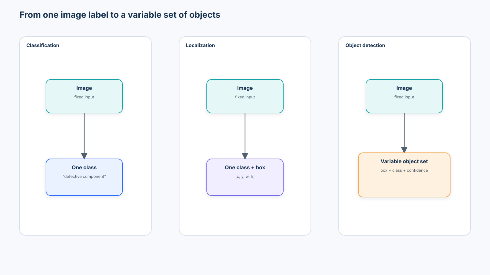
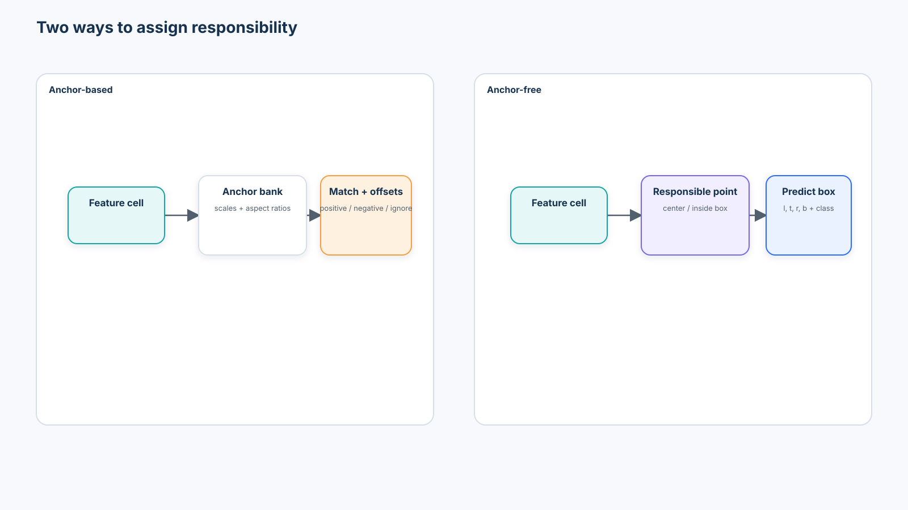
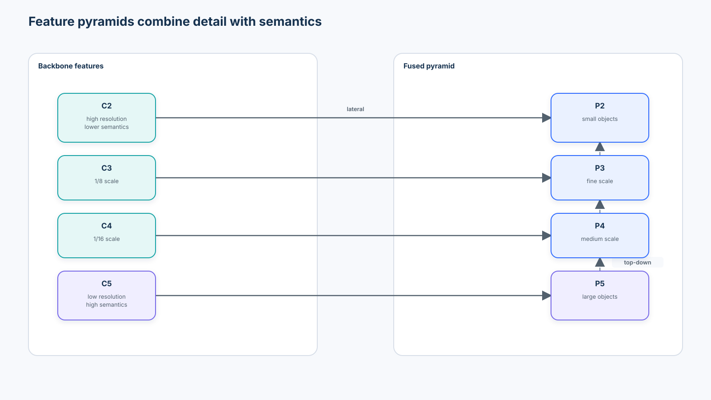
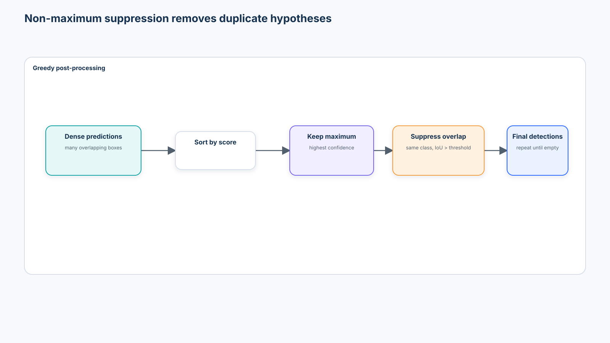
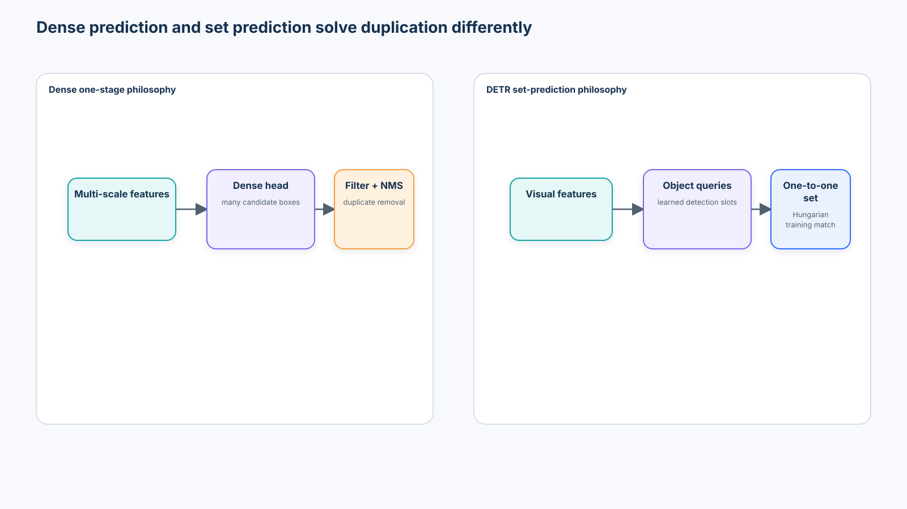
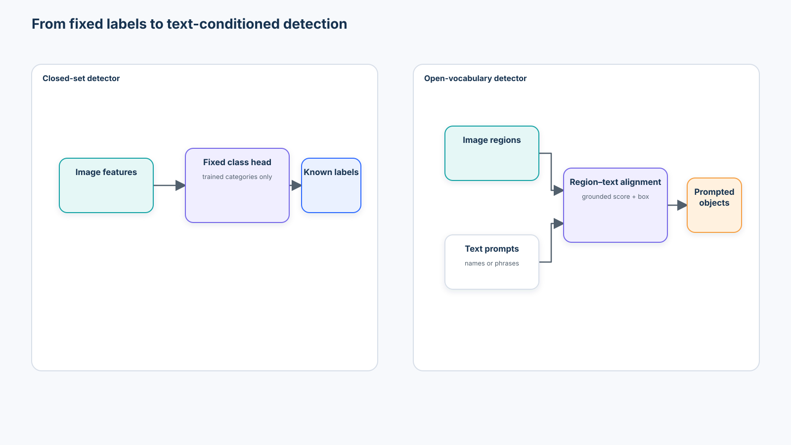

# Beginner 05 — Object Detection

> From localization and matching to YOLO, DETR, and open-vocabulary detection

**Level:** Beginner<br>
**Estimated time:** 10–12 hours<br>
**Primary artifact:** [`lab.ipynb`](lab.ipynb)
**Prerequisites:** [Course 01](../01-modern-computer-vision-foundations/README.md), [Course 02](../02-modern-cnn-architectures-efficient-vision/README.md), [Course 03](../03-vision-transformers/README.md), and [Course 04](../04-self-supervised-visual-representation-learning/README.md)

## 1. Central question

> How does a vision system move from saying **what is in an image** to determining **what objects exist, where they are, how confident it is, and which predictions refer to the same object?**



```text
Classification                 Localization                    Detection

image → one class              image → class + box             image → variable object set
                                                                  ├─ box + class + score
                                                                  ├─ box + class + score
                                                                  └─ ...
```

Detection introduces questions that classification does not solve:

- Where is each object?
- How many objects exist?
- Which category belongs to each box?
- Which prediction is responsible for which ground-truth object?
- Which overlapping predictions are duplicates?
- How should small and large objects share the model?
- What localization error is acceptable?

Object detection is therefore not classification repeated across an image. It is a variable-size structured prediction problem with geometry, assignment, imbalance, duplicate handling, and threshold-dependent evaluation.

## 2. Scenario, success criteria, and boundaries

An industrial assembly line captures trays that may contain multiple **housings**, **fasteners**, and **contamination regions**. Factories A and B supply development images. Factory C uses different lighting and surface texture and remains held out until evaluation. The detector will eventually support counting, routing, and human inspection—but the notebook never authorizes physical action.

The course succeeds when you can:

1. validate a box and annotation contract;
2. implement IoU, greedy matching, AP, anchor assignment, and class-aware NMS;
3. explain how one-stage, two-stage, and set-prediction detectors solve the same design problems differently;
4. train and inspect a tiny anchor-free dense detector;
5. evaluate confidence, duplicate, source, and object-size failure slices; and
6. produce a bounded detector-selection artifact that separates measured evidence from optional ecosystem claims.

This course does **not** reproduce COCO training, certify a safety system, compare proprietary services, establish a universal YOLO-versus-DETR winner, or teach segmentation yet. Course 06 extends boxes into pixel-level masks and promptable segmentation.

### Risk boundaries

- A missed fastener can be more costly than a false review alert; class-average AP does not encode that cost.
- Procedural data proves code paths, not deployment validity.
- Confidence is not calibrated probability by default.
- Camera, factory, shift, occlusion, and object-size slices must remain visible.
- Open-vocabulary prompts expand the output space but do not remove validation or unknown-object risk.

## 3. Learning objectives

By the end, you should be able to:

- distinguish classification, localization, detection, and segmentation;
- convert `xyxy`, center-based `xywh`, normalized, and pixel boxes safely;
- explain COCO, Pascal VOC, and YOLO annotation contracts;
- calculate and interpret IoU, including edge cases;
- determine detection TP/FP/FN assignments at a chosen class and IoU threshold;
- construct a precision–recall curve, AP, mAP, and multi-IoU evaluation;
- explain why object-size slices matter;
- compare one-stage and two-stage detectors;
- explain anchor matching, anchor design, and anchor-free responsibility;
- explain feature pyramids and multi-scale fusion;
- connect imbalance to focal loss and geometry to IoU-based losses;
- implement class-aware NMS and diagnose its failure modes;
- explain modern YOLO-style backbone–neck–head systems;
- explain DETR object queries, one-to-one Hungarian matching, and standard NMS-free inference;
- distinguish dense prediction from set prediction;
- perform source-aware, threshold-aware, and size-aware error analysis;
- explain detection calibration and end-to-end latency; and
- place Grounding DINO-style open-vocabulary detection in the wider curriculum.

## 4. The detection output contract

For prediction $i$,

$$
\hat{y}_i=(\hat{b}_i,\hat{c}_i,\hat{s}_i),
$$

where $\hat{b}_i$ is a box, $\hat{c}_i$ is a class, and $\hat{s}_i$ is a confidence score. An image produces a variable number of these tuples after decoding and post-processing.

Ground truth has a different contract:

$$
y_j=(b_j,c_j),
$$

usually with metadata such as `image_id`, object area, crowd/ignore flags, source, annotation provenance, and review status. Ground truth does not need a model confidence score.

The cardinalities differ:

```text
ground truth:  GT₁ GT₂ GT₃
predictions:   P₁ P₂ P₃ P₄ P₅ P₆ ...
```

Before computing a localization loss or a TP count, the system must answer:

> Which prediction should be compared with which object?

That assignment problem reappears in anchor matching, anchor-free responsibility, evaluation, and DETR's bipartite matching.

## 5. Bounding-box representations

### `xyxy`

$$
(x_{min},y_{min},x_{max},y_{max})
$$

This form is convenient for intersection, clipping, drawing, and many library operators.

### Center-based `xywh`

$$
(x_c,y_c,w,h)
$$

This form makes box center and scale explicit and is common in detector heads and YOLO-style annotation.

### Top-left COCO `xywh`

COCO JSON stores `(x_min, y_min, width, height)`, not center `xywh`. Both are often called `xywh`, so the semantic name must appear in the schema and conversion function.

### Normalized coordinates

Dividing horizontal coordinates and widths by image width and vertical coordinates and heights by image height maps values into `[0,1]` when boxes are valid and clipped. Normalization is useful for resolution-independent storage or model outputs, but only when the image size and convention travel with the data.

Common bugs include:

- swapping image width and height;
- treating normalized coordinates as pixels;
- confusing center `xywh` with top-left `xywh`;
- mixing inclusive and half-open endpoints;
- resizing an image without transforming boxes;
- augmenting pixels without updating annotations;
- retaining zero-area or out-of-frame boxes; and
- rounding before evaluation.

The notebook implements `xyxy_to_xywh`, `xywh_to_xyxy`, `normalize_boxes`, `denormalize_boxes`, clipping, validation, and round-trip assertions.

## 6. Annotation formats are interface contracts

| Format | Structure | Box convention | Strength | Frequent failure |
| --- | --- | --- | --- | --- |
| COCO | One JSON with images, annotations, and category IDs | top-left pixel `xywh` | Rich metadata and standard evaluation ecosystem | category/image ID mismatch; crowd flags ignored |
| Pascal VOC | One XML file per image | pixel `xyxy`-like fields | Readable and simple | endpoint convention and label-map drift |
| YOLO style | One text file per image | normalized center `class x y w h` | Compact and training-friendly | missing image dimensions; normalization mistakes |

Conversion should be a tested boundary, not scattered arithmetic inside training code. A production annotation manifest should also record schema version, taxonomy version, coordinate convention, image hash, source, annotator/reviewer, and transform history.

## 7. Intersection over Union

For boxes $A$ and $B$,

$$
IoU(A,B)=\frac{|A\cap B|}{|A\cup B|}.
$$

The intersection width and height must be clamped at zero. Edge-touching boxes have zero intersection area under the continuous/half-open convention used by modern tensor libraries.

IoU is central because it appears in four different system stages:

```text
IoU
├── training assignment
├── localization-loss families
├── duplicate suppression
└── evaluation matching
```

The notebook asserts perfect, partial, disjoint, contained, and edge-touching cases and verifies manual results against `torchvision.ops.box_iou`.

### What IoU cannot express

IoU is scale sensitive: a two-pixel error can devastate a tiny box and barely affect a large one. Non-overlapping boxes all have IoU zero even when one is almost correct and another is far away. IoU also says nothing about class, confidence, downstream cost, or annotation ambiguity.

## 8. Detection precision and recall

A prediction becomes a true positive only when:

```text
predicted class is correct
AND IoU ≥ evaluation threshold
AND that ground-truth object has not already been matched
```

Predictions are processed in descending confidence order. A duplicate that overlaps an already matched object becomes a false positive, even if its box is geometrically good.

$$
precision=\frac{TP}{TP+FP},\qquad
recall=\frac{TP}{TP+FN}.
$$

A higher confidence threshold usually returns fewer boxes, which can improve precision but reduce recall. A lower threshold usually exposes more true objects and more false positives. The threshold is part of the operating policy, not a cosmetic plotting choice.

## 9. Average Precision and mAP

For one class and IoU threshold:

```text
sort predictions by confidence
        ↓
greedily match TP / FP
        ↓
cumulative precision and recall
        ↓
interpolated precision envelope
        ↓
area under the PR curve = AP
```

Mean AP averages class AP values under a declared protocol. COCO's headline box metric averages AP across IoU thresholds `0.50:0.05:0.95`, classes, and its full evaluation rules. `AP50` is more tolerant of imprecise boxes; `AP75` and the multi-IoU average demand tighter localization.

The notebook implements a transparent pedagogical AP calculation. It is not a drop-in replacement for `pycocotools`: crowd regions, ignore flags, area ranges, maximum detections, interpolation details, and dataset-specific rules must use the official evaluator for benchmark reporting.

### Object-size evaluation

COCO reports small, medium, and large area ranges. On another image resolution or domain, silently reusing those pixel thresholds can be misleading. The notebook declares its own normalized size bands and records the rule in every artifact.

Small objects are difficult because they have fewer pixels, disappear during downsampling, produce weaker features, are sensitive to annotation error, and can be heavily occluded. This connects directly to Course 02's resolution experiments and Course 03's patch-size experiments.

## 10. Detection as eight design problems

| Problem | Question | Typical mechanisms |
| --- | --- | --- |
| Representation | How are candidate objects represented? | proposals, anchors, points, queries |
| Localization | How is geometry predicted? | offsets, distances, direct normalized boxes |
| Multi-scale perception | How do small and large objects remain visible? | FPN, PAN-style or bidirectional fusion |
| Assignment | Which prediction owns which target? | IoU thresholds, center rules, dynamic matching, Hungarian matching |
| Classification | What category is present? | fixed class head, region–text alignment |
| Duplicate handling | Which predictions refer to one object? | NMS, Soft-NMS, one-to-one objectives |
| Loss design | How are many objectives balanced? | focal/objectness, L1, IoU/GIoU/DIoU/CIoU |
| Evaluation | What counts as correct? | class + IoU + unique match + confidence ranking |

Architecture families are different bundles of answers to these problems.

## 11. From sliding windows to two-stage detectors

```text
sliding windows → region proposals → R-CNN → Fast R-CNN → Faster R-CNN
```

The decisive systems insight was shared computation. Instead of running a classifier independently on thousands of image crops, Faster R-CNN shares backbone features between the Region Proposal Network and per-region head:

```text
image → backbone → feature maps → proposals → ROI features → class + refined box
```

Two-stage detectors remain useful when mature proposal/ROI tooling, localization quality, flexible per-region processing, or long-tail customization matters. Their costs include proposal machinery, more complex training/inference, and often heavier latency.

Faster R-CNN is the representative architecture here. The course inspects the contract and maintained TorchVision API; it does not reimplement ROI Align or a full proposal network.

## 12. One-stage dense detection

One-stage systems predict over dense feature locations:

```text
image → backbone → multi-scale neck → detection head → dense candidates
```

SSD, RetinaNet, FCOS, and YOLO-style systems differ in assignment, head, losses, and post-processing, but they share the idea that candidate predictions are produced directly from feature maps without a separate learned region-proposal stage.

Historically this formulation emphasized throughput. Dense prediction also creates a severe imbalance: an image may contain tens of thousands of candidate locations but only a few objects.

## 13. Anchors and anchor-free responsibility



An anchor-based detector places several reference shapes at each feature location. Assignment uses overlap and ignore thresholds; the model predicts class/objectness and offsets from the selected anchor.

Anchors provide useful priors but introduce:

- dataset-specific scales and aspect ratios;
- many negative candidates;
- sensitivity to matching thresholds;
- overlapping responsibilities; and
- poor small-object coverage when the bank and feature stride are misaligned.

Anchor-free detectors instead assign a point or location—often an object center or a point inside the box—and predict coordinates or left/top/right/bottom distances. This removes anchor-bank hyperparameters but does not remove assignment design. Center sampling, feature level, dynamic matching, quality targets, and conflicts still matter.

The notebook measures anchor coverage on the same corpus and constructs an anchor-free grid target so this trade-off is visible rather than rhetorical.

## 14. Feature pyramids and multi-scale fusion



Deep features are semantically strong but spatially coarse. Shallow features retain detail but contain less context. Feature Pyramid Networks add lateral connections and a top-down pathway so each output scale combines both.

```text
detector = backbone + neck + head
```

- **Backbone:** extracts hierarchical visual features.
- **Neck:** fuses scales; FPN, PAN-style aggregation, and bidirectional pyramids are representative patterns.
- **Head:** predicts objectness/quality, class, and geometry at one or several scales.

Pyramids help small objects only if the input contains sufficient evidence, annotations are reliable, the stride is appropriate, and assignment actually sends small targets to fine features.

## 15. Loss design

### Imbalance and focal loss

For target-aligned probability $p_t$,

$$
FL(p_t)=-\alpha_t(1-p_t)^\gamma\log(p_t).
$$

The modulating factor downweights easy examples, allowing difficult positives and negatives to contribute relatively more. RetinaNet established focal loss as an influential response to dense foreground/background imbalance. It does not eliminate taxonomy imbalance or hard-negative sampling decisions.

### Box regression

- **Coordinate L1/Smooth L1:** direct and stable, but coordinate scale and parameterization matter.
- **IoU loss:** aligns optimization with overlap but has no gradient signal for disjoint boxes in its simplest form.
- **GIoU:** uses the smallest enclosing box to distinguish disjoint configurations.
- **DIoU:** adds center-distance pressure.
- **CIoU:** additionally considers aspect-ratio consistency.

No localization loss replaces evaluation. A training surrogate may improve optimization without improving every size/source slice or calibrated operating point.

## 16. Duplicate detections and NMS



Greedy class-aware NMS:

1. remove candidates below the confidence threshold;
2. process one class at a time;
3. sort by confidence;
4. keep the highest-scoring box;
5. suppress remaining boxes above the NMS IoU threshold; and
6. repeat.

NMS can remove a legitimate object in a crowded scene, retain duplicates below the overlap threshold, and change dramatically with score or IoU threshold. Class-agnostic NMS can suppress overlapping objects from different classes. Soft-NMS decays scores rather than deleting boxes, but adds its own policy and calibration behavior.

The notebook implements NMS manually, verifies it against `torchvision.ops.nms`, visualizes before/after boxes, and sweeps thresholds.

## 17. Modern YOLO-style detection

YOLO is best treated as a one-stage design philosophy, not one installation command:

```text
image
  ↓
backbone
  ↓
multi-scale neck
  ↓
decoupled / detection head
  ↓
dense class, quality, and box predictions
  ↓
filtering and duplicate policy
```

Modern families commonly use anchor-free heads, multi-scale outputs, IoU-family losses, export-oriented operations, and highly optimized training recipes. Model name alone does not specify preprocessing, assignment, checkpoint, license, NMS/end-to-end mode, export graph, quantization behavior, or target-hardware latency.

### 2026 ecosystem note

Ultralytics documents YOLO26, released in January 2026, as its current family and reports a native end-to-end/NMS-free path plus an open-vocabulary YOLOE-26 extension. These are publisher-reported claims until reproduced under the target protocol. The current Ultralytics package and trained models are offered under AGPL-3.0 or an enterprise license. Because that obligation may conflict with private enterprise use, `ultralytics` is **not** a default dependency in this MIT learning repository. The notebook shows a guarded, version-pinned adapter (`ultralytics==8.4.138`) only after the learner explicitly enables it and accepts the applicable license and checkpoint terms.

Classic NMS remains essential course material because many deployed dense detectors and export paths still use it, and even end-to-end models need duplicate/error analysis.

## 18. DETR: detection as set prediction



DETR reframed detection as direct set prediction:

```text
image → backbone → visual tokens → transformer → fixed object queries → set of class + box predictions
```

Object queries are learned detection slots. They are not text labels such as “person” or “car.” Each slot interacts with image features and predicts a class/box or `no object`.

### Hungarian matching

Given predictions $i$ and ground-truth objects $j$, construct a cost such as

$$
C_{ij}=\lambda_{cls}C^{cls}_{ij}
+\lambda_{L1}\lVert \hat b_i-b_j\rVert_1
+\lambda_{giou}C^{giou}_{ij}.
$$

The Hungarian algorithm finds the one-to-one minimum-cost assignment. Unmatched queries learn `no object`.

One-to-one training discourages multiple slots from claiming the same ground truth, which is why traditional NMS is absent from standard DETR inference. This is a property of the training formulation, not a guarantee that a model can never emit similar boxes.

The notebook builds and visualizes a real cost matrix with `scipy.optimize.linear_sum_assignment`.

### Limitations and evolution

Original DETR had slow convergence, weak small-object behavior, and expensive high-resolution attention. Deformable DETR sparsified multi-scale attention; DAB-DETR made box priors in queries more explicit; DN-DETR used denoising training; and DINO combined improved denoising and query/box ideas.

> **DINO detector is not DINO self-supervised learning.** Course 04's DINO learns visual representations without semantic labels. The detector acronym means DETR with Improved deNoising anchOr boxes.

RT-DETR and later real-time set-prediction systems narrow the historical speed gap. A 2026 decision should compare maintained implementations, exports, licenses, calibration, and target-device evidence—not repeat the 2020 speed narrative unchanged.

## 19. YOLO and DETR as design philosophies

| Decision | Dense YOLO-style path | DETR-style set path |
| --- | --- | --- |
| Candidate representation | dense feature locations/points | fixed learned object queries |
| Assignment | center/dynamic/quality rules, often one-to-many or mixed | global one-to-one Hungarian match |
| Multi-scale mechanism | backbone + pyramid neck + multi-scale heads | original global feature map; modern variants commonly add multi-scale/deformable features |
| Duplicate handling | traditionally NMS; some modern end-to-end heads avoid it | one-to-one objective; standard inference has no traditional NMS |
| Strength | mature real-time/export ecosystem | clean set objective and global matching |
| Watch | post-processing, assignment, license, export divergence | query behavior, convergence, small objects, implementation maturity |

Neither philosophy determines success alone. Dataset coverage, object scale, annotation quality, calibration, latency contract, software license, and operational integration often dominate small benchmark differences.

## 20. From closed-set to open-vocabulary detection



Closed-set detectors predict a taxonomy fixed during training. Open-vocabulary detectors align regions with text or multimodal representations so categories can be supplied at inference time.

Grounding DINO combines a DETR-like detector with grounded language–image pretraining and can localize objects described by category names or referring expressions. This changes the output contract:

- prompts and prompt templates become versioned inputs;
- synonyms, attributes, and phrase granularity affect scores;
- an open label space complicates calibration and false-positive analysis;
- text does not guarantee visual grounding; and
- prompt-conditioned results still require source, size, demographic, and safety evaluation.

Course 05 provides the bridge only. Course 09 treats open-vocabulary and foundation detectors in depth.

## 21. Tooling review

| Tool | Best fit | Strength | Constraint / governance question |
| --- | --- | --- | --- |
| PyTorch + torchvision | primitive teaching; Faster R-CNN, RetinaNet, FCOS, SSD references | transparent tensors, maintained weights API, box/NMS ops | detection APIs can evolve; pin preprocessing and weight enums |
| SciPy | Hungarian assignment | trusted `linear_sum_assignment` implementation | cost design and scaling remain yours |
| COCO API / `pycocotools` | benchmark-compatible COCO evaluation | crowd/ignore, area ranges, max detections, standard protocol | platform build complexity; not a generic business metric |
| TorchMetrics | batched metric integration | convenient mAP state and distributed aggregation | backend and exact protocol must be recorded |
| Hugging Face Transformers | DETR, RT-DETR, Grounding DINO model/processor APIs | common processor/model interface and model cards | network artifacts, revisions, preprocessing, license, and remote-code policy |
| Ultralytics | maintained YOLO26/YOLOE-26 training and export ecosystem | compact user-facing train/predict/export workflow | AGPL-3.0 or enterprise license; package/checkpoint/export versions must be pinned |
| Detectron2 | research and advanced region/detection systems | mature configurable detection abstractions | installation, custom ops, and deployment portability |
| MMDetection | broad research recipes and components | extensive architecture/config ecosystem | abstraction depth, dependency matrix, config lineage |
| CVAT / FiftyOne | annotation QA and visual error analysis | boxes, attributes, slices, similarity, review workflows | identity, storage, tenant, retention, and audit controls |

The executable path deliberately uses common PyTorch, torchvision, NumPy, pandas, Pillow, Matplotlib, and SciPy APIs. Optional SDK cells are isolated and disabled in credential-free validation.

## 22. Evaluation beyond one mAP number

Use an explicit loop:

```text
versioned dataset + split
        ↓
decode with recorded thresholds
        ↓
match predictions to ground truth
        ↓
AP / recall / duplicate / calibration / latency slices
        ↓
inspect failures
        ↓
change data, model, threshold, or workflow
```

### Required slices

- class and rare class;
- small, medium, and large objects;
- source, camera, factory, and time;
- occlusion, truncation, and crowding;
- confidence band and localization quality;
- per-image object count;
- pre- and post-NMS candidate count; and
- end-to-end latency including resize, decode, transfer, NMS, and serialization.

### Error taxonomy

| Error | Evidence | Likely next check |
| --- | --- | --- |
| classification | good overlap, wrong label | taxonomy ambiguity, class balance, context shortcut |
| localization | right class, insufficient IoU | annotation consistency, loss, resolution, stride |
| duplicate | several predictions match one object | NMS/one-to-one behavior, score quality |
| background FP | no suitable ground truth | hard negatives, leakage, threshold/calibration |
| missed object | unmatched ground truth | scale, occlusion, assignment, label coverage |
| source-specific failure | AP/recall gap by factory | capture process, normalization, spurious source cue |

### Calibration

A score of `0.9` is not automatically a 90% chance that class and localization are correct. Detection calibration depends on class, localization threshold, duplicate policy, object size, source, and selection after NMS. Useful diagnostics include reliability by confidence band, precision at the operating threshold, expected calibration error under a declared correctness rule, and localization-aware calibration. Calibrate on data separate from final evaluation.

## 23. Production decision framework

Choose a detector against the full contract:

- required classes, unknown-object policy, counts, and geometry;
- minimum object pixel size and capture resolution;
- annotation budget and QA process;
- recall/precision cost by class and source;
- real-time deadline, throughput, memory, power, and export runtime;
- NMS or end-to-end duplicate policy;
- checkpoint, source, dependency, and model license;
- data privacy, retention, worker/safety implications, and human review;
- monitoring for confidence, count, size, source, and latency drift; and
- rollback, shadow deployment, audit, and incident response.

The notebook's decision artifact compares:

1. a mature two-stage TorchVision baseline;
2. a dense YOLO-style/anchor-free path;
3. a DETR-style set-prediction path; and
4. an open-vocabulary extension.

Only the tiny anchor-free path is trained locally. All ecosystem alternatives remain evaluation gates until run under the same data, metric, latency, and governance contract.

## 24. Practical lab

The notebook follows one source-aware assembly-line scenario:

1. declare the output, annotation, split, seed, device, and artifact contracts;
2. implement and assert box conversions, clipping, validation, and annotation examples;
3. calculate IoU manually and verify against torchvision;
4. generate multi-object images across three factories and visualize boxes;
5. implement greedy detection matching, PR curves, AP, mAP, and size slices;
6. inspect anchor coverage and build anchor-free grid targets;
7. train a tiny anchor-free dense detector with objectness, class, and box losses;
8. decode candidates and implement class-aware NMS manually;
9. verify NMS against torchvision and sweep confidence/NMS thresholds;
10. inject source shift and small-object failures and measure mitigation trade-offs;
11. construct a DETR-style Hungarian matching matrix;
12. compare dense and set-prediction responsibilities;
13. inspect maintained TorchVision, Transformers, Ultralytics, and Grounding DINO adapters without enabling network downloads by default; and
14. save detections, evaluation tables, error slices, timing, and a governed decision artifact.

Run locally:

```bash
python -m pip install -r curriculum/beginner/05-object-detection/requirements.txt
jupyter lab curriculum/beginner/05-object-detection/lab.ipynb
```

Set `CV_FULL_RUN=1` only to use available accelerators and larger training budgets. Optional adapters require their own explicit environment flags and dependency/license review.

## 25. Failure modes and mitigations

| Failure | Signal | Mitigation experiment |
| --- | --- | --- |
| wrong coordinate convention | boxes shift or scale systematically | schema validation and round-trip fixtures |
| resize/augmentation mismatch | visual boxes no longer cover objects | joint image-target transforms and assertions |
| poor anchor coverage | low best-anchor IoU for a size/aspect slice | redesign anchors, add scale, or test anchor-free assignment |
| foreground imbalance | objectness dominated by easy background | focal loss, sampling, quality-aware assignment |
| small-object miss | low small-object recall/AP | resolution, fine feature level, capture, label QA |
| crowded-scene suppression | recall drops after NMS | threshold sweep, Soft-NMS, set/end-to-end alternative |
| duplicates | high pre/post candidate ratio and FP count | NMS/score tuning or one-to-one objective |
| source shortcut | held-out-factory AP gap | capture audit, targeted data, source-aware validation |
| uncalibrated confidence | confidence bands overstate precision | held-out calibration and bounded thresholds |
| benchmark/runtime mismatch | good AP but missed deadline | profile full decode path on exact export and hardware |
| open-vocabulary prompt drift | synonyms yield unstable boxes | version prompts, prompt ensembles, category-specific evaluation |

## 26. What you should now be able to explain without code

1. Why is object detection not classification repeated over locations?
2. Why is `xywh` ambiguous without saying center or top-left?
3. Why can a prediction with the correct class still be a false positive?
4. Why does AP50 hide some localization errors?
5. Why does the same pixel error affect a tiny box more than a large box?
6. Where does IoU appear during training, post-processing, and evaluation?
7. Why do anchors create both priors and hyperparameters?
8. What assignment choices remain in an anchor-free detector?
9. How does an FPN combine detail and semantics?
10. Why does focal loss help a dense detector without solving every imbalance?
11. When can NMS remove a real object?
12. Why are object queries not class-name prompts?
13. Why does one-to-one Hungarian training remove the need for traditional DETR NMS?
14. How is DINO detector different from Course 04's DINO representation learner?
15. Why is the highest-mAP model not automatically the best deployment choice?
16. What changes when detection becomes text conditioned?

## 27. Exercises

1. **Implementation:** add top-left COCO `xywh` conversion and property-based round-trip cases.
2. **Diagnosis:** create two overlapping same-class objects and find an NMS threshold that loses one; compare Soft-NMS.
3. **Evaluation:** add AP75 and plot which error categories grow between AP50 and AP75.
4. **Assignment:** change anchor scales, then measure best-anchor IoU by object-size band.
5. **Modeling:** add a second fine-scale detection head and measure small-object recall against latency.
6. **Set prediction:** change Hungarian cost weights and explain every assignment change.
7. **Calibration:** build confidence bins separately for small and large objects.
8. **Architecture:** write a detector recommendation for a crowded edge-camera scene and defend its duplicate, latency, and license strategy.
9. **Governance:** design an open-vocabulary prompt/version manifest and a false-grounding review policy.

## 28. References

- Girshick et al., [Rich Feature Hierarchies for Accurate Object Detection and Semantic Segmentation](https://arxiv.org/abs/1311.2524), 2013.
- Girshick, [Fast R-CNN](https://arxiv.org/abs/1504.08083), 2015.
- Ren et al., [Faster R-CNN: Towards Real-Time Object Detection with Region Proposal Networks](https://arxiv.org/abs/1506.01497), 2015.
- Liu et al., [SSD: Single Shot MultiBox Detector](https://arxiv.org/abs/1512.02325), 2015.
- Lin et al., [Feature Pyramid Networks for Object Detection](https://arxiv.org/abs/1612.03144), 2016.
- Lin et al., [Focal Loss for Dense Object Detection](https://arxiv.org/abs/1708.02002), 2017.
- Tian et al., [FCOS: Fully Convolutional One-Stage Object Detection](https://arxiv.org/abs/1904.01355), 2019.
- Rezatofighi et al., [Generalized Intersection over Union](https://arxiv.org/abs/1902.09630), 2019.
- Zheng et al., [Distance-IoU Loss](https://arxiv.org/abs/1911.08287), 2019.
- Bodla et al., [Soft-NMS](https://arxiv.org/abs/1704.04503), 2017.
- Carion et al., [End-to-End Object Detection with Transformers](https://arxiv.org/abs/2005.12872), 2020.
- Zhu et al., [Deformable DETR](https://arxiv.org/abs/2010.04159), 2020.
- Liu et al., [DAB-DETR](https://arxiv.org/abs/2201.12329), 2022.
- Li et al., [DN-DETR](https://arxiv.org/abs/2203.01305), 2022.
- Zhang et al., [DINO: DETR with Improved DeNoising Anchor Boxes](https://arxiv.org/abs/2203.03605), 2022.
- Zhao et al., [DETRs Beat YOLOs on Real-time Object Detection](https://arxiv.org/abs/2304.08069), 2023.
- Liu et al., [Grounding DINO](https://arxiv.org/abs/2303.05499), 2023.
- COCO, [Detection evaluation](https://cocodataset.org/#detection-eval) and [API](https://github.com/cocodataset/cocoapi).
- TorchVision, [Object-detection models and pretrained weights](https://docs.pytorch.org/vision/stable/models.html#object-detection).
- Hugging Face, [Object detection task guide](https://huggingface.co/docs/transformers/tasks/object_detection) and [Grounding DINO documentation](https://huggingface.co/docs/transformers/model_doc/grounding-dino).
- Ultralytics, [YOLO26 documentation](https://docs.ultralytics.com/models/yolo26/) and [license options](https://www.ultralytics.com/license), accessed 2026-09-01.

---

**Previous:** [Course 04 — Self-Supervised Visual Representation Learning](../04-self-supervised-visual-representation-learning/README.md)<br>
**Next:** Course 06 — Segmentation & Promptable Segmentation
