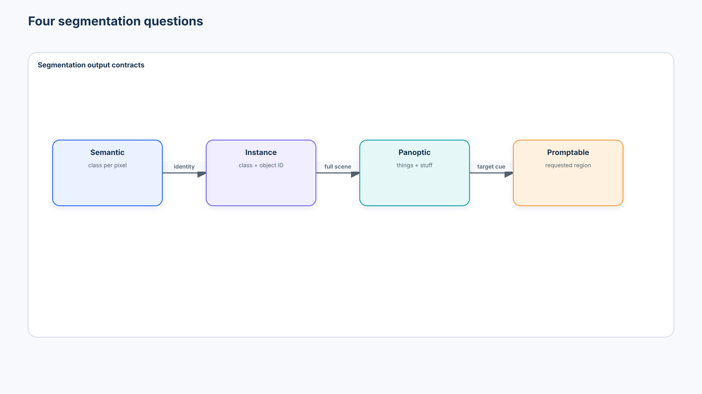
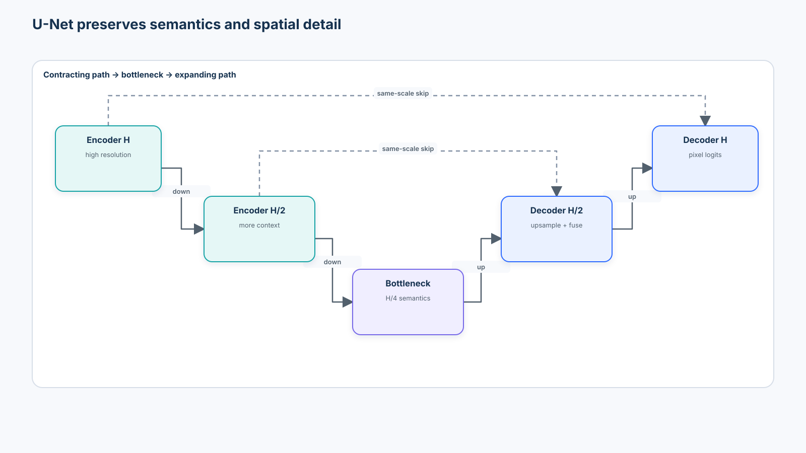
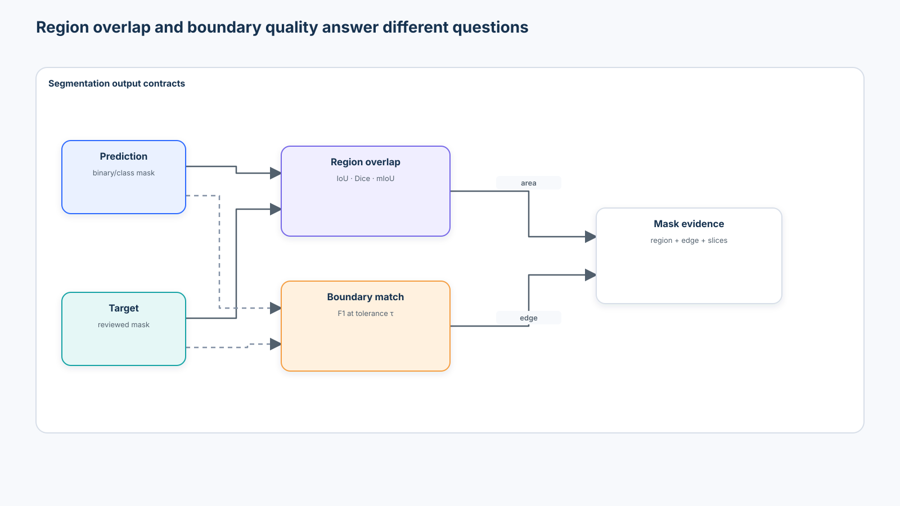
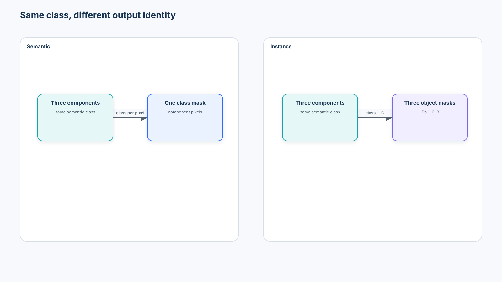
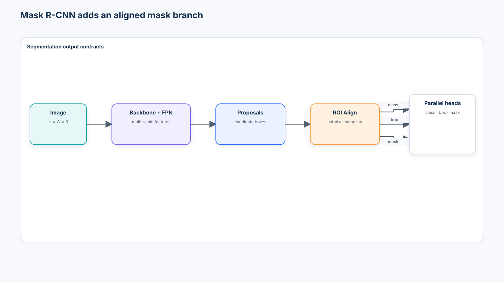
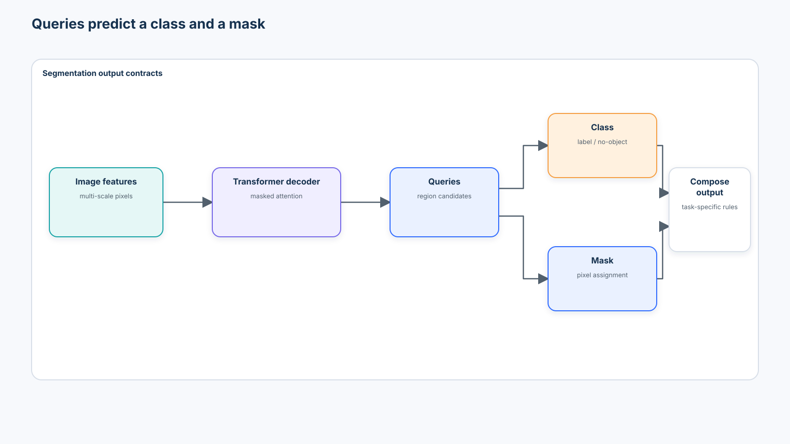
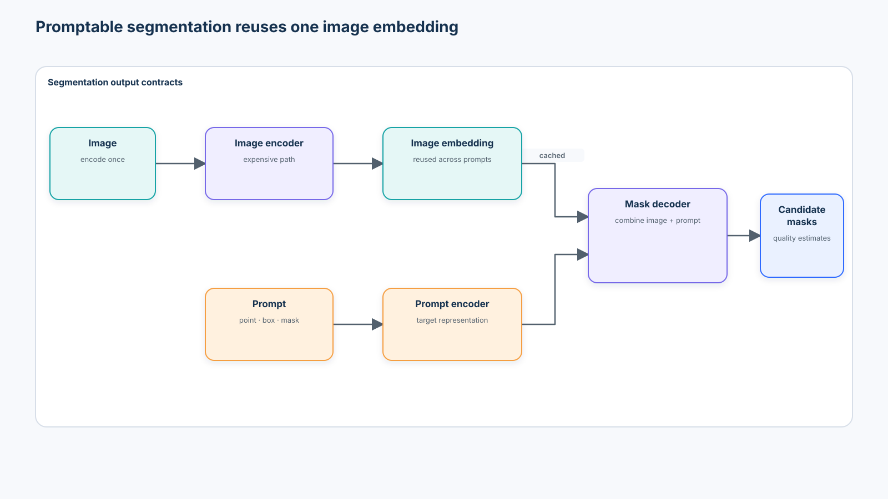
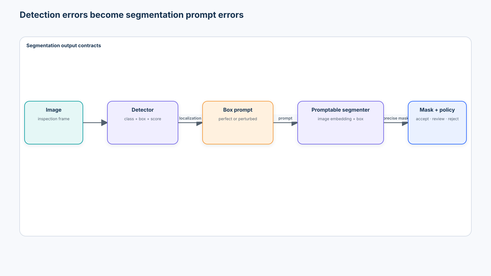

# Beginner 06 — Segmentation & Promptable Segmentation

> From pixel classification and boundary evidence to SAM-style interactive vision

**Level:** Beginner  
**Estimated time:** 10–12 hours  
**Primary artifact:** [`lab.ipynb`](lab.ipynb)  
**Prerequisites:** [Course 01](../01-modern-computer-vision-foundations/README.md), [Course 02](../02-modern-cnn-architectures-efficient-vision/README.md), [Course 03](../03-vision-transformers/README.md), [Course 04](../04-self-supervised-visual-representation-learning/README.md), and [Course 05](../05-object-detection/README.md)

## 1. Central question

> What changes when the system must predict the **exact pixels** belonging to an object or region rather than only a bounding box?

Detection returns coarse geometry. Segmentation adds a dense output contract and makes boundaries, tiny structures, overlap, prompt placement, and mask provenance first-class concerns.

```text
Detection                         Segmentation
image → object → bounding box     image → object / region → pixel mask
```



This course is organized around eight design problems: pixel representation, context, resolution recovery, boundary quality, instance separation, prompting, loss design, and evaluation. Architecture names matter because they embody different answers—not because a longer model catalogue is better.

## 2. Scenario, success criteria, and boundaries

Factories A and B provide development images of component bodies, contamination, and surface damage. Factory C changes illumination, texture, contrast, and edge ambiguity and remains held out. Two operating paths are evaluated:

```text
automated inspection: image → task-specific U-Net → masks
human review:         image → point / box → promptable segmenter → corrected mask
```

The course succeeds when you can:

1. validate raster-mask contracts and preserve discrete IDs through transforms;
2. implement IoU, Dice, mIoU, foreground recall, and boundary F1 from scratch;
3. train a readable CPU-safe U-Net and compare CE, Dice, and combined loss priorities;
4. diagnose tiny, thin, low-contrast, occluded, boundary-heavy, and source-shift failures;
5. measure point, box, refinement, and detector-box sensitivity; and
6. save an evidence bundle that separates local measurements, optional foundation-model observations, and unresolved production assumptions.

This notebook does **not** certify an inspection system, reproduce benchmark-scale segmentation training, claim a classical prompt proxy is SAM, or treat a visually precise mask as semantically correct.

## 3. Learning objectives

By the end, you should be able to:

- distinguish semantic, instance, panoptic, and promptable segmentation;
- describe dense raster, polygon, run-length, and per-instance mask representations;
- handle binary, multiclass, instance, and ignore-label contracts;
- explain encoder–decoder resolution recovery, U-Net skips, dilation, and ASPP;
- explain Mask R-CNN, ROI Align, query masks, and Mask2Former-style unification;
- calculate and interpret pixel accuracy, class IoU, mIoU, Dice, foreground recall, and boundary F1;
- explain CE/BCE, Dice, focal-style, and combined losses without naming one universal winner;
- distinguish automatic taxonomy-bound masks from spatially prompted regions;
- explain reusable image embeddings, prompt encoders, mask decoders, ambiguity, and multiple candidates;
- evaluate prompt sensitivity, box-error propagation, source shift, and quality-estimate reliability; and
- design a human-review policy with traceable prompts, masks, decisions, and retention.

## 4. Mask contracts

A binary mask is

$$
M \in \{0,1\}^{H\times W}.
$$

A multiclass semantic mask is

$$
M \in \{0,\ldots,K-1\}^{H\times W}.
$$

The corresponding model emits logits in `B × K × H × W`; `argmax` over `K` produces class IDs. Store label masks as integer tensors. Keep an explicit class map, ignore ID, spatial size, coordinate convention, and taxonomy version with every artifact.

For instance segmentation, each object has a class, binary mask, optional box, and instance ID. Two components of the same class share a semantic label but not an identity.

| Representation | Strength | Contract risk |
| --- | --- | --- |
| Dense raster | Direct training target; exact pixel grid | Resolution-specific and large |
| Polygon | Compact, editable geometry | Rasterizer and hole conventions change pixels |
| COCO-style RLE | Compact for large binary regions | Height/width and memory-order mismatch |
| Per-instance masks | Preserves object identity and overlap | Must define overlap and occlusion policy |

Polygons and RLE are storage encodings, not automatically equivalent ground truth. Rasterization resolution, vertex rounding, holes, crowd regions, and occlusion rules belong in the annotation contract.

## 5. Annotation and data quality

Mask errors often survive visual spot checks:

- image/mask misalignment after crop, pad, or augmentation;
- bilinear resizing that invents class IDs;
- anti-aliased edges interpreted as classes;
- inconsistent class and ignore IDs;
- overlapping instance masks without an occlusion rule;
- holes introduced by morphology or polygon conversion;
- different polygon rasterizers across training and evaluation; and
- leakage across adjacent video frames, products, lots, or factories.

The transform rule is simple:

```text
continuous image values → bilinear/bicubic may be appropriate
discrete class IDs      → nearest-neighbor
```

The notebook demonstrates the corruption with assertions. A production validator should also record image/mask hashes, dimensions, unique IDs, class area, connected components, tiny regions, overlap, source, annotator, reviewer, and transform history.

## 6. Semantic segmentation

Semantic segmentation predicts a class distribution for every pixel:

```text
input:  B × C × H × W
output: B × K × H × W logits
```

Every pixel labeled `component` is semantically equivalent. Two touching components are not separated unless the target representation preserves instance identity or another mechanism detects object boundaries.

## 7. Encoder–decoder design

A classifier encoder trades spatial detail for semantic context through stride, pooling, or patch merging. A segmentation decoder must recover the output grid:

```text
image → encoder → low-resolution semantics → decoder → high-resolution mask
```

Upsampling alone cannot recreate information that the encoder discarded. High-resolution lateral features, dilated features, learned decoders, and multi-scale fusion preserve or reintroduce spatial evidence in different ways.

## 8. U-Net and skip connections



U-Net concatenates encoder features into decoder stages at matching resolutions. These skips carry edge and location detail that would be expensive to reconstruct from a bottleneck alone.

Do not confuse two mechanisms:

```text
residual connection → improves optimization inside a representation stage
U-Net skip          → restores same-scale spatial evidence to the decoder
```

The notebook implements `ConvBlock`, `DownBlock`, `Bottleneck`, `UpBlock`, skip concatenation, and a segmentation head. Shape assertions prove that `B × C × H × W` becomes `B × K × H × W`.

## 9. Dilation and DeepLab-style context

For kernel size $k$ and dilation $d$, the effective one-dimensional kernel span is

$$
k_{eff}=k+(k-1)(d-1).
$$

A `3`-tap kernel with dilation `2` samples `x · x · x`: its span is five without another downsampling step. Dilation expands context while preserving feature-map resolution, although repeated rates can create gridding artifacts.

DeepLab's atrous spatial pyramid pooling is the representative context mechanism:

```text
feature map
├─ dilation 1
├─ dilation 6
├─ dilation 12
├─ dilation 18
└─ global context
       ↓
      fuse
```

The exact useful rates depend on feature stride and image scale. Multi-scale context cannot recover absent pixels or repair an invalid annotation contract.

## 10. Segmentation losses and imbalance

Cross-entropy optimizes per-pixel class likelihood. BCE is the binary form. Dice directly emphasizes overlap:

$$
Dice(A,B)=\frac{2|A\cap B|}{|A|+|B|}, \qquad L_{Dice}=1-Dice.
$$

Focal-style losses reduce the influence of easy pixels. Combinations such as CE + Dice can balance stable pixel-wise gradients with region overlap. No loss universally wins: the right evidence includes rare-class recall, boundary behavior, source slices, calibration, and operating cost—not only training loss.

If 99% of pixels are background, an all-background predictor reaches 99% pixel accuracy and 0% defect recall. Class weights and alternative losses can help optimization, but they cannot create missing examples or correct inconsistent labels.

## 11. IoU, Dice, and class-averaged evaluation

For predicted set $A$ and target set $B$:

$$
IoU(A,B)=\frac{|A\cap B|}{|A\cup B|},
$$

and

$$
Dice(A,B)=\frac{2|A\cap B|}{|A|+|B|}.
$$

On the same non-empty binary sets:

$$
Dice=\frac{2IoU}{1+IoU}.
$$

Per-class IoU exposes rare-class failures. Mean IoU averages declared classes; say whether background and absent classes are included. Define the empty/empty policy explicitly because libraries differ. Pixel accuracy, mIoU, Dice, foreground recall, and class prevalence answer different questions.



## 12. Boundary quality

Area overlap can hide operationally important edge defects. Boundary F1 converts both masks to contours, matches predicted and target contour pixels within a declared tolerance, then computes harmonic mean precision/recall. Boundary IoU, contour distance, and Hausdorff distance are other possible contracts.

Tolerance must be recorded in pixels or physical units. A two-pixel error means something different for a 16-pixel scratch, a 4K image, and a calibrated millimetre-scale inspection. The notebook compares predictions with similar overlap but different edges.

## 13. Small, thin, and ambiguous regions

Tiny and thin regions are disproportionately affected by stride, resizing, boundary ambiguity, label noise, and thresholding. Report performance by region size, minimum thickness, contrast, occlusion, and source. A single mIoU can conceal a system that performs well on component bodies and misses nearly every thin crack.

## 14. Instance segmentation



Instance output commonly contains:

```text
class + box + binary mask + score + instance identity
```

Touching objects require separation. Connected components can recover instances only when same-class masks do not touch; learned center, contour, proposal, or query mechanisms are needed in harder cases.

## 15. Mask R-CNN and ROI Align



Mask R-CNN adds a parallel mask head to Faster R-CNN:

```text
image → backbone + FPN → proposals → ROI Align
                                      ├─ class
                                      ├─ refined box
                                      └─ per-class mask
```

ROI Pooling quantizes region coordinates; ROI Align samples without that coarse quantization. Pixel masks are sensitive to alignment, so this small implementation detail matters. The notebook demonstrates the output contract conceptually and does not reproduce a complete proposal system.

## 16. Panoptic segmentation

Panoptic segmentation assigns every pixel a semantic class and gives countable **things** an instance identity. Amorphous **stuff** such as floor, sky, or road receives a semantic region without object identity.

Panoptic Quality is commonly expressed as segmentation quality times recognition quality over matched segments. It is a task-specific evaluation protocol, not a synonym for semantic mIoU.

## 17. Query-based mask classification



DETR introduced set prediction with learned object queries. Query-based segmentation extends the same idea:

```text
image features → transformer decoder → queries → class + mask
```

Mask2Former is the conceptual case study: semantic, instance, and panoptic segmentation can be represented through mask classification, then combined under task-specific rules. This does not mean their labels, matching, post-processing, or metrics become identical.

## 18. Promptable segmentation

Traditional semantic segmentation maps an image into a fixed trained taxonomy. Promptable segmentation maps an image plus a target cue into the requested region. A prompt specifies *which region is intended*; it does not guarantee the region's semantic class.

| Prompt | Meaning | Common ambiguity |
| --- | --- | --- |
| Positive point | This pixel belongs to the target | part versus whole |
| Negative point | This pixel does not belong | which adjacent region to remove |
| Box | Target lies inside this region | loose box may include several objects |
| Previous mask | Refine this candidate | prior error can persist |

Language-assisted prompting can add concept semantics, but point/box/mask prompts and text-conditioned concept discovery are distinct contracts.

## 19. SAM-style architecture and reusable embeddings



The expensive image encoder can run once. Several clicks or boxes then reuse its embedding through a prompt encoder and lightweight mask decoder. This supports interactive latency, but the cached embedding becomes sensitive data with its own retention and access policy.

A single click on a person may reasonably mean shirt, person, person plus backpack, or a larger foreground group. Multiple candidate masks represent prompt ambiguity; a model-reported mask-quality score ranks candidates but is not observed ground-truth IoU.

## 20. The current optional foundation adapter: SAM 3.1

The 2026 review selects the official [Meta SAM 3 repository](https://github.com/facebookresearch/sam3) at commit `660a5e9e1b8b4c02c0ad97229b88a09a6e4ff5b7` and the gated `facebook/sam3.1` checkpoint for the optional path. SAM 3.1 (released 2026-03-27) is the current official update and adds Object Multiplex for multi-object video tracking. SAM 3 also expands visual prompting into open-vocabulary text/exemplar concept segmentation.

The selection is deliberately **not** part of default execution:

- the official model has 848M parameters; the SAM 3.1 checkpoint is about 3.5 GB;
- official prerequisites are Python 3.12+, PyTorch 2.7+, CUDA 12.6+, and a CUDA GPU;
- checkpoint access is gated and requires authentication;
- code and weights use the custom **SAM License**, including use restrictions and redistribution obligations—not Apache 2.0;
- the official repository is pinned rather than executing an unreviewed latest branch; and
- optional results must record checkpoint hash, repository revision, hardware, prompts, and license acceptance.

SAM 2.1 remains a useful Apache-2.0 image/video alternative with smaller checkpoints, but it is not mislabeled as the newest generation. The local notebook uses a transparent color-and-connectivity prompt proxy only to teach evaluation mechanics. Its outputs are labeled `local_prompt_proxy`, never “SAM results.”

## 21. Prompt ambiguity, sensitivity, and refinement

Promptable does not mean prompt-insensitive. Move the same point by 2, 5, or 10 pixels; perturb the same box inward, outward, or sideways; then measure IoU, Dice, boundary F1, and area. Report the prompt-generation policy and all coordinates.

Refinement is a conversation with the mask:

```text
initial prompt → initial mask → negative/positive correction or prior mask → refined mask
```

The correction delta, reviewer, timestamp, original output, and final approved mask belong in the audit trail.

## 22. Automatic mask generation

Automatic mask generation evaluates a grid or hierarchy of prompts, produces many candidates, removes duplicates, filters low-quality or unstable masks, and may crop the image to recover small regions. More proposals increase compute and redundancy. Nested regions, tiny objects, and quality-score errors remain unresolved.

## 23. Detector + segmenter systems



```text
detector → box prompt → promptable segmenter → precise mask
```

This is a useful enterprise composition, not an error-erasing cascade. A shifted or undersized detector box changes the prompt and can clip the desired mask. Evaluating with perfect ground-truth boxes establishes an oracle ceiling, not production performance. The notebook perturbs boxes to expose this propagation.

An open-ended extension adds language:

```text
text prompt → open-vocabulary detector → boxes → promptable segmenter → masks
```

This previews Course 09. Phrase grounding, open-vocabulary category detection, and concept segmentation overlap but are not interchangeable.

## 24. Source shift and evaluation design

Factories A/B and Factory C differ in appearance while sharing a nominal mask taxonomy. Compare overall and held-out-source metrics, then inspect which slice moved: contrast, edge ambiguity, texture, region size, or class. A promptable foundation model may generalize better, worse, or simply fail differently from a task-specific U-Net. Measure it; do not assume it.

The minimum evidence table should include:

| Slice | mIoU | Dice | Foreground recall | Boundary F1 | Count |
| --- | ---: | ---: | ---: | ---: | ---: |
| Development | measured | measured | measured | measured | declared |
| Factory C | measured | measured | measured | measured | declared |
| Tiny / thin | measured | measured | measured | measured | declared |
| Low contrast | measured | measured | measured | measured | declared |
| Occluded | measured | measured | measured | measured | declared |

## 25. Human-in-the-loop operating model

```text
image → automatic mask → quality gate
                         ├─ accept candidate under bounded policy
                         └─ reviewer → point/box/refinement → approve or reject
```

Quality estimates must be compared with actual IoU on a reviewed set. Low-quality routing thresholds should be selected from review capacity and error cost, not copied from a demo. Retain the original prediction, candidate quality, prompt sequence, reviewer edits, final mask, and model/checkpoint versions.

## 26. Enterprise decision framework

| Option | Best fit | Principal evidence | Common constraint |
| --- | --- | --- | --- |
| Task-specific segmentation | Stable taxonomy, high-volume automation | source-sliced masks and latency on target hardware | labels and retraining |
| Promptable foundation model | Flexible interactive targets | prompt robustness, domain masks, quality calibration | size, license, compute |
| Detector + segmenter | discover then refine instances | end-to-end box-error propagation | compounded errors |
| Human-assisted workflow | rare/high-cost ambiguity | review time, correction delta, agreement | throughput and privacy |

Scenario A—stable high-volume inspection—often favors a compact task-specific model. Scenario B—flexible review—may favor promptable interaction. Scenario C—an open-ended assistant—needs grounding, detection, segmentation, and explicit tool authorization. These are hypotheses to validate, not product rules.

## 27. Production considerations

- Measure preprocessing, encoder, prompt-decoder, post-processing, and transfer latency separately.
- Declare input resolution, batch size, precision, warm-up, hardware, and memory.
- Version taxonomy, label policy, rasterizer, ignore ID, threshold, and morphology.
- Cache image embeddings only with access control, retention, and invalidation rules.
- Monitor class area, component count, confidence/quality, correction rate, prompt count, source, and failure slices.
- Re-run prompt-sensitivity and source-shift tests after model or preprocessing updates.
- Define abstention and human-review capacity before automatic physical action.

## 28. Security, privacy, and governance

Inspection images can capture people, badges, medical/biometric regions, screens, facility layouts, or proprietary products in the background. Minimize collection, restrict raw images and embeddings, redact where appropriate, define retention, and document lawful purpose.

Prompt logs can reveal sensitive review intent. Treat clicks, boxes, text prompts, prior masks, and edits as governed records. Adversarial patches, texture attacks, and maliciously chosen prompts can create confident but wrong masks. An apparently precise contour can still refer to the wrong semantic object.

Model, code, checkpoint, dataset, and annotation licenses are separate decisions. SAM 3.1's custom terms require legal review for the intended use; downloading the checkpoint is not a production approval.

## 29. Anti-patterns

1. Resizing class masks with bilinear interpolation.
2. Reporting pixel accuracy only.
3. Ignoring rare, tiny, thin, or absent-class behavior.
4. Assuming high IoU guarantees acceptable boundaries.
5. Treating semantic and instance masks as interchangeable.
6. Assuming a SAM-style mask is automatically semantically correct.
7. Evaluating one convenient prompt location.
8. Using perfect ground-truth boxes and claiming detector-to-mask production quality.
9. Dropping prompt and correction provenance.
10. Assuming foundation segmentation removes domain evaluation.

## 30. Notebook map and evidence contract

The notebook runs one deterministic experiment:

1. generate and profile a source-aware synthetic corpus;
2. prove nearest-neighbor mask resizing;
3. implement and verify overlap and boundary metrics;
4. trace and train a small U-Net;
5. compare CE, Dice, and CE + Dice;
6. evaluate size, shape, contrast, occlusion, boundary, and Factory C slices;
7. recover instance IDs from connected components;
8. evaluate local point, negative-point, box, refinement, and quality-score behavior;
9. measure point and detector-box perturbation;
10. save `.artifacts/course-06-segmentation-evidence.json`.

The JSON keeps `locally_measured_evidence`, `optional_downloaded_model_observations`, and `unresolved_production_assumptions` separate. It includes dataset and mask contracts, model versions, loss comparison, semantic and boundary metrics, size slices, source shift, prompt sensitivity, box-error propagation, human-review policy, and limitations.

## 31. Tooling review

| Tool | Use here | Decision |
| --- | --- | --- |
| PyTorch | readable U-Net, losses, training | Default common SDK |
| torchvision | tensor transforms and maintained model contracts | Default; no downloaded weights |
| SciPy | transparent connected components and boundary dilation | Default; avoids heavier OpenCV dependency |
| Pillow | image/mask resize contract | Default |
| Matplotlib / pandas / NumPy | plots, tables, metrics | Default |
| segmentation-models-pytorch | production architecture library | Reviewed, not needed for this teaching U-Net |
| pycocotools | COCO RLE and official-style mask evaluation | Recommended when COCO interchange is required; not needed locally |
| Hugging Face Hub | authenticated checkpoint retrieval | Optional only; pin revision and artifact hash |
| Official Meta SAM 3 repo | current SAM 3.1 adapter | Optional, isolated environment |
| CVAT / Label Studio | annotation and review workflows | Operational options; validate export contract |
| FiftyOne | dataset and failure-slice inspection | Useful at scale; unnecessary for the self-contained lab |

## 32. Further reading: primary research

- [Fully Convolutional Networks for Semantic Segmentation](https://arxiv.org/abs/1411.4038)
- [U-Net: Convolutional Networks for Biomedical Image Segmentation](https://arxiv.org/abs/1505.04597)
- [DeepLabv3: Rethinking Atrous Convolution for Semantic Image Segmentation](https://arxiv.org/abs/1706.05587)
- [Feature Pyramid Networks for Object Detection](https://arxiv.org/abs/1612.03144)
- [Mask R-CNN](https://arxiv.org/abs/1703.06870)
- [Panoptic Segmentation](https://arxiv.org/abs/1801.00868)
- [DETR: End-to-End Object Detection with Transformers](https://arxiv.org/abs/2005.12872)
- [Masked-attention Mask Transformer for Universal Image Segmentation (Mask2Former)](https://arxiv.org/abs/2112.01527)
- [Segment Anything](https://arxiv.org/abs/2304.02643)
- [SAM 2: Segment Anything in Images and Videos](https://arxiv.org/abs/2408.00714)
- [SAM 3: Segment Anything with Concepts](https://ai.meta.com/research/publications/sam-3-segment-anything-with-concepts/)
- [SAM 3.1 official release notes](https://github.com/facebookresearch/sam3/blob/main/RELEASE_SAM3p1.md)

## 33. Official documentation

- [PyTorch loss functions](https://docs.pytorch.org/docs/stable/nn.html#loss-functions)
- [TorchVision semantic segmentation models](https://docs.pytorch.org/vision/stable/models.html#semantic-segmentation)
- [TorchVision Mask R-CNN](https://docs.pytorch.org/vision/stable/models/mask_rcnn.html)
- [COCO data format and API](https://github.com/cocodataset/cocoapi)
- [Meta SAM 3 repository and license](https://github.com/facebookresearch/sam3)
- [Meta SAM 2 repository](https://github.com/facebookresearch/sam2)
- [CVAT mask annotation documentation](https://docs.cvat.ai/docs/manual/basics/types-of-shapes/)
- [Label Studio image segmentation template](https://labelstud.io/templates/image_segmentation)

## 34. What you should now be able to explain without code

1. What is the difference between semantic and instance segmentation?
2. Why does segmentation need decoders or high-resolution pathways?
3. What role do U-Net skip connections play?
4. Why can pixel accuracy be misleading?
5. What is the difference between IoU and Dice?
6. Why does boundary quality need separate evaluation?
7. Why must class masks use nearest-neighbor resizing?
8. What problem does Mask R-CNN solve beyond detection?
9. What is panoptic segmentation?
10. What does mask classification mean?
11. How is promptable segmentation different from semantic segmentation?
12. Why can one point correspond to multiple valid masks?
13. Why are promptable outputs sensitive to prompt placement?
14. Why must predicted mask quality be evaluated against actual IoU?
15. When is a box a stronger prompt than one point?
16. How can detector box errors affect downstream masks?
17. When would you choose task-specific over promptable segmentation?
18. When is human-in-the-loop segmentation preferable?
19. Why does foundation segmentation not remove the need for labels?
20. What evidence is required before a mask can drive physical action?

## 35. Transition to Course 07

Course 06 asks:

> Which pixels belong to this region?

[Course 07 (planned)](../README.md) will ask:

> How do we learn a visual space where similar objects, identities, defects, and regions can be found efficiently?

The bridge is the representation itself: dense region features can become embeddings for retrieval, matching, clustering, deduplication, and open-world inspection.
