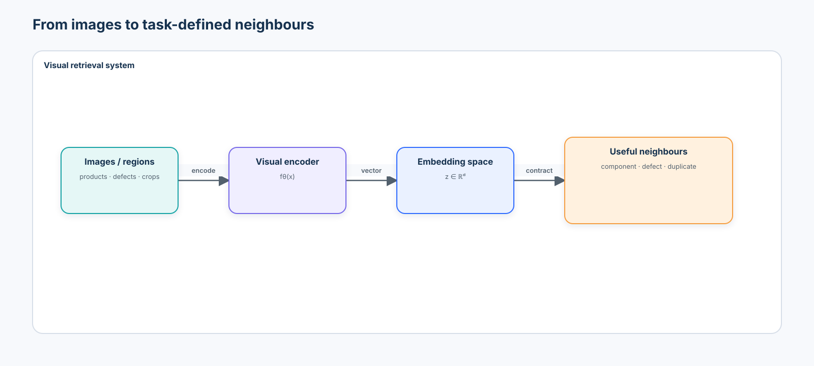
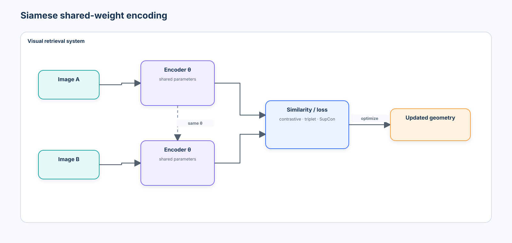
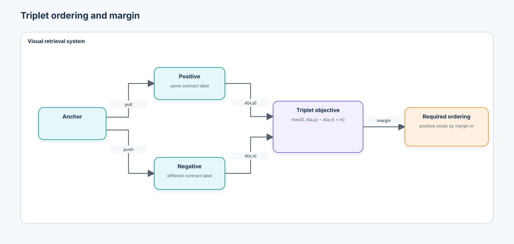
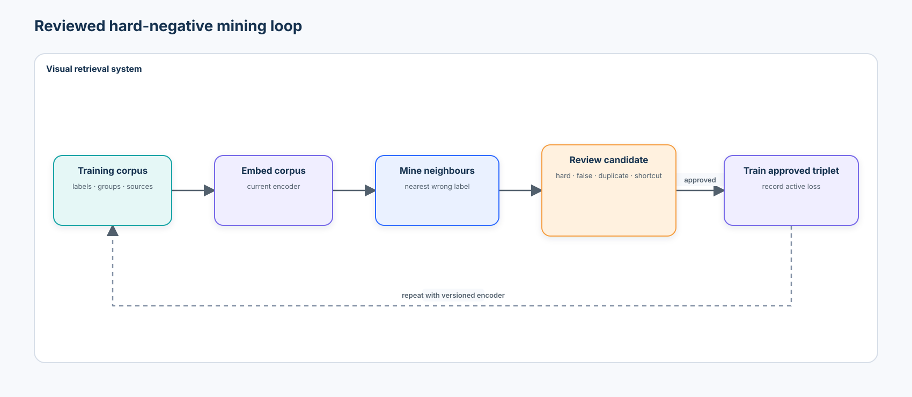
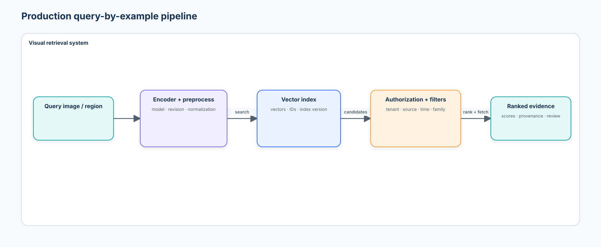
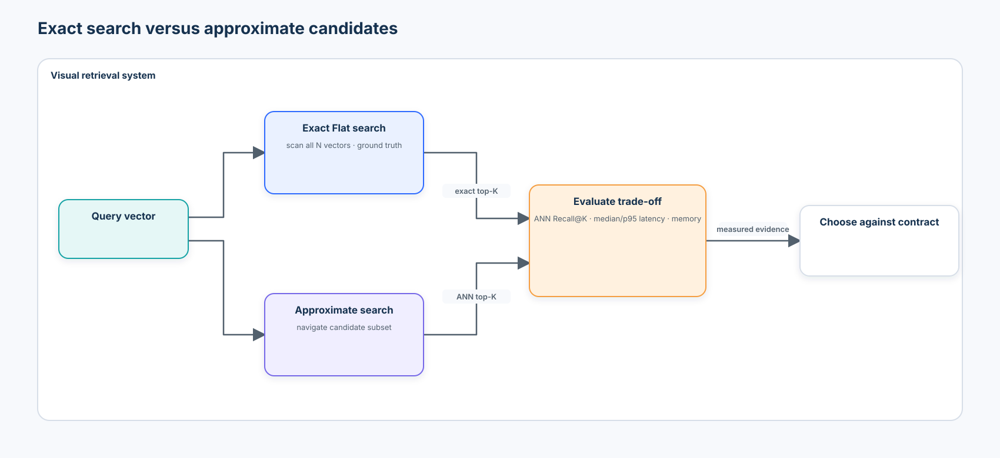
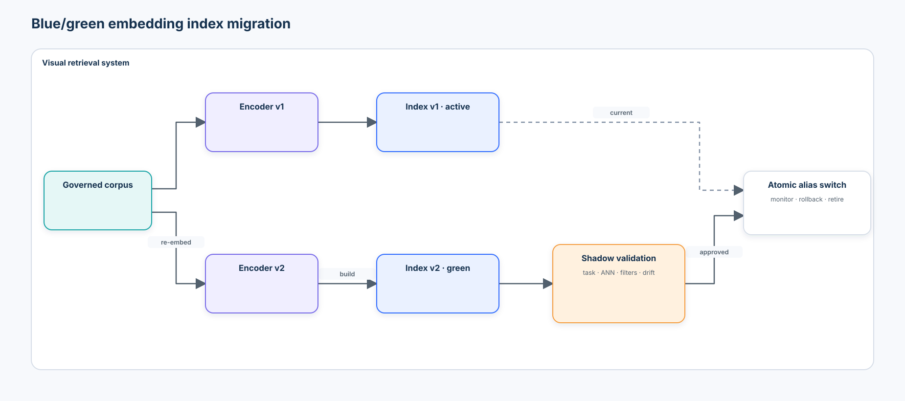
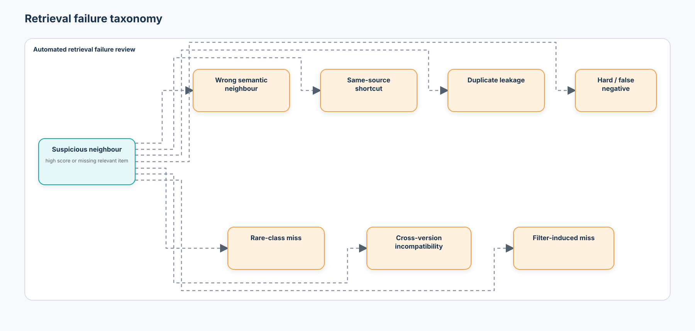

# Beginner 07 — Visual Embeddings, Metric Learning & Retrieval

> From similarity learning to scalable image search

## 1. Central question

> How do we learn and operationalize a visual representation space where semantically or operationally similar items are close together, dissimilar items are separated, and retrieval remains useful at production scale?

[Course 01](../01-modern-computer-vision-foundations/README.md) introduced `image → embedding`. [Course 04](../04-self-supervised-visual-representation-learning/README.md) asked how useful representations are learned. This course asks how their geometry is shaped, evaluated, searched, versioned, and operated.

```text
visual encoder → embedding space → similarity metric → metric-learning objective
       → nearest-neighbour retrieval → hard-negative mining → index
       → scalable search → evaluation → production retrieval system
```

This is not a “download a fashionable encoder, put vectors in a database, and inspect attractive neighbours” tutorial. The decision unit is the complete retrieval contract: similarity semantics, encoder, supervision, sampler, geometry, gallery, metric, index, filters, evaluation slices, version, and operating policy.

## 2. Similarity is a product contract

“Looks similar” is underspecified. The same pair can be relevant for one task and wrong for another:

| Contract | Relevant when | Important nuisance factors | Important evidence to preserve |
| --- | --- | --- | --- |
| Component identity | same component family or asset | lighting, background, camera | shape, markings, geometry |
| Defect retrieval | same operational failure type | product family, factory style | scratch, corrosion, fracture evidence |
| Duplicate search | same underlying capture | encoding, small crop, brightness | fine pixel/layout correspondence |
| Re-identification | same entity across time/cameras | viewpoint, occlusion, illumination | identity-specific detail |

> Similarity is a product requirement, not an inherent property of an image.

The notebook makes four contracts executable—component, defect, identity, and duplicate relevance—and shows that one representation does not dominate all four.



## 3. Learning objectives, prerequisites, and boundaries

After the chapter and lab, you should be able to:

- explain embeddings, feature extraction, metric learning, normalization, and shared encoders;
- compare cosine similarity, dot product, and Euclidean distance under explicit normalization;
- implement contrastive and triplet losses and verify them on known cases;
- distinguish easy, hard, semi-hard, and false negatives;
- build class-balanced `P × K` batches and online/offline mining loops;
- compare frozen supervised features with a domain metric-learned encoder without claiming a universal winner;
- evaluate k-NN and rankings with Precision@K, Recall@K, AP, mAP, and MRR where appropriate;
- compare full-image, object-crop, and masked-region retrieval;
- evaluate duplicate detection separately from semantic retrieval;
- construct an exact cosine baseline and measure approximate-index recall, latency, and memory;
- reason about metadata filters, freshness, deletion, version compatibility, blue/green migration, drift, source bias, and tenant boundaries; and
- produce a versioned enterprise retrieval evidence artifact.

Prerequisites: [Course 04](../04-self-supervised-visual-representation-learning/README.md), plus the detection/crop contract from [Course 05](../05-object-detection/README.md) and mask contract from [Course 06](../06-segmentation-promptable-segmentation/README.md).

The course succeeds when you can diagnose why a ranking is useful or unsafe and identify which part of the contract should change. It does **not** reproduce web-scale pretraining, certify biometric identity systems, benchmark a hosted vector database, or turn demonstration latency thresholds into service-level objectives.

## 4. Mental model: the retrieval lifecycle

```text
Define relevance
      ↓
Collect and split by identity/source/time
      ↓
Encode gallery and query with one versioned contract
      ↓
Search exact baseline, then approximate candidates if justified
      ↓
Apply authorization and metadata policy
      ↓
Rank, inspect, evaluate, and route failures
      ↓
Refresh, migrate, monitor, and retire the index
```

The gallery is part of the model. A strong encoder cannot retrieve a missing relevant case. A fast index cannot repair an invalid positive label. A visually plausible top result is not evidence that the ranking works across queries.

## 5. What is a visual embedding?

An encoder maps an image or region to a vector:

$$
z=f_\theta(x), \qquad z\in\mathbb{R}^d.
$$

A feature extractor exposes whatever representation its pretraining learned. Metric learning changes the encoder so distances better match a declared relevance relation. A pooled classification feature, dense patch feature, and retrieval embedding are related but not interchangeable contracts.

The dimension $d$ is an operating choice. Larger vectors can preserve more information but increase storage, memory bandwidth, index construction, and search cost. A smaller vector is useful only if the relevant neighbourhoods survive compression.

## 6. Similarity and distance

For vectors $a$ and $b$:

$$
d_2(a,b)=\lVert a-b\rVert_2,
$$

$$
s_{dot}(a,b)=a^\top b,
$$

and

$$
s_{cos}(a,b)=\frac{a^\top b}{\lVert a\rVert_2\lVert b\rVert_2}.
$$

Euclidean distance is smaller-is-better. Dot product and cosine similarity are larger-is-better. Mixing these conventions silently can reverse a ranking.

For L2-normalized vectors:

$$
\lVert a-b\rVert_2^2=2-2\cos(a,b).
$$

The notebook verifies this identity numerically and checks that NumPy, scikit-learn, and FAISS exact rankings agree under the same preprocessing and tie policy.

## 7. Normalization changes the geometry

```text
raw embedding             L2-normalized embedding
magnitude + direction     direction only; norm = 1
```

Normalization makes cosine search equivalent to inner-product search and makes thresholds easier to compare within one version. It is not universally correct. Magnitude can encode confidence, image quality, frequency, or another useful signal. If normalization changes, the distance contract and index evaluation change too.

Record whether normalization happens before storage, at query time, inside the model, or inside the search SDK. Double normalization is usually harmless numerically; missing normalization is not.

## 8. Pairwise supervision and noisy relations

Pair labels answer whether two samples should be close:

```text
image A + image B → same / different under one contract
```

Same SKU, identity, component, or defect can supply strong labels. Same session, lot, camera track, page, or user action is only weak evidence. Weak positives can teach source or temporal shortcuts; false negatives can push genuinely related items apart.

Train/test splitting must happen at the group that defines leakage. Duplicate groups, asset identities, people, video tracks, customers, factories, or time windows may need to stay together.

## 9. Siamese encoders share parameters



```text
image A → encoder θ → zA
                     ↘ similarity / loss
image B → encoder θ → zB
```

“Siamese” describes shared encoding structure, not one loss. The branches may receive pairs, triplets, multiple augmented views, or larger structured batches. Shared weights put both inputs in one coordinate system.

## 10. Contrastive pair loss

For $y=1$ meaning similar, a margin-style pair loss is:

$$
L=y d^2+(1-y)\max(0,m-d)^2.
$$

Positives are pulled together. Negatives are pushed apart only until margin $m$. A margin that is too small stops teaching early; one that is too large can create unstable or impossible geometry. The number and difficulty of selected pairs determine how much non-zero signal reaches the encoder.

## 11. Triplet loss



For anchor $a$, positive $p$, negative $n$, and margin $m$:

$$
L=\max\left(0,d(a,p)-d(a,n)+m\right).
$$

The absolute positions are less important than the ordering constraint: the positive should be closer than the negative by at least $m$. Many valid geometries satisfy the same triplets, which is why downstream ranking evaluation remains necessary.

## 12. Easy, hard, semi-hard, and false negatives

| Negative | Relation to anchor/positive | Learning value | Risk |
| --- | --- | --- | --- |
| Easy | already beyond the margin | often zero loss | wasted batches |
| Hard | closer than the positive | strong corrective signal | label error or instability |
| Semi-hard | farther than positive but inside margin | useful bounded signal | depends on batch coverage |
| False negative | labeled different but relevant | destructive signal | taxonomy or annotation failure |

Random negative sampling often returns easy examples. The model appears to converge because loss approaches zero, while fine-grained rankings remain poor.

## 13. The sampler is part of the model

Metric learning needs useful relationships inside each optimization batch. A common batch contract is:

$$
P\ \text{classes}\times K\ \text{examples per class}.
$$

For example, `8 × 4 = 32` provides multiple positives per class and many negative candidates. Random image batches may contain no positive for an anchor, especially with many identities.

The lab compares random, semi-hard, and batch-hard triplet policies while recording active-triplet fraction, loss, and held-out mAP. It then performs an offline mining round with **simulated oracle adjudication**:



```text
embed training corpus → retrieve nearest wrong-label item
        → review label/relevance → train on approved hard triplet → repeat
```

Mining without review can amplify label noise, duplicate leakage, and source shortcuts.

In the synthetic lab, hidden `true_defect` supplies a known answer and simulates a reviewer accepting or rejecting each mined negative. This is not available in production. A deployed workflow needs qualified human or domain adjudication, an auditable decision, and a policy for uncertain or disputed relationships before the example enters training.

## 14. Supervised contrastive and proxy objectives

Supervised contrastive learning treats multiple same-class samples as positives in one batch, extending the multi-view contrastive ideas from Course 04. It can use class structure more fully than selecting one positive per anchor, but same-class does not always mean equally relevant.

Pair combinations grow quickly with corpus size. Proxy methods learn class or concept representatives and compare samples with those proxies. Proxy-NCA and ProxyAnchor are useful examples: they reduce pair enumeration and can improve convergence, but a single proxy may oversimplify multi-modal classes.

## 15. Angular margins

ArcFace-style systems normalize embeddings and class weights, then add an angular margin in the classification objective. Angular separation is especially common for identity retrieval and re-identification. It does not make a system inherently fair, private, calibrated, or safe; biometric deployments require separate legal, demographic, spoofing, consent, and access-control evidence.

This beginner lab implements pair and triplet primitives directly. It reviews proxy and angular approaches without turning the course into a face-recognition recipe.

## 16. What should the embedding preserve or ignore?

```text
metric objective + augmentation + sampler + labels = operational similarity
```

For component retrieval, lighting, factory background, and camera may be nuisances while shape and markings matter. For defect retrieval, a tiny scratch or colour contamination may be essential. An augmentation that helps one contract can erase another.

The source-aware lab uses the same object under Factory A/B/C capture styles. It compares full-image, crop, and masked-region embeddings to ask whether context removal reduces camera/source shortcuts without discarding relevant evidence.

## 17. Representation baselines

The controlled comparison includes:

1. official ImageNet-supervised torchvision ResNet-18 features;
2. a randomly initialized tiny encoder as a geometry baseline;
3. a small domain triplet encoder trained for defect similarity; and
4. an optional pinned official DINOv2 feature path, disabled by default.

The ResNet download is a public, credential-free artifact but still has a weight enum, preprocessing contract, source URL, and cache. DINOv2 is isolated because source checkout and checkpoint download add supply-chain, network, memory, and provenance decisions. None is assumed to win every contract.

## 18. Geometry diagnostics are not retrieval proof

Norms, covariance, effective rank, pairwise cosine distributions, centroid movement, PCA, UMAP, or t-SNE can reveal collapse and drift. They do not establish ranking usefulness. A two-dimensional projection can manufacture visually persuasive clusters.

Always reconnect geometry to held-out queries, declared relevance, source/time/identity groups, and failure slices. Low training loss also does not guarantee useful retrieval.

## 19. Retrieval evaluation

For a query with a ranked list:

$$
P@K=\frac{\text{relevant items in top }K}{K},
$$

$$
R@K=\frac{\text{relevant items in top }K}{\text{all relevant gallery items}}.
$$

Precision emphasizes purity; recall emphasizes coverage. They can disagree when many relevant items exist.

Average Precision weights relevant hits by their rank:

$$
AP=\frac{1}{|R|}\sum_{k=1}^{N}P@k\cdot rel(k),
$$

with a declared policy when a query has no relevant gallery items. mAP averages AP across eligible queries. Mean Reciprocal Rank is useful when the first relevant item is the primary objective, not as a universal replacement for mAP.

The notebook assertion-checks all metrics on hand-constructed rankings before applying them to images.

## 20. Query-by-example



```text
query image → encoder → query embedding → similarity search → ranked results
```

The query can be a full image, detected object crop, segmented region, reference product, or defect example. Keep query and gallery preprocessing identical unless the asymmetry is deliberate and evaluated.

## 21. Region-level retrieval

Courses 05 and 06 provide the upstream contracts:

```text
image → detector / segmenter → object crop / masked region → encoder → search
```

Ground-truth boxes or masks establish an oracle region ceiling. They do not include detector or segmenter errors. A production study must perturb or use predicted regions and measure the end-to-end effect.

The lab evaluates full image, oracle crop, and oracle masked region separately and labels the information advantage explicitly.

## 22. Duplicate and near-duplicate detection

Exact duplicate, re-encoded copy, small crop, same object, and same semantic category are different relations. Dataset cleanup and leakage prevention often benefit from perceptual hashes plus embedding evidence.

The notebook compares a difference-hash baseline with semantic embedding similarity, selects thresholds on a development pair set, and reports held-out duplicate precision and recall. It assigns underlying `duplicate_group` identities to development or test **before** constructing positive and negative pairs, restricts every pair member to the same partition, and asserts that the partitions have zero group overlap. A threshold is version-, preprocessing-, and corpus-specific.

## 23. Re-identification is retrieval with higher stakes

Re-identification asks whether the same entity appears across camera, time, or viewpoint. Products, containers, vehicles, equipment, and people can all be entities. Identity embeddings can enable unauthorized surveillance, linkage, or cross-context inference.

Do not use this course as approval for biometric deployment. Minimize collection, define lawful purpose, obtain appropriate consent, evaluate demographic and environmental slices, restrict index/query access, and prevent cross-tenant search.

## 24. Exact nearest-neighbour search

For $N$ stored vectors of dimension $d$, exhaustive comparison costs roughly:

$$
O(Nd)
$$

per query. Exact search is the correctness baseline. On small or moderately sized corpora it may also be the simplest production choice because it avoids index training, approximation recall loss, and complex update behavior.

## 25. Approximate nearest neighbours

At millions of vectors, candidate pruning can reduce search work. Major families include:

- inverted files (IVF): route a query to selected coarse partitions;
- graph search (HNSW): navigate a proximity graph;
- product quantization (PQ): compress subvectors and approximate distances; and
- hybrids: combine partitioning, graphs, compression, and reranking.



Approximation trades recall, latency, build time, update flexibility, and memory. “Fast” without ANN recall against an exact baseline is incomplete evidence.

## 26. FAISS as the index case study

FAISS exposes one index contract across exact and approximate methods. The tested lab uses:

- `IndexFlatIP` for exact inner-product search over normalized vectors; and
- `IndexHNSWFlat` for approximate graph search with an `efSearch` sweep.

The FAISS SDK runs in a short-lived local worker process so its native parallel runtime remains isolated from the long-lived PyTorch/Jupyter kernel on platforms where those runtimes conflict. The worker implementation is visible inside the notebook, exchanges only local NumPy arrays, and does not introduce a hidden module, hosted service, or network call.

The official FAISS guidance identifies Flat indexes as the exact reference and describes HNSW as a strong RAM-resident option when exactness is not required. HNSW adds graph memory and does not support arbitrary removal in the same way as a mutable record store. Index choice must start from corpus size, query volume, update/delete requirements, hardware, and the written quality contract.

## 27. ANN recall and latency belong together

For exact top-$K$ set $E_q$ and approximate set $A_q$:

$$
ANNRecall@K=\frac{|E_q\cap A_q|}{K}.
$$

Measure latency distribution and recall on the same query set. The lab sweeps `efSearch`, times each query call individually over three sequential passes, and reports the median and p95 of those individual-query samples against ANN recall. The measurement includes local Python/FAISS call overhead and excludes concurrency, queuing, networking, payload fetch, and service saturation. Its perturbed-copy scale proxy validates the measurement method; it does not model real large-corpus graph structure, cache behavior, workload diversity, or production tail latency.

## 28. Memory and compression

Raw float32 vector memory is:

$$
4Nd\ \text{bytes}.
$$

Ten million 768-dimensional vectors require about 30.7 GB before IDs, graph links, partitions, process overhead, replicas, or metadata. The notebook reports the formula and serialized FAISS index sizes. It does not invent unexposed allocator precision.

PQ or scalar quantization can reduce memory at the cost of distance error and additional tuning. Always remeasure task retrieval, not only vector reconstruction error.

## 29. Metadata filtering and authorization

Enterprise search often means:

```text
find visually similar cases
WHERE tenant = authorized_tenant
  AND factory != query_factory
  AND component_family IN allowed_scope
```

Vector similarity and metadata policy are separate layers. Pre-filtering narrows candidates before similarity search but can create tiny/imbalanced shards. Post-filtering is simple but can return fewer than $K$ valid results or require oversampling. Authorization filters must be enforced, not merely suggested by query text.

The lab compares pre-filter and post-filter behavior and records filter-induced misses.

## 30. Embedding and index versioning



```text
encoder_v1 → embedding space A → index_v1
encoder_v2 → embedding space B → index_v2
```

Track at least:

- model name, source, revision, checkpoint hash, and license;
- preprocessing and region policy;
- normalization, dimension, dtype, and distance metric;
- training objective, sampler, data revision, and label taxonomy;
- index family, parameters, build data, creation time, and code version; and
- metadata/filter schema and tenant/authorization policy.

> An embedding is not just a vector. It is a versioned model artifact.

Cross-version comparison is invalid unless compatibility is explicitly trained and evaluated. Same dimension does not imply same coordinate system.

## 31. Refresh, deletion, and blue/green migration

New items may support incremental insertion; deleted or revoked items need reliable removal or tombstones; updated labels/metadata need synchronized policy state. Some approximate indexes make deletion or in-place updates expensive.

For a new encoder:

```text
re-embed corpus → build index_v2 → validate exact/task/ANN/filter evidence
→ shadow or canary queries → switch an alias atomically → monitor → retire v1
```

Keep rollback until the new index proves stable. Prevent mixed v1/v2 gallery shards unless a tested compatibility layer exists.

## 32. Drift and source-bias analysis

Monitor norm distributions, similarity distributions, centroids within the same space, neighbour retention, class/source neighbour rates, query coverage, and delayed retrieval outcomes. Geometry movement does not automatically mean task degradation, and stable averages can hide one failing source.

For each query, compare:

```text
semantic neighbour rate@K
same-source neighbour rate@K
```

If same-source rate rises while semantic relevance falls, the encoder may be retrieving camera style rather than operational content. The lab evaluates Factory A/B/C and compares full-image with region-focused features.

## 33. Hard-negative review as data quality

High similarity plus disagreeing labels can indicate a genuine hard negative, mislabeled item, duplicate, ambiguous taxonomy, or source shortcut. Do not automatically relabel every disagreement.

The notebook creates a review queue with query/neighbor IDs, similarity, labels, sources, and a rule-based review reason. A human or governed workflow decides whether to change labels, taxonomy, sampling, augmentation, or the similarity contract.

## 34. Retrieval failure taxonomy



| Failure | Observable evidence | Typical mitigation |
| --- | --- | --- |
| Same-source shortcut | neighbours share camera/site but not semantic label | source-held-out tests, crop/mask, balanced sampling |
| Wrong semantic neighbour | high score under wrong contract | revise labels/objective, add reviewed hard negatives |
| Duplicate leakage | copies cross train/query/gallery split | duplicate grouping before split and indexing |
| Hard/false negative | nearest wrong label is arguably relevant | review taxonomy and pair policy |
| Rare-class miss | relevant rare cases absent or outranked | gallery coverage, class-aware evaluation/mining |
| Cross-version incompatibility | dimension or ranking mismatch | rebuild and version-gate indexes |
| Filter-induced miss | valid neighbour removed or too few results | pre-filter design, oversampling, policy review |

Failures should be saved as sample-level evidence, not hidden by one aggregate mAP.

## 35. Enterprise scenarios

### Defect-case retrieval

Prioritize defect relevance, source invariance, Recall@K, reviewable examples, and safe abstention when no comparable case exists.

### Product catalogue search

Prioritize identity/category precision, latency, freshness, metadata policy, availability, and consistent presentation of alternatives.

### Dataset-quality platform

Prioritize duplicate groups, hard negatives, likely mislabels, provenance, reversible review decisions, and split repair.

The same encoder/index configuration need not satisfy all three.

## 36. Retrieval contract and production gate

A candidate configuration $m$ might maximize task mAP subject to:

$$
Latency@P95(m)\le L_{max},
$$

$$
ANNRecall@10(m)\ge R_{min},
$$

$$
Memory(m)\le M_{max},
$$

and

$$
SameSourceRate@K(m)\le S_{max}.
$$

The notebook thresholds are clearly labeled **demonstration thresholds for this runtime only**. A release gate also needs index freshness, filter correctness, tenant isolation, query authorization, failure slices, capacity/load evidence, backup/restore, rollback, and an owner for alerts.

## 37. Tooling review

| Tool | Best fit | Strengths | Constraints / hidden failure |
| --- | --- | --- | --- |
| PyTorch + torchvision | primitive losses, tiny metric model, official supervised baseline | transparent tensors/autograd and maintained weight enums | sampler and evaluation remain your responsibility |
| `pytorch-metric-learning` | production experiments with packaged losses/miners/samplers | broad metric-learning components | abstraction can hide pair counts, label semantics, and reducer behavior |
| scikit-learn neighbours | portable exact/tree baselines and small datasets | familiar metric APIs and evaluation ecosystem | not a billion-scale vector service |
| FAISS 1.15.0 | local exact and ANN indexing | Flat, IVF, HNSW, PQ, CPU/GPU families | filtering/tenancy live outside many indexes; recall and deletion must be designed |
| Hugging Face Transformers | model/processor access to reusable features | model cards, cached artifacts, common APIs | revisions, preprocessing, licenses, remote artifacts |
| `timm` | broad pretrained encoder catalogue | consistent creation and many recipes | recipe/model-name/license/preprocessing provenance |
| Official DINOv2 | governed optional self-supervised features | reusable global and patch representations | source/checkpoint pinning, download, memory, domain transfer |
| Qdrant / similar services | service-level metadata filtering and payloads | operational vector API and filter semantics | service identity, tenancy, backup, cost, and vendor/runtime dependency |
| FiftyOne | visual neighbour/failure review | sample-level dataset inspection | UI evidence does not replace portable metrics or lineage |

The core lab uses common SDKs and no hosted service. It teaches NumPy similarity, PyTorch losses/mining, scikit-learn support, and FAISS exact/HNSW search before discussing service architectures.

## 38. State of practice in 2026

**Established:** supervised and self-supervised frozen encoders, normalized cosine/inner-product retrieval, task-specific metric learning, exact baselines, FAISS-style indexes, and ranking metrics are mature patterns.

**Rapidly consolidating:** reusable DINO-family global/dense features, image-text encoders, domain adapters, HNSW/IVF/PQ combinations, hybrid vector-plus-metadata search, and visual data-engine review workflows.

**Research frontier:** compatibility-trained embeddings across model generations, universal representations that preserve conflicting similarity contracts, billion-scale filtered ANN under frequent updates, privacy-preserving visual retrieval, robust uncertainty for “no suitable neighbour,” and fair identity retrieval.

Current does not mean universally suitable. Recheck the exact model/index version, license, data, hardware, benchmark protocol, and failure evidence before standardizing.

## 39. Practical lab — enterprise visual similarity and retrieval

The notebook follows one manufacturing archive from contract to operations:

1. declare scenario, success criteria, risk boundaries, seed, offline/optional paths, and demonstration thresholds;
2. generate components, defects, identities, Factory A/B/C capture styles, masks/boxes, duplicates, source shortcuts, and controlled label noise;
3. make component, defect, identity, and duplicate relevance executable;
4. verify cosine/dot/L2 normalization equivalence;
5. verify contrastive/triplet losses and retrieval metrics on known examples;
6. extract official ResNet-18 full/crop/masked embeddings and build exact rankings;
7. implement a shared tiny encoder, `P × K` batching, and random/semi-hard/batch-hard mining;
8. perform an offline hard-negative feedback round with explicit simulated oracle adjudication and inspect false negatives;
9. compare frozen supervised, random, and domain metric-learned representations by contract and Factory C;
10. compare full-image, crop, and masked-region source/semantic neighbour behavior;
11. split by underlying duplicate group before pair construction, assert no group leakage, and compare semantic embeddings with perceptual hashing;
12. generate hard-negative and automated failure-review tables;
13. verify NumPy, scikit-learn, and FAISS exact search;
14. sweep FAISS HNSW `efSearch` against exact Recall@10 and latency;
15. measure vector/index/metadata memory;
16. compare pre-filter and post-filter retrieval;
17. simulate embedding-version drift and a blue/green migration; and
18. save the partitioned enterprise evidence artifact.

Run:

```bash
python -m pip install -r curriculum/beginner/07-visual-embeddings-metric-learning-retrieval/requirements.txt
jupyter lab curriculum/beginner/07-visual-embeddings-metric-learning-retrieval/lab.ipynb
```

## 40. Evidence artifact

The notebook writes `.artifacts/course-07-retrieval-evidence.json` with three top-level partitions:

```json
{
  "locally_measured_evidence": {},
  "optional_downloaded_model_observations": {},
  "unresolved_production_assumptions": {}
}
```

Local evidence records similarity contracts, duplicate-group split integrity, encoder/index manifests, dimensions, normalization, objective, simulated mining adjudication, ranking metrics, source bias, hard-negative review, exact parity, individual-query ANN timing/recall, memory, filters, migration, drift, and failures. Optional DINOv2 observations cannot overwrite local measurements. Production thresholds remain assumptions until measured on the target archive, workload, hardware, and policy boundary.

## 41. Security, privacy, and governance

Embeddings are derived data, not automatically anonymous data. They can expose identity, membership, sensitive visual attributes, proprietary products, facilities, or relationships between records. Similarity search can become a linkage or inference interface.

- enforce tenant and record authorization before returning neighbours;
- encrypt and access-control images, embeddings, indexes, metadata, backups, and query logs;
- prevent cross-customer galleries and unauthorized “search by person” workflows;
- define purpose, retention, deletion propagation, legal basis, and audit records;
- record model/data licenses, checkpoint/source hashes, and upstream training-data limitations;
- rate-limit and monitor enumeration or membership-probing behavior;
- test embedding inversion/membership risks conceptually and minimize exposed vectors;
- review human identity and biometric use with specialist legal and fairness processes; and
- treat reviewer labels and hard-negative decisions as governed changes.

## 42. Anti-patterns

1. Showing t-SNE and declaring the embedding good.
2. Evaluating only top-1 accuracy.
3. Training on random easy negatives only.
4. Treating every same-class pair as equally similar.
5. Treating every visually similar different-class item as a label error.
6. Ignoring source/camera clustering.
7. Mixing vectors from different model or preprocessing versions.
8. Changing normalization or metric without rebuilding evaluation.
9. Using ANN without measuring recall against exact neighbours.
10. Treating search latency as independent of filters, replicas, concurrency, and payload fetch.
11. Re-indexing silently without provenance or rollback.
12. Assuming a public foundation encoder fits every domain.
13. Using oracle object crops and claiming end-to-end retrieval quality.
14. Ignoring hard negatives and zero-relevant queries.
15. Treating duplicate detection and semantic retrieval as one task.

## 43. Exercises

1. **Implementation:** add supervised contrastive loss and compare it under the same `P × K` batches.
2. **Mining:** measure how false-negative rate changes as hard-negative depth increases.
3. **Contract judgment:** define separate invariance policies for component, defect, and duplicate retrieval.
4. **Region pipeline:** perturb the oracle box and measure end-to-end crop retrieval degradation.
5. **Indexing:** add IVF and sweep `nprobe`; compare build time, memory, recall, and latency with HNSW.
6. **Compression:** add scalar/PQ compression and measure task mAP after reranking.
7. **Filtering:** implement tenant-safe pre-filtering and prove unauthorized IDs never enter candidates.
8. **Migration:** design a shadow-query and rollback plan for 20 million versioned embeddings.
9. **Operations:** define freshness, p95 latency, ANN recall, semantic relevance, and source-bias alerts with owners.

## 44. What you should now be able to explain without code

1. What does an embedding represent?
2. Why is similarity task-dependent?
3. How do cosine similarity and Euclidean distance differ?
4. What does L2 normalization change?
5. What is a Siamese network?
6. How do contrastive and triplet losses differ?
7. What is a hard negative?
8. Why are random easy negatives often uninformative?
9. Why does batch composition matter?
10. What is Recall@K?
11. Why can Precision@K and Recall@K disagree?
12. What does mAP measure in retrieval?
13. Why can object-crop retrieval outperform full-image retrieval?
14. Why can same-source neighbours indicate a shortcut?
15. What is exact nearest-neighbour search?
16. Why use approximate nearest neighbours?
17. What is ANN recall?
18. Why must latency and ANN recall be measured together?
19. Why are embeddings from model v1 and v2 not automatically compatible?
20. What evidence would justify a production retrieval index?

## 45. Transition to Course 08

Course 07 asks: “Which visual item is most similar to this one?”

[Course 08 — Tracking, Keypoints & Pose](../README.md) will ask: “Is this the same object over time, and where are its important spatial points?” Retrieval geometry becomes an identity-association primitive, while tracking adds temporal state, motion, occlusion, lifecycle, and identity-switch evaluation.

## 46. Primary research and official documentation

- Hadsell, Chopra, and LeCun, [Dimensionality Reduction by Learning an Invariant Mapping](http://yann.lecun.com/exdb/publis/pdf/hadsell-chopra-lecun-06.pdf), CVPR 2006.
- Schroff, Kalenichenko, and Philbin, [FaceNet: A Unified Embedding for Face Recognition and Clustering](https://arxiv.org/abs/1503.03832), CVPR 2015.
- Khosla et al., [Supervised Contrastive Learning](https://arxiv.org/abs/2004.11362), NeurIPS 2020.
- Movshovitz-Attias et al., [No Fuss Distance Metric Learning Using Proxies](https://arxiv.org/abs/1703.07464), ICCV 2017.
- Kim et al., [Proxy Anchor Loss for Deep Metric Learning](https://arxiv.org/abs/2003.13911), CVPR 2020.
- Deng et al., [ArcFace: Additive Angular Margin Loss for Deep Face Recognition](https://arxiv.org/abs/1801.07698), CVPR 2019.
- Johnson, Douze, and Jégou, [Billion-scale similarity search with GPUs](https://arxiv.org/abs/1702.08734), IEEE Transactions on Big Data 2019.
- Malkov and Yashunin, [Efficient and Robust Approximate Nearest Neighbor Search Using Hierarchical Navigable Small World Graphs](https://arxiv.org/abs/1603.09320), 2016/2020.
- Jégou, Douze, and Schmid, [Product Quantization for Nearest Neighbor Search](https://hal.inria.fr/inria-00514462/document), TPAMI 2011.
- Oquab et al., [DINOv2: Learning Robust Visual Features without Supervision](https://arxiv.org/abs/2304.07193), 2023.
- Meta AI, [official DINOv2 model card](https://github.com/facebookresearch/dinov2/blob/main/MODEL_CARD.md) and [repository](https://github.com/facebookresearch/dinov2).
- Meta AI, [FAISS documentation](https://faiss.ai/) and [index-selection guidance](https://github.com/facebookresearch/faiss/wiki/Guidelines-to-choose-an-index).
- scikit-learn, [nearest-neighbour documentation](https://scikit-learn.org/stable/modules/neighbors.html).
- PyTorch, [`TripletMarginLoss`](https://docs.pytorch.org/docs/stable/generated/torch.nn.TripletMarginLoss.html) and [`pairwise_distance`](https://docs.pytorch.org/docs/stable/generated/torch.nn.functional.pairwise_distance.html).
- torchvision, [ResNet-18 weights and preprocessing](https://docs.pytorch.org/vision/stable/models/generated/torchvision.models.resnet18.html).
- Qdrant, [filtering documentation](https://qdrant.tech/documentation/concepts/filtering/), for the service-level extension reviewed but not required by this lab.
