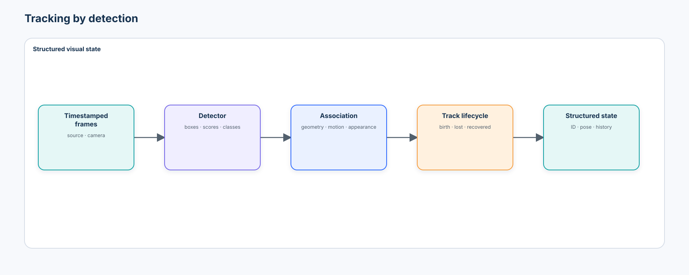
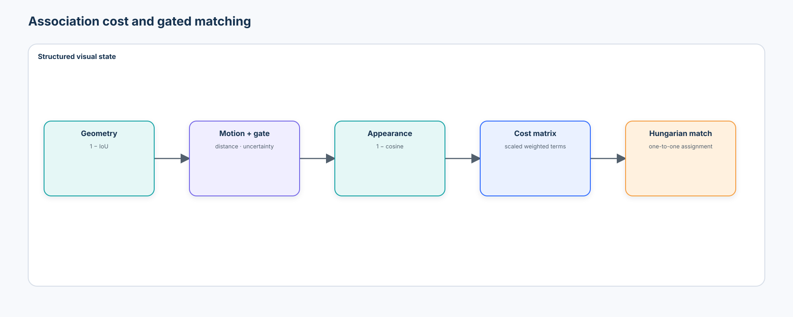
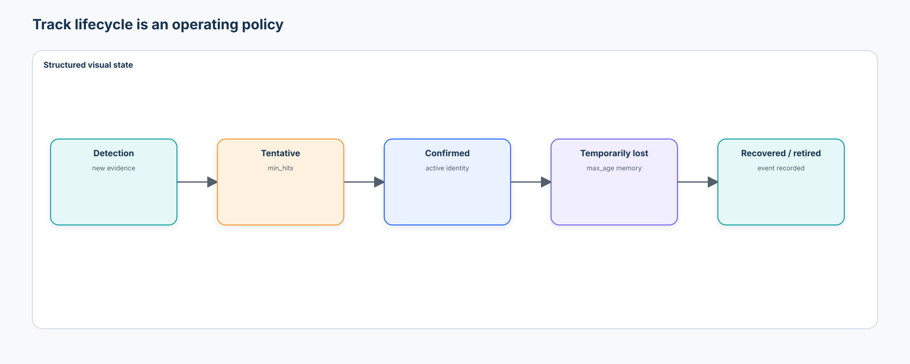
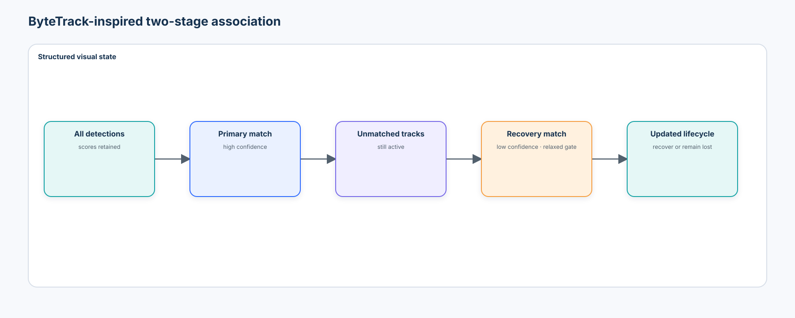
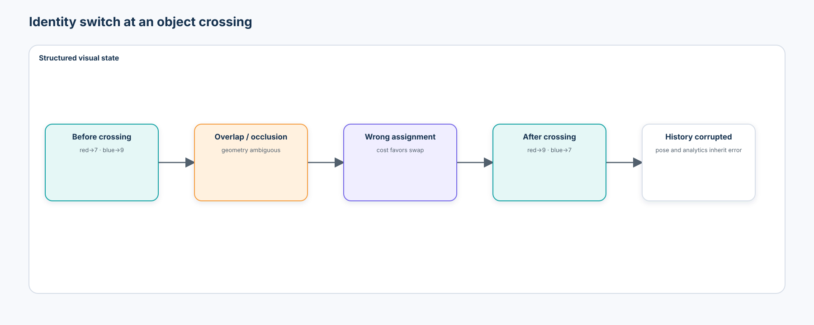
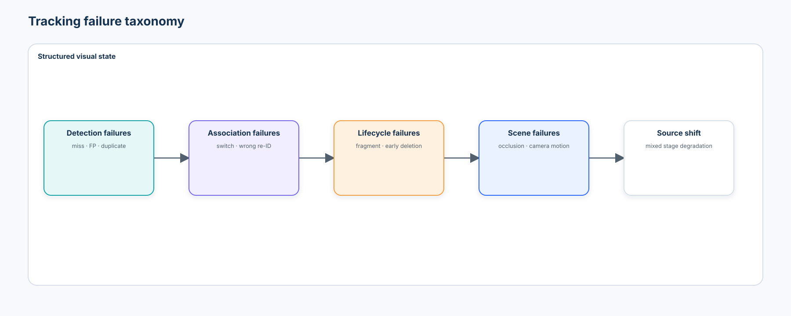
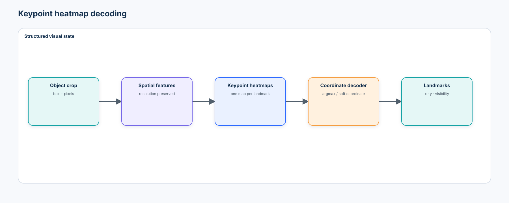
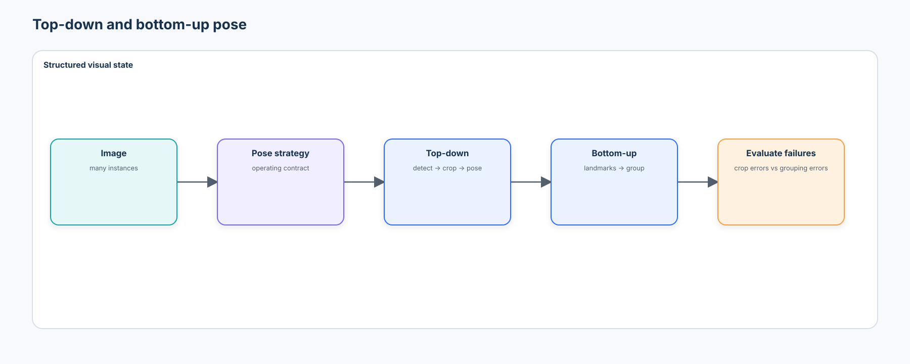
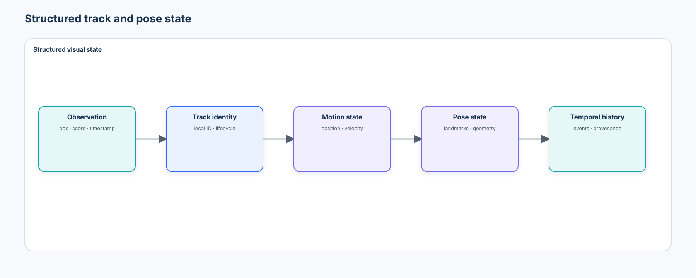

# Beginner 08 — Tracking, Keypoints & Pose

> From temporal identity to structured visual state

## 1. Central question

> How does a vision system maintain object identity through time and describe the important spatial configuration of an object within each frame?

[Course 05](../05-object-detection/README.md) asked where an object is. [Course 07](../07-visual-embeddings-metric-learning-retrieval/README.md) asked which visual items are similar. This course connects both ideas across time:

```text
Detection → Tracking identity → Keypoints → Pose / configuration → Temporal state
```

The unit of reasoning is one **structured object state**, not three disconnected tasks:

```text
track_id · class · box · score · velocity · keypoints · pose · age · last_seen · history
```

Smooth boxes are not enough. Identity, association, landmark accuracy, temporal behavior, and upstream failure propagation must remain separately measurable.



## 2. Learning objectives and boundaries

After the chapter and lab, you should be able to:

- define a timestamped video and detector-observation contract;
- implement IoU, Hungarian assignment, lifecycle management, motion prediction, gating, and appearance association;
- explain SORT, DeepSORT, ByteTrack, OC-SORT, and BoT-SORT as combinations of a few design choices;
- distinguish occlusion, identity switches, fragmentation, false tracks, and missed detections;
- explain what MOTA, IDF1, and HOTA reveal and hide;
- generate and decode keypoint heatmaps, represent visibility explicitly, and compute PCK and a clearly labeled OKS-like teaching score;
- compare top-down and bottom-up pose systems;
- derive joint angles, lengths, orientation, and timestamp-based velocity from landmarks;
- quantify smoothing error, jitter, and lag;
- attribute a failed pose history to detection, association, keypoint, or temporal-policy causes; and
- define an auditable tracking-and-pose deployment contract.

The lab is deterministic, credential-free, CPU-safe, and non-biometric. It does not reproduce an official MOT benchmark, claim official HOTA/IDF1 from simplified teaching metrics, certify a safety system, or treat a temporary track number as a real-world identity.

## 3. Video is a timestamped data contract

A video is a sequence

$$
V=\{I_1,I_2,\ldots,I_T\}.
$$

Each frame needs more than pixels: `frame`, `timestamp`, dimensions, `camera_id`, optional calibration, and provenance. Frame number is not time when capture rates vary, decoding skips frames, or backpressure drops them.

```json
{
  "frame": 42,
  "timestamp_s": 1.437,
  "camera_id": "camera_a",
  "image_size": [192, 128],
  "detector_version": "synthetic-detector-v1"
}
```

Velocity must use elapsed time:

$$
v_t=\frac{p_t-p_{t-1}}{t_t-t_{t-1}},
$$

not a silent fixed-FPS assumption.

## 4. Detection versus tracking

A detector answers “what is visible in this frame?” A tracker must decide whether a current detection corresponds to a previous state. Tracking-by-detection makes the boundary explicit:

```text
video → detector → per-frame detections → association → lifecycle → tracks
```

The modularity is useful: detectors can be upgraded, evaluated, and scheduled independently. The cost is equally important: a missed or badly localized detection can become a gap, deletion, false birth, identity switch, or poor pose crop.

The ground-truth corpus and detector-like observations must be separate. `ground_truth_id` is available only to evaluation code; it never enters association.

## 5. Data association

For previous tracks $T_i$ and detections $D_j$, first apply semantically meaningful hard gates, then build a rectangular cost matrix over the plausible pairs and solve a one-to-one assignment:

```text
class compatible? · center plausible? · minimum IoU if required? · appearance plausible?
                                  ↓
                         surviving pairs only
                                  ↓
                   weighted geometry + motion + appearance
                                  ↓
                         Hungarian assignment
                                  ↓
                    independent max combined cost
```

A useful cost can combine geometry, predicted motion, and appearance:

$$
C_{ij}=\lambda_g(1-IoU(T_i,D_j))+\lambda_m d_{motion}(T_i,D_j)+\lambda_a(1-\cos(z_i,z_j)).
$$

Terms must be scaled before combining them. `iou_gate`, `center_gate`, and `appearance_gate` retain their own meanings; `combined_cost_threshold` controls acceptance after weighted scoring. Deriving a mixed-cost threshold from `1 - iou_gate` would be valid only for a pure IoU cost. Hungarian assignment minimizes the total remaining cost; it does not make invalid gates, scaling, or acceptance policy meaningful.



### IoU association

The simplest cost is

$$
C_{ij}=1-IoU(T_i,D_j).
$$

It works best at high frame rate with slow motion and little occlusion. It fails when boxes do not overlap after fast movement, two objects cross, the camera moves, or detection disappears.

## 6. A transparent tracker and lifecycle

The notebook implements `IoUTracker` and an extended `StructuredTracker` with `predict`, `associate`, `update`, `create`, and `retire` operations. Each track owns its ID, box, class, score, hits, age, missed frames, velocity, appearance representation, state, and event history.



| Policy | What it controls | Typical trade-off |
| --- | --- | --- |
| `min_hits` | evidence required before confirmation | fewer false tracks versus slower availability |
| `max_age` | tolerated unmatched observations | better short-occlusion recovery versus stale matches |
| confidence thresholds | which detector evidence is considered | precision versus recovery |
| hard gates | class, displacement, optional IoU, and appearance plausibility | fewer switches versus more fragmentation |
| combined-cost threshold | maximum accepted weighted cost after matching | stricter evidence versus more unmatched tracks |

These are operating policies, not architecture trivia. Tune them on development sequences and freeze them before final evaluation.

## 7. Motion prediction, filtering, and gating

A constant-velocity state can include

$$
x=[c_x,c_y,w,h,v_x,v_y,\ldots].
$$

Prediction moves the expected box before matching. A Kalman filter adds explicit process and measurement uncertainty:

```text
previous state → predict + uncertainty → measurement → update → posterior state
```

The notebook's filtering example is a scalar, position-only recursive estimator with no velocity state. It teaches the uncertainty-weighted measurement update only; it is not the tracker's timestamp-aware constant-velocity predictor or a production tracking Kalman filter. A production implementation must define state transitions, observation matrices, covariance initialization, process noise, and measurement noise for the camera and motion regime.

Gating rejects pairs outside plausible IoU or center-distance regions. Mahalanobis gating additionally scales displacement by uncertainty. A very tight gate fragments tracks; a very loose gate invites identity switches.

## 8. Appearance association and DeepSORT

A crop can be encoded into a normalized appearance vector:

```text
detection crop → re-identification encoder → embedding
```

Appearance can preserve identity when geometry becomes ambiguous, but it can also encode camera, lighting, clothing, or background shortcuts. Course 07's lessons apply directly: freeze the similarity contract, split by identity/source, inspect hard negatives, and evaluate source shift.

DeepSORT's influential design combines Kalman prediction, Hungarian association, and a learned appearance metric. Its importance is architectural rather than timeless superiority. Re-identification mismatch, long occlusion, crowding, and camera change remain difficult.

## 9. ByteTrack and modern tracking-by-detection

ByteTrack's key teaching insight is that low detector confidence does not mean no temporal evidence:

```text
high-confidence detections → primary association
remaining tracks + low-confidence detections → recovery association
```



The notebook implements a **ByteTrack-inspired teaching experiment**, not the complete official algorithm. Weak evidence may recover a partially occluded object, but it can also increase false associations.

Representative design lessons:

| Family | Main lesson | Failure still requiring evidence |
| --- | --- | --- |
| SORT | detection quality + simple motion/assignment can be strong | identity through occlusion |
| DeepSORT | appearance assists identity | domain mismatch in re-ID features |
| ByteTrack | use low-score boxes in a second stage | weak-evidence false association |
| OC-SORT | make motion estimation robust to occlusion/nonlinearity | long disappearance and detector failure |
| BoT-SORT | combine motion, appearance, and camera-motion compensation | added components and calibration burden |

Single-object tracking starts from one initialized target. Multi-object tracking creates and associates many identities. Foundation-model video mask propagation is related, but this course keeps detection-based MOT as the inspectable core.

## 10. Occlusion, switches, and fragmentation

Partial occlusion, short full occlusion, long disappearance, leaving the view, and later re-entry need different policies. A track ID is a local hypothesis, not permanent real-world identity.



An **identity switch** occurs when a ground-truth entity changes its matched predicted identity. **Fragmentation** occurs when one real trajectory is represented by multiple disconnected predicted track segments. Reacquiring the wrong existing track and creating a new track are therefore different errors.

The lab slices short occlusion, medium occlusion, and crossings rather than reporting only an easy aggregate. Each row computes `slice_fragment_recoveries` from miss→match transitions entirely observed inside that slice; it does not repeat the sequence-wide fragmentation total under a slice label.

## 11. Tracking metrics without name inflation

Frame-level precision and recall measure detection-like coverage. They do not measure who remained who.

MOTA combines false negatives, false positives, and identity switches:

$$
MOTA=1-\frac{FN+FP+IDSW}{GT}.
$$

It can be dominated by detection errors. IDF1 emphasizes correctly identified detections across trajectories. HOTA explicitly balances detection and association quality over localization thresholds. An accurate detector can therefore coexist with poor identity continuity.

The notebook reports transparent local counts, a clearly named `identity_consistency_f1_teaching`, and

$$
HOTA_{like}=\sqrt{DetA\cdot AssA}
$$

only as a **teaching decomposition**, never as official HOTA. It also writes a **MOTChallenge-compatible teaching export**—two text tables that still require the expected directory/sequence configuration and benchmark semantics before an optional pinned TrackEval run. Official benchmark claims require the reference evaluator, exact dataset rules, ignore/crowd handling, thresholds, and sequence aggregation.

## 12. Tracking failure taxonomy



| Failure | Likely source | Observable consequence |
| --- | --- | --- |
| missed detection | detector | gap or premature deletion |
| false track / duplicate | detector + birth policy | spurious state |
| identity switch | association | another entity inherits history |
| fragmentation | miss + lifecycle | one entity receives several IDs |
| failed re-identification | appearance/gate | lost state or wrong recovery |
| camera-motion failure | uncompensated motion | widespread bad predictions |
| source shift | several stages | mixed degradation |

## 13. From boxes to landmarks

A box says where an object is; landmarks say how it is configured. A keypoint is

$$
k_i=(x_i,y_i,v_i),
$$

where $v_i$ expresses visibility or annotation state. Keep `visible`, `occluded but labeled`, `outside image`, and `not annotated` distinct. Missing coordinates are not `(0,0)`; the lab uses `NaN` plus an explicit visibility mask.

Examples need not be biometric: robot joints, component corners, gripper tips, animal landmarks, and vehicle control points are all keypoint contracts.

## 14. Heatmaps and coordinate regression

Heatmap models preserve spatial uncertainty:

```text
image → encoder → spatial features → one heatmap per keypoint → coordinate decoder
```



Argmax is discrete and simple; soft coordinate extraction can be differentiable and sub-pixel. Higher heatmap resolution reduces quantization but increases activation memory and computation. The notebook compares `16×16`, `32×32`, and `64×64` targets.

Direct regression emits continuous coordinates without storing dense heatmaps. It has a smaller output but can represent spatial ambiguity less explicitly. Neither output family is a universal winner.

## 15. PCK and OKS

Percentage of Correct Keypoints declares a keypoint correct when

$$
\lVert p-\hat p\rVert_2 < \alpha S,
$$

where $S$ is an object scale. The same pixel error matters more for a small object, so the normalization contract must be recorded.

Object Keypoint Similarity uses distance, object scale, per-keypoint tolerance, and visibility. The lab's compact `oks_like_teaching` function is deliberately not the COCO evaluator. COCO comparisons require the official visibility semantics, sigmas, area definition, matching, and aggregation.

## 16. Pose is structured geometry

```text
keypoints → skeleton graph → lengths / angles / orientation → pose state
```

Nodes are landmarks and edges encode anatomical or mechanical relationships. Structural checks can reveal impossible lengths, topology, or joint angles even when average point error looks small. Derived geometry inherits and can amplify keypoint error.

### Top-down and bottom-up



| Property | Top-down | Bottom-up |
| --- | --- | --- |
| flow | detector → crop → pose | all keypoints → grouping |
| detector dependency | direct | not required in the same form |
| crowded-scene cost | grows with instances | grouping becomes difficult |
| common failure | bad box → bad crop → bad pose | wrong landmark grouping |
| deployment fit | modular and inspectable | useful when many instances dominate crop cost |

Modern designs express three durable lessons: HRNet preserves high-resolution representations; ViTPose uses strong transformer backbones and pretraining; RTMPose targets real-time accuracy/latency trade-offs. Choose from a pinned implementation and model card only after validating input schema, checkpoint data/license, preprocessing, export, target hardware, and domain transfer.

## 17. Track-level pose and temporal state



Once pose belongs to a track, a system can reason about configuration change rather than isolated skeletons:

```text
frame → detection → track ID → keypoints → geometry → timestamped history
```

Exponential moving average reduces visible jitter but adds lag:

$$
\hat p_t=\alpha p_t+(1-\alpha)\hat p_{t-1}.
$$

Measure point error, frame-to-frame jitter, and response lag together. Perfect smoothness can be wrong when real motion is abrupt.

The most dangerous propagation path is explicit:

```text
detection error → association error → wrong identity → keypoints assigned to wrong entity → corrupt pose history
```

## 18. Practical lab — industrial workcell

The self-contained notebook creates a deterministic synthetic workcell with two containers and an articulated robot arm. It includes velocity changes, crossings, short occlusion, weak detections, false positives, variable timestamps, and a shifted Camera C. Exact boxes and robot landmarks form evaluation-only ground truth; trackers receive detector observations without hidden identity.

The 18 phases are:

1. visualize ground-truth frames and trajectories;
2. generate and evaluate a noisy detector stream;
3. implement the IoU/Hungarian tracker;
4. sweep lifecycle policies;
5. compare raw observations, filtering, and timestamp-aware motion;
6. compare geometry, appearance, and combined association;
7. stress short/medium occlusion and crossings;
8. test ByteTrack-inspired low-confidence recovery;
9. separate detection and association metrics and export TrackEval inputs;
10. generate and decode Gaussian keypoint heatmaps;
11. compare heatmap resolution, memory, and latency;
12. validate PCK with hand-checked cases;
13. demonstrate a scale-aware OKS-like teaching score;
14. derive segment length, orientation, and joint angle;
15. measure EMA error, jitter, and lag;
16. construct a combined track + pose history;
17. show identity-error propagation into pose state; and
18. attribute Camera C degradation by pipeline stage.

All generated media, tables, and `course-08-tracking-pose-evidence.json` are written beneath the gitignored local `.artifacts/` directory.

## 19. Source shift and error attribution

Camera C changes rendered brightness, appearance, motion blur, and the detector-noise simulation. Detection and tracking use the changed observation stream. The pose comparison does **not** run an image model on Camera C: it injects a larger, stage-specific keypoint-noise proxy and labels every row with `pose_image_model_inference = false`. This controlled proxy demonstrates separate pose-stage degradation without presenting it as downloaded-model evidence. “The model failed” is not actionable; a stage-specific table is.

The failure-propagation phase likewise keeps two kinds of evidence separate: a controlled synthetic track-ID perturbation isolates the causal impact on pose ownership, while a naturally occurring switch from the geometry-only tracker shows an actual association failure in the crossing-container sequence.

| Symptom | Upstream hypothesis | Evidence to inspect |
| --- | --- | --- |
| track gap | missed detector output | per-frame recall and confidence |
| identity swap | ambiguous association | gated cost components and assignment |
| keypoint error | bad crop or pose output | crop IoU, visibility, point error |
| delayed state | smoothing | timestamped lag and alpha |
| Camera C degradation | multi-stage shift | detector, association, and pose slices |

## 20. Optional maintained implementations

The default lab needs no downloaded model or external tracker.

| Extension | Course role | Pinning / license decision |
| --- | --- | --- |
| [TrackEval](https://github.com/JonathonLuiten/TrackEval) | official HOTA/identity evaluation after MOTChallenge export | optional source revision; MIT code; dataset rules and licenses remain separate |
| [ByteTrack](https://github.com/FoundationVision/ByteTrack) | compare an official implementation with the teaching tracker | optional source revision; MIT code; checkpoint/data terms checked separately |
| [MMPose / RTMPose](https://github.com/open-mmlab/mmpose) | maintained pose ecosystem and deployment comparison | optional; Apache-2.0 code; pin config, revision, checkpoint and training-data terms |
| [torchvision Keypoint R-CNN](https://docs.pytorch.org/vision/stable/models/generated/torchvision.models.detection.keypointrcnn_resnet50_fpn.html) | least-fragile common-SDK human-keypoint smoke test | disabled environment flag; weights enum; PyTorch BSD-style code, weight/data provenance recorded |

The notebook stores manifests and guarded loader functions. It never downloads weights during default execution and never implies that a COCO human-pose checkpoint estimates industrial robot landmarks.

## 21. Real-time architecture and deployment contract

```text
camera → decoder → detector → tracker → pose model → temporal state → bounded analytics
```

Detector cadence may be lower than tracker cadence, but this changes drift and recovery. If a camera produces 30 FPS and a pipeline sustains 20 FPS, backlog grows unless the system drops frames, adapts inference, batches safely, reduces resolution, or changes detector cadence. Every choice must preserve timestamps and expose dropped-frame counters.

A deployment contract might require:

$$
IDSwitchRate\le S_{max},\quad TrackRecovery\ge R_{min},\quad PCK\ge P_{min},\quad P95Latency\le L_{max}.
$$

The notebook's values are **demonstration thresholds for that runtime only**, not universal targets. Production evidence needs target cameras, motion, crowding, failure costs, hardware, concurrency, warm-up, and backpressure.

## 22. Privacy, security, and provenance

Anonymous track IDs can become identifying when linked to appearance, time, location, or other data. Human tracking may trigger biometric, employment, surveillance, consent, retention, and access-control obligations. Prefer non-identifying state when the task permits it; minimize storage and cross-camera linkage.

Adversaries or ordinary environmental changes can exploit occlusion, detector evasion, appearance manipulation, or deliberate crossings. Confidence is not authorization for consequential action.

Treat a track as a derived artifact. Record tracker, detector, appearance encoder, and keypoint-model versions; camera and timestamps; association and lifecycle parameters; lifecycle events; input/data lineage; and evidence artifact version.

## 23. Evidence artifact

The notebook partitions evidence into:

```text
locally_measured_evidence
optional_downloaded_model_observations
unresolved_production_assumptions
```

Local evidence includes the dataset and detector contracts, tracker version, association/lifecycle policies, tracking metrics, occlusion slices, switch/fragment records, heatmap and PCK checks, pose geometry, temporal stability, source shift, failure attribution, and known limitations. Empty optional observations are truthful; they are not failed experiments.

## 24. Tooling decisions

The default path uses common NumPy, pandas, Matplotlib, Pillow, SciPy, scikit-learn, PyTorch, and torchvision APIs. SciPy supplies the trusted rectangular Hungarian primitive; the cost remains course code. The tracker, motion model, evaluation, heatmaps, geometry, and temporal analysis remain visible in the notebook.

External frameworks can hide detector preprocessing, track birth/death, gating, low-score handling, metric semantics, or pose visibility policies. Switch only when the framework is pinned, its license and checkpoint provenance are acceptable, its outputs reproduce the same local contracts, and it improves relevant target-hardware evidence.

See the repository [tooling review](../../../TOOLING.md) for the broader decision framework.

## 25. Anti-patterns

- evaluating the detector but not identity continuity;
- reporting only MOTA or a visually smooth demo;
- calling an approximate local proxy official HOTA or IDF1;
- tuning policies on the final test sequence;
- allowing `ground_truth_id` into the tracker;
- evaluating only unoccluded, fixed-camera video;
- discarding all low-confidence boxes without measuring the effect;
- using appearance embeddings without source and privacy evaluation;
- treating a local track ID as persistent identity;
- using oracle detections while claiming end-to-end tracking;
- encoding absent keypoints as `(0,0)`;
- averaging pixel errors without object-scale normalization;
- smoothing until trajectories look attractive without measuring lag;
- ignoring frame timestamps and dropped-frame behavior; and
- blaming one “model” without stage-level attribution.

## 26. What you should now explain without code

1. Why is tracking not merely detection on every frame?
2. What information does an association cost encode?
3. When does IoU association fail, and why can prediction help?
4. What do Kalman prediction and uncertainty provide conceptually?
5. Why can a gate reduce switches but increase fragmentation?
6. How can appearance improve and harm identity continuity?
7. How do an identity switch and a fragment differ?
8. Why can low-confidence detections be useful to a tracker?
9. How do MOTA, IDF1, and HOTA ask different questions?
10. Why is the notebook's HOTA-like score not official HOTA?
11. What information does a keypoint heatmap preserve?
12. Why do visibility and object scale change pose evaluation?
13. How do top-down and bottom-up pose pipelines fail differently?
14. Why can small landmark error create large angle error?
15. Why does smoothing reduce jitter but add lag?
16. How can a tracking error corrupt an otherwise accurate pose model?
17. Why must velocity use timestamps rather than frame numbers?
18. What evidence is required before tracked state drives an automated decision?

## 27. Primary sources and current practice

- Bewley et al., [Simple Online and Realtime Tracking](https://arxiv.org/abs/1602.00763) (SORT).
- Wojke et al., [Simple Online and Realtime Tracking with a Deep Association Metric](https://arxiv.org/abs/1703.07402) (DeepSORT).
- Zhang et al., [ByteTrack: Multi-Object Tracking by Associating Every Detection Box](https://arxiv.org/abs/2110.06864) and the [official repository](https://github.com/FoundationVision/ByteTrack).
- Cao et al., [Observation-Centric SORT](https://arxiv.org/abs/2203.14360) (OC-SORT).
- Aharon et al., [BoT-SORT](https://arxiv.org/abs/2206.14651).
- Luiten et al., [HOTA: A Higher Order Metric for Evaluating Multi-Object Tracking](https://arxiv.org/abs/2009.07736), [TrackEval](https://github.com/JonathonLuiten/TrackEval), and [MOTChallenge](https://motchallenge.net/).
- Sun et al., [Deep High-Resolution Representation Learning for Human Pose Estimation](https://arxiv.org/abs/1902.09212) (HRNet).
- Xu et al., [ViTPose: Simple Vision Transformer Baselines for Human Pose Estimation](https://arxiv.org/abs/2204.12484).
- Jiang et al., [RTMPose: Real-Time Multi-Person Pose Estimation based on MMPose](https://arxiv.org/abs/2303.07399) and [official MMPose inference documentation](https://mmpose.readthedocs.io/en/latest/user_guides/inference.html).
- [COCO keypoint evaluation API](https://github.com/cocodataset/cocoapi) for reference visibility, OKS, and benchmark aggregation semantics.

Review date: **2026-09-02**. “Modern” here means a maintained and operationally relevant design lesson, not a universal state-of-the-art claim. Recheck source revisions, releases, licenses, trained-weight terms, datasets, and hardware support before adoption.

## 28. Transition to Course 09

Courses 05–08 designed specialized systems for detection, segmentation, retrieval, tracking, and pose. [Course 09](../README.md) asks whether reusable foundation representations can support several of these capabilities through prompting, open vocabularies, adapters, and lightweight heads.

```text
frame → detection → association → identity → motion → landmarks → geometry → temporal history
```

Architecture determines what state a system can represent. Evaluation determines whether that state is trustworthy enough to use.
