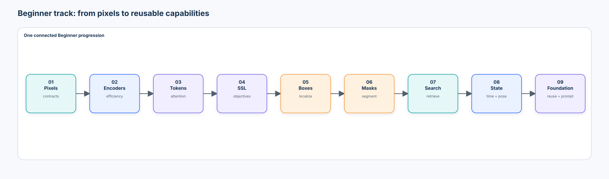
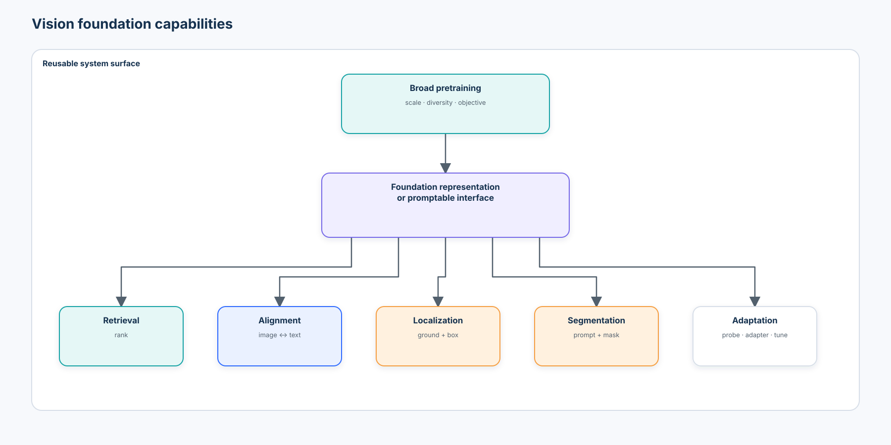
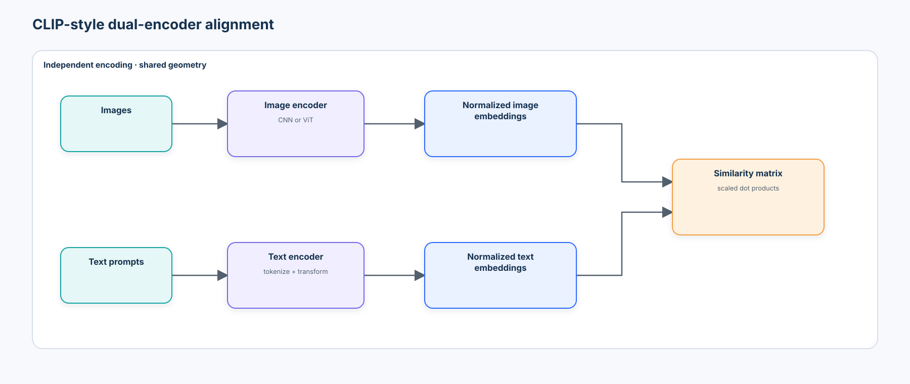
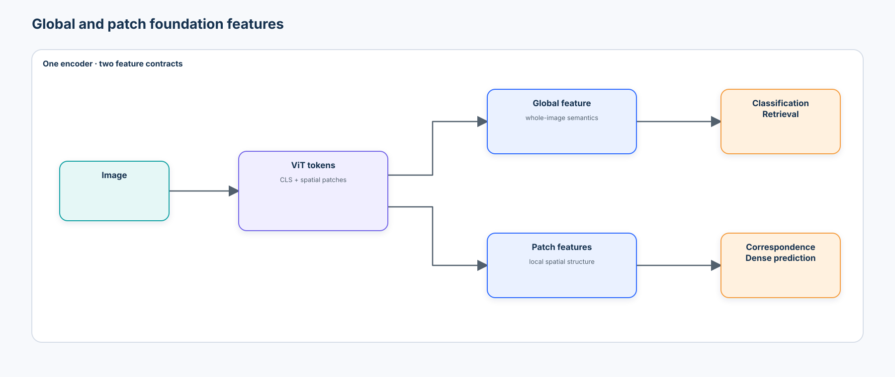
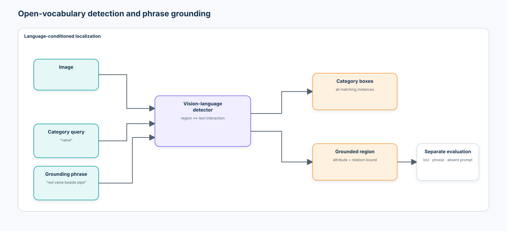
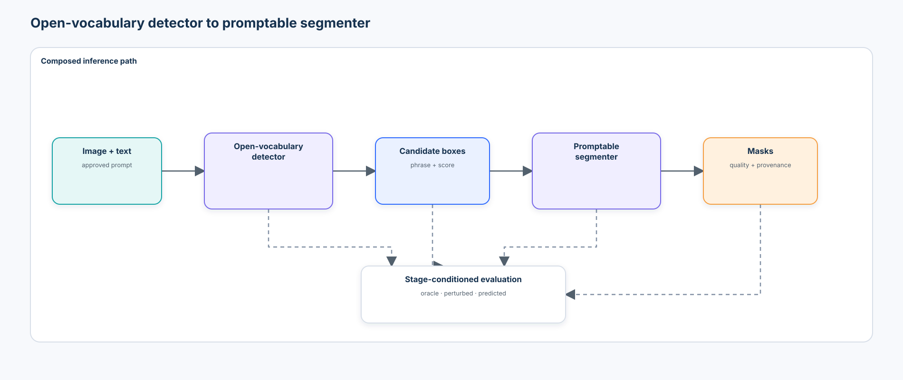
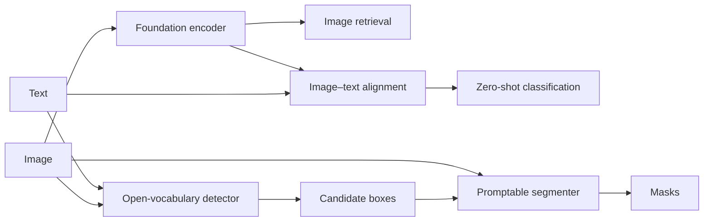
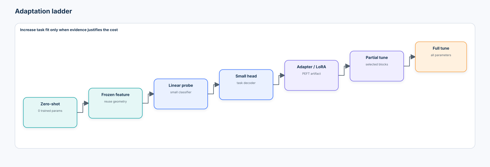
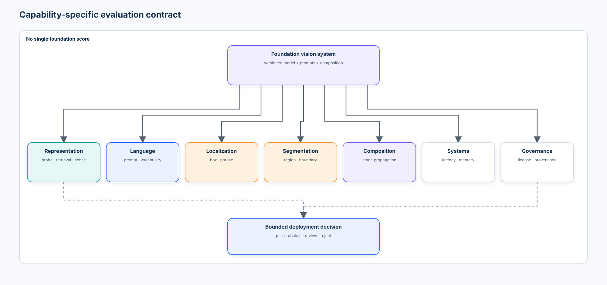
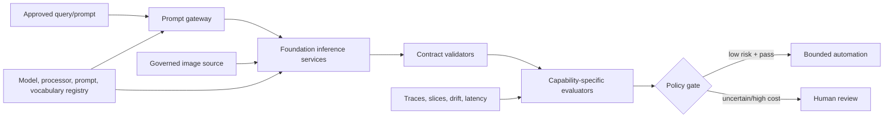

# Beginner 09 — Vision Foundation Models & Open-Vocabulary Vision

> From reusable representations to promptable visual systems—and from impressive demos to capability-specific evidence.

## 1. Central question

> Can one reusable visual representation support many tasks that previously required separate task-specific models?

Courses 01–08 built explicit contracts for classification, efficient encoding, tokens, self-supervision, detection, segmentation, retrieval, tracking, and pose. Course 09 asks what can be reused across those contracts and what must remain task-specific.



```text
large, diverse pretraining
            ↓
 foundation representation or interface
            ↓
retrieval · classification · grounding · detection · segmentation
```

The synthesis is deliberately cautious:

> Foundation models increase capability reuse. They do not remove task-specific evaluation, failure analysis, system contracts, or accountable operating policy.

## 2. Learning objectives and boundaries

After this course, you should be able to:

- define a vision foundation model in terms of broad pretraining, transfer, and reusable interfaces—not parameter count alone;
- distinguish supervised, self-supervised, and image–text pretraining;
- explain representation foundation models, cross-modal representations, and promptable interfaces;
- implement normalized image–text similarity and a CLIP-style symmetric contrastive loss;
- evaluate zero-shot classification, prompt templates, prompt ensembles, vocabulary sensitivity, and abstention;
- compare global and patch-level features through retrieval and correspondence contracts;
- distinguish closed-set, open-vocabulary, and open-world behavior;
- distinguish category detection from phrase grounding;
- explain Grounding DINO-style language-conditioned localization and SAM-style promptable masks;
- measure detector-to-segmenter error propagation with oracle and predicted boxes kept separate;
- compare zero-shot, frozen-feature, linear-probe, small-head, adapter, partial-fine-tune, and full-fine-tune choices;
- compare specialist and foundation systems fairly across quality, latency, memory, maintenance, and risk;
- record model, code, checkpoint, preprocessing, prompt, vocabulary, license, and evaluation provenance; and
- design an enterprise foundation-vision architecture with explicit review and fallback paths.

**Prerequisites:** [Course 03](../03-vision-transformers/README.md), [Course 04](../04-self-supervised-visual-representation-learning/README.md), [Course 05](../05-object-detection/README.md), [Course 06](../06-segmentation-promptable-segmentation/README.md), and [Course 07](../07-visual-embeddings-metric-learning-retrieval/README.md). Course 08 contributes temporal state and failure-propagation discipline.

**Scenario:** a manufacturing team must find newly named component conditions, retrieve similar cases, ground a phrase to regions, and produce reviewable masks before enough labels exist for a new specialist system.

**Success criteria:** the notebook's known-answer checks pass; development and held-out source remain separate; prompts and candidate vocabularies are versioned; local proxies are never reported as foundation-model observations; oracle and end-to-end composition results remain separate; and the final evidence artifact distinguishes measured, optional, and unresolved evidence.

**Non-goals:** reproducing large-scale pretraining, establishing a leaderboard, teaching full multimodal generation, or approving automated safety decisions.

**Risk boundaries:** all default images and labels are procedural. No credentials, remote code, large checkpoints, people, or biometric identity are used. Optional downloaded models are disabled by default and require separate approval, license review, artifact hashes, and target-domain evaluation.

## 3. The Beginner-track synthesis

```text
01 represent visual information
02 design efficient encoders
03 represent images as tokens
04 learn without manual labels
05 localize objects
06 segment regions
07 search representation spaces
08 maintain structured visual state
09 reuse representations and interfaces across tasks
```

Course 09 is not an unrelated catalogue. Its capabilities are composed from earlier primitives:

| Earlier contract | Reused in Course 09 | What still needs its own evaluation |
| --- | --- | --- |
| image tensors and calibration | governed processor and score contract | source shift, calibration, abstention |
| ViT tokens | global and patch features | resolution, positional behavior, dense quality |
| SSL geometry | frozen reusable features | probe, retrieval, correspondence, collapse |
| boxes and matching | language-conditioned localization | IoU, precision/recall, phrase correctness |
| masks and prompts | prompt-conditioned segmentation | region, boundary, topology, correction effort |
| retrieval space | image–image and image–text search | relevance, source bias, index/version policy |
| temporal state | future concept tracking and video prompts | identity, latency, drift, recovery |

## 4. What is a vision foundation model?

A practical definition is:

> A vision foundation model is pretrained on sufficiently broad data and objectives that its representation or task interface can be reused across multiple downstream visual tasks.

That definition has six parts: scale, diversity, a broad objective, transfer, reusable features or interfaces, and adaptation. A large checkpoint trained for one fixed taxonomy may be an excellent pretrained specialist without being a useful foundation model.

```text
task-specific model                 foundation model
target dataset                      broad pretraining corpus
      ↓                                      ↓
one training objective              reusable representation/interface
      ↓                                      ↓
one output contract                 multiple downstream contracts
```

The term comes with social and operational consequences too: training-data provenance, licenses, access gates, compute concentration, representational bias, and downstream misuse do not disappear when reuse improves.

## 5. Capabilities and interfaces—not a model catalogue



| Capability | Input → output | Representative case study | Contract that remains local |
| --- | --- | --- | --- |
| representation | image → global/patch features | DINO family | feature layer, normalization, resolution |
| alignment | image/text → shared space | CLIP, SigLIP | prompts, vocabulary, similarity, calibration |
| prompting | image + point/box/text/example → conditioned output | SAM family | prompt semantics and user effort |
| localization | image + phrase → boxes/scores | Grounding DINO | box and phrase correctness |
| segmentation | image + prompt → masks/quality | SAM family | region, boundary, topology, quality calibration |
| adaptation | frozen model + data → downstream behavior | probes, adapters, LoRA | trainable scope, drift, reproducibility |
| composition | multiple capabilities → system result | detector → segmenter | end-to-end propagation and fallback |

Categories overlap. SAM 3, for example, combines representation, concept prompting, detection, segmentation, and tracking. The capability contract is more durable than a product name.

## 6. Three pretraining paradigms

| Paradigm | Learning signal | Typical strength | Important limitation |
| --- | --- | --- | --- |
| supervised large-scale | human category labels | task-aligned semantics | taxonomy and annotation constraints |
| self-supervised visual | relationships or missing content derived from images | transferable visual and dense structure | semantics are not automatically language addressable |
| image–text | naturally paired image and language | open textual query interface | caption bias, prompt sensitivity, weak fine-grained grounding |

Course 04 showed that objectives shape geometry. Course 09 adds a second representation and asks whether language can address that geometry.

## 7. Foundation representation versus foundation interface

```text
representation model                 promptable interface
image → reusable features            image + prompt → task output
```

DINO-style features are primarily reusable representations. CLIP-style systems expose aligned image and text representations. SAM-style systems expose a prompt-conditioned mask interface. Grounding DINO-style systems expose language-conditioned localization. These are tendencies, not rigid boxes.

The reusable object might therefore be:

- model weights;
- a global embedding space;
- patch tokens;
- an image embedding cached for repeated prompts;
- a prompt grammar;
- a task-conditioned decoder; or
- a composed service contract.

## 8. CLIP-style dual encoders



An image encoder and text encoder are trained so matched pairs score higher than mismatched pairs. For image \(x\) and text \(t\):

$$
z_I = \frac{f_I(x)}{\lVert f_I(x)\rVert_2}, \qquad
z_T = \frac{f_T(t)}{\lVert f_T(t)\rVert_2}
$$

$$
s(x,t)=z_I^\top z_T, \qquad
\ell_{ij}=\exp(\tau) z_{I,i}^\top z_{T,j}
$$

where \(\exp(\tau)\) is a learned positive logit scale. A CLIP-style batch objective applies cross-entropy in both image→text and text→image directions. Course 04's contrastive matrix and Course 07's normalized retrieval geometry are now cross-modal.

### SigLIP-style alignment

CLIP's batch softmax treats the paired item as the positive among the current batch. SigLIP replaces the global softmax normalization with pairwise sigmoid losses. [SigLIP 2](https://arxiv.org/abs/2502.14786) adds multilingual and localization-aware training ingredients, including self-distillation and masked prediction. This evolution is evidence that image–text alignment is a design family, not one finished recipe.

Do not compare objectives from descriptions alone. Match data, encoder, batch budget, resolution, and evaluation.

## 9. Zero-shot classification is similarity-based decision making

For labels `scratch`, `dent`, `contamination`, and `normal`, build prompts such as:

```text
"a close-up inspection photo of a scratched connector"
"a close-up inspection photo of a dented connector"
...
```

Encode prompts, compare the image embedding with each text embedding, and choose or abstain. No task-specific class head is trained, but the decision still depends on:

- the pretraining distribution;
- preprocessing and embedding layer;
- prompt template;
- candidate label set;
- aggregation and logit scale;
- decision threshold; and
- source distribution.

Zero-shot means no target-task parameter update—not no assumptions.

## 10. Prompt templates and ensembles

`scratch`, `a scratch`, and `an industrial connector with surface scratching` can occupy different locations in text space. Prompt wording is therefore part of the versioned input contract.

Prompt ensembling encodes several approved templates for one concept and aggregates their normalized features or logits. It may reduce template variance; it does not prove semantic coverage.

Evaluate:

- per-template macro F1;
- prediction agreement across paraphrases;
- worst-template recall;
- calibration and abstention;
- source slices; and
- template provenance.

When a prompt suite is evaluated on a locked test source, those rows are reporting only. Do not select, rewrite, or drop templates from test results. Operational template selection belongs on development data, followed by one frozen evaluation on the held-out source.

## 11. Candidate-vocabulary sensitivity

Zero-shot classification is relative. Adding `corrosion` to `[scratch, dent, normal]` changes the normalization and can change every posterior-like score, even when image–text similarities are unchanged.

```text
same image + same prompt
             ↓
different competing vocabulary
             ↓
possibly different decision
```

Record the complete ordered vocabulary, synonyms, exclusions, background/unknown policy, and thresholds. A class score is not a stable probability across vocabulary revisions.

## 12. Zero-shot is not open-world recognition

| Term | What it promises | What it does not promise |
| --- | --- | --- |
| closed set | predict among fixed trained classes | recognize unmodeled concepts |
| open vocabulary | accept textual concepts beyond one fixed head | reliably recognize every valid phrase |
| open set recognition | reject samples outside known classes | localize arbitrary described objects |
| open world | detect unknowns and update knowledge over time | solved, universal recognition |

An arbitrary string is a syntactic input capability, not evidence of semantic competence.

## 13. Self-supervised foundation features

DINO-family encoders produce global and patch-level visual features without requiring image captions. DINOv2 is a widely reusable reference with Apache-2.0 code/model cards; DINOv3 is the current research case study reviewed here and uses a custom DINOv3 License with gated weights. The newer model is not automatically the correct enterprise choice.



Use the global token for whole-image classification or retrieval. Use patch tokens when the contract depends on local structure, correspondence, depth, or dense prediction. A strong global classifier does not prove strong local features.

## 14. Patch correspondence

For a query patch \(p\) in image A and patch features \(h_B(q)\) in image B:

$$
q^*=\arg\max_q \frac{h_A(p)^\top h_B(q)}{\lVert h_A(p)\rVert_2\lVert h_B(q)\rVert_2}
$$

Correspondence can fail under repeated texture, large viewpoint change, occlusion, feature stride, resizing, or a representation trained for global invariance. Evaluate geometric correctness, not only similarity magnitude.

## 15. Foundation features for retrieval

Reuse Course 07's contract and compare representations under two complementary protocols:

1. **Cross-source generalization:** Factory C queries search a Factory A/B gallery. This measures semantic retrieval on an unseen source, but cannot measure same-source preference because Factory C is absent from the gallery.
2. **Source-bias diagnostic:** mixed Factory A/B/C queries search a mixed gallery with the query itself excluded. Report same-label@K, same-source@K, the eligible-gallery same-source baseline, and excess same-source rate above that baseline.

Compare each protocol for:

- specialist supervised feature;
- self-supervised-style visual feature;
- image–text aligned feature.

Report P@K, Recall@K, mAP, class/source separation, and failure examples. A useful defect-retrieval representation should preserve semantic neighbors without unnecessary factory clustering; raw same-source@K is interpreted relative to the gallery composition rather than treated as intrinsically good or bad. Different objectives can win for semantic retrieval, instance retrieval, source invariance, and text-to-image search. There is no context-free “best embedding.”

## 16. Open-vocabulary detection



A fixed detector maps an image to boxes over a trained category head. An open-vocabulary detector also accepts text concepts and aligns region evidence with language. The contract becomes:

```text
image + ordered prompts
        ↓
boxes + phrase spans/labels + scores
```

This creates new failure axes: text tokenization, synonyms, prompt order, absent concepts, region–word alignment, attribute binding, and score calibration.

## 17. Category detection versus phrase grounding

**Open-vocabulary category detection** asks for instances of `fire extinguisher`.

**Phrase grounding** asks for the region corresponding to `the red extinguisher beside the exit`.

Both use language-conditioned localization, but phrase grounding must bind attributes and relations to the correct referent. Category AP alone does not test that contract.

An honest relational grounding experiment must represent both entities and their spatial relationship. The notebook builds candidate-region descriptors, identifies a relation target such as `pipe`, constructs pairwise features such as `left_of`, `right_of`, distance, and vertical overlap, and combines referent evidence with the requested relation. Treating `beside` as an absolute left-position token would test location bias, not a relation.

## 18. Grounding DINO-style architecture

Grounding DINO connects DETR-style set prediction from Course 05 with language conditioning. A visual backbone and text encoder produce features; cross-modal enhancement and language-guided queries help a decoder predict boxes aligned with words or phrases.

The full architecture is more complex than “CLIP plus DETR.” The key beginner lesson is that localization and semantic addressing interact before the final box head.

Evaluation should include:

- IoU at explicit thresholds;
- phrase/category correctness;
- precision and recall, including absent prompts;
- synonym and paraphrase stability;
- attribute/relation binding;
- seen/unseen and source slices; and
- threshold selection on development data only.

## 19. Promptable segmentation revisited

Course 06 introduced image embeddings, prompt encoders, and mask decoders. Here the focus is capability composition. A promptable segmenter may consume a point, box, mask, text, or exemplar depending on the model generation.

The official SAM 3 family now supports concept prompts, detection, segmentation, and tracking; the March 27, 2026 SAM 3.1 release adds Object Multiplex and updated checkpoints. It requires gated access, a CUDA-oriented stack, and the custom SAM License. Those facts were rechecked against the official repository and release at the revisions recorded in the notebook. A locally generated mask proxy is never a SAM result.

## 20. Open-vocabulary detector → promptable segmenter



```text
text ambiguity → grounding error → box error → mask error → decision error
```

Evaluate at least three boundaries:

1. **oracle-box segmentation** isolates the segmenter under ideal prompts;
2. **perturbed-box segmentation** measures prompt sensitivity;
3. **detector-box → segmentation** measures the end-to-end system.

Never report oracle-box quality as end-to-end quality. A precise mask around the wrong object is still a system failure.

## 21. A reusable capability graph still has multiple contracts



Reuse reduces duplicated pretraining. It does not merge the retrieval, classification, box, phrase, mask, latency, and human-review contracts into one metric.

## 22. Composition error propagation

If \(D\) is detector recall and \(S\) is conditional mask success given a correct box, a rough upper bound on end-to-end success is \(D\times S\). Errors are rarely independent, so the real system must measure stage-conditioned outcomes:

| Stage event | Diagnostic |
| --- | --- |
| prompt missed concept | synonym/paraphrase slice |
| detector selected wrong instance | phrase-binding and box error |
| box was loose/tight | oracle-to-perturbed prompt curve |
| segmenter chose wrong component | prompt and topology failure |
| downstream rule misused mask | decision-policy audit |

The notebook emits per-stage events rather than one opaque score.

## 23. Specialist versus foundation systems

| Dimension | Specialist | Foundation system |
| --- | --- | --- |
| intended scope | narrow | broad/reusable |
| downstream labels | usually required | potentially fewer |
| new categories | retrain or extend head | sometimes promptable |
| model size/latency | often smaller/lower | often larger/higher |
| behavior surface | bounded taxonomy | prompt and vocabulary dependent |
| predictability | often easier to characterize | more variable across concepts |
| maintenance | task model versions | model + processor + prompt + composition versions |
| evaluation | task-specific | still task-specific, plus interface robustness |

A foundation system can accelerate discovery and bootstrapping. A specialist can remain preferable when the taxonomy is stable, the target is constrained, latency is tight, or validation demands a smaller behavior surface.

## 24. The adaptation ladder



| Step | Trainable scope | Best early question | Main risk |
| --- | --- | --- | --- |
| zero-shot | none | does alignment already address the taxonomy? | prompt and domain mismatch |
| frozen feature | none | is geometry reusable? | wrong layer/pooling contract |
| linear probe | linear head | are classes already separable? | hides dense/local weakness |
| small task head | shallow decoder/head | can bounded capacity solve the task? | interface coupling |
| adapter / LoRA / visual prompt tuning | small inserted parameters/prompts | is parameter-efficient adaptation enough? | implementation/export fragmentation |
| partial fine-tune | selected blocks | where is task-specific change needed? | representation drift |
| full fine-tune | all parameters | is broad adaptation justified? | cost, forgetting, maintenance |

Always start with the least adaptive baseline that can falsify the need for more training. Record trainable parameter count, data, seeds, drift, and deployment artifact.

## 25. Parameter-efficient adaptation

Adapters add small trainable modules; LoRA learns low-rank updates to selected weight matrices; visual prompt tuning learns task-specific prompt tokens. These techniques can reduce trainable parameters, but they do not make adaptation free:

- target layers and ranks are new hyperparameters;
- merged and unmerged artifacts need provenance;
- export/runtime support varies;
- base-model and adapter versions must match;
- small adapters can still overfit or encode sensitive data; and
- changed features can invalidate retrieval indexes and thresholds.

Course 09 introduces the decision; later courses can implement full PEFT training.

## 26. Evaluation is capability-specific



| Capability | Core evidence | Robustness evidence |
| --- | --- | --- |
| zero-shot classification | macro F1, per-class recall, calibration | prompt/vocabulary/source sensitivity |
| retrieval | P@K, Recall@K, mAP | source bias, duplicates, hard negatives |
| patch correspondence | correct-match rate, spatial error | viewpoint, lighting, repeated texture |
| grounding | box IoU, phrase correctness, precision/recall | synonyms, attributes, absent prompts |
| segmentation | IoU, Dice, boundary F1, topology | box/point/text perturbation, correction effort |
| composition | end-to-end success and stage-conditioned failures | oracle vs predicted inputs, cascades |
| systems | latency distribution, memory, throughput | concurrency, fallback, target hardware |
| governance | complete manifests and approvals | revocation, rollback, data/license change |

Do not average incompatible capabilities into one “foundation score.”

## 27. Prompt robustness is a release contract

Build an approved prompt suite with:

- canonical term;
- synonyms;
- paraphrases;
- attributes and relations;
- absent/negative concepts;
- confusing neighbors;
- multilingual terms if the product supports them; and
- adversarial or policy-restricted content when relevant.

Measure mean, worst-case, and disagreement. A prompt improvement chosen on the test set is test leakage.

## 28. Calibration, unknowns, and abstention

Softmax over text similarities produces a normalized number, not a calibrated probability that the concept is present. This is especially dangerous when every candidate class is wrong.

Useful policies include:

- minimum similarity or energy threshold;
- margin between the first and second concept;
- explicit `unknown/other` evaluation;
- detector no-object threshold;
- stage-specific confidence gates; and
- human review for costly actions.

Thresholds are selected on development data, then frozen before held-out evaluation.

## 29. Failure taxonomy

- **representation failure:** global semantics erase local detail;
- **alignment failure:** visual evidence and domain language do not meet;
- **prompt failure:** wording or vocabulary changes the result;
- **binding failure:** attributes or relations attach to the wrong region;
- **localization failure:** correct concept, poor box;
- **segmentation failure:** plausible box, poor boundary/topology;
- **composition failure:** upstream error is amplified downstream;
- **source shortcut:** background/site dominates the feature;
- **unknown overconfidence:** forced selection for absent concepts;
- **provenance failure:** model, data, or processor cannot be reconstructed;
- **policy failure:** flexible prompts expose prohibited or sensitive outputs; and
- **systems failure:** memory, latency, or dependency stack violates deployment constraints.

The notebook maps each failed example to a stage and mitigation hypothesis.

## 30. Tooling landscape

| Tool | Best fit | What it makes easy | What it can hide / governance concern |
| --- | --- | --- | --- |
| NumPy, PyTorch, torchvision | transparent local primitives and specialist baseline | tensor math, losses, probes, image ops | developer owns every processor and metric contract |
| Hugging Face Transformers | common model/processor interface for CLIP, SigLIP2, DINOv2, Grounding DINO | model cards, immutable revisions, familiar inference APIs | processor defaults, cache/network behavior, rapidly changing APIs, weight licenses |
| OpenCLIP | broad CLIP-family checkpoint research | many image–text encoders and training recipes | checkpoint/data provenance differs across entries |
| official DINOv2/DINOv3 | reference global/dense features | author implementations and weights | revision, access, preprocessing, custom DINOv3 license |
| official Grounding DINO | research reproduction | inspectable language-conditioned detection | compiled/native stack, release age, token/threshold semantics |
| official SAM 3/3.1 | concept, visual-prompt, image/video segmentation and tracking | current unified promptable interface | gated weights, custom license, large CUDA-oriented deployment |
| PEFT | adapters/LoRA management where supported | standardized configuration and artifact handling | module targeting and export compatibility remain model-specific |
| FiftyOne/CVAT/Label Studio | slice inspection and adjudication | human review and visual error analysis | permissions, data retention, ontology/export semantics |

The default notebook uses the first row and scikit-learn. Optional Hugging Face and official-repository paths are manifests plus guarded adapters—never silent downloads.

## 31. Optional-model governance

A production-eligible downloaded-model run must record:

```json
{
  "model_id": "organization/model",
  "model_revision": "full immutable SHA",
  "source_repository": "organization/repository",
  "source_revision": "full immutable SHA",
  "processor_class": "...",
  "library_versions": {"transformers": "...", "torch": "..."},
  "checkpoint_sha256": "...",
  "license_review": "approved decision reference",
  "prompt_suite_version": "...",
  "candidate_vocabulary_version": "...",
  "evaluation_dataset_version": "..."
}
```

Pinning Python packages is insufficient. Pinning source code does not pin checkpoint bytes. A model-card license field is not legal approval, and a code license does not necessarily govern training data or weights.

The guarded teaching adapters may be used as smoke tests before all artifacts are hashed, but they must then emit `artifact_hash_status: not_collected` and `production_provenance_complete: false`. Such observations cannot enter model comparisons or release decisions until the missing processor and checkpoint hashes are resolved.

## 32. Current model ecosystem reviewed in 2026

Review date: **2026-09-03**.

### Established practice

- **CLIP-style dual encoders** remain a foundational pattern for zero-shot classification and image–text retrieval. The official OpenAI code is MIT licensed; downstream users must still review weights, data provenance, and fitness for purpose.
- **DINOv2** remains a practical self-supervised feature baseline with global and patch representations and common Hugging Face APIs.
- **Grounding DINO** remains an influential, available language-conditioned detection reference with Apache-2.0 code and checkpoints exposed through common model/processor APIs.

### Rapidly consolidating

- **SigLIP 2** extends sigmoid image–text learning with multilingual, localization-aware, and flexible-resolution variants. It is a strong current comparison, not proof that every checkpoint transfers to industrial imagery.
- **DINOv3** scales self-supervised visual features and emphasizes dense transfer. Official weights are gated and governed by a custom license; treat author results as model-specific evidence until reproduced.
- **SAM 3/3.1** unifies concept prompting, segmentation, detection, and tracking across image/video. Its scale, custom license, access, and hardware requirements matter as much as capability.

### Research frontier and open problems

- stable open-world unknown discovery rather than arbitrary-string input;
- compositional grounding of fine-grained attributes and relations;
- calibrated confidence across changing vocabularies;
- trustworthy dense features under viewpoint and domain shift;
- efficient/on-device foundation inference;
- continual adaptation without forgetting or index invalidation;
- complete data provenance and opt-out mechanisms; and
- system-level evaluation for composed foundation pipelines.

“Current” does not mean “production approved.” Recheck every revision, model card, license, benchmark, and hardware claim.

## 33. Practical lab — reusable visual capabilities under one contract

The self-contained [notebook](lab.ipynb) uses one procedural inspection corpus and common SDKs to:

1. create source-separated images, boxes, masks, phrases, and a novel concept;
2. implement normalized similarity and the CLIP-style symmetric loss;
3. compare prompt templates, ensembles, vocabulary revisions, and abstention;
4. compare specialist, self-supervised-style, and aligned proxy representations;
5. test global retrieval and patch correspondence separately;
6. implement a transparent open-vocabulary grounding proxy;
7. distinguish category detection from relational phrase grounding;
8. compose predicted boxes with a promptable mask proxy;
9. compare oracle, perturbed, and detected-box segmentation;
10. compare zero-shot and frozen linear-probe adaptation;
11. attribute failures by stage and source; and
12. write `artifacts/course-09-foundation-vision-evidence.json`.

Every local row includes:

```json
{"engine": "local_teaching_proxy", "foundation_model": false}
```

Optional official model observations live in a separate array and are empty on the default run.

Run from the repository root:

```bash
python -m pip install -r curriculum/beginner/09-vision-foundation-models-open-vocabulary/requirements.txt
jupyter lab curriculum/beginner/09-vision-foundation-models-open-vocabulary/lab.ipynb
```

## 34. Enterprise architecture



Production boundaries should include:

- prompt allow/deny and normalization policy;
- tenant and data authorization before inference or retrieval;
- immutable model/processor/prompt/vocabulary bundles;
- isolated caches and artifact stores;
- per-capability thresholds and fallbacks;
- latency, memory, concurrency, and cost budgets;
- audit logs without sensitive raw prompt/image leakage;
- human adjudication and override;
- canary, rollback, and kill-switch paths; and
- ongoing source-, concept-, and prompt-slice evaluation.

## 35. Production decision artifact

Choose among:

```text
reuse specialist
reuse zero-shot foundation interface
freeze foundation features + train probe/head
parameter-efficient adaptation
partial/full fine-tuning
compose detector + segmenter
collect more labels first
```

The decision record should include domain gap, taxonomy volatility, label budget, compute, target hardware, latency, memory, privacy, licenses, source/checkpoint provenance, prompt stability, capability metrics, end-to-end failures, review cost, expected reuse horizon, and rollback.

## 36. Anti-patterns

- calling any large pretrained model a foundation model;
- using model names as the curriculum structure;
- reporting a local proxy as a downloaded foundation checkpoint;
- treating zero-shot as prompt-independent or open-world;
- changing candidate labels without reevaluation;
- comparing a prompted model with a specialist while ignoring prompt information/cost;
- evaluating global embeddings and claiming dense correspondence quality;
- reporting oracle boxes as detector→segmenter performance;
- averaging classification, box, mask, and latency into one opaque score;
- downloading `main` or executing remote code implicitly;
- assuming code, weights, and data share a license;
- fine-tuning before testing frozen features;
- updating an encoder without rebuilding its retrieval index; and
- allowing a flexible prompt to trigger an unbounded automated action.

## 37. Exercises

### Implementation

1. Add two domain-valid prompt templates and measure mean and worst-template recall.
2. Add an absent class and tune an abstention rule using development data only.
3. Implement text-to-image retrieval and compare it with image-to-image retrieval.
4. Replace mean patch descriptors with color-plus-gradient descriptors and measure correspondence.

### Diagnosis

5. Find a sample whose prediction changes when one competitor is added. Explain the geometry.
6. Create two legitimate adjacent objects that the grounding proxy merges, then classify the downstream mask failure.
7. Inject a correct-category but wrong-instance box. Show why mask IoU alone can obscure phrase-binding failure.
8. Identify whether held-out-source degradation begins at alignment, localization, or segmentation.

### Architecture judgment

9. Choose between a specialist, zero-shot interface, frozen probe, and adapter for a stable four-class edge deployment.
10. Design a manifest and rollback plan for a new processor revision.
11. Specify fair information budgets for comparing automatic semantic segmentation with box-prompted segmentation.
12. Define what evidence would justify adopting DINOv3 or SAM 3.1 under your organization's license and hardware policy.

## 38. What you should now be able to explain without code

1. Why is a foundation model not merely a very large pretrained model?
2. What can be reusable: weights, representation, prompt interface, or system component?
3. How do supervised, self-supervised, and image–text pretraining differ?
4. How does a dual encoder enable zero-shot classification?
5. Why can a prompt template change a zero-shot result?
6. Why can adding a competing label change every class score?
7. Why is open vocabulary not the same as open world?
8. What is the difference between a global and a patch feature?
9. Why can a retrieval winner lose on patch correspondence?
10. How does phrase grounding differ from category detection?
11. What does language add to a DETR-style detector?
12. Why must oracle-box and detector-box mask quality be separate?
13. How can one upstream error propagate through a composed system?
14. When can a specialist be preferable to a foundation system?
15. Why start with zero-shot or frozen features before fine-tuning?
16. What new artifacts do adapters and LoRA require?
17. Why is a model confidence not automatically calibrated across vocabularies?
18. What provenance is missing if only the model name is recorded?
19. Why do foundation models still require task-specific evaluation?
20. What changes as the curriculum moves from visual foundation systems to multimodal reasoning?

## 39. Transition to Intermediate

Beginner ends with reusable perception interfaces. Intermediate begins when language, images, documents, video, retrieval, and tools participate in longer reasoning workflows.

```text
Beginner 09
reusable representation + grounded output contracts
                         ↓
Intermediate
multimodal architecture + reasoning + retrieval + agents
```

The boundary remains important: a grounded visual output is evidence for reasoning, not permission to act.

## 40. Primary research and official sources

### Foundations and alignment

- Bommasani et al., [On the Opportunities and Risks of Foundation Models](https://arxiv.org/abs/2108.07258).
- Radford et al., [Learning Transferable Visual Models From Natural Language Supervision](https://arxiv.org/abs/2103.00020) and the [official OpenAI CLIP repository](https://github.com/openai/CLIP).
- Zhai et al., [Sigmoid Loss for Language Image Pre-Training](https://arxiv.org/abs/2303.15343).
- Tschannen et al., [SigLIP 2](https://arxiv.org/abs/2502.14786), the [official Big Vision repository](https://github.com/google-research/big_vision), and [Transformers SigLIP2 documentation](https://huggingface.co/docs/transformers/model_doc/siglip2).

### Self-supervised foundation features

- Oquab et al., [DINOv2: Learning Robust Visual Features without Supervision](https://arxiv.org/abs/2304.07193), the [official repository](https://github.com/facebookresearch/dinov2), and [Transformers DINOv2 documentation](https://huggingface.co/docs/transformers/model_doc/dinov2).
- Siméoni et al., [DINOv3](https://arxiv.org/abs/2508.10104), the [official repository](https://github.com/facebookresearch/dinov3), and [official research page](https://ai.meta.com/research/publications/dinov3/).

### Open-vocabulary localization and segmentation

- Liu et al., [Grounding DINO](https://arxiv.org/abs/2303.05499), the [official repository](https://github.com/IDEA-Research/GroundingDINO), and [Transformers documentation](https://huggingface.co/docs/transformers/model_doc/grounding-dino).
- Minderer et al., [Simple Open-Vocabulary Object Detection with Vision Transformers](https://arxiv.org/abs/2205.06230) (OWL-ViT).
- Kirillov et al., [Segment Anything](https://arxiv.org/abs/2304.02643).
- Carion et al., [SAM 3: Segment Anything with Concepts](https://ai.meta.com/research/publications/sam-3-segment-anything-with-concepts/), the [official SAM 3 repository](https://github.com/facebookresearch/sam3), and [SAM 3.1 release notes](https://github.com/facebookresearch/sam3/blob/main/RELEASE_SAM3p1.md).

### Adaptation and evaluation

- Hu et al., [LoRA: Low-Rank Adaptation of Large Language Models](https://arxiv.org/abs/2106.09685).
- Jia et al., [Visual Prompt Tuning](https://arxiv.org/abs/2203.12119).
- [Hugging Face PEFT documentation](https://huggingface.co/docs/peft/index).
- [FiftyOne evaluation documentation](https://docs.voxel51.com/user_guide/evaluation.html).

All version-specific statements were reviewed on **2026-09-03**. Author-reported benchmark claims are not reproduced by the CPU default lab and are not presented as local evidence.
