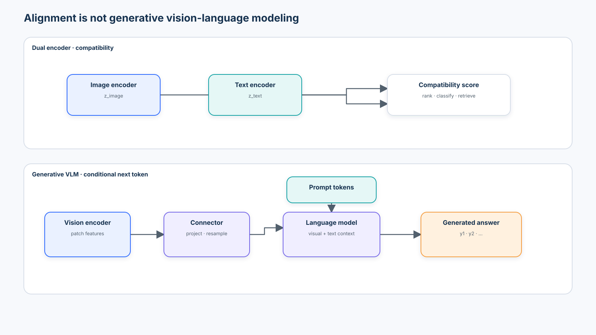
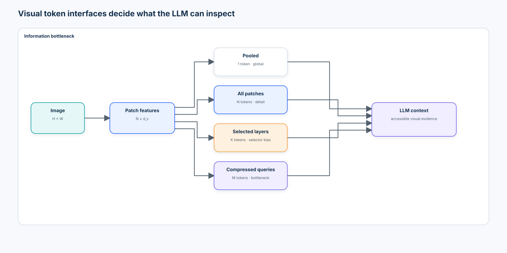
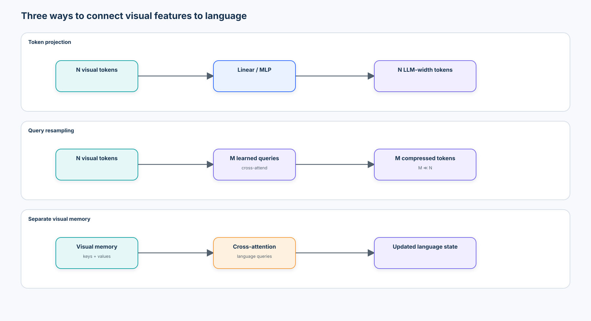
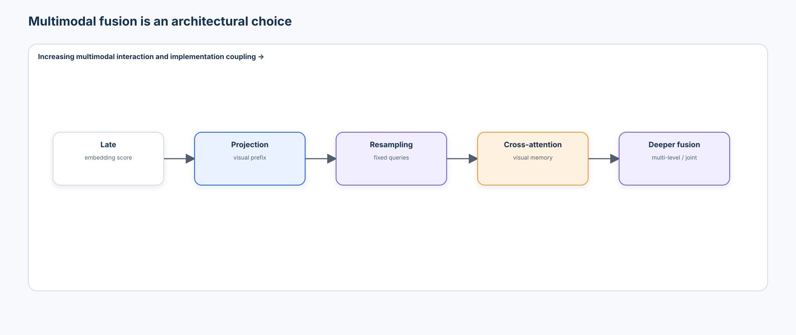
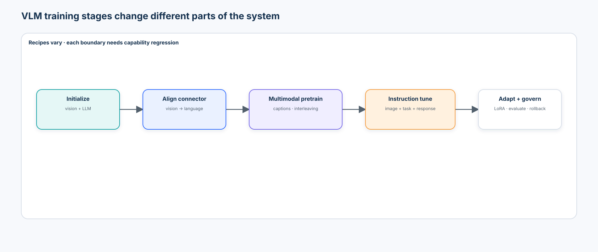
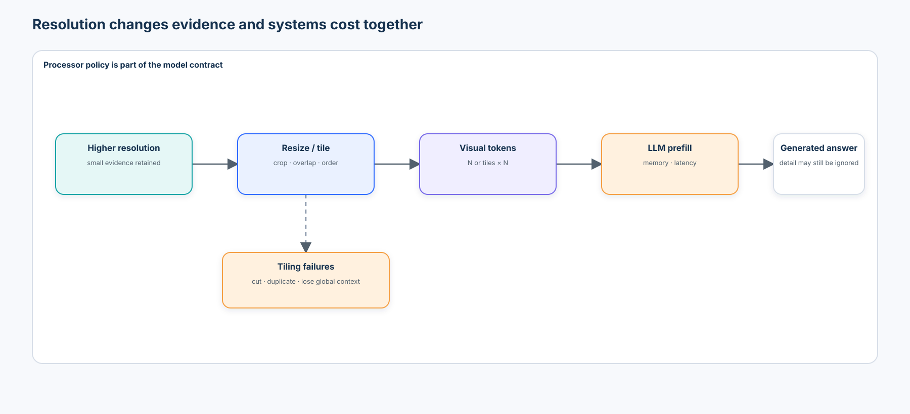
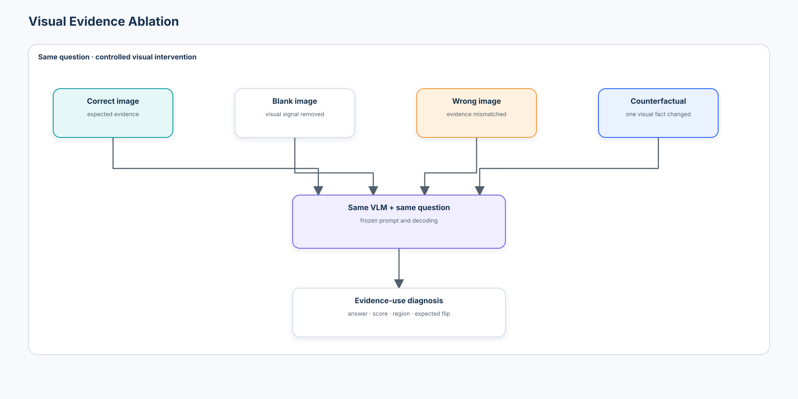
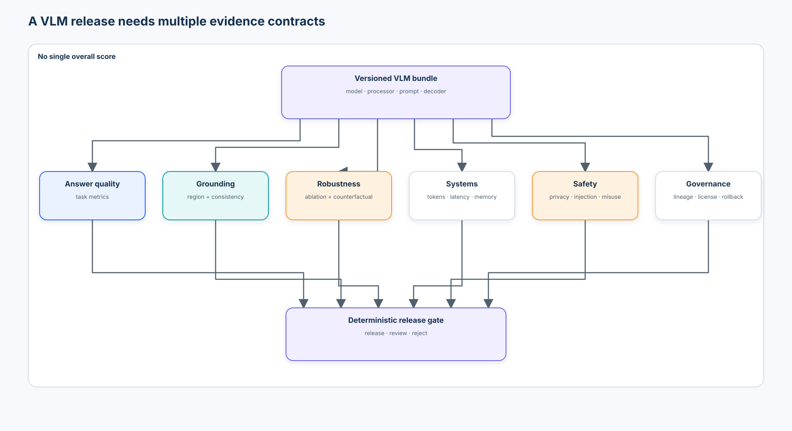
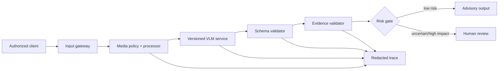

# Intermediate 01 — Vision-Language Models: From Visual Features to Multimodal Reasoning

> How does a system move from aligning images with language to consuming visual information inside a language model and generating answers that remain tied to what it sees?

[Beginner 09](../../beginner/09-vision-foundation-models-open-vocabulary/README.md) ended with reusable visual representations, image–text alignment, open-vocabulary grounding, and promptable interfaces. This course begins the Intermediate track by putting visual tokens inside a generative language system.

```text
Beginner 09                         Intermediate 01
image ↔ text compatibility          image + text → shared context → language
classification · retrieval          answers · explanations · comparisons
grounded boxes/masks                generated claims + evaluated evidence
```

The architectural shift matters because a plausible next token can be produced even when visual evidence is weak. A VLM therefore needs separate contracts for perception, language generation, grounding, reasoning, uncertainty, systems behavior, and governance.

## 1. Learning outcomes

By the end, you should be able to:

1. distinguish a CLIP-style dual encoder from a generative VLM;
2. trace an image through patch tokens, a connector, an LLM context, and autoregressive generation;
3. calculate visual-token, attention, and KV-cache implications of resolution and multi-image input;
4. compare pooled, projected, resampled, and cross-attended visual interfaces;
5. explain linear/MLP projectors and query-based resamplers without claiming that dimension matching creates intelligence;
6. distinguish multimodal pretraining, alignment, instruction tuning, preference tuning, and task adaptation;
7. explain dynamic tiling, image identity, ordering, and interleaved context contracts;
8. separate recognition, grounding, and reasoning tasks;
9. design controlled counting, spatial, comparison, absence, and prompt-robustness evaluations;
10. detect language-prior dependence with blank-image, wrong-image, and counterfactual-image tests;
11. validate structured answers and their evidence independently;
12. compare exact, normalized, set-valued, spatial, and review-based metrics;
13. frame LoRA/adapters, frozen components, and full tuning as evidence-driven choices;
14. profile quality, visual tokens, latency, memory, and deployment constraints together; and
15. design a governed enterprise VLM inference and evaluation architecture.

## 2. Course contract

**Audience:** practitioners who completed the Beginner track or already understand ViTs, embeddings, grounding, and basic language-model generation.

**Prerequisites:** [Vision Transformers](../../beginner/03-vision-transformers/README.md), [Self-Supervised Visual Representation Learning](../../beginner/04-self-supervised-visual-representation-learning/README.md), and especially [Vision Foundation Models & Open-Vocabulary Vision](../../beginner/09-vision-foundation-models-open-vocabulary/README.md).

**Expected time:** 10–12 hours including experiments and exercises.

**Scenario:** an industrial reliability team wants one assistant to inspect component images, answer bounded questions, compare before/after views, and return evidence locations. Wrong counts, invented components, or an answer tied to the wrong image can trigger unnecessary maintenance or conceal a real defect.

**Success criteria:** the notebook runs without credentials; the toy generator is labeled as a local teaching model; train/development/test sources remain separate; visual-token and connector behavior are observable; generated answers and evidence are scored separately; visual ablations and counterfactuals execute; test data never selects prompts or thresholds; and the final evidence record distinguishes local measurements, optional model smoke tests, and unresolved production assumptions.

**Non-goals:** training a competitive foundation VLM, ranking vendors, reproducing public benchmark scores, teaching CUDA kernels, accepting arbitrary uploads, or authorizing maintenance actions.

**Risk boundary:** generated language is advisory. Schema validation is not factual validation, a cited box is not proof that the answer used it, and neither output is authorization to act.

## 3. Mental model: visual evidence becomes language context



### Dual encoder

```text
Image → image encoder → z_image
                           ↘
                          score
                           ↗
Text  → text encoder  → z_text
```

CLIP-style alignment asks approximately: **how compatible are this image and this text?** The encoders can support classification and retrieval without generating a sentence.

### Generative VLM

```text
Image → vision encoder → visual tokens → connector ┐
                                                    ├→ language model → answer tokens
Prompt → tokenizer      → text tokens ──────────────┘
```

A generative VLM asks: **given visual evidence, the prompt, and tokens already generated, what token should come next?** It combines perception, multimodal fusion, language modeling, and a decoding policy. That added flexibility creates added failure surfaces.

## 4. Visual tokens reconnect ViTs to language models

For an image of height $H$, width $W$, and patch size $P$, a non-overlapping ViT produces approximately

$$
N=\frac{H}{P}\frac{W}{P}
$$

patch tokens before optional class/register tokens. The encoder output may be written

$$
V=[v_1,\ldots,v_N]\in\mathbb{R}^{N\times d_v}.
$$

A VLM may expose all patch tokens, selected layers, a pooled feature, spatially pooled tokens, or a learned fixed-size summary. The interface controls what the language model can access; information discarded before fusion cannot be recovered by fluent decoding.



## 5. Patch tokens versus pooled-image interfaces

| Interface | Preserves | Loses or risks | Good fit |
| --- | --- | --- | --- |
| pooled image | global semantics, low cost | small text, counts, precise relations | broad classification/caption context |
| all patch tokens | spatial detail | large context and latency | OCR, diagrams, small objects |
| selected/multi-layer tokens | targeted detail and feature levels | selector bias, more contracts | dense or fine-grained tasks |
| compressed/resampled tokens | bounded LLM context | bottleneck may erase facts | scalable general VLMs |

A strong pooled representation does not imply good counting or OCR. Conversely, thousands of patches do not guarantee that the decoder will use them.

## 6. Visual-token budget

At $448\times448$ with $P=14$:

$$
N=32\times32=1024\text{ visual patches}.
$$

If all are visible to the language model, one image contributes roughly 1,024 tokens before text. Four images contribute roughly 4,096. For decoder self-attention, token interactions scale quadratically with the combined sequence length in a naive implementation, while KV-cache storage grows approximately linearly with generated/context tokens, layers, hidden width, and precision.

```text
resolution ↑ → visual detail ↑ → visual tokens ↑
                                  ↓
                     prefill compute · memory · latency ↑
```

This is a systems contract, not only an architecture detail. Always record the actual processor policy; model names do not reveal the number of tiles or tokens produced for a particular image.

## 7. Visual-token compression

Compression mechanisms include:

- fixed or adaptive spatial pooling;
- token selection or pruning;
- learned query tokens;
- Perceiver-style resampling;
- pixel unshuffle/patch merging;
- multi-layer feature injection; and
- task-conditioned routing.

The trade-off is unavoidable:

```text
more compression → lower cost and bounded context
                 → greater risk of dropping small or relational evidence
```

Compression must be evaluated by capability and slice. A resampler that preserves captions may still fail on a tiny gauge label.

## 8. Projecting vision into the LLM space

Suppose $V\in\mathbb{R}^{N\times d_v}$ and the language-model width is $d_l$. A linear connector is

$$
H_v=VW+b,\qquad W\in\mathbb{R}^{d_v\times d_l}.
$$

This makes dimensions compatible. It does not guarantee that a visual direction means the same thing as a linguistic direction. Alignment data and objectives teach the connector and/or surrounding components how visual evidence should influence language.

### Linear projector

Strengths: small, cheap, transparent, and a strong baseline. Limitations: no nonlinear remapping and no inherent token compression.

### MLP projector

```text
visual token → linear → activation → linear → LLM-width token
```

An MLP adds limited nonlinear adaptation at modest cost. LLaVA 1.5 is an influential demonstration that a simple MLP connector can be competitive when paired with appropriate visual features and instruction data.

## 9. Query-based resampling



A query resampler uses $M$ learned queries to attend to $N$ visual features:

$$
Q' = \operatorname{softmax}\left(\frac{QK_V^\top}{\sqrt d}\right)V_V,
$$

usually with $M\ll N$. BLIP-2's Q-Former is a representative bridge between frozen image encoders and frozen language models. Flamingo uses a Perceiver Resampler plus gated cross-attention for interleaved image/text sequences. These are related bottleneck ideas, not interchangeable implementations.

Benefits: fixed output length, explicit cross-attention, and easier control of downstream token count. Risks: information bottleneck, query collapse/redundancy, and task-specific blind spots.

## 10. Cross-attention fusion

Instead of inserting projected visual tokens into one causal stream, an architecture can keep a separate visual memory and let language layers cross-attend to it:

```text
language hidden state ──query──┐
                              ├→ cross-attention → updated language state
visual memory ─────key/value───┘
```

This preserves an explicit modality boundary and allows selective insertion across language layers, but changes the LLM architecture and serving/cache behavior.

## 11. Fusion taxonomy



| Fusion | Mechanism | Advantage | Trade-off |
| --- | --- | --- | --- |
| late | compare separate embeddings | cheap, reusable indexes | weak generative interaction |
| token projection | insert visual tokens into LLM sequence | simple, reuses causal stack | visual token cost |
| query resampling | compress features into learned queries | bounded context | compression loss |
| cross-attention | language attends separate visual memory | flexible modality boundary | architectural/serving complexity |
| deeper/native fusion | inject multi-level or jointly learned features | richer interaction | expensive training and harder attribution |

“Early,” “intermediate,” and “late” describe where interaction occurs. They do not form a quality ranking independent of task, data, scale, and compute.

## 12. Autoregressive multimodal generation

For visual representation (V), prompt tokens (x), and answer (y):

$$
P(y\mid V,x)=\prod_{t=1}^{T}P(y_t\mid y_{<t},V,x).
$$

Every generated token depends on a distribution over the vocabulary. Visual evidence influences that distribution through the fusion path, but the language model can continue a plausible sequence using learned linguistic/co-occurrence priors when visual evidence is absent, ambiguous, compressed away, or ignored.

Generation settings—greedy versus sampling, temperature, top-p, maximum tokens, stopping rules, and structured decoding—are part of the evaluation contract.

## 13. Training stages are not universal



Many systems use some subset of:

1. **vision and language initialization** from separately pretrained components;
2. **connector/alignment training** to make visual features useful to the language stack;
3. **multimodal pretraining** on captions, interleaved documents, OCR, region text, or other mixtures;
4. **multimodal instruction tuning** on image + instruction + response records;
5. **preference/safety tuning** for response behavior; and
6. **domain adaptation** through heads, connectors, adapters/LoRA, partial tuning, or full tuning.

Exact order, frozen components, objectives, and data mixtures differ. “Instruction tuned” says something about behavior training, not factual reliability on your domain.

## 14. Alignment versus instruction tuning

Alignment training may hold a vision encoder and LLM fixed while teaching a connector to condition the LLM. Instruction tuning teaches response behavior from records such as:

```text
image: component_104.png
instruction: Describe the visible defect and cite its region.
response: {"condition":"corrosion","evidence":[...]}
```

Caption continuation and instruction following are different data contracts. Synthetic instruction generation can increase coverage but also copy teacher errors, style artifacts, ungrounded rationales, unsafe assumptions, and licensing/provenance problems.

## 15. Resolution and native processing



Resolution-sensitive tasks include OCR, documents, charts, screenshots, diagrams, remote sensing, small defects, and dense scenes. Common processor strategies are:

- fixed resize/crop;
- aspect-ratio-preserving resize plus padding;
- native/dynamic resolution;
- adaptive tiling or pan-and-scan; and
- thumbnail plus high-resolution tiles.

The processor can erase tiny evidence before the model sees it. Record interpolation, crop policy, tile order, overlap, maximum pixels, and token merging.

## 16. Dynamic tiling

```text
large image → global thumbnail + local tiles → per-tile features → ordered visual tokens
```

Tiling can preserve small text but may duplicate objects in overlaps, cut objects at boundaries, lose global relationships, reorder reading flow, and explode token count. InternVL's published dynamic-resolution approach and Gemma 3's Pan & Scan are representative, model-specific designs—not one standard algorithm.

## 17. Multi-image and interleaved context

Multi-image input adds identity and reference resolution:

```text
Image A: before
Image B: after
Question: what changed, and in which image?
```

Interleaving preserves local association:

```text
text → image A → text → image B → question
```

whereas “all images then all text” relies more heavily on explicit labels and positional conventions. Store image IDs, order, role, timestamp, page/frame locator, processor output, and truncation state. A correct claim tied to the wrong image is still an error.

## 18. Recognition, grounding, and reasoning

| Capability | Question | Output contract |
| --- | --- | --- |
| recognition | What is present? | category/attribute answer |
| grounding | Where is the referent? | answer + region/object ID |
| reasoning | What follows from evidence and rules? | conclusion + checked evidence/premises |

Example:

```text
Recognition: two valves are visible.
Grounding: valve_2 is the red valve left of the pipe.
Reasoning: under the supplied isolation rule, valve_2 is the candidate to close.
```

The last statement requires a rule and may imply action. The VLM may propose it, but trusted deterministic policy and authorized humans/systems must decide whether action is permitted.

## 19. Visual-reasoning taxonomy

```text
attribute · counting · comparison · spatial · relational · temporal
causal · diagram · chart · OCR-dependent · multi-image
```

This course introduces the taxonomy and evaluates a bounded subset deeply: attributes, counting, spatial relations, absence, and before/after comparison. Later courses specialize document, retrieval, video, and agent workflows.

## 20. Counting is not plural recognition

Recognizing “bolts are present” can be satisfied by a global cue. Answering “exactly seven bolts” requires instance separation, coverage, duplicate control, occlusion handling, and a stable mapping from perceived instances to number words.

Evaluate counts by exact integer error, mean absolute count error, over/under-count rates, and slices for density, overlap, scale, crop boundaries, and repeated patterns. Do not accept a fluent plural description as a correct count.

## 21. Spatial and relational reasoning

Controlled scenes can provide exact truth for `left/right`, `above/below`, `inside/outside`, `near/far`, and `between`. Evaluation must define coordinate conventions and relation thresholds. A model can recognize both objects and still bind the relation backward.

Course 09 tested relation-aware phrase grounding. Here, the generated answer adds another failure point: the model may localize correctly but verbalize the inverse relation.

## 22. Multi-image comparison

Comparison requires consistent image identity and matched semantics:

- which component moved;
- which defect appeared or disappeared;
- which count changed;
- whether an apparent change is illumination, viewpoint, crop, or content.

Use controlled counterfactual pairs before real before/after data. Report change-type accuracy, image attribution, localization, and false-change rate separately.

## 23. Visual hallucination and failure taxonomy

A visual hallucination is generated content unsupported by or contradicted by the supplied image/context. Useful subtypes include:

- **existence:** claims an absent object;
- **attribute:** wrong color, state, text, or condition;
- **count:** invents or misses instances;
- **relation:** reverses or invents geometry;
- **OCR:** fabricates text;
- **image binding:** cites the wrong image/page/frame;
- **evidence:** returns a region that does not support the answer;
- **reasoning:** correct perception, invalid inference; and
- **policy:** a plausible answer is treated as authorization.

Not every error is a hallucination. A malformed JSON document is an interface error; a correct answer after a cropped-out image may reveal leakage or a language prior; an unanswerable question answered confidently is an abstention failure.

## 24. Language-prior failure

```text
strong learned prior + weak/ambiguous visual signal
                         ↓
             plausible unsupported answer
```

If red valves dominate training, a text-only model may answer `red` for any valve. A VLM can inherit the same shortcut if the connector is weak or the image is ignored. Evaluate rare attribute combinations, balanced counterfactual pairs, and performance conditional on source.

## 25. Visual Evidence Ablation



Run the same question with:

1. the correct image;
2. a blank image;
3. a wrong/mismatched image; and
4. a counterfactual image differing in exactly one relevant fact.

Measure answer changes, probability/logit changes, evidence-region changes, and whether the expected counterfactual answer flips. Identical outputs are not proof of failure—the question might be answerable from text—but for an image-dependent question they are a strong warning.

Visual Evidence Ablation is a recurring diagnostic, not a leaderboard metric.

## 26. Grounding requirements

Where the workflow needs traceable evidence, require a structured referent:

```json
{
  "answer": "The red valve is scratched.",
  "evidence": {
    "image_id": "inspection_after",
    "object_id": "valve_2",
    "box_xyxy": [12, 18, 39, 45]
  }
}
```

Evaluate answer correctness, image/object identity, box overlap, and answer–evidence consistency independently. A fabricated box can look precise. Attention maps are internal interaction diagnostics, not causal proof that the cited evidence produced the answer.

## 27. Structured output is an interface, not a truth guarantee

Schema validation should reject missing/unknown fields, invalid enum values, malformed coordinates, boxes outside image bounds, duplicate IDs, and unsupported action fields. Semantic validation must still check the answer and evidence against trusted labels or human review.

Use deterministic code for schemas, units, coordinate bounds, authorization, and release gates. Use model judgment only for bounded semantic comparisons that deterministic normalization cannot resolve, and calibrate that judge against human decisions.

## 28. Capability-specific evaluation



| Capability | Primary metrics | Required slices/failures |
| --- | --- | --- |
| recognition | accuracy, macro F1, per-class recall | rare attributes, sources, corruptions |
| counting | exact count, MAE, over/under rate | density, overlap, scale, crop |
| grounding | IoU/point hit, object/image ID accuracy | attributes, relations, absent targets |
| spatial | relation accuracy by relation | inverse pairs, distance thresholds |
| comparison | change-type and image attribution | no-change, illumination, viewpoint |
| hallucination | unsupported-claim rate, absent-object precision/recall | popular, adversarial, source slices |
| prompt robustness | agreement, worst-prompt recall, abstention | paraphrases, ordering, injection |
| systems | prefill/decode latency, tokens, memory, throughput | concurrency, resolution, image count |
| governance | manifest completeness, approvals, audit replay | revocation, processor/model drift |

Do not collapse these into one “VLM score.” A weighted business decision may combine gates only after each metric's meaning and minimum are explicit.

## 29. Exact match is not enough—and semantic judging is not free

`three bolts`, `there are 3 bolts`, and `3` may express the same count. Use the narrowest reliable evaluator:

1. exact match for enums/IDs;
2. deterministic normalization for case, punctuation, number words, and approved synonyms;
3. set/graph comparison for structured facts;
4. spatial metrics for boxes/points;
5. calibrated rubric or human review for genuinely open language.

Never use a general model judge for arithmetic, schemas, permissions, or coordinate validity. When a semantic judge is necessary, version the rubric/model, blind it to system identity, test order sensitivity, measure agreement with humans, and preserve an appeal/review path.

## 30. Prompt robustness, uncertainty, and abstention

Prompts can change granularity, required evidence, response schema, and prior activation. Build a frozen prompt suite on development data, including paraphrases, negative/absent questions, misleading premises, multi-image references, and irrelevant instructions embedded in images.

Useful abstention states include:

```text
answerable · insufficient_visual_evidence · ambiguous_reference
unsupported_task · policy_blocked · invalid_input · review_required
```

Confidence can be miscalibrated and is not comparable across vocabulary, prompt, decoding, or model revisions without evidence.

## 31. Adaptation choices

Start with the smallest trainable scope supported by evidence:

```text
prompt/schema baseline
        ↓
frozen VLM evaluation
        ↓
connector or task head
        ↓
LoRA/adapters on selected language/vision modules
        ↓
partial tuning
        ↓
full multimodal tuning
```

Record trainable parameters, labels/tokens, compute, held-out gains, regression suites, representation drift, catastrophic forgetting, safety changes, export compatibility, base–adapter linkage, and rollback artifacts. LoRA reduces trainable state; it does not remove data, evaluation, or licensing obligations.

## 32. Systems costs

Measure independently:

- image preprocessing and tiling;
- vision-encoder latency;
- connector/resampler latency;
- LLM prefill latency;
- time to first token;
- inter-token latency and decode throughput;
- peak/device memory and KV cache;
- batch/concurrency behavior;
- request and image limits; and
- energy/cost on target hardware.

Model parameter count alone cannot predict VLM latency. Visual-token count can dominate prefill while output length dominates decoding.

## 33. Representative architecture cases—not a leaderboard

Review date: **2026-09-06**.

| Case | Architectural lesson | What not to infer |
| --- | --- | --- |
| CLIP | late dual-encoder alignment | similarity is generative reasoning |
| Flamingo | resampled visual memory + gated cross-attention; interleaving | one recipe dominates all current VLMs |
| BLIP-2 | Q-Former bridges frozen vision/LLM components | fixed queries preserve every detail |
| LLaVA / LLaVA 1.5 | projected ViT tokens and visual instruction tuning; simple MLP baseline | connector simplicity eliminates data dependence |
| LLaVA-OneVision | shared single-image, multi-image, and video transfer | benchmark transfer guarantees domain transfer |
| InternVL family | ViT–MLP–LLM, dynamic resolution/tiling, multi-image | more tiles always improve grounding |
| Gemma 3 | frozen SigLIP vision encoder, fixed soft-token interface, Pan & Scan, interleaving | fixed token count preserves all high-resolution evidence |
| Qwen3-VL | long interleaved context, spatial-temporal position treatment, multi-level visual injection | author-reported benchmark leadership is universal |

## 34. Tooling landscape

| Tool | Best fit | Strength | Boundary to review |
| --- | --- | --- | --- |
| PyTorch / torchvision | primitives and custom experiments | transparent tensors, losses, profiling | you own token and metric contracts |
| Hugging Face Transformers | common processors, chat templates, generation | broad maintained model APIs | model-specific processors, revisions, remote code, licenses |
| PEFT / TRL | adapters and multimodal tuning workflows | standardized LoRA/training components | module targeting, data packing, base compatibility |
| vLLM | high-throughput supported-model serving | batching, paged caches, OpenAI-compatible surfaces | multimodal limits/support vary by model/version |
| SGLang | structured high-performance serving/programs | constrained generation and multimodal serving | backend/model maturity and deployment complexity |
| llama.cpp / MLX-VLM | local and edge experimentation | quantization and device-oriented runtimes | processor parity, unsupported operators, quality drift |
| lmms-eval | reproducible multimodal benchmark harness | task adapters and standardized runs | contamination, task semantics, judge dependence |
| VLMEvalKit | broad VLM evaluation integration | model/dataset coverage | versioned prompts, proprietary judge requirements |
| FiftyOne / CVAT / Label Studio | visual failure review and adjudication | slices, evidence inspection, correction | access control, retention, ontology/versioning |

The default notebook uses PyTorch, NumPy, pandas, Pillow, Matplotlib, and scikit-learn only. A guarded Transformers adapter demonstrates the common processor/chat-template/generate path without making a network download part of the course.

## 35. 2026 state of the art and open problems

### Established practice

- pretrained ViT-family visual encoders connected to autoregressive language models;
- multimodal instruction tuning after alignment/pretraining;
- model-specific high-resolution processing and explicit chat templates;
- capability suites rather than caption/VQA accuracy alone; and
- quantized/local serving where processor parity is verified.

### Rapidly consolidating

- native/interleaved long contexts across many images, documents, and video;
- dynamic resolution and token-budget controls;
- multi-level visual features rather than one final encoder layer;
- explicit structured outputs and grounding interfaces; and
- multimodal preference/reinforcement learning with verifiable task signals.

### Research frontier

- faithful evidence attribution rather than plausible cited regions;
- calibrated uncertainty under missing, conflicting, or adversarial images;
- robust counting, OCR, fine spatial reasoning, and long-context image binding;
- encoder-free or more deeply unified multimodal architectures;
- unified understanding and generation without weakening either contract;
- contamination-resistant benchmarks and scalable human evaluation; and
- secure visual agents whose model output cannot grant permissions.

No model is “state of the art” without a task, dataset version, split, prompt/processor, resolution/token policy, decoding policy, metric, hardware, precision, and date.

## 36. Practical notebook

The self-contained [lab notebook](lab.ipynb) implements one controlled inspection system:

1. generate source-separated images and exact scene graphs;
2. patchify images and inspect full/pooled visual tokens;
3. calculate resolution, multi-image, attention, and KV-cache budgets;
4. execute linear, MLP, query-resampler, and cross-attention primitives;
5. train a tiny causal multimodal generator with a visual-token prefix;
6. compare it with a language-prior baseline;
7. score recognition, counting, spatial, and defect questions separately;
8. predict and evaluate evidence patches independently from answers;
9. run blank-image, wrong-image, and counterfactual-image ablations;
10. evaluate a deterministic before/after comparison proxy;
11. validate structured output and inject schema/evidence failures;
12. profile connector token/latency trade-offs;
13. expose disabled, pinned optional VLM adapters; and
14. write `artifacts/intermediate-01-vlm-evidence.json`.

All instructional code remains in the notebook. There is no `lab.py` or hidden local model package.

```bash
python -m pip install -r curriculum/intermediate/01-vision-language-models/requirements.txt
jupyter lab curriculum/intermediate/01-vision-language-models/lab.ipynb
```

## 37. Enterprise inference architecture



The gateway authenticates the caller and resolves tenant/project scope before media retrieval. The media layer validates type, size, decompression limits, malware policy, privacy, and retention. The service pins model, processor, prompt, decoding, quantization, runtime, and hardware. Validators check schema and evidence before a deterministic risk gate. Logs retain identifiers, hashes, versions, timings, decisions, and errors—not hidden reasoning or unnecessary image content.

## 38. Failure modes and mitigations

| Failure | Detection | Mitigation |
| --- | --- | --- |
| image ignored | blank/wrong-image invariance | better data/fusion; abstain; evidence gate |
| language prior | rare/counterfactual attribute gap | rebalance data; hard negatives; visual ablation |
| detail cropped/compressed | resolution/tile/token slice | processor revision; targeted tiles; OCR/tool route |
| wrong image binding | image-ID attribution error | explicit IDs/order; interleaved context; schema |
| hallucinated object/text | absent-object/OCR probes | abstention; constrained taxonomy; verification tool |
| answer correct, evidence wrong | separate answer/evidence metrics | evidence supervision and release gate |
| prompt/schema drift | prompt-suite regression | immutable prompt/version; contract tests |
| adapter mismatch | base/hash/config check | atomic bundle and compatibility manifest |
| unsafe action inference | attempted side effect | advisory-only model; trusted authorization layer |
| sensitive visual leakage | privacy review/log audit | minimization, redaction, access, retention controls |

## 39. Production upgrade path

| Notebook boundary | Production upgrade |
| --- | --- |
| procedural panels | governed, consented, versioned domain corpus with rare/failure slices |
| tiny patch statistics | approved pinned vision processor and checkpoint |
| tiny causal generator | supported VLM runtime with tested generation configuration |
| one prompt set | development-selected multilingual/adversarial prompt suite |
| exact labels | layered deterministic + calibrated human/semantic review |
| coarse evidence patch | object/region grounding with adjudicated evidence quality |
| sequential CPU | target hardware, concurrency, batching, timeout, and cost testing |
| local JSON | signed evidence registry with lineage, approvals, rollback, and retention |
| advisory notebook | authenticated service, tenant isolation, policy gate, staffed review |

## 40. Exercises

1. Replace spatial pooling with learned token selection and compare count/evidence retention.
2. Change the patch size and plot visual tokens, latency, count accuracy, and grounding hit rate.
3. Add `above/below` inverse-pair tests and diagnose binding failures.
4. Add an unanswerable question and select an abstention threshold on development data only.
5. Add a no-change image pair and measure false-change rate.
6. Train the same tiny generator with a linear versus MLP connector across three seeds.
7. Evaluate whether answer correctness remains stable while evidence correctness changes.
8. Add prompt paraphrases without selecting from test performance; report worst-prompt recall.
9. Design a fair OCR route that compares direct VLM reading with a governed OCR tool.
10. Draft a base-model + adapter + processor compatibility and rollback manifest.

## 41. What you should now be able to explain without code

- Why is CLIP-style compatibility not autoregressive multimodal generation?
- What information can be lost before visual tokens reach the language model?
- Why can a smaller visual-token interface improve latency but hurt counting?
- How do projection, query resampling, and cross-attention differ?
- Why can fluent language continue when the image is blank or mismatched?
- What does a counterfactual image test prove that ordinary accuracy does not?
- Why must answer correctness and evidence correctness be scored separately?
- Why does valid JSON not imply a truthful VLM response?
- Why are multi-image IDs and ordering part of the model contract?
- Why is the newest or largest VLM not automatically the best deployment choice?

## 42. Transition to Intermediate 02

This course explains how visual evidence enters a language generator. The next course should deepen **multimodal reasoning**: decomposing questions, using tools and verifiers, testing intermediate claims without requesting private chain-of-thought, and separating reasoning quality from final-answer style.

```text
visual tokens + language generation
                ↓
bounded multimodal reasoning + verification
```

## 43. Primary research and official sources

### Architectural foundations

- Radford et al., [CLIP](https://arxiv.org/abs/2103.00020) and the [official repository](https://github.com/openai/CLIP).
- Alayrac et al., [Flamingo](https://arxiv.org/abs/2204.14198).
- Li et al., [BLIP-2](https://arxiv.org/abs/2301.12597).
- Liu et al., [Visual Instruction Tuning (LLaVA)](https://arxiv.org/abs/2304.08485) and [Improved Baselines with Visual Instruction Tuning](https://arxiv.org/abs/2310.03744).
- Li et al., [LLaVA-OneVision](https://arxiv.org/abs/2408.03326) and the [official LLaVA repository](https://github.com/haotian-liu/LLaVA).

### Current model case studies

- Bai et al., [Qwen3-VL Technical Report](https://arxiv.org/abs/2511.21631), the [official repository](https://github.com/QwenLM/Qwen3-VL), and [Transformers documentation](https://huggingface.co/docs/transformers/model_doc/qwen3_vl).
- Chen et al., [InternVL](https://arxiv.org/abs/2312.14238), the [official repository](https://github.com/OpenGVLab/InternVL), and its documented dynamic-resolution implementation.
- Google, [Gemma 3 developer guide](https://developers.googleblog.com/en/introducing-gemma3/) and [architecture explanation](https://developers.googleblog.com/en/gemma-explained-whats-new-in-gemma-3/).

### Evaluation, grounding, and adaptation

- Li et al., [POPE: Evaluating Object Hallucination in Large Vision-Language Models](https://arxiv.org/abs/2305.10355) and the [official repository](https://github.com/RUCAIBox/POPE).
- Yue et al., [MMMU](https://arxiv.org/abs/2311.16502).
- Liu et al., [MM-Vet](https://arxiv.org/abs/2308.02490).
- Hu et al., [LoRA](https://arxiv.org/abs/2106.09685) and [Hugging Face PEFT](https://huggingface.co/docs/peft/index).
- [lmms-eval](https://github.com/EvolvingLMMs-Lab/lmms-eval) and [VLMEvalKit](https://github.com/open-compass/VLMEvalKit).

### Serving and operations

- [Hugging Face multimodal chat templates](https://huggingface.co/docs/transformers/chat_templating_multimodal).
- [vLLM multimodal inputs](https://docs.vllm.ai/en/latest/features/multimodal_inputs/).
- [SGLang multimodal language models](https://docs.sglang.ai/supported_models/multimodal_language_models.html).
- [llama.cpp multimodal documentation](https://github.com/ggml-org/llama.cpp/tree/master/docs/multimodal).

Version-specific ecosystem statements were reviewed on **2026-09-06**. Public benchmark results remain author-reported unless the notebook explicitly labels a local reproduction; the default lab is a teaching system, not evidence about those foundation checkpoints.
