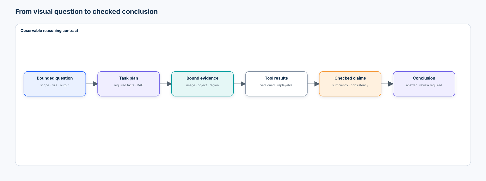
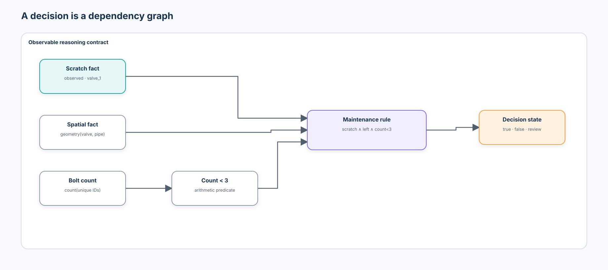
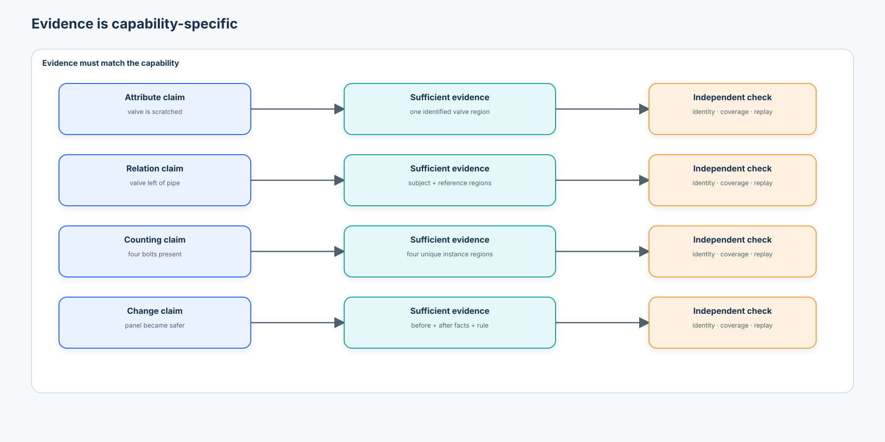
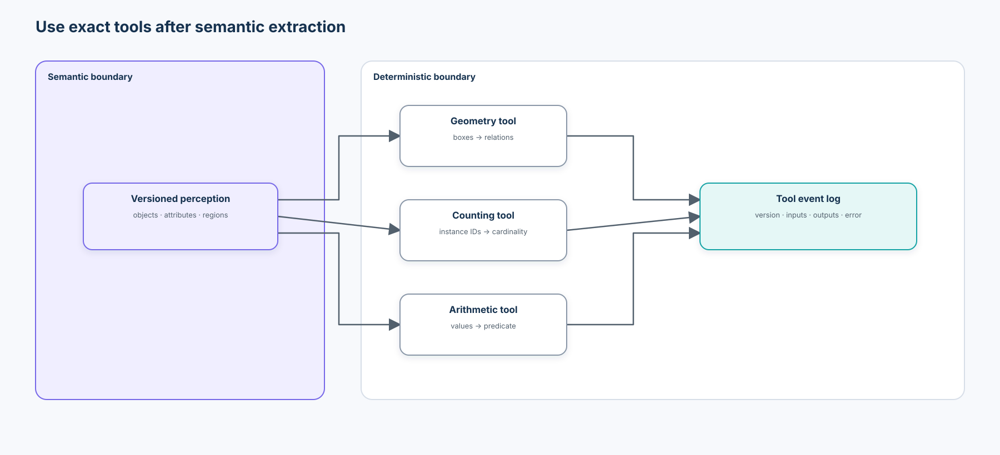
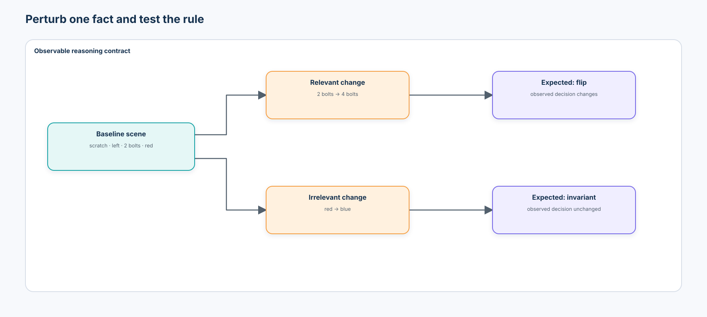
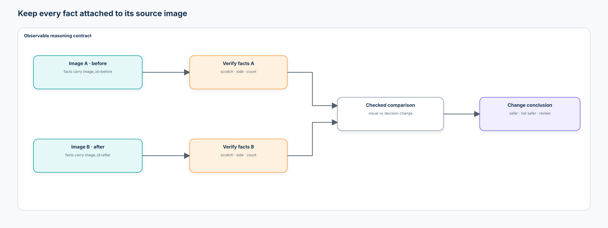
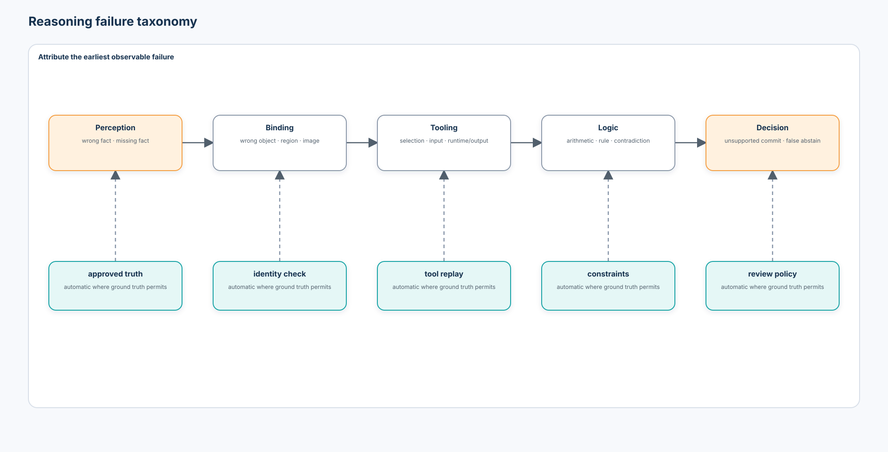
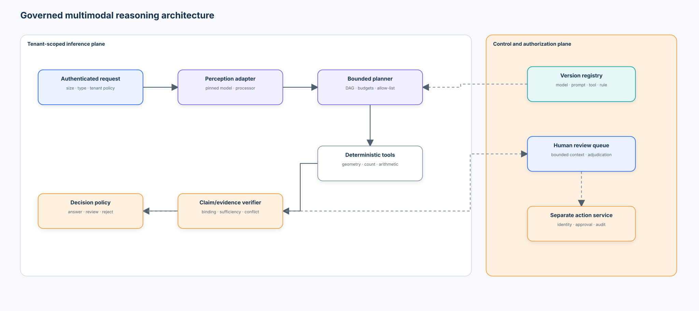

# Intermediate 02 — Multimodal Reasoning & Verification: From Visual Evidence to Checked Conclusions

> How can a multimodal system solve questions that require several visual facts or computations while keeping every decision-relevant claim verifiable?

[Intermediate 01](../01-vision-language-models/README.md) followed visual tokens through a connector into generated language and showed why a fluent answer may ignore the image. This course turns that warning into a system design.

```text
Intermediate 01                         Intermediate 02
visual tokens + prompt                  bounded question + evidence contract
generated answer                        task plan + typed facts + checked claims
answer/evidence evaluation              node, tool, evidence, and decision evaluation
grounded advisory output                reviewable evidence artifact
```

The goal is not to expose or imitate a model's private chain-of-thought. The system instead emits the work products an operator can validate:

```text
Question → Task plan → Required facts → Evidence → Tool results
         → Checked claims → Decision rule → Answer / review required
```

## 1. Learning outcomes

By the end, you should be able to:

1. distinguish perception, relation extraction, deterministic computation, rule evaluation, and language generation;
2. explain why answer accuracy alone cannot establish reasoning fidelity;
3. decompose a bounded visual question into a dependency graph;
4. encode observable facts separately from derived claims;
5. bind each claim to the correct image, region, object, and tool record;
6. define evidence requirements for attributes, spatial relations, counting, comparison, and multi-image change;
7. measure evidence relevance, correctness, sufficiency, and task-specific coverage independently;
8. implement typed geometry, counting, arithmetic, and contradiction tools;
9. distinguish tool selection/input correctness from tool execution correctness;
10. propagate `verified_true`, `verified_false`, `uncertain`, and `unknown` states through a rule;
11. produce `decision_true`, `decision_false`, or `review_required` without inventing a missing fact;
12. test relation inverses, contradictions, and equivalent questions;
13. build relevant and irrelevant counterfactuals one controlled fact at a time;
14. measure sensitivity to decision facts and invariance to distractors;
15. evaluate each reasoning node as well as the final answer;
16. automatically attribute perception, binding, tool, rule, contradiction, and abstention failures where ground truth allows;
17. keep before/after observations attached to their source images;
18. distinguish a visual change from a decision-relevant change;
19. explain why repeated agreement is not the same as truth;
20. use model-based judges only as fallible supplementary signals;
21. preserve tool versions, inputs, outputs, timing, errors, and verification results;
22. define a deterministic release/review policy from measured evidence;
23. identify prompt injection, untrusted text, privacy, authorization, and retention boundaries; and
24. explain how a checked reasoning pipeline becomes the foundation for a visual agent without granting it action authority.

## 2. Course contract

**Audience:** practitioners who completed the Beginner track and [Intermediate 01](../01-vision-language-models/README.md), or who already understand boxes, embeddings, VLM interfaces, and source-aware evaluation.

**Expected time:** 10–12 hours including the notebook and exercises.

**Scenario:** a reliability assistant examines industrial panels. It must decide whether a component needs maintenance from a scratch observation, a left/right relation, and a bolt count; compare before/after images; and return evidence that a reviewer can reconstruct.

**Success criteria:** the credential-free CPU notebook executes top to bottom; all teaching code remains inside it; development and held-out test sources remain separate; every required fact has an explicit evidence requirement; deterministic tools have versioned contracts; counterfactuals alter one declared fact; failure injection is attributed automatically; uncertain or missing decision facts cause review; and the final JSON separates local measurements from optional model observations and production unknowns.

**Non-goals:** revealing hidden model reasoning, training a competitive reasoning VLM, reproducing a public leaderboard, accepting arbitrary uploads, running generated code, building a general agent framework, or authorizing maintenance.

**Risk boundary:** this course produces advisory evidence. A valid schema, a consistent explanation, a model judge, or a passing local toy experiment is not permission to act.

## 3. Recognition is not reasoning

Consider the question:

> Does the scratched valve require maintenance under the rule “scratched, left of the pipe, and fewer than three bolts”?

A useful answer depends on at least three observations and one rule:

```text
scratch present? ─┐
valve left of pipe? ├→ AND rule → decision
bolt count < 3? ───┘
```

Detecting a valve is perception. Deciding which pipe is its reference is binding. Comparing their centers is computation. Applying the maintenance policy is reasoning. Writing a sentence is generation. An end-to-end answer hides these failure surfaces.



## 4. Observable artifact, not hidden chain-of-thought

A reviewable record can be compact:

```json
{
  "question_id": "panel-104-maintenance",
  "required_facts": ["scratch", "valve_left_of_pipe", "bolt_count"],
  "claims": [
    {"id": "c1", "value": true, "status": "verified_true", "evidence_ids": ["region_valve"]},
    {"id": "c2", "value": true, "status": "verified_true", "tool_event_id": "geometry-17"},
    {"id": "c3", "value": 2, "status": "verified_true", "tool_event_id": "count-09"}
  ],
  "decision_rule": "scratch AND left_of AND bolt_count < 3",
  "result": "decision_true",
  "authorization": "none"
}
```

It records what was required, observed, calculated, checked, and decided. It does **not** claim to reveal internal token-by-token cognition.

## 5. Reasoning as a dependency graph

A directed acyclic graph (DAG) makes dependencies inspectable. If node $v$ depends on predecessors $\operatorname{pred}(v)$, evaluate it only after every required predecessor has a usable state:

$$
s_v=f_v\left(\{s_u:u\in\operatorname{pred}(v)\}\right).
$$

The executor must reject missing dependencies and cycles, record evaluation order, and preserve the input state seen by each node. A graph is useful because the business rule has structure—not because “graph” is intrinsically more intelligent.



## 6. Observed facts versus derived claims

| Kind | Example | Evidence | Verifier |
| --- | --- | --- | --- |
| observed attribute | scratch present on `valve_1` | valve crop or mask | approved perception check or reviewer |
| observed instance set | `bolt_1`, `bolt_2` | two unique regions | instance/evidence-set check |
| derived relation | valve left of pipe | both boxes | coordinate comparison |
| derived quantity | bolt count = 2 | trusted instance IDs | deterministic count |
| derived decision | maintenance required | three checked facts | versioned policy rule |

“Observed” does not mean infallible. It means the fact originates at the perception boundary. “Derived” means the result can be recomputed from declared inputs.

## 7. Evidence is capability-specific

One evidence shape cannot support every claim.

| Claim | Minimum evidence contract | Common insufficient evidence |
| --- | --- | --- |
| valve is scratched | the identified valve region at usable resolution | a box around the whole panel |
| valve is left of pipe | subject and reference identities plus both regions | only the valve region |
| four bolts are present | four unique bolt identities/regions under a set policy | one representative bolt |
| damage ratio exceeds 40% | total and damaged sets, then arithmetic record | only damaged examples |
| panel became safer | before and after facts with image IDs plus decision rule | an unbound statement that “something changed” |



## 8. Relevance, correctness, sufficiency, and coverage

These are distinct:

- **relevant:** the evidence concerns the claim;
- **correct:** its identity, region, source image, and content are right;
- **sufficient:** it contains everything needed to verify the claim;
- **complete:** every required claim is supported;
- **contradictory:** evidence or claims cannot jointly hold under the declared semantics.

For tasks with a known required evidence set, define a local diagnostic:

$$
\operatorname{coverage}=\frac{|E_{required}\cap E_{provided}|}{|E_{required}|}.
$$

This is not a universal explanation score. A count of four supported by three unique bolts has coverage $0.75$ only because the required entity set is known.

## 9. Bind evidence to identity and source

Every observation should carry:

```json
{
  "evidence_id": "before-valve-1",
  "image_id": "before",
  "object_id": "valve_1",
  "region_xyxy": [8, 18, 28, 38],
  "claim": "scratch present",
  "source": "local_structured_perception_proxy",
  "foundation_model": false
}
```

A correct fact attached to the wrong image or object is a binding failure, not a success.

## 10. Deterministic-first tool use

> If a fact can be computed exactly from trusted structured inputs, do not ask a generative model to calculate it.

```text
trusted boxes       → spatial relation
trusted instances   → count
trusted measurements→ arithmetic
trusted fact states → policy decision
```

Use a perception model for semantic interpretation. Use tested code for geometry, counting, arithmetic, schema validation, and policy evaluation.



## 11. Geometry tool

For box $b=(x_1,y_1,x_2,y_2)$, define center

$$
c(b)=\left(\frac{x_1+x_2}{2},\frac{y_1+y_2}{2}\right).
$$

With image coordinates increasing rightward and downward:

```text
subject left_of reference  ↔  cx(subject) < cx(reference) - tolerance
subject above reference    ↔  cy(subject) < cy(reference) - tolerance
```

The tolerance, overlap semantics, normalization, and coordinate frame are part of the versioned contract. “Left” could otherwise mean center-based, edge-based, camera-relative, or viewer-relative.

## 12. Counting tool

A count is a set cardinality, not a language estimate:

$$
n=|\operatorname{unique}(\text{approved instance IDs})|.
$$

The input policy must define class, image, region, confidence, duplicate suppression, occlusion, and ignore behavior. A deterministic function can correctly count the wrong selected set; therefore record both **selection/input correctness** and **execution correctness**.

## 13. Arithmetic and rule tools

If five of ten trusted connectors are damaged:

$$
r=\frac{5}{10}=0.5,\qquad r>0.4.
$$

The arithmetic result is exact relative to its inputs, but it inherits any input defects. The same boundary applies to the final rule.

## 14. Tool contract and event log

```json
{
  "contract": {
    "name": "spatial_relation",
    "version": "1.0.0",
    "deterministic": true,
    "input_schema": "two xyxy boxes in image-pixel coordinates",
    "output_schema": "relation booleans and normalized distance"
  },
  "event": {
    "tool_event_id": "geometry-17",
    "inputs": {},
    "outputs": {},
    "status": "ok",
    "latency_ms": 0.04,
    "error": null
  }
}
```

Versions, schemas, inputs, outputs, latency, and errors make execution replayable. Do not log unrestricted images, secrets, or personal data merely because tracing is useful.

## 15. Four-valued fact states

Binary truth is insufficient at a perception boundary:

| State | Meaning | Rule behavior |
| --- | --- | --- |
| `verified_true` | checked evidence supports the fact | usable as true |
| `verified_false` | checked evidence refutes the fact | usable as false |
| `uncertain` | evidence exists but does not meet the reliability policy | propagate review if decision-relevant |
| `unknown` | required evidence is missing/unavailable | propagate review if decision-relevant |

The terminal rule returns `decision_true`, `decision_false`, or `review_required`. Naively multiplying model confidences is not a generally valid uncertainty model.

## 16. Verification layers

Verification can occur at several boundaries:

1. schema and type validity;
2. object/image/region binding;
3. evidence sufficiency;
4. deterministic recomputation;
5. relation and contradiction constraints;
6. policy-rule replay;
7. human or domain review for unresolved semantic claims.

An independent verifier should not simply repeat the same unconstrained prompt to the same model and call agreement proof.

## 17. Contradiction and inverse-relation tests

For distinct, non-overlapping centers:

```text
left_of(a, b) ↔ right_of(b, a)
above(a, b)   ↔ below(b, a)
inside(a, b)  ↔ contains(b, a)
```

Claims that assert both `left_of(a,b)` and `right_of(a,b)` are contradictory under that contract. Equivalent and inverse questions should also be tested; repeated consistency can still be consistently wrong.

## 18. Counterfactual sensitivity

Counterfactual tests change one declared fact while holding the rest fixed.

| Changed fact | Rule relevant? | Expected decision change |
| --- | ---: | ---: |
| scratch: present → absent | yes | yes |
| bolt count: 2 → 4 | yes | yes |
| side: left → right | yes | yes |
| valve color: red → blue | no | no |

A robust system should be sensitive to relevant changes and invariant to irrelevant ones. Report these separately:

$$
\text{relevant sensitivity}=\frac{\text{required flips observed}}{\text{required flips}},
$$

$$
\text{irrelevant invariance}=\frac{\text{required non-flips observed}}{\text{required non-flips}}.
$$



## 19. Multi-image reasoning

Before/after questions require facts from both images:

```text
image_before → facts_before ┐
                            ├→ compare → apply the same policy → change conclusion
image_after  → facts_after ─┘
```

The system must test image attribution, not only fact content. Swapping image labels should be detected. A red-to-blue paint change is visual change; it is not decision-relevant if color is absent from the policy.



## 20. Failure taxonomy

| Failure | Observable symptom | Check |
| --- | --- | --- |
| perception | wrong scratch/object fact | compare observation with approved truth/review |
| missing fact | dependency absent | DAG completeness |
| wrong evidence binding | right statement, wrong region/object | identity and region check |
| relation inversion | left reported as right | geometry replay and inverse test |
| counting | wrong selected instance set or count | set and cardinality check |
| tool selection | wrong tool for required fact | task-to-tool policy |
| tool input | valid tool receives wrong object/set | input lineage check |
| tool execution | output differs from reference execution | replay/test |
| arithmetic | wrong operation or operands | structured recomputation |
| rule application | facts right, policy result wrong | versioned policy replay |
| contradiction | incompatible checked claims | constraint checker |
| unsupported inference | claim lacks required evidence | sufficiency check |
| image binding | fact attached to wrong image | image attribution test |
| abstention | commits despite unknown/uncertain dependency | decision-state policy |



## 21. Evaluation contract

Report at least:

- final decision accuracy and review rate;
- fact/node accuracy by capability;
- evidence relevance, correctness, sufficiency, and coverage;
- tool selection, input, and execution correctness;
- contradiction and inverse-consistency rates;
- relevant counterfactual sensitivity and irrelevant invariance;
- image-attribution accuracy;
- unsupported-commit and false-abstention rates;
- failure-attribution accuracy; and
- latency by stage, with measured workload and runtime.

Final accuracy can rise while evidence completeness falls. Review rate can rise while unsafe unsupported commitments fall. Keep the metrics visible rather than combining them into one score.

## 22. Source-separated evaluation

The notebook uses procedural factories with different rendering conditions:

```text
Factory A → development construction only
Factory B → development policy checks
Factory C → held-out test reporting only
```

No threshold, counterfactual expectation, tool tolerance, or rule changes after observing Factory C. Split by source/group before creating related examples so a base scene and its counterfactual cannot cross the boundary.

## 23. A model judge is not ground truth

A multimodal model can help triage free-form claims or identify likely missing evidence, but it may share the candidate's blind spots, prefer plausible prose, or be influenced by untrusted image text. If used:

- version the judge, processor, prompt, decoder, and rubric;
- prevent candidate/judge data leakage;
- measure judge agreement against expert adjudication by slice;
- keep deterministic checks authoritative where exact semantics exist;
- preserve disagreements; and
- route high-impact disagreements to review.

## 24. Public benchmarks and what they actually test

Use benchmarks diagnostically, not as interchangeable leaderboards:

- [CLEVR](https://openaccess.thecvf.com/content_cvpr_2017/html/Johnson_CLEVR_A_Diagnostic_CVPR_2017_paper.html) isolates attributes, counting, comparison, spatial relationships, and logical operations with scene graphs and functional programs.
- [GQA](https://openaccess.thecvf.com/content_CVPR_2019/html/Hudson_GQA_A_New_Dataset_for_Real-World_Visual_Reasoning_and_Compositional_Question_Answering_CVPR_2019_paper.html) adds compositional programs and grounding/consistency metrics over real images.
- [VQA v2](https://openaccess.thecvf.com/content_cvpr_2017/html/Goyal_Making_the_V_in_CVPR_2017_paper.html) uses complementary images to reduce question-only shortcuts.
- [MathVista](https://arxiv.org/abs/2310.02255) combines visual and mathematical reasoning tasks.
- [MMMU](https://arxiv.org/abs/2311.16502) spans expert, multi-discipline questions and heterogeneous image types; [MMMU-Pro](https://arxiv.org/abs/2409.02813) further reduces text-only shortcuts and adds a vision-only setting.
- [VERIFY](https://arxiv.org/abs/2503.11557) and [VisuLogic](https://arxiv.org/abs/2504.15279) target reasoning fidelity and vision-centric reasoning rather than only recognition.

Dataset license, test access, contamination, prompt policy, answer normalization, and metric implementation are part of every benchmark claim. This notebook reproduces none of their published scores.

## 25. 2026 state-of-the-art radar

Current work increasingly separates visual evidence from downstream reasoning:

- CVPR 2026 [PEARL](https://openaccess.thecvf.com/content/CVPR2026/html/Zhang_Perceptual-Evidence_Anchored_Reinforced_Learning_for_Multimodal_Reasoning_CVPR_2026_paper.html) introduces perception checklists and evidence-anchored rewards because final-answer verification alone can reward reasoning built on bad perception.
- CVPR 2026 [See It, Say It, Sorted](https://openaccess.thecvf.com/content/CVPR2026/html/Zhang_See_It_Say_It_Sorted_An_Iterative_Training-Free_Framework_for_CVPR_2026_paper.html) uses an explicit evidence pool and retrieves more evidence when the current pool is insufficient.
- [MM-CoT](https://arxiv.org/abs/2512.08228) evaluates visual consistency and logical coherence as separate constraints.
- CVPR 2026 [Med-CMR](https://openaccess.thecvf.com/content/CVPR2026/html/Gong_Med-CMR_A_Fine-Grained_Benchmark_Integrating_Visual_Evidence_and_Clinical_Logic_CVPR_2026_paper.html) decomposes perceptual understanding and multi-step domain reasoning rather than treating a final medical answer as one capability.

These are research case studies, not production endorsements. The durable lesson is to verify prerequisites and evidence—not to copy one paper's architecture or score.

## 26. Visual programming and tool composition

[VisProg](https://openaccess.thecvf.com/content/CVPR2023/html/Gupta_Visual_Programming_Compositional_Visual_Reasoning_Without_Training_CVPR_2023_paper.html) and [ViperGPT](https://arxiv.org/abs/2303.08128) showed that language models can compose vision and Python-like modules for complex visual queries. [CRITIC](https://openreview.net/forum?id=Sx038qxjek) studies correction using external tool feedback.

The useful pattern is modular verification. The production warning is equally important: generated code, unconstrained tools, arbitrary network access, and shared mutable state expand the attack and failure surface. This course executes only allow-listed local functions with fixed schemas.

## 27. Tooling review

| Tool | Good fit | What it does not prove | Governance notes |
| --- | --- | --- | --- |
| Python dataclasses / type hints | transparent contracts and records | runtime factual correctness | validate at boundaries; evolve schemas explicitly |
| NumPy | deterministic geometry and arithmetic | semantic perception quality | pin numerical environment for regulated replay |
| pandas | event and slice analysis | causal explanation | redact sensitive columns before export |
| Matplotlib / Pillow | local evidence and diagnostic views | model grounding | preserve image license, source, and transformations |
| PyTorch | learned modules and tensor inspection | verified reasoning | record device, precision, seed, and weights |
| Hugging Face Transformers | standard processors and open-model adapters | license approval, safe remote code, or benchmark parity | pin immutable revisions; `trust_remote_code=False`; hash artifacts |
| Pydantic / JSON Schema | boundary validation in services | truth of a schema-valid claim | reject unknown fields where contracts require it |
| NetworkX / workflow graphs | graph validation and visualization at larger scale | need for an agent framework | start with a small transparent executor |
| OpenTelemetry | cross-service traces and latency | permission to retain images/prompts | propagate trace IDs; minimize and govern payloads |

The notebook deliberately uses the standard library, NumPy, pandas, Pillow, and Matplotlib. A framework would obscure the small mechanisms being taught.

## 28. Security and governance boundaries

- Treat OCR, captions, image metadata, and user prompts as untrusted data—not instructions.
- Do not execute generated code or permit dynamic imports in the reasoning path.
- Allow-list tools and validate all arguments, sizes, image IDs, and object IDs.
- Separate tenant data, indexes, caches, traces, and reviewer queues.
- Minimize stored crops; apply retention, access, encryption, and regional controls.
- Record model/tool/rule versions and immutable hashes where applicable.
- Keep inference, verification, policy decision, and action authorization as different services and identities.
- Rate-limit requests and bound graph depth, tool calls, image count, and compute.
- Require human approval for consequential maintenance or safety actions.

## 29. Enterprise reference architecture



```text
authenticated request
  → input policy / malware / size / tenant checks
  → versioned perception adapter
  → bounded task planner
  → allow-listed deterministic tools
  → claim/evidence verifier
  → versioned decision policy
  → answer or review queue
  → separate authorized action service (outside this course)
```

Trace metadata can cross these boundaries; unrestricted image content and secrets should not. Rollback requires versioned model, processor, prompt, tool, rule, and schema bundles.

## 30. Notebook map

The single [lab notebook](lab.ipynb) is the executable course:

1. create source-separated industrial scenes and trusted scene records;
2. render evidence and define observable claim/fact contracts;
3. implement and test geometry, counting, arithmetic, and contradiction tools;
4. execute a dependency DAG with four-valued state propagation;
5. compare an opaque answer-only proxy with a checked pipeline;
6. score node, evidence, tool, and final-decision behavior;
7. inject and automatically attribute reasoning failures;
8. run relevant and irrelevant counterfactuals;
9. test inverse consistency and contradictions;
10. compare before/after panels with explicit image binding;
11. demonstrate uncertainty, missing facts, and abstention;
12. profile stage latency and export a governed evidence record.

The notebook's `local_structured_perception_proxy` consumes synthetic scene records. It is deterministic teaching infrastructure, not a VLM, foundation model, or production perception benchmark.

## 31. Exercises

1. Change center-based `left_of` to edge-based semantics. Which relations change and how should the contract version change?
2. Add an occluded bolt state. Define whether it is countable, uncertain, or ignored before changing the code.
3. Inject a duplicate object ID and prove the count tool deduplicates it while the evidence checker flags duplicate evidence.
4. Add `inside ↔ contains` to the contradiction checker with explicit boundary behavior.
5. Design a counterfactual where two facts change accidentally. Add a validator that rejects it.
6. Add a reviewer outcome and measure override/disagreement rates without treating the reviewer as infallible.
7. Draft a JSON Schema for the final evidence artifact and identify which fields contain sensitive data.
8. Propose a source-aware production evaluation with factory, device, lighting, operator, and time splits.

## 32. What you should now be able to explain without code

You should be able to answer:

> Why can a correct answer still be unsupported?

> Why is one valve crop insufficient evidence for a left/right claim?

> How can a deterministic count tool return the wrong business answer while executing perfectly?

> Why should an unknown scratch state produce review rather than `false`?

> Why must a counterfactual change one fact at a time?

> Why is inverse consistency useful but not proof of truth?

> Why must every before/after claim retain its image ID?

> Why is schema validation necessary but insufficient?

> Why are private reasoning traces a weaker audit contract than externally checked artifacts?

> What additional permission boundary appears when a visual reasoner becomes a visual agent?

## 33. Bridge to Intermediate 03

This course assumes that the required facts can be attached to images and regions. Enterprise documents make that harder:

```text
image evidence
  ↓
pages · layout · OCR · tables · charts · forms · provenance
```

[Intermediate 03 — Document Intelligence](../README.md) will extend the same claim/evidence contract across pages, reading order, cells, figures, and long-document context. The central idea remains unchanged: a conclusion is only as reviewable as the evidence and transformations that support it.
