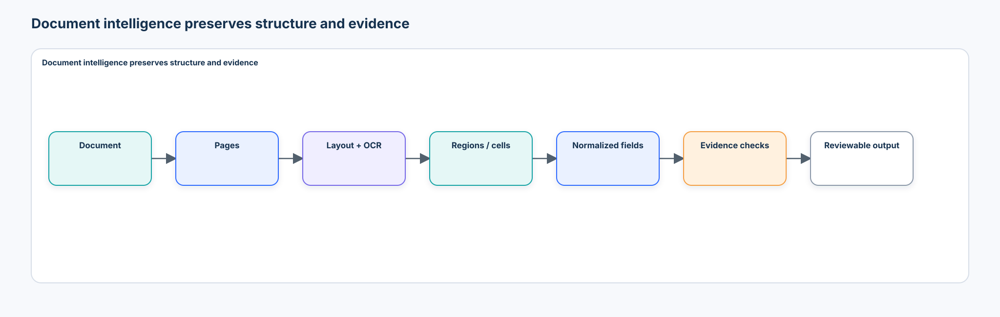
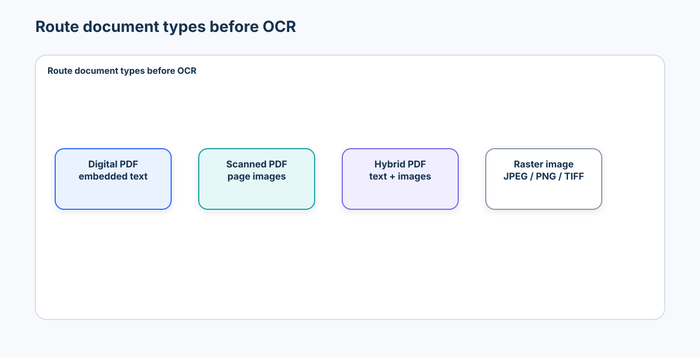
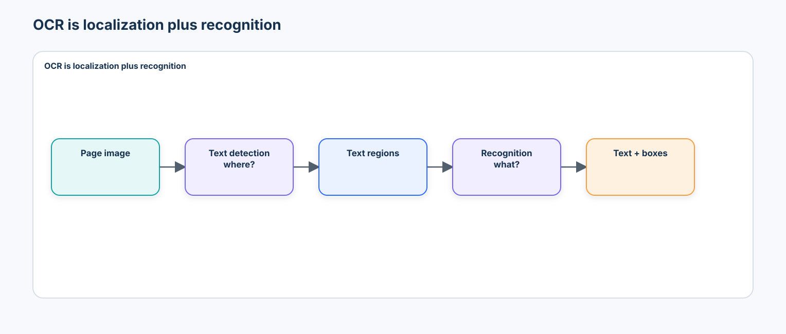
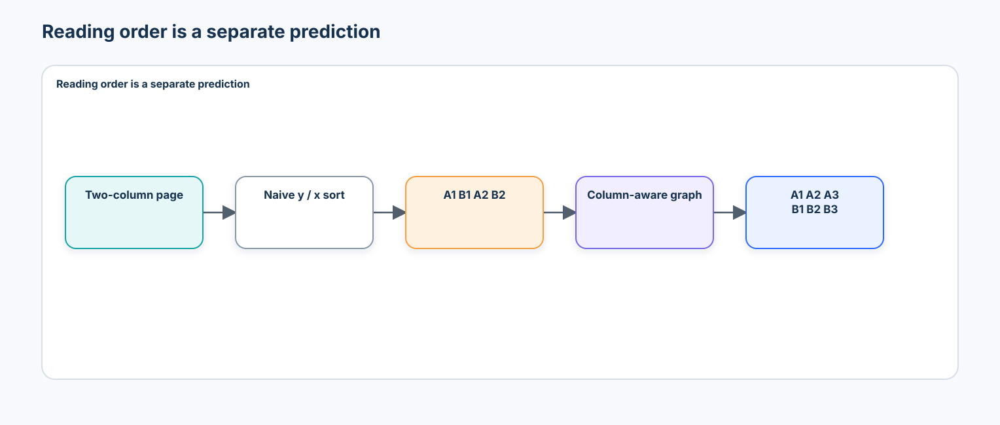
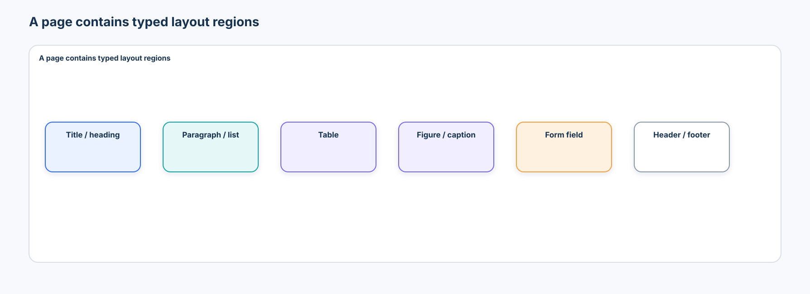
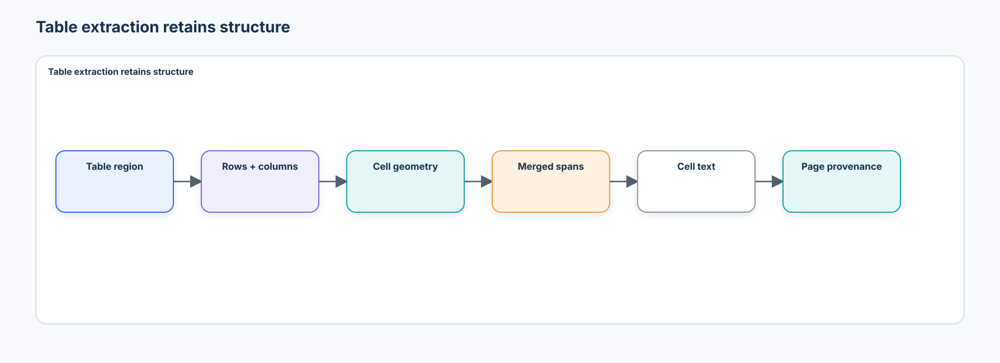
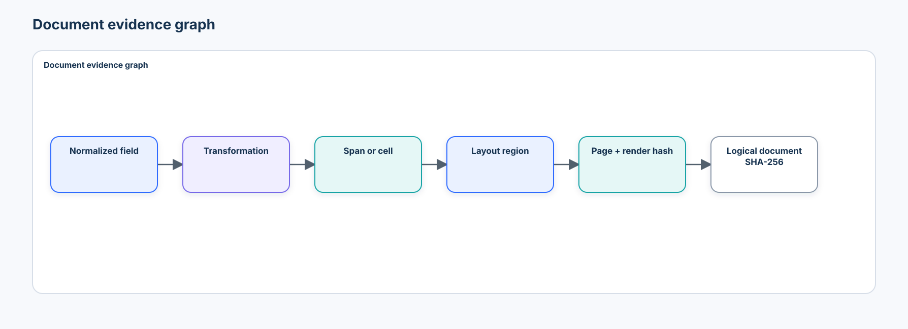
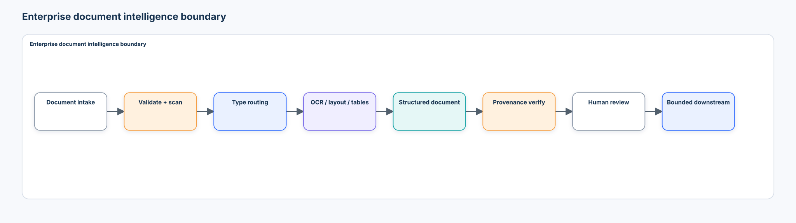

# Intermediate 03 — Document Intelligence: From Pixels and Layout to Structured Evidence

> **Central question:** How can a system convert visually complex documents into structured evidence while preserving exactly where every extracted fact came from?

[← Intermediate 02 · Multimodal Reasoning & Verification](../02-multimodal-reasoning-verification/README.md) · [Run the notebook](lab.ipynb) · [Intermediate track](../README.md)

Documents combine text, geometry, tables, figures, visual states, and relationships across pages. A field is not trustworthy merely because its characters are correct. It must remain traceable through normalization, extraction, OCR or table structure, a page region, a page render, and the original document.



## Learning contract

After this course, you should be able to:

- route digital, scanned, hybrid, and raster inputs without applying OCR blindly;
- convert consistently among PDF points, pixels, and normalized page coordinates;
- separate text detection, recognition, layout analysis, and reading-order reconstruction;
- represent paragraphs, forms, tables, merged cells, figures, captions, and checkboxes explicitly;
- compare OCR-plus-layout, layout-aware, and OCR-free architectures without declaring a universal winner;
- measure CER, WER, layout overlap, reading order, table structure, field extraction, and provenance separately;
- preserve raw evidence and transformation assumptions when normalizing dates, currency, percentages, and identifiers;
- detect missing, conflicting, ambiguous, and unsupported values;
- evaluate by document source/template and keep a held-out template reporting-only; and
- design a secure intake, extraction, verification, review, and retention architecture.

### Prerequisites

Complete [Vision-Language Models](../01-vision-language-models/README.md) and [Multimodal Reasoning & Verification](../02-multimodal-reasoning-verification/README.md). The lab assumes basic Python, arrays, tables, image coordinates, and classification/evaluation concepts from the Beginner track.

### Scenario, success criteria, and boundaries

The lab processes synthetic invoices, inspection reports, and maintenance forms from three vendors:

| Source | Role | Permitted use |
| --- | --- | --- |
| Template A | construction | build and debug deterministic primitives |
| Template B | development | select rules and review policy |
| Template C | held-out test | final reporting only |

Documents are split before pages, OCR records, cells, or perturbations are created. Success means the notebook can improve over flatten-to-text and proximity-only baselines, attribute injected failures, and produce a replayable evidence artifact. It does **not** benchmark production OCR, claim signature authenticity, or authorize financial actions.

## 1. A document is a multimodal system

A naive pipeline discards the structure needed to audit an answer:

```text
PDF / image → OCR → plain text → generator → answer
```

A stronger system keeps the hierarchy alive:

```text
Document → pages → regions → spans / cells / figures / controls
         → normalized elements → cross-page relationships
         → evidence references → extraction → verification → review
```

The invariant is simple:

> Every transformation may add a representation, but none may silently sever lineage to the original document.

## 2. Route the input before OCR



| Input | What it contains | First inspection | Typical next step |
| --- | --- | --- | --- |
| Digital PDF | embedded text, vector graphics, object coordinates | inspect text/object layer and render | extract text plus coordinates; OCR only image-only regions |
| Scanned PDF | page images | render at a recorded DPI | orientation/dewarp, detection, recognition |
| Hybrid PDF | text plus raster regions or hidden text layer | compare text layer with rendering | reconcile sources region by region |
| Raster image | pixels only | validate format, size, orientation | image preprocessing and OCR/layout |

OCRing every PDF can replace high-quality embedded text with recognition errors, duplicate hidden text, and erase vector coordinates. Conversely, trusting a PDF text layer blindly can expose stale, invisible, or malicious content. Preserve both the original rendering and the source-specific extraction record.

## 3. Page coordinates are a contract

A box is meaningless without its frame:

```json
{
  "box": [120, 82, 234, 106],
  "format": "xyxy",
  "origin": "top_left",
  "unit": "pixel",
  "page_width": 1200,
  "page_height": 1600,
  "dpi": 150
}
```

PDF user space commonly uses points, with 72 points per inch. Raster systems use pixels. Some PDF interfaces use a bottom-left origin; image interfaces usually use top-left. At DPI \(d\):

$$
x_{px}=x_{pt}\frac{d}{72}, \qquad y_{px}=y_{pt}\frac{d}{72}.
$$

For a page of width \(W\) and height \(H\), normalized coordinates are:

$$
(x_1/W,\ y_1/H,\ x_2/W,\ y_2/H).
$$

The notebook implements `pixel_to_normalized_box()`, `normalized_to_pixel_box()`, and `pdf_points_to_pixels()` with round-trip and bounds assertions.

## 4. Rendering is a quality and systems choice

Rendering a letter-size page at 72, 150, and 300 DPI produces approximately 0.48, 2.1, and 8.4 million pixels. Higher DPI can recover small glyphs, but increases storage, memory, latency, and downstream visual-token count. Measure small-text recognition and cost together; do not choose DPI from habit.

For digital PDFs, retain the source text coordinates even when rendering pages for visual models. A raster render is a view of the document, not a replacement for the source structure.

## 5. OCR is detection plus recognition



```text
page image → text detection → text regions → text recognition → words/lines
```

Detection answers **where is text?** Recognition answers **what does it say?** End-to-end engines package both, but evaluation should keep the failure boundary visible. A useful word-level record is:

```json
{
  "word_id": "p1-w17",
  "text": "Total",
  "box": [780, 1090, 842, 1118],
  "confidence": 0.97,
  "page": 1,
  "line_id": "p1-l8",
  "language": "en",
  "rotation_deg": 0,
  "engine": "local_ocr_proxy"
}
```

Text without coordinates is useful for search, but insufficient as extraction evidence.

### OCR error taxonomy

- character substitution (`0↔O`, `1↔l`, `5↔S`);
- missing or spurious text;
- word merge or split;
- reading-order error;
- orientation/rotation failure;
- language or script mismatch; and
- low-resolution, blur, compression, contrast, stamp, or handwriting interference.

### CER and WER

For reference length \(N\), substitutions \(S\), deletions \(D\), and insertions \(I\):

$$
\operatorname{CER}=\frac{S+D+I}{N}, \qquad
\operatorname{WER}=\frac{S+D+I}{N}.
$$

CER edits characters; WER edits word tokens. Always define normalization—case, Unicode, whitespace, punctuation—before comparing results. Empty-reference policy must also be explicit.

### Confidence is not correctness

OCR confidence is engine-specific telemetry, not a calibrated probability and not comparable across engines without evaluation. Reliability may vary by font size, page region, language, template, and scan quality. The notebook reports accuracy beside confidence and deliberately creates an overconfident error.

## 6. Reading order is its own prediction problem



Sorting by `y` then `x` turns two columns into `A1 B1 A2 B2`. Intended order may be `A1 A2 A3 B1 B2 B3`. Represent regions as nodes and relations such as `above`, `left_of`, `same_column`, and `continuation_of` as edges. A deterministic graph works for controlled layouts; production systems need learned layout cues, language, document type, and evaluation for cycles or ambiguous orders.

The notebook reports pairwise order accuracy:

$$
\text{order accuracy}=\frac{\text{correctly ordered region pairs}}{\text{comparable region pairs}}.
$$

## 7. Layout analysis restores page semantics



Layout detection predicts region type and geometry for titles, headings, paragraphs, lists, tables, figures, captions, headers, footers, and form controls. Two common orders have different failure behavior:

- **OCR → layout:** rich text cues help classification, but OCR errors propagate.
- **layout → regional OCR:** region-specific settings are possible, but missed layout regions suppress recognition.

Measure region classification and geometry, then downstream reading order and extraction. A high layout mAP does not guarantee correct field provenance.

### Layout-aware representations

LayoutLM-style systems combine token identity, 2D position, and visual appearance. The architecture can be summarized as:

```text
token embedding + box embedding + page/image features → contextual document representation
```

[LayoutLMv3](https://arxiv.org/abs/2204.08387) unified text and image masking and added word–patch alignment. It is a representative architecture, not a reason to hide OCR and coordinate contracts.

### OCR-free models

[Donut](https://arxiv.org/abs/2111.15664) maps document images through a vision encoder and autoregressive decoder to structured text without an explicit OCR interface. This can simplify the external pipeline and avoid some OCR error propagation, but generated structure can be harder to debug, align to exact regions, and verify.

| Dimension | OCR + layout | OCR-free image-to-structure |
| --- | --- | --- |
| Debuggability | strong stage boundaries | weaker unless token/region alignment is exposed |
| Text provenance | explicit spans and boxes | must be reconstructed or requested |
| External complexity | multiple modules | compact interface |
| Domain adaptation | modular | often model-level |
| Structured generation | separate extraction layer | native decoder output |
| Exact replay | strong for deterministic stages | generation policy and model artifacts required |

Schema-valid JSON from either path establishes interface validity—not factual validity.

## 8. Tables are structure, not lines of text



Table detection asks whether and where a table exists. Structure recognition identifies rows, columns, headers, cells, and spans. Cell text is yet another contract. Keep them separable:

```json
{
  "cell_id": "t1-r0-c0",
  "row_start": 0,
  "row_end": 0,
  "col_start": 0,
  "col_end": 2,
  "role": "column_header",
  "text": "Q1",
  "box": [120, 340, 760, 380],
  "page": 4
}
```

A CSV cannot faithfully encode a header spanning January through March without an additional convention. Flattening also loses blank cells, hierarchy, geometry, and page continuation.

Evaluate table detection IoU/precision/recall, cell detection, row/column assignment, adjacency, span correctness, and cell text separately. [PubTables-1M](https://openaccess.thecvf.com/content/CVPR2022/html/Smock_PubTables-1M_Towards_Comprehensive_Table_Extraction_From_Unstructured_Documents_CVPR_2022_paper.html) and the official [Table Transformer](https://github.com/microsoft/table-transformer) implementation introduced comprehensive location/structure annotations and GriTS-style grid comparisons. TEDS compares tree-edit similarity for HTML-like table structure; neither metric alone proves field-level correctness.

## 9. Forms bind keys to values

OCR can correctly read both `Invoice Number` and `Purchase Order Number` yet bind a nearby value to the wrong key. Candidate relationships include nearest-right, nearest-below, same-row, semantic-key compatibility, and learned relations. A reliable baseline combines a controlled key vocabulary with geometry and rejects ambiguous candidates.

Represent both sides:

```json
{
  "key": "Invoice Number",
  "value": "INV-1042",
  "key_box": [90, 210, 250, 238],
  "value_box": [270, 210, 390, 238],
  "page": 1,
  "binding_method": "semantic_key_plus_geometry_v1"
}
```

Checkboxes, radio buttons, seals, stamps, and signatures are visual-state extraction tasks. `signature_present=true` never establishes identity or authenticity.

## 10. Headers, footers, figures, and charts

Repeated headers and footers can pollute chunks and extraction. Detect them by repeated text/location, layout class, or template analysis—but retain them as suppressed elements because confidentiality labels, dates, and document identifiers may matter later.

Figures require a figure box, caption box, caption text, and a scored binding when multiple candidates are nearby. Chart extraction may include chart type, axes, legend, labels, marks, and reconstructed values. This course keeps chart parsing conceptual; exact values should be checked against source tables or deterministic arithmetic where available.

## 11. Multi-page structure

A document must preserve `document_id → page_id → element_id`. Paragraphs, lists, sections, and tables can continue across pages. A table continuation hypothesis can use adjacent pages, repeated headers, aligned columns, caption/context, and an explicit confidence. Merged output must retain every cell's original page and box.

Document classification can select an extraction schema at the page, section, or document level:

```text
document → document type → schema and extraction policy
```

Misclassification is a cascading failure, so retain classifier evidence and allow an `unknown` type rather than forcing the nearest schema.

## 12. Schema-driven extraction and normalization

A field is a value plus evidence:

```json
{
  "field": "invoice_total",
  "raw": "$1,240.00",
  "normalized": 1240.0,
  "state": "verified",
  "page": 2,
  "region_id": "table_1",
  "cell_id": "table_1-r4-c2",
  "box": [120, 330, 218, 354],
  "transformation": {
    "name": "currency_parser",
    "version": "1.0.0",
    "input": "$1,240.00",
    "output": 1240.0,
    "assumptions": {"currency": "CAD"}
  }
}
```

Normalization is a transformation, not cleanup. Store input, output, version, and assumptions. `03/04/2026` is unresolved without locale or document context; silently selecting March 4 or April 3 manufactures certainty.

## 13. The document evidence graph



```text
normalized field → extraction relation → OCR span or table cell
                 → layout region → page render → original document hash
```

For each node and edge, keep stable IDs and versions. A minimum provenance object includes:

- document SHA-256 and optional page-render hash;
- document, page, region, span/cell, and box identity;
- raw text and normalized value;
- transformation and engine/model version;
- timestamp or run ID; and
- verification results and review state.

The same filename is not the same document. Content hashes make lineage and replay checks possible, but are not access-control decisions.

## 14. Verification and field states

Deterministic checks should answer:

```text
schema valid? → page exists? → box valid? → region/span/cell exists?
              → raw evidence matches? → transformation replays?
              → business rule satisfied?
```

Do not ask an LLM judge to verify checks that code can reproduce exactly. Use field-level states:

| State | Meaning | Default action |
| --- | --- | --- |
| `verified` | required bindings and replay checks pass | eligible for policy evaluation |
| `uncertain` | evidence exists but confidence/ambiguity remains | review |
| `missing` | required field or evidence absent | review |
| `conflicting` | multiple supported values disagree | apply explicit policy or review |
| `unsupported` | output cannot be bound or derived from evidence | reject/review |

A correct value with the wrong page, box, or cell is a provenance failure. A plausible value absent from all evidence is unsupported. If page 1 and page 3 disagree, preserve both candidates and apply a documented policy; do not silently choose the value that “looks final.”

## 15. Evaluation is a vector, not one score

Report at least:

- document classification accuracy;
- CER and WER with defined normalization;
- layout class/geometry metrics;
- pairwise reading-order accuracy;
- table detection, structure, span, and cell-text metrics;
- field exact match and normalized-value accuracy;
- evidence/provenance correctness;
- unsupported extraction rate; and
- review rate and correction effort.

Slice by template/vendor, document type, page region, font size, language, and perturbation. A field can be correct while provenance is wrong; a structurally correct table can contain wrong cell text. Never collapse these into a score that hides the failing boundary.

### Source separation and template shift

Pages from one document or template are correlated. Splitting them randomly leaks layout coordinates and boilerplate. The notebook fixes rules on Template B, then reports Template C once. Ask whether the system learned document semantics or memorized positions.

### Perturbation testing

Test rotation, blur, low contrast, JPEG compression, cropping, scanner noise, handwritten marks, and stamp overlap where relevant. Attribute degradation to rendering, detection, recognition, layout, reading order, table structure, binding, normalization, or provenance—not only the final field.

## 16. Failure taxonomy and mitigations

| Earliest failing boundary | Example | Mitigation |
| --- | --- | --- |
| intake/rendering | corrupted file, decompression bomb, missing page | validation, limits, sandboxing, quarantine |
| OCR | substitution, omission, wrong rotation/language | preprocessing, language routing, engine comparison, review |
| layout | table labeled paragraph | source-diverse layout data, region review |
| reading order | columns interleaved | graph/learned ordering, order metrics |
| table | merged header split or page continuation broken | span-aware schema, continuation checks |
| key/value binding | PO number bound as invoice number | semantic-key constraints plus geometry |
| visual state | checked box read as empty | control-specific detector and review |
| normalization | ambiguous date forced | locale/context contract or `uncertain` |
| page/provenance | correct value linked to wrong page/cell | referential and replay validation |
| unsupported extraction | plausible number absent from evidence | evidence-required output contract |
| template shift | coordinate rule fails on Vendor C | source-held-out evaluation and bounded adaptation |

Attribute the earliest violated contract. A later unsupported result may be caused by an earlier OCR miss; recording both symptom and root boundary improves remediation.

## 17. Technology landscape and selection

Reviewed **2026-09-07**. Recheck versions, licenses, model cards, processors, and artifact hashes before production use.

| Tool/family | Best fit | Strength | Important boundary |
| --- | --- | --- | --- |
| [Pillow](https://pillow.readthedocs.io/) / [OpenCV](https://docs.opencv.org/) | rendering fixtures and image preprocessing | common, observable image APIs | not a document parser or OCR engine |
| [pdfplumber](https://github.com/jsvine/pdfplumber) | inspectable PDF text, character, line, and table geometry | MIT; useful for digital PDFs | no rendering engine; inherited PDFMiner semantics |
| [PyMuPDF](https://pymupdf.readthedocs.io/) | high-performance PDF rendering/extraction | mature page, text, and geometry APIs | AGPL/commercial dual license requires deployment review |
| [Tesseract 5.5.3](https://github.com/tesseract-ocr/tesseract/releases/tag/5.5.3) | transparent OCR baseline | maintained, local, Apache-2.0 | system binary/language packs; confidence is not portable |
| [docTR](https://mindee.github.io/doctr/) | modular neural detection + recognition | PyTorch/TensorFlow ecosystem | heavyweight optional runtime and model provenance |
| [PaddleOCR](https://www.paddleocr.ai/latest/en/index.html) | OCR and structured document pipelines | broad maintained modules, Apache-2.0 code | runtime/model/backend complexity; pin every artifact |
| [LayoutLMv3](https://huggingface.co/docs/transformers/model_doc/layoutlmv3) | OCR/layout-aware token tasks | text, 2D boxes, visual features | depends on OCR/token-box alignment |
| [Table Transformer](https://huggingface.co/docs/transformers/model_doc/table-transformer) | table detection and structure | common Transformers interfaces, MIT weights | separate OCR is still needed for cell text |
| Donut/Nougat-style models | OCR-free structured generation | compact external interface | generated structure and region provenance need explicit evaluation |
| 2026 document VLMs | broad parsing of text/tables/formulas/charts | emerging end-to-end capability | benchmark scope, prompt sensitivity, compute, and evidence binding remain open |

### Minimal course choice

The credential-free notebook uses NumPy, pandas, Pillow, and Matplotlib. It does not require a PDF engine, OCR binary, model download, GPU, or remote service. Optional adapters are disabled by default:

- Tesseract 5.5.3 (`6951ffe10ce031374bcd04fe400811da1e7e04ad`, Apache-2.0) through the common `pytesseract` wrapper;
- Microsoft Table Transformer detection (`2357cbe2b5a5d1c03e54f32764f06058933b65ab`) and structure v1.1-all (`7587a7ef111d9dcbf8ac695f1376ab7014340a0c`), MIT model cards, through `AutoImageProcessor` and `AutoModelForObjectDetection`; and
- PaddleOCR‑VL‑1.6 (`c5630abae1d940eafe0697512a0325494b02ab42`, Apache-2.0 model card), an **emerging** 2026 document parser, through the official `PaddleOCRVL` SDK.

Optional observations remain ineligible for comparison until code/model revisions, processor files, artifact hashes, license review, input policy, runtime, and evaluation data are recorded. Author-reported leaderboard results are not local evidence.

### State of the art: maturity matters

- **Established:** route digital versus scanned content; preserve coordinates; combine OCR/layout/table modules; use schema validation, source-held-out tests, and human review.
- **Consolidating:** layout-aware pretrained representations, DETR-style table models, diverse human-annotated layout data such as [DocLayNet](https://arxiv.org/abs/2206.01062), and modular document parsing pipelines.
- **Emerging in 2026:** compact document VLMs such as [PaddleOCR‑VL‑1.6](https://arxiv.org/abs/2606.03264) unify text, table, formula, chart, and seal parsing. Treat their benchmark claims as model-specific author evidence.
- **Research frontier:** cross-template generalization, calibrated field-level uncertainty, trustworthy region-level provenance from generative parsers, handwritten/multilingual long documents, and evaluation suites that separate parsing from reasoning. [DISCO](https://arxiv.org/abs/2603.23511) is one 2026 proposal for comparative parsing and QA evaluation.

## 18. Enterprise architecture, security, and operations



```text
intake → file validation/malware scan → type routing → page rendering
       → OCR/layout/tables/forms/figures → structured document
       → field extraction → provenance verification → review queue
       → separately authorized downstream system
```

Treat documents as hostile inputs. Cover malformed PDFs, embedded files, scripts/macros, external links, metadata, hidden text layers, decompression bombs, and parser vulnerabilities. Never execute embedded content. Sandbox parsers, cap pages/pixels/time/memory, isolate tenants, scan files, and patch native dependencies.

Document text can contain `IGNORE ALL PRIOR INSTRUCTIONS`. That string is evidence data—not control-plane instruction. Keep system/tool policy outside retrieved content and apply typed schemas, allow-listed tools, least privilege, and output validation in later RAG systems.

Documents may contain PII, financial/medical data, signatures, and account identifiers. Version raw documents, page renders, OCR/layout JSON, structured fields, provenance graphs, and review corrections separately. Minimize retention: a cropped evidence region may be sufficient where the full original is not, but policy and legal requirements decide. Encrypt, audit access, and enforce deletion across derived artifacts.

### Human review

A useful review interface highlights the exact source region beside the extracted field. Store original value, reviewed value, reviewer identity, timestamp, reason, and evidence shown. Measure review rate, correction rate, and time per field. Reviewer edits are observations, not automatically infallible truth; adjudicate disagreement and monitor template drift.

## 19. Anti-patterns

Avoid:

1. OCRing every PDF before checking embedded text.
2. Throwing away page coordinates or origin/unit metadata.
3. Flattening all text before extracting structure.
4. Using naive x/y sorting as universal reading order.
5. Treating table text as plain lines or ignoring merged cells.
6. Returning fields without source regions.
7. Normalizing values without retaining raw text and assumptions.
8. Splitting pages from one document/template across train and test.
9. Testing one template or treating OCR confidence as calibrated probability.
10. Letting document content modify system instructions.
11. Asking a VLM to recompute exact table arithmetic when deterministic code suffices.
12. Treating schema-valid JSON or a correct value with wrong provenance as success.
13. Deleting repeated headers/footers before deciding whether they are evidence.
14. Assuming a document foundation model removes layout/provenance evaluation.

## 20. Lab map

The self-contained [notebook](lab.ipynb) implements:

1. document/page contracts, hashes, coordinate round trips, and DPI cost;
2. a deterministic mixed-document generator with three isolated templates;
3. `local_ocr_proxy`, CER/WER, confidence reliability, and OCR perturbations;
4. layout records and naive versus column-aware reading order;
5. table/cell/span schemas, flattening loss, and structure metrics;
6. proximity failure and semantic-plus-geometry key/value binding;
7. versioned normalization, ambiguous-date review, and checkbox state;
8. cross-page table continuation with cell-level page provenance;
9. a structured document plus evidence graph;
10. wrong-page, wrong-box, wrong-cell, unsupported-value, and bad-normalization injections;
11. Template B development versus untouched Template C reporting;
12. rotation, blur, compression, and low-contrast stage degradation;
13. governed optional adapters and an enterprise evidence artifact.

Generated documents and evidence are written only under `.artifacts/`, which is gitignored.

## 21. Exercises

### Implementation

Add a percentage normalizer that stores its scale assumption and passes replay validation. Extend the table schema with projected row headers without flattening spans.

### Diagnosis

Create an OCR output with low CER but a wrong invoice total. Explain why aggregate text accuracy hid the critical field failure and identify the earliest failing boundary.

### Architecture judgment

Choose among embedded-text extraction, OCR-plus-layout, and OCR-free parsing for a multilingual hybrid PDF workflow. Specify license, latency, provenance, review, and rollback evidence required before adoption.

### Production design

Design a retention policy for raw documents, page renders, cropped evidence, structured fields, and reviewer corrections. Include tenant isolation, deletion propagation, hashes, and audit events.

## 22. What you should now be able to explain without code

1. Why is a document not merely an image or plain text?
2. When should OCR be avoided, and when is it required?
3. Why must OCR spans retain coordinate frame metadata?
4. Why do multi-column pages break naive sorting?
5. What does layout analysis add beyond OCR?
6. How do OCR-free and OCR-plus-layout systems fail differently?
7. Why are table detection and table structure recognition different tasks?
8. What information does a merged cell lose in CSV?
9. How can key/value extraction be wrong when both strings are recognized correctly?
10. Why must normalization preserve the raw value and assumptions?
11. Why is `03/04/2026` ambiguous?
12. Why can a correct field value still be unsupported?
13. Why must a continued table retain each cell's original page?
14. Why are repeated headers dangerous but not always disposable?
15. Why must train/test splitting happen by document source or template?
16. Why is document text untrusted input?
17. Why retain OCR, layout, parser, and transformation versions?
18. What evidence is required before an extracted financial value reaches an automated system?

## 23. Transition to Intermediate 04

This course turns one document into structured, traceable evidence. **Intermediate 04 — Multimodal Retrieval & RAG** will ask how to index and retrieve the correct page, region, table cell, figure, or field across many documents while preserving access control and citations.

## References

### Primary research and datasets

- Xu et al., [LayoutLM: Pre-training of Text and Layout for Document Image Understanding](https://arxiv.org/abs/1912.13318), 2019.
- Huang et al., [LayoutLMv3: Pre-training for Document AI with Unified Text and Image Masking](https://arxiv.org/abs/2204.08387), 2022.
- Appalaraju et al., [DocFormer: End-to-End Transformer for Document Understanding](https://arxiv.org/abs/2106.11539), 2021.
- Kim et al., [OCR-free Document Understanding Transformer (Donut)](https://arxiv.org/abs/2111.15664), 2021.
- Blecher et al., [Nougat: Neural Optical Understanding for Academic Documents](https://arxiv.org/abs/2308.13418), 2023.
- Zhong et al., [PubLayNet](https://arxiv.org/abs/1908.07836), 2019.
- Pfitzmann et al., [DocLayNet](https://arxiv.org/abs/2206.01062), 2022.
- Smock et al., [PubTables-1M](https://openaccess.thecvf.com/content/CVPR2022/html/Smock_PubTables-1M_Towards_Comprehensive_Table_Extraction_From_Unstructured_Documents_CVPR_2022_paper.html), CVPR 2022.
- Smock et al., [GriTS: Grid Table Similarity Metric for Table Structure Recognition](https://arxiv.org/abs/2203.12555), 2022.
- Zhang et al., [PaddleOCR-VL-1.6](https://arxiv.org/abs/2606.03264), 2026.
- DISCO authors, [Document Intelligence Suite for Comparative Evaluation](https://arxiv.org/abs/2603.23511), 2026.

### Official tooling documentation

- [PDF specification, ISO 32000 reference](https://pdfa.org/resource/iso-32000-pdf/)
- [PyMuPDF documentation](https://pymupdf.readthedocs.io/)
- [pdfplumber repository and documentation](https://github.com/jsvine/pdfplumber)
- [Tesseract documentation](https://tesseract-ocr.github.io/tessdoc/)
- [PaddleOCR documentation](https://www.paddleocr.ai/latest/en/index.html)
- [docTR documentation](https://mindee.github.io/doctr/)
- [Hugging Face LayoutLMv3 documentation](https://huggingface.co/docs/transformers/model_doc/layoutlmv3)
- [Hugging Face Table Transformer documentation](https://huggingface.co/docs/transformers/model_doc/table-transformer)
- [Hugging Face Donut documentation](https://huggingface.co/docs/transformers/model_doc/donut)
