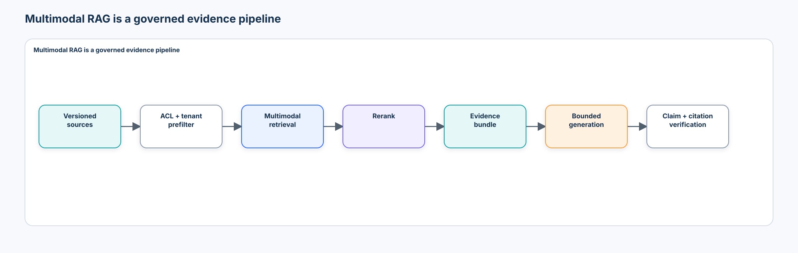
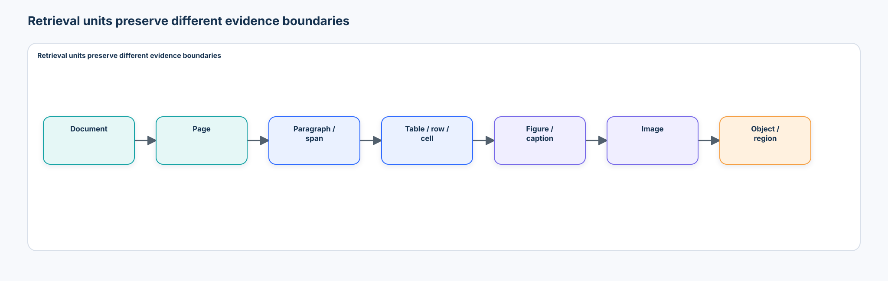
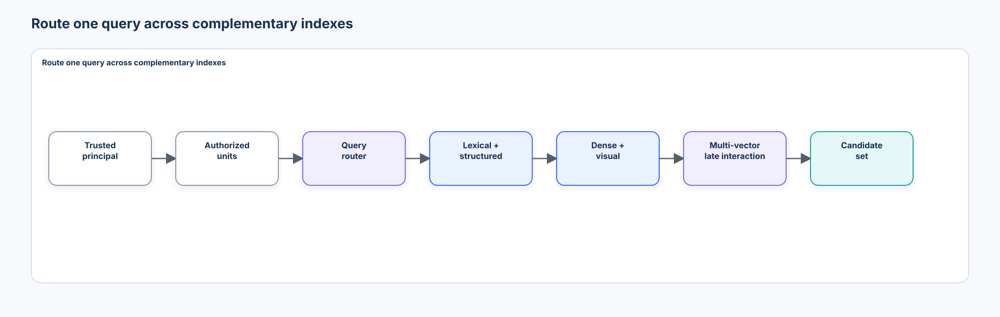
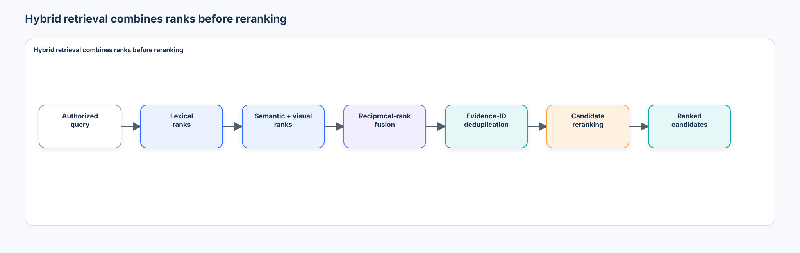
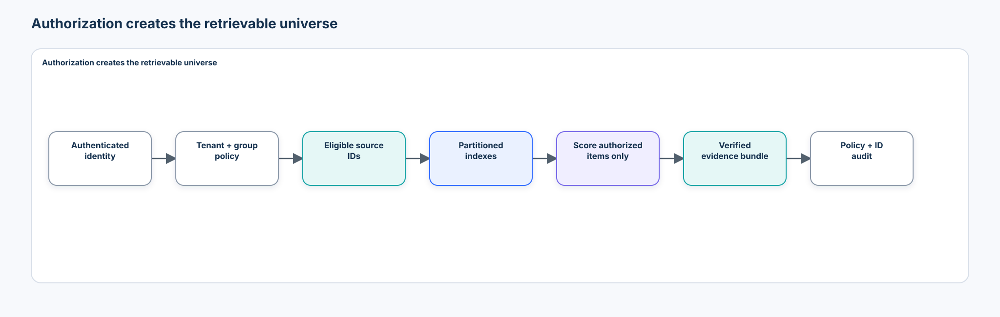
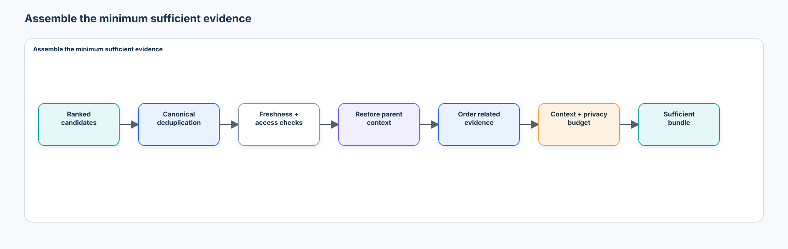
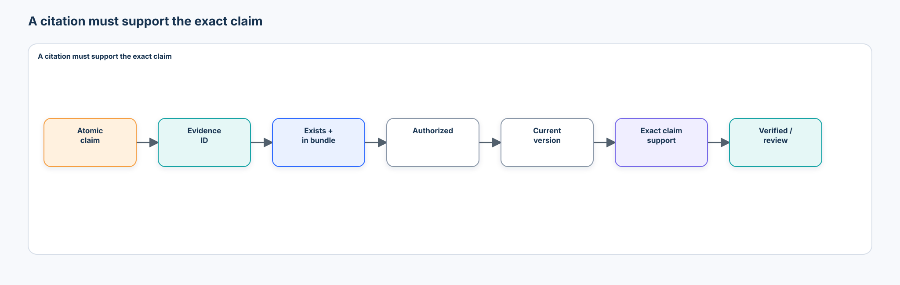
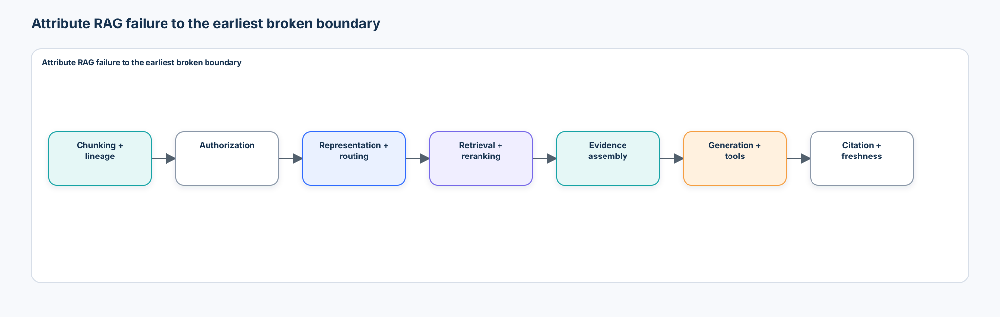

# Intermediate 04 — Multimodal Retrieval & RAG: From Evidence Indexing to Grounded Multimodal Answers

> **Central question:** How can a system retrieve the minimum sufficient authorized multimodal evidence—correctly, efficiently, and securely—and produce claims whose citations can be independently verified?

[← Intermediate 03 · Document Intelligence](../03-document-intelligence/README.md) · [Run the notebook](lab.ipynb) · [Intermediate track](../README.md)

Retrieval-augmented generation is not “put files in a vector database and ask a model.” It is a chain of contracts: decide what can be retrieved, preserve structure and lineage, authorize candidates before scoring, retrieve with measurable recall, assemble only sufficient evidence, generate within that evidence boundary, and verify that each citation actually supports its claim.



## Learning contract

After this course, you should be able to:

- choose among document-, page-, paragraph-, span-, table-, cell-, figure-, image-, object-, and region-level retrieval units;
- preserve canonical source, page, region, cell, image, version, and authorization lineage through indexing;
- explain lexical, dense, shared image–text, structured, and multi-vector representations;
- implement BM25-style lexical retrieval, deterministic dense and visual proxies, reciprocal-rank fusion, routing, reranking, and evidence assembly;
- place tenant, access-group, metadata, and typed version-policy checks before generation—and enforce both access and version eligibility before scoring;
- measure Recall@K, Precision@K, MRR, nDCG, complete-evidence-set recall, citation support, faithfulness, leakage, and staleness separately;
- compare retrieval-only, oracle-evidence generation, and retrieved-evidence generation;
- diagnose missing evidence, distractor capture, bad granularity, stale indexes, unsupported claims, and citation drift;
- test full-image, caption, and region retrieval without treating a local proxy as a foundation model; and
- review optional FAISS, BGE-M3, SigLIP 2, ColPali/ColQwen, reranker, and VLM components with pinned provenance.

### Prerequisites

Complete [Document Intelligence](../03-document-intelligence/README.md), [Multimodal Reasoning & Verification](../02-multimodal-reasoning-verification/README.md), and [Visual Embeddings, Metric Learning & Retrieval](../../beginner/07-visual-embeddings-metric-learning-retrieval/README.md). You should be comfortable with embeddings, cosine similarity, tables, page/region provenance, ranking metrics, and deterministic verification.

### Scenario, source policy, and boundaries

The notebook creates invoices, inspection records, maintenance tables, figures, captions, full images, and image regions for one fictional enterprise. Sources are isolated before derived retrieval units are constructed:

| Source | Role | Permitted use |
| --- | --- | --- |
| Vendor A | construction | design records, indexes, assertions, and failure fixtures |
| Vendor B | development | choose routing, fusion, reranking, context, and review policy |
| Vendor C | held-out reporting | report once after policy freeze; no tuning |

Access groups are `Finance`, `Operations`, and `Safety`; principals may have one or more groups but cannot acquire a group from query text or retrieved content. The notebook uses transparent local retrieval and generation proxies. It does **not** benchmark a production embedding model, vector database, reranker, or LLM. Outputs are advisory and carry `authorization = "none"`.

## 1. RAG is an evidence system

The generator is downstream of the most consequential choices:

```text
source → parsing → retrieval units → authorized indexes → candidates
       → fusion/reranking → evidence bundle → bounded generation
       → claim/citation validation → answer or review
```

An answer can fail even when its prose is fluent. The wrong page may be retrieved, the right document may be chunked at the wrong boundary, a relevant cell may be filtered out, an unauthorized item may leak, or a citation may exist without supporting the claim. Therefore “answer accuracy” is not a sufficient RAG metric.

Text RAG typically retrieves passages for a language model. **Multimodal RAG** must additionally decide whether evidence is text, layout, a cell, a figure, a whole image, an object, or a region; preserve geometry and cross-modal relationships; and budget both visual and textual context. Converting every modality to captions simplifies the interface but can erase the exact evidence the question needs.

## 2. Retrieval units define what can be cited



| Unit | Useful when | Common failure |
| --- | --- | --- |
| document | one source is short and cohesive | irrelevant context dominates |
| page | page identity is meaningful | fact spans page boundaries |
| paragraph/span | prose facts need compact support | layout and nearby qualifiers disappear |
| table | structure is needed as a whole | too large for precise citation |
| row/cell | exact lookup or arithmetic | header/context lineage is lost |
| figure/caption | visual explanation or diagram lookup | caption and figure become separated |
| image | global visual similarity matters | background shortcut dominates |
| object/region | local evidence matters | crop lacks scene context |

There is no universal chunk size. A valid unit must be retrievable, interpretable, citable, and reconstructable within its parent hierarchy.

## 3. Chunk by structure, not only token count

Sliding token windows are a baseline, not a document model. Layout-aware chunking respects headings, paragraphs, lists, table boundaries, merged cells, captions, figures, page breaks, and cross-page continuations. Hierarchical retrieval can first select a document or page, then score its children.

Useful chunk metadata includes:

```json
{
  "evidence_id": "vendor-b:invoice-17:page-1:cell-total",
  "canonical_source_id": "vendor-b:invoice-17:total",
  "document_id": "vendor-b:invoice-17",
  "page": 1,
  "modality": "table_cell",
  "source_box": [0.63, 0.72, 0.90, 0.78],
  "tenant_id": "northstar",
  "access_groups": ["Finance"],
  "source_version": "2"
}
```

## 4. Canonical identity prevents duplicate evidence

The same fact may appear as OCR text, a structured field, a cell crop, and a page representation. `evidence_id` identifies a representation; `canonical_source_id` identifies the underlying source fact. Evidence assembly should deduplicate by canonical lineage while preserving the most useful representation and its parent context.

Deduplication by text alone is unsafe: two invoices can legitimately contain the same amount, and a repeated warning may be independent evidence on two pages.

## 5. Representation taxonomy

| Representation | Signal | Strength | Limitation |
| --- | --- | --- | --- |
| lexical | exact terms, identifiers, rare tokens | precise and inspectable | weak synonym/visual matching |
| dense text | semantic vector | paraphrase and concept match | opaque errors; model/version dependence |
| shared image–text | aligned image and query vectors | cross-modal retrieval | global features may miss small regions |
| structured | typed keys and values | exact filters, comparisons, arithmetic | requires reliable extraction/schema |
| multi-vector | token/patch vectors with late interaction | fine-grained document matching | storage, compute, and filtering complexity |

Representations are complementary. A maintenance ID is often best found lexically; “oxidation near the lower flange” may need semantic and region signals; “largest approved invoice” should use retrieval to find authorized rows and deterministic code to compute the maximum.

## 6. Lexical retrieval remains a strong baseline

BM25 balances term frequency, inverse document frequency, and length normalization. A common form is:

$$
\operatorname{BM25}(q,d)=\sum_{t\in q}\operatorname{IDF}(t)
\frac{f(t,d)(k_1+1)}{f(t,d)+k_1\left(1-b+b\frac{|d|}{\operatorname{avgdl}}\right)}.
$$

It is especially valuable for invoice numbers, asset IDs, part codes, and exact terminology. The notebook implements the formula directly so tokenization, document frequency, and score behavior remain visible.

## 7. Dense retrieval changes the matching function

A dual encoder maps query and evidence independently, then compares normalized vectors:

$$
s(q,d)=\frac{f(q)^\top g(d)}{\lVert f(q)\rVert_2\lVert g(d)\rVert_2}.
$$

Dense retrieval improves semantic matching but does not guarantee factual support, authorization, freshness, or good region localization. The default notebook uses a declared semantic-feature proxy so no downloaded model is confused with locally measured foundation-model evidence.

The synthetic proxy has an explicit information boundary. Corpus features are built only from observable retrieval records; query features are built only from an observable `RetrievalRequest`. Required evidence IDs, relevance labels, gold answers, and evaluation-only semantic classes remain in the evaluation record and are never passed to routing, feature construction, candidate generation, or reranking. The notebook inspects those function signatures and serialized public views to assert this separation. Synthetic source truth may generate the public corpus, but evaluation annotations are constructed and stored separately.

A shared image–text space enables direct text-to-image and image-to-text comparison. Separate text and visual spaces can use modality-specialist encoders but require rank fusion, calibration, or a learned bridge. Neither design is universally superior: test global semantics, local detail, language coverage, index cost, and source bias on the actual query distribution.

## 8. Visual retrieval needs an explicit unit

A whole-image embedding answers “which scene looks similar?” A region embedding can answer “where is the corroded connector?” A caption can retrieve a visually grounded concept only if the caption is complete and correct. Compare all three; do not assume the global image vector is the correct representation for a small-object question.

The query can also be an image or region. Image-to-corpus retrieval encodes the visual query, retrieves similar images/regions, and can follow parent lineage to associated documents. Measure whether results match the visual condition or merely the camera, vendor background, or source style.

## 9. Multi-vector retrieval preserves local interactions

ColBERT-style late interaction retains multiple query and document vectors and aggregates token-level matches, commonly with a MaxSim operation:

$$
s(q,d)=\sum_{i\in q}\max_{j\in d} q_i^\top d_j.
$$

Document-image systems such as ColPali extend this idea to visual page patches. The benefit is finer matching without a single compressed page vector; the cost is larger indexes, more interactions, harder filtering, and model-specific preprocessing. It is an optional, emerging comparison—not the course default.

## 10. Route queries before spending retrieval budget

Query routing predicts needed evidence types without using hidden gold relevance. Examples:

- an exact invoice ID routes to lexical and structured indexes;
- “show the damaged connector” routes to visual/caption/region indexes;
- “which invoice is largest?” routes to structured rows plus deterministic aggregation;
- a synthesis question routes to multiple indexes and requires a complete evidence set.

Routing errors are measurable retrieval failures. A broad fallback can protect recall but increases distractors, latency, and context cost.

Complex questions require a dependency plan rather than one broad search. For “which vendor has the highest authorized invoice total, and does its inspection show corrosion?” retrieve authorized totals, apply deterministic `argmax`, bind the winning vendor/supplier, retrieve its inspection text and region, then assemble the complete evidence set. This is the observable dependency-graph discipline from Intermediate 02 applied to retrieval.

## 11. Multi-index retrieval preserves modality strengths



Keep modality-specific scores and ranks. Raw cosine similarity, BM25, and structured-match scores have different scales; concatenating them without calibration makes thresholds meaningless.

## 12. Hybrid retrieval and reciprocal-rank fusion



Reciprocal-rank fusion (RRF) combines ranked lists without requiring score calibration:

$$
\operatorname{RRF}(d)=\sum_{r\in R}\frac{1}{k+\operatorname{rank}_r(d)}.
$$

RRF is robust and simple, but its constant, participating indexes, list depths, and tie policy are still configuration. The notebook tests the calculation against a hand-computed ranking.

## 13. Access control must precede scoring



The secure and version-aware order is:

```text
authenticated principal → tenant/group policy → eligible source IDs
                        → typed version policy → retrieval/ranking → evidence bundle
```

Post-filtering top results is unsafe and harms recall: unauthorized items may influence ranking, appear in logs or caches, occupy candidate slots, or leak through side channels. Build security filters from trusted identity and policy—not natural-language query instructions.

The same rule applies to required freshness. When a request says `version_policy="current_only"`, a stale representation must be removed before scoring so it cannot displace a valid candidate. `version_policy="as_of"` requires an explicit ISO-8601 timestamp and selects coherent records effective at that time. `version_policy="historical_allowed"` permits coherent archived versions for historical questions. A source/index mismatch is ineligible under every policy; it is not a trustworthy historical record.

## 14. Metadata filters are part of retrieval semantics

Vendor, date, document type, equipment ID, locale, source version, and status may narrow a request. Validate allowed filter names and values; unknown filters should fail closed or enter review. Record which filters were applied and how many candidates remained, without logging sensitive content.

## 15. Candidate generation optimizes recall

First-stage retrieval should efficiently surface a broad authorized candidate set. This is where lexical, dense, visual, and approximate-nearest-neighbor methods belong. Tune candidate depth on development data using recall and complete-set recall, not final answer accuracy alone.

## 16. Reranking optimizes ordering

A cross-encoder or multimodal reranker jointly scores the query and candidate, usually with better interaction modeling and higher cost. A transparent deterministic reranker can combine exact identifiers, modality compatibility, semantic overlap, and metadata matches. It must not use gold relevance labels at inference time.

Rerank only the authorized candidate set. Report reranking gain, candidate recall ceiling, latency, and the cases where reranking suppresses required complementary evidence.

## 17. Evidence assembly is more than top-k



An evidence assembler should:

1. remove canonical duplicates;
2. retain exact provenance and authorization decisions;
3. restore necessary headers, captions, or parent context;
4. order multi-page or multi-part evidence coherently;
5. satisfy the query's required evidence types;
6. respect token, image, latency, and privacy budgets; and
7. stop when additional context is not useful.

“More context” can lower reliability by adding near-duplicates, stale values, prompt-injection text, and contradictory or irrelevant evidence.

## 18. Minimum sufficient context

Sweep evidence depth rather than choosing top-k by habit. Track retrieval recall, complete-evidence-set recall, context size, distractor rate, generation correctness, citation support, and cost together. A direct lookup may need one cell; a comparison may need several authorized rows; a visual synthesis may need a region and its inspection record.

## 19. Retrieval-only is the first evaluation gate

Before connecting a generator, inspect ranked evidence and answer:

- Was every required item retrievable?
- Did the right unit and modality appear?
- Was it early enough in the ranking?
- Were unauthorized and stale items excluded?
- Did distractors crowd out complementary evidence?

Generation cannot recover evidence it never receives. A retrieval-only baseline creates a ceiling and prevents a fluent model from hiding index defects.

## 20. Ranking metrics answer different questions

For required evidence set $G_q$ and retrieved set $R_q^K$:

$$
\operatorname{Recall@K}=\frac{|G_q\cap R_q^K|}{|G_q|},\qquad
\operatorname{Precision@K}=\frac{|G_q\cap R_q^K|}{K}.
$$

MRR emphasizes the first relevant rank. nDCG accounts for graded relevance and rank discount. Define the relevance scale, tie handling, and denominator. Report per-query values before averages.

## 21. Complete-set recall protects synthesis tasks

Item recall can look strong while no query receives all evidence required for a valid answer. Define:

$$
\operatorname{CompleteSetRecall@K}=\frac{1}{|Q|}\sum_{q\in Q}
\mathbf{1}[G_q\subseteq R_q^K].
$$

A two-part question with one retrieved item has 50% item recall and 0% complete-set success. This distinction is central to multimodal synthesis.

Report a retrieval-stage waterfall as well as the final number. The course measures complete-evidence recall at the initial candidate union, after fusion, after reranking, after canonical deduplication/hierarchy handling, and in the final context-budgeted bundle. If evidence is present initially but absent at the end, this table identifies whether ordering, bundle depth, deduplication, or the context budget—not candidate generation—caused the loss.

## 22. Citation existence is not citation support



A useful answer contract contains atomic claims, evidence IDs, and support states. Validate at least:

- citation ID exists;
- cited item was in the supplied bundle;
- principal was authorized for it;
- cited version is current enough for the task;
- evidence supports the exact claim, including units and qualifiers; and
- all material claims have sufficient support.

Citation precision measures how many citations support their claims; citation recall measures how many support-requiring claims have supporting citations. A valid-looking identifier is not evidence.

## 23. Faithfulness is conditional on supplied evidence

An answer is faithful when its claims are supported by the supplied evidence. It may still be factually incomplete because retrieval missed the true source. Conversely, an unfaithful answer can be accidentally correct from model memory. Measure answer correctness, retrieval completeness, and evidence faithfulness separately.

## 24. Oracle evidence separates failure stages

Run the same generator twice:

```text
gold/oracle evidence → generator → oracle-generation result
retrieved evidence   → generator → end-to-end result
```

If oracle generation succeeds but retrieved generation fails, retrieval/assembly is implicated. If oracle generation fails, the generator or answer policy is implicated. If retrieval is incomplete and oracle generation also fails, both boundaries need work. “Oracle” means the labeled evidence set used for evaluation; it is never available to production retrieval.

## 25. Tables should not be reduced to prose arithmetic

Retrieve the authorized rows/cells, preserve headers and units, then use deterministic code for exact maximum, sum, date comparison, or threshold logic. A generator may explain the result, but should not be the calculator of record.

## 26. Figures and captions are related but distinct evidence

A figure may contain the requested component while its caption names only the overall assembly. A caption may state a claim not visually verifiable from the figure. Store the relationship and allow retrieval of either or both; cite the evidence that supports the claim actually made.

## 27. Distractors and counterfactuals expose brittle systems

Inject:

- near-duplicate values from another vendor;
- a semantically similar but irrelevant page;
- a relevant unauthorized item;
- stale and current versions of one source;
- a malicious “ignore policy” string; and
- a counterfactual source update that should change the answer.

Measure answer flips, evidence-set changes, citation drift, and unauthorized retrieval. A robust system should change when relevant evidence changes and remain stable when only irrelevant distractors change.

## 28. Freshness and index lineage

Each record should name source version/hash, effective interval, representation model/version, index version, and indexing time. Updating a source without reindexing creates a stale but internally consistent vector. Retrieval quality metrics may not reveal that the answer came from an obsolete source.

Freshness checks compare the indexed source version/hash with the current source registry. The query must carry a typed policy: current-only, point-in-time `as_of`, or historical-allowed. Apply it after authorization and before every retriever scores candidates, then verify it again at the evidence boundary as defense in depth. “Latest” is not always the legally effective version.

## 29. Prompt injection is a data-boundary problem

Retrieved text is untrusted evidence. It cannot modify system policy, grant access, call tools, or request more corpus data. Keep control instructions outside evidence, delimit content, use typed schemas, allow-list tools, minimize privileges, and validate outputs. The generator should receive only the assembled bundle—not unrestricted corpus or index access.

## 30. Logging without leaking content

Record principal/tenant pseudonyms, policy version, eligible candidate count, query route, index versions, ranked evidence IDs, scores/ranks, bundle IDs, checks, and timings. Avoid raw documents, full queries, embeddings, secrets, and sensitive answer text unless an approved retention policy requires them.

## 31. Evaluation by source and query type

Report direct text fact, table comparison, image retrieval, figure lookup, multimodal synthesis, and access-controlled queries separately. Slice by vendor, modality, retrieval unit, required evidence count, access group, and fresh/stale state. Freeze policy on Vendor B; Vendor C is reporting only.

## 32. Failure taxonomy



| Earliest failing boundary | Example | Mitigation |
| --- | --- | --- |
| parsing/chunking | total detached from its currency/header | structure-aware units and parent lineage |
| authorization | relevant Finance cell reaches Operations user | trusted pre-filtered partitions and leakage tests |
| representation | small defect lost in global image vector | caption/region/multi-vector representation |
| routing | visual question sent only to lexical index | measurable router and recall fallback |
| retrieval | required item below candidate cutoff | tune recall depth; hybrid index |
| reranking | complementary second item suppressed | set-aware reranking and complete-set metric |
| assembly | duplicates consume bundle | canonical deduplication |
| generation | supported evidence miscomputed | deterministic tool and oracle-evidence test |
| citation | citation exists but supports another claim | claim-level support verifier |
| freshness | v1 indexed after source becomes v2 | source/index registry and reindex SLA |

## 33. Technology landscape and 2026 review

Reviewed **2026-09-09**. Recheck releases, model cards, data, licenses, processors, hashes, and target-runtime behavior before adoption.

| Tool/family | Best fit | Strength | Boundary to review |
| --- | --- | --- | --- |
| NumPy/pandas | transparent course indexes and metrics | observable, deterministic primitives | teaching scale only |
| [FAISS](https://github.com/facebookresearch/faiss) | local exact/ANN vector search | mature CPU/GPU indexes; MIT | recall loss, updates, filters, memory, tenant isolation |
| [BGE-M3](https://huggingface.co/BAAI/bge-m3) | multilingual dense/sparse/multi-vector text retrieval | multiple retrieval modes in one family; MIT model card | tokenizer/model revision, long-input cost, domain evaluation |
| [SigLIP 2](https://huggingface.co/google/siglip2-base-patch16-224) | shared image–text retrieval | multilingual and dense-feature capabilities; Apache-2.0 | preprocessing, resolution, global/region fit, data/license review |
| [ColBERT](https://arxiv.org/abs/2004.12832) | late-interaction text retrieval | fine-grained matches | index size and interaction cost |
| [ColPali](https://arxiv.org/abs/2407.01449) / ColQwen | visual document-page retrieval | patch-level page representation | large runtime, page rendering, patch storage, benchmark transfer |
| [Sentence Transformers CrossEncoder](https://www.sbert.net/examples/cross_encoder/applications/README.html) | text reranking | common pair-scoring API | slower joint scoring; candidate ceiling remains |
| [Qwen3-VL](https://arxiv.org/abs/2511.21631) | optional multimodal query–evidence scoring | current common Transformers processor/generation interface | non-authoritative relevance scores; large runtime; prompt/model dependence |
| hosted vector databases | distributed serving and operations | filtering, replication, managed scale | tenancy, deletion, consistency, portability, cost, and auditability |

This is deliberately not a catalogue. Select a system only after the retrieval unit, modality, filter semantics, update pattern, consistency, scale, latency, tenancy, deletion, and evidence requirements are known.

### Optional model manifests

The notebook pins disabled adapters to immutable revisions:

- BGE-M3: `5617a9f61b028005a4858fdac845db406aefb181`;
- SigLIP 2 base patch16 224: `75de2d55ec2d0b4efc50b3e9ad70dba96a7b2fa2`;
- BGE reranker v2 M3: `953dc6f6f85a1b2dbfca4c34a2796e7dde08d41e`;
- ColQwen2.5 base: `92908120384b7a2110c5beda3ab29cbdb2c08e49`;
- ColPali engine release v0.3.17: `0c630e356bbbf292ae0d8f050f54b8640f05919a`; and
- Qwen3-VL-2B-Instruct optional multimodal relevance scorer: `89644892e4d85e24eaac8bacfd4f463576704203`.

These identifiers do not prove readiness. Optional observations remain ineligible for comparison until model/code revision, processor configuration, artifact hashes, checkpoint license, source data, target runtime, access approval, and evaluation corpus are recorded. No optional model downloads on the default path.

## 34. Enterprise architecture and operations

```text
trusted identity/policy ──────────────┐
                                     v
sources → parse/version → partitioned authorized indexes → retrieve/rerank
   │                    source registry ↗               ↓
   └──────── provenance/evidence store ← bundle ← validate freshness
                                               ↓
                                   bounded generator / tools
                                               ↓
                              claim + citation verification
                                               ↓
                                 answer / abstain / review
```

Production design must address encrypted storage, tenant partitions, deletion propagation, index rebuild/rollback, access-policy changes, caches, embeddings as sensitive derived data, audit events, availability, recovery objectives, model/index migrations, quality gates, drift, and incident response. A removed source must disappear from lexical, vector, cache, bundle, and downstream trace stores under the applicable retention policy.

### Human review

High-risk or unresolved answers should show the exact claim beside its source page, cell, figure, full image, or region—not only a generated summary. Store the evidence shown, original answer, corrected answer/citation, reviewer identity, timestamp, and reason. Measure review rate, answer correction rate, citation correction rate, and time to decision. Reviewer edits are observations that may require adjudication; they do not silently become universal ground truth.

## 35. Anti-patterns

Avoid:

1. selecting a vector database before defining evidence and authorization contracts;
2. flattening tables, figures, captions, and page regions into anonymous text;
3. splitting one canonical fact into train/dev/test representations;
4. embedding first and filtering permissions after ranking;
5. fusing incomparable raw scores without calibration;
6. tuning on held-out Vendor C;
7. reporting answer accuracy without retrieval-only metrics;
8. reporting average item recall without complete-set recall;
9. treating a citation identifier as proof of support;
10. letting the generator browse the unrestricted corpus;
11. using an LLM for exact arithmetic already present in structured evidence;
12. assuming more context is always safer;
13. treating content instructions as control-plane instructions;
14. filtering stale or superseded versions only after they have occupied candidate slots;
15. letting gold relevance or evaluation-only semantic fields enter synthetic proxy features;
16. ignoring source/index/model versions and deletion propagation; and
17. presenting local proxies or optional model-card claims as production evidence.

## 36. Lab map

The self-contained [notebook](lab.ipynb) implements:

1. typed evidence, principal, query, retrieval-hit, bundle, claim, and citation contracts;
2. a multimodal Vendor A/B/C corpus split before derived units;
3. trusted ACL/tenant prefiltering followed by typed `current_only`, `as_of`, and `historical_allowed` enforcement before scoring;
4. lexical BM25, semantic dense, visual, structured, and multi-vector teaching indexes;
5. executable assertions that public query/corpus features exclude gold relevance, required evidence, answers, and evaluation-only semantic classes;
6. deterministic query routing, RRF, reranking, hierarchy, canonical deduplication, and context budgets;
7. retrieval-only Recall@K, Precision@K, MRR, nDCG, item recall, complete-set recall, and a five-stage recall waterfall;
8. full-image versus caption versus region retrieval and shortcut diagnostics;
9. deterministic table aggregation and figure/caption evidence binding;
10. a top-k sweep balancing sufficiency, distractors, context, and compute proxies;
11. a labeled `local_generation_proxy`, oracle versus retrieved evidence, and failure attribution;
12. claim-level citation verification, including unsupported, missing, wrong-ID, unauthorized, and stale injections;
13. distractor, counterfactual, prompt-injection, stale-index, and access-control tests;
14. frozen Vendor B policy and Vendor C reporting-only evaluation;
15. optional disabled FAISS/model adapters with machine-readable readiness gates; and
16. a governed JSON evidence artifact under `.artifacts/`.

## 37. Exercises

### Implementation

Add a date-aware metadata filter whose allowed operators and timezone semantics are explicit. Add a table-row representation that restores its header lineage during evidence assembly.

### Diagnosis

Create a query with high Recall@5 but zero complete-set recall. Identify whether candidate generation, reranking, deduplication, or the context budget caused the failure.

### Architecture judgment

Choose between single-vector shared image–text retrieval and multi-vector document-image retrieval for 10 million scanned pages. Specify quality, memory, filter, update, deletion, license, and latency evidence required.

### Production design

Design a tenant deletion and access-revocation workflow across source objects, lexical and vector indexes, caches, evidence bundles, logs, and generated answers. Include proof of completion and rollback behavior.

## 38. What you should now be able to explain without code

1. Why is a retrieval unit also a citation-design decision?
2. Why is fixed-token chunking insufficient for tables and figures?
3. What is the difference between an evidence ID and a canonical source ID?
4. When is lexical retrieval stronger than dense retrieval?
5. What does a shared image–text embedding enable?
6. Why can a global image embedding miss a small defect?
7. What does late interaction preserve that a single vector discards?
8. Why should heterogeneous raw scores not be added casually?
9. What problem does reciprocal-rank fusion solve, and what does it not solve?
10. Why must ACL filtering happen before scoring?
11. What is the difference between candidate generation and reranking?
12. Why can high item recall coexist with failed multimodal synthesis?
13. What makes an evidence bundle minimally sufficient?
14. Why can increasing top-k reduce answer reliability?
15. Why is retrieval-only evaluation required before generation?
16. How do oracle-evidence tests separate retrieval and generation failures?
17. Why is citation presence different from citation support?
18. How can a current source produce a stale retrieval result?
19. Why is retrieved prompt-injection text data rather than authority?
20. What evidence is needed before an optional embedding model, reranker, vector index, or VLM becomes production-ready?

## 39. Transition to Intermediate 05

This course retrieves bounded evidence from mostly static documents and images. **Intermediate 05 — Video-Language Understanding** will add time: frame sampling, event boundaries, temporal ordering, streaming context, long-video retrieval, and citations that must identify when—not only where—evidence occurs.

## References

### Primary research

- Lewis et al., [Retrieval-Augmented Generation for Knowledge-Intensive NLP Tasks](https://arxiv.org/abs/2005.11401), 2020.
- Karpukhin et al., [Dense Passage Retrieval for Open-Domain Question Answering](https://arxiv.org/abs/2004.04906), 2020.
- Cormack, Clarke, and Buettcher, [Reciprocal Rank Fusion Outperforms Condorcet and Individual Rank Learning Methods](https://doi.org/10.1145/1571941.1572114), 2009.
- Khattab and Zaharia, [ColBERT: Efficient and Effective Passage Search via Contextualized Late Interaction over BERT](https://arxiv.org/abs/2004.12832), 2020.
- Radford et al., [Learning Transferable Visual Models From Natural Language Supervision](https://proceedings.mlr.press/v139/radford21a.html), 2021.
- Yu et al., [SigLIP 2: Multilingual Vision-Language Encoders with Improved Semantic Understanding, Localization, and Dense Features](https://arxiv.org/abs/2502.14786), 2025.
- Chen et al., [BGE M3-Embedding](https://arxiv.org/abs/2402.03216), 2024.
- Faysse et al., [ColPali: Efficient Document Retrieval with Vision Language Models](https://arxiv.org/abs/2407.01449), 2024 / ICLR 2025.
- Qwen Team, [Qwen3-VL Technical Report](https://arxiv.org/abs/2511.21631), 2025.

### Official tooling and evaluation

- [FAISS documentation and source](https://github.com/facebookresearch/faiss).
- [Hugging Face SigLIP 2 documentation](https://huggingface.co/docs/transformers/model_doc/siglip2).
- [Sentence Transformers CrossEncoder documentation](https://www.sbert.net/docs/cross_encoder/cross_encoder.html).
- [ViDoRe benchmark repository](https://github.com/illuin-tech/vidore-benchmark).
- [NIST information retrieval metric overview](https://trec.nist.gov/).
