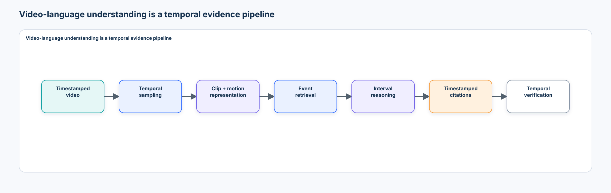
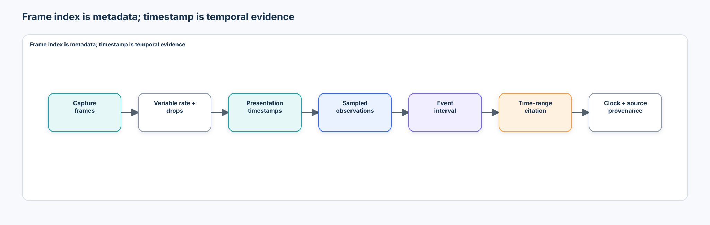
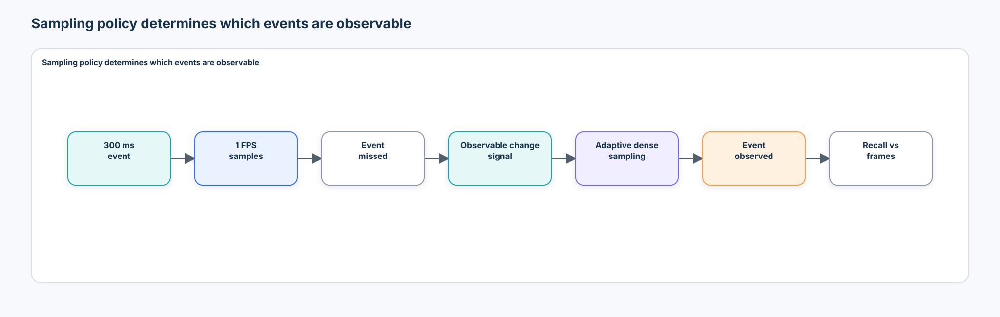
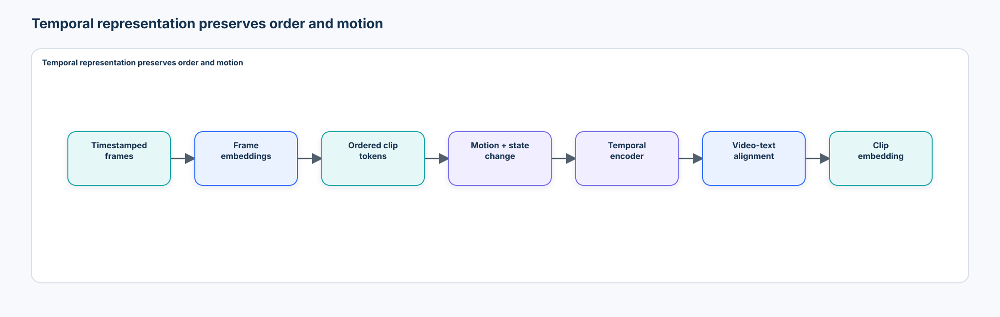
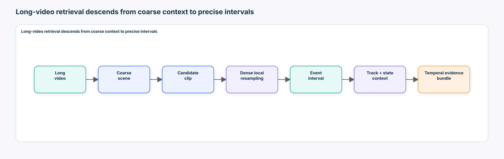
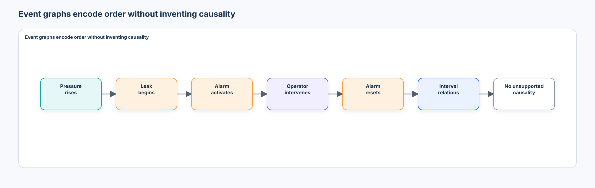
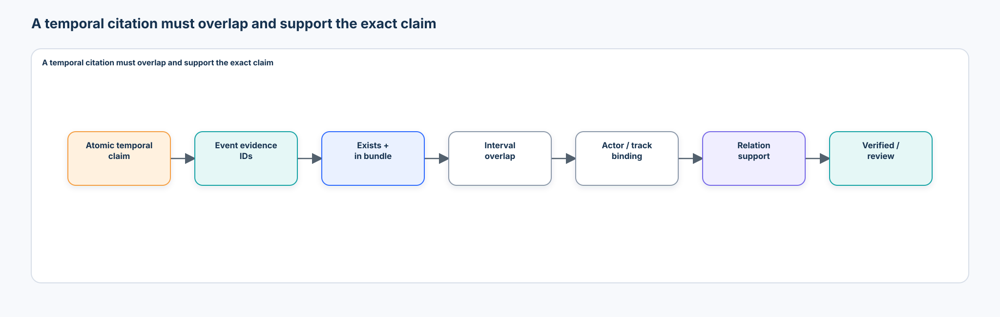
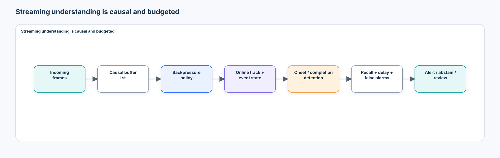

# Intermediate 05 — Video-Language Understanding: From Temporal Evidence to Grounded Video Reasoning

> **Central question:** How can a multimodal system locate, represent, retrieve, reason over, and cite the correct evidence in time?

[← Intermediate 04 · Multimodal Retrieval & RAG](../04-multimodal-retrieval-rag/README.md) · [Run the notebook](lab.ipynb) · [Intermediate track](../README.md)

Video understanding is not image understanding repeated frame by frame. The system must preserve time, motion, identity, event boundaries, ordering, duration, and causal availability while controlling the amount of visual evidence it processes. A fluent answer is insufficient: the claim must be bound to the interval—or set of intervals—that supports it.



## Learning contract

After this course, you should be able to:

- distinguish frame index, presentation timestamp, event time, and wall-clock time;
- explain how frame rate, dropped frames, variable-rate media, and sampling determine observable events;
- compare frame pooling, order-aware clip representations, motion/state-change features, and space-time attention;
- design whole-video, scene, fixed-clip, event, frame, and track-interval retrieval units;
- implement temporal sampling, transparent clip features, text-to-clip retrieval, temporal grounding, interval relations, and event deduplication;
- measure event observation recall, Recall@K, MRR, temporal IoU, boundary errors, complete temporal evidence recall, and citation support;
- test reversal, frame shuffling, relevant and irrelevant temporal counterfactuals, evidence ablation, and language-prior hallucination;
- distinguish offline from causal streaming inference and measure event delay, false alarms, frame loss, backlog, and backpressure trade-offs;
- preserve timestamp, source, version, track, authorization, and compression lineage through Video RAG; and
- evaluate established video encoders, current video-language systems, and emerging streaming architectures without confusing model-card results with production evidence.

### Prerequisites

Complete [Tracking, Keypoints & Pose](../../beginner/08-tracking-keypoints-pose/README.md), [Vision-Language Models](../01-vision-language-models/README.md), [Multimodal Reasoning & Verification](../02-multimodal-reasoning-verification/README.md), and [Multimodal Retrieval & RAG](../04-multimodal-retrieval-rag/README.md). Course 03’s transformer mechanics and Course 04’s self-supervised objectives are useful background.

### Scenario, success criteria, and boundaries

The notebook creates timestamped procedural observations for an industrial workcell containing an operator, robot arm, containers, valve, pressure signal, alarm, and replaceable component. Camera A is construction data, Camera B is development-only, and Camera C is reporting-only after policy freeze. The sources differ in brightness, nominal frame rate, timestamp cadence, motion speed, background, and dropped frames.

A successful system must find the relevant event intervals, retrieve complete evidence for multi-event questions, bind actors to track IDs, compute temporal relations and durations deterministically, support every claim with authorized timestamped evidence, and abstain or request review when evidence is incomplete. Generated answers are advisory and carry `authorization = "none"`.

The default notebook is credential-free and CPU-safe. It uses declared `local_temporal_representation_proxy` and `local_video_language_proxy` components—not a video foundation model, production decoder, or model-quality benchmark. It generates observations procedurally rather than downloading a dataset. Ground-truth event annotations are stored separately and never enter sampling, feature, retrieval, or reranking functions.

### Non-goals

This is not a video-upload API tutorial, architecture catalogue, full audio course, multi-camera re-identification course, or causal-inference course. It does not claim that temporal order proves causality. It teaches the evidence contracts that remain necessary whichever model or service is selected.

## 1. From spatial to temporal evidence

An image system often asks, “What is happening here?” A video system must also answer: what happened, when, for how long, before or after what, involving which persistent entity, and supported by which time interval?

For frames $I_t$ and their timestamps $\tau_t$:

$$
V=\{(I_t,\tau_t)\}_{t=1}^{T}.
$$

The evidence contract changes from **where** to **where + when**. A box on one frame cannot by itself prove an action, a transition, a duration, or an event order.

## 2. Video data and clock contracts

A source record should preserve at least:

```json
{
  "video_id": "inspection-42",
  "duration_seconds": 83.4,
  "nominal_fps": 30.0,
  "frame_count": 2502,
  "width": 1920,
  "height": 1080,
  "time_base": "1/90000",
  "clock_source": "camera_pts",
  "source_version": "3"
}
```

Every decoded observation needs both `frame_index` and `timestamp_seconds`. Index is useful identity metadata, but it is not sufficient temporal evidence. Variable frame rate, presentation/decode order, dropped frames, transcoding, resampling, and clock drift can invalidate the shortcut $\tau=i/\mathrm{fps}$.



Modern PyTorch video pipelines should review [TorchCodec](https://docs.pytorch.org/torchcodec/stable/), which exposes time-based decoding and sampling on top of FFmpeg. Decoder choice does not remove the need to record seek mode, timestamps, codec/FFmpeg versions, and decode error policy.

## 3. Frame rate and temporal aliasing

Suppose a valve transition lasts 300 ms. A 1 FPS sampler may observe frames immediately before and after it without observing the transition itself. This is temporal aliasing: different underlying sequences become indistinguishable under the sampling policy.

```text
ground truth: closed ─── opens ─ closes ───
1 FPS:        closed                 closed
```

Spatial resolution determines visible detail; temporal resolution determines visible events. A model cannot reason about an event it was never shown.

## 4. Temporal sampling policies



| Policy | Mechanism | Strength | Failure |
| --- | --- | --- | --- |
| uniform | sample every fixed time interval | simple and reproducible | misses brief events between samples |
| random | sample offsets/windows stochastically | useful augmentation during training | nondeterministic coverage at inference |
| event-aware | increase density around observable motion/change | efficient for sparse events | gate can miss semantically important low-motion events |
| hierarchical | coarse pass, candidate interval, dense local pass | scales to long video | coarse stage creates a recall ceiling |

Sampling is part of the model and evaluation contract. Record target times, selected presentation timestamps, tolerance/tie rules, missing-frame handling, and the number of decoded and encoded frames.

The notebook mechanically enforces the deployable boundary: `event_aware_sample` and `observable_change_segments` accept public `FrameObservation` records and declared thresholds only. Their signatures cannot accept event types, ground-truth IDs, annotation boundaries, or evaluation records; a negative test passes `EventAnnotation` records and requires a type failure. `oracle_event_segmentation_ceiling` remains outside the deployable component registry.

## 5. Frames, clips, and motion

The simplest representation encodes every frame independently:

$$
z_1,z_2,\ldots,z_T.
$$

Mean pooling summarizes common appearance but can erase one damaged frame among 99 normal frames. Max pooling preserves strong activations but loses order and may amplify noise. Attention pooling can prioritize frames but consumes compute and does not automatically learn the right evidence.

A clip encoder receives an ordered interval and can represent appearance, motion, action, and short-term temporal structure. Two sequences containing the same frames in opposite order have identical bag-of-frame averages yet different meanings: filling becomes emptying, and closed→open becomes open→closed.

## 6. Transparent temporal representations



The lab’s transparent proxy uses only observable frame fields:

```text
mean state + first/last delta + motion magnitude + transition indicators
```

It is deliberately inspectable. A production representation may use 3D convolution, recurrent state, temporal shift/mixing, or transformer attention. The same questions remain: what time span does one token represent, what order is retained, what motion is visible, and what detail was compressed away?

## 7. Space-time attention

Video transformers extend patch tokens with spatial and temporal position. If each frame has $S$ spatial tokens and there are $T$ frames, joint attention sees $N=TS$ tokens and naive attention interactions grow as $O(T^2S^2)$. Factorized designs separate spatial and temporal attention to reduce cost and introduce a useful inductive structure.

[TimeSformer](https://arxiv.org/abs/2102.05095) compared space-only, joint, sparse-local-global, and divided space-time attention. [ViViT](https://arxiv.org/abs/2103.15691) explored factorized video-transformer variants. These are architecture lessons, not prescriptions: input sampling, positional treatment, token compression, pretraining, and target task can dominate the result.

## 8. Video self-supervision and alignment

[VideoMAE](https://arxiv.org/abs/2203.12602) uses high-ratio tube masking to exploit video redundancy during self-supervised pretraining. Other objectives include temporal prediction, contrastive video learning, teacher–student consistency, and video-text correspondence. Architecture determines how information can flow; pretraining determines which invariances and temporal cues the representation learns.

Video-text alignment extends dual-encoder retrieval:

$$
s(V,q)=\frac{f_{video}(V)^\top g_{text}(q)}{\lVert f_{video}(V)\rVert_2\lVert g_{text}(q)\rVert_2}.
$$

Whole-video embeddings support text-to-video retrieval, but may compress away the exact moment. Text-to-clip retrieval can return `video 42, 34.2s–39.8s`, creating usable temporal evidence.

## 9. Action recognition is not event reasoning

Action recognition asks which action is present. Temporal event reasoning may require two localized events and a deterministic relation:

```text
action: tightening bolt
reasoning: did tightening finish before the leak stopped?
```

Correct action classification does not establish onset, completion, duration, actor identity, repetition count, or order relative to another event.

## 10. Retrieval units become temporal

Possible units include whole video, scene, shot, fixed clip, event segment, frame, and track interval. Each choice controls what can be found and cited.

| Unit | Best fit | Risk |
| --- | --- | --- |
| video | broad topic retrieval | exact moment disappears |
| scene/shot | editorial boundaries | industrial events need not match cuts |
| fixed overlapping clip | predictable index | duplicate events and arbitrary boundaries |
| observable event segment | semantic boundary | change detector becomes a recall dependency |
| frame | static evidence or onset precision | no duration by itself |
| track interval | actor/entity history | association errors contaminate reasoning |

## 11. Fixed windows versus event segments

Fixed 5-second windows are simple and predictable; overlap reduces boundary misses but creates near-duplicate evidence. Event-centered indexing can reduce duplication and improve boundary meaning, but depends on a scene/action/change detector. A ground-truth-derived segmenter is an **oracle ceiling**, not a deployable baseline.

The lab compares fixed windows, an observable change-point proxy, and a clearly labeled oracle segmenter. It never presents the oracle result as model performance.

## 12. Long video and hierarchical retrieval

A two-hour video at 30 FPS contains 216,000 frames. With 256 visual tokens per frame, even 32 frames already consume 8,192 visual tokens before text. Feeding every decoded frame to one model is usually an inefficient and poorly observable system design.



Hierarchical retrieval can index the whole video, 30-second scenes, 5-second clips, and variable-length events, then descend coarse→fine. Every compression layer—frame embeddings, clip vectors, event memory, structured summaries—trades cost against recoverable temporal detail. A summary is not equivalent to original evidence unless it retains source intervals and can restore them.

## 13. Temporal grounding

Given “When does the operator replace the connector?”, temporal grounding predicts an interval $P=[p_s,p_e]$. For ground truth $G=[g_s,g_e]$:

$$
\operatorname{tIoU}(P,G)=
\frac{\max(0,\min(p_e,g_e)-\max(p_s,g_s))}
{\max(p_e,g_e)-\min(p_s,g_s)}.
$$

The notebook tests perfect, partial, contained, disjoint, and boundary-touching intervals. It reports Recall at tIoU thresholds 0.3, 0.5, and 0.7, plus absolute start error, end error, and duration error. A high tIoU can still hide an unacceptable onset error for a short safety event.

## 14. State changes and track-aware evidence

Many enterprise questions concern transitions:

```json
{
  "entity": "valve_2",
  "before": "closed",
  "after": "open",
  "transition_interval": [12.2, 12.8]
}
```

Course 08 supplied track identity, box, pose, and history. This course treats a track interval as evidence: Track 7 enters a zone, interacts with a machine, and leaves. Wrong association can create a wrong actor, wrong event count, or impossible state history even when frame-level detections are correct.

## 15. Interval relations and event graphs

Use deterministic tools for `before`, `after`, `overlaps`, `contains`, and `during`; Allen’s interval algebra is the richer formal foundation ([Allen, 1983](https://doi.org/10.1145/182.358434)). The lab also computes gaps and durations rather than asking a generator to perform interval arithmetic.



An event graph may record pressure rise before leak onset, leak onset before alarm activation, and operator intervention during the alarm. It must not label “pressure caused leak” merely because one preceded the other.

## 16. Repetition and temporal deduplication

Counting events is not counting frames containing an action. Overlapping windows such as 32–36s, 34–38s, and 36–40s may all describe one event. Merge candidates using compatible event semantics, temporal overlap/gap, and track/entity identity. Keep the constituent intervals so deduplication remains auditable.

## 17. Complete temporal evidence

Multi-event questions require every supporting event. For required event set $G_q$ and retrieved event set $R_q^K$:

$$
\operatorname{CompleteTemporalEvidence@K}
=\frac{1}{|Q|}\sum_q \mathbf{1}[G_q\subseteq R_q^K].
$$

Report event Recall@K and complete-set success separately. A question about whether valve closure preceded alarm reset is unsupported when only the closure interval was retrieved.

## 18. Temporal citation contract



```json
{
  "evidence_id": "video42:event17",
  "video_id": "inspection-42",
  "start_seconds": 33.8,
  "end_seconds": 35.1,
  "frame_start": 1014,
  "frame_end": 1053,
  "event_type": "leak_start",
  "track_ids": ["valve_2"],
  "source_version": "3"
}
```

Frame numbers are metadata; the canonical evidence boundary is the timestamp interval. A citation can exist yet fail support because it references 40–45s for an event at 21s, binds the wrong track, or supplies only one side of a before/after claim.

## 19. Claim-level verification

For “The leak begins before the alarm activates,” verification checks that both required evidence IDs were supplied, each overlaps the correct labeled event under the evaluation contract, access/version checks pass, and `leak.start < alarm.start`. Citation existence, interval overlap, exact claim support, and complete support are separate states.

The answer generator cannot retrieve new video, inspect evaluation annotations, change sampling, or authorize an action. It receives only the bounded evidence bundle and deterministic tool outputs.

The executable stage-wise waterfall reports event recall and complete multi-event recall after public observation, sampling, candidate retrieval, boundary refinement, deduplication, and final bundle validation. Evaluation truth scores each stage after the fact; it is never passed into pipeline functions. The first incomplete stage distinguishes “never sampled” from retrieval, localization, or assembly loss.

## 20. Temporal hallucination taxonomy

| Failure | Example | Measurement |
| --- | --- | --- |
| invented event | claims an alarm that remained off | event-presence precision |
| wrong event time | correct event, wrong interval | tIoU and boundary errors |
| wrong order | reverses leak and alarm | relation accuracy |
| wrong duration | onset correct, completion wrong | duration error |
| wrong actor/track | binds operator 2 to operator 7’s action | track-binding accuracy |
| duplicate event | overlapping windows counted as repeats | canonical event precision |
| missed event | short valve transition unseen | event observation/retrieval recall |
| state-change hallucination | claims closed→open without transition evidence | transition support |
| unsupported causal claim | converts “before” into “caused” | causal-language violation rate |

Plausible narrative is not temporal evidence. A model may infer that an alarm “must have” activated after pressure rose even when the light and audio remained off.

## 21. Temporal evidence ablation and counterfactuals

Ask the same question with the full relevant clip, only the pre-event clip, only the post-event clip, and an unrelated clip. An answer about whether a transition occurred should depend on seeing both sides of the transition.

Relevant counterfactuals swap leak→alarm into alarm→leak and require the answer to flip. Irrelevant counterfactuals shift operator entry while preserving leak/alarm order and require invariance. Report both sensitivity and invariance; neither alone establishes grounding.

## 22. Reversal and shuffle diagnostics

Forward/reversed and ordered/shuffled inputs test whether a representation depends on temporal sequence. The notebook defines:

$$
TD=\operatorname{Accuracy}_{ordered}-\operatorname{Accuracy}_{shuffled}.
$$

`temporal_dependence_teaching` is a local diagnostic—not a standardized benchmark. A zero value may expose a bag-of-frame shortcut, but a large value alone does not prove general temporal reasoning.

## 23. Offline versus streaming understanding

Offline systems can inspect the full video. At streaming time $t$, a causal system may use only $I_{\le t}$, never future frames. Event onset, active state, and completion are distinct answer states: `not_started`, `active`, `completed`, or `uncertain`.



Do not evaluate a future-aware offline model and describe it as real time.

## 24. Streaming metrics and backpressure

If a leak begins at 20s and is detected at 21.4s, detection delay is 1.4s. Report event recall, false alarms, delay distribution, and time-to-completion separately.

When a 30 FPS camera feeds an 18 FPS pipeline, queue-all behavior causes latency to grow without bound. Alternatives—drop-oldest/latest, adaptive sampling, resolution reduction, batching, and event-triggered inference—trade latency against event recall. Timestamps, not processed frame counts, determine event timing.

The lab repeats queue-all, keep-latest, and event-aware drop policies under five deterministic processing-jitter seeds. It reports mean, standard deviation, and range for event recall plus delay and processed-frame variability rather than presenting one scheduling trace as representative.

## 25. Frame drops and synchronization

The lab repeats random delivery at 100%, 50%, and 20% across five deterministic seeds. It reports mean, standard deviation, and range for event recall, separates short- from long-event recall, and records tIoU-qualified localization recall and observed-boundary error. Equal delivered FPS is therefore not treated as equal evidence. Because thinning can also create a larger apparent signal delta and trigger a heuristic that stayed quiet on dense input, non-monotonic proxy behavior is a diagnostic—not evidence that dropped frames improve the underlying video. In multi-camera systems, clock drift, differing frame rates, encode delay, and network latency mean Camera A timestamps cannot be compared with Camera B without a synchronization guarantee. Preserve source clock, offset estimate, uncertainty, and correction version.

## 26. Audio-visual evidence

Video-language systems may actually be audio-visual-language systems. Alarm sound, spoken instruction, and machine noise can complement visual evidence. Do not silently collapse conflicts: `visual alarm OFF` and `audio alarm ON` are modality-specific observations requiring reconciliation or review.

The lab keeps audio conceptual so this course remains focused. [PE-AV](https://huggingface.co/facebook/pe-av-large) is included only as a pinned optional video/audio/text retrieval adapter and carries an Apache-2.0 model-card license.

## 27. Video question taxonomy

Evaluate separately: static recognition, action, event presence, temporal localization, before/after, duration, repetition counting, state change, actor/track binding, comparison, multi-event reasoning, and long-video retrieval. One aggregate VideoQA score can hide a model that recognizes objects well but fails temporal order or localization.

## 28. Technology landscape and 2026 review

Reviewed **2026-09-09**. Recheck releases, model cards, code, processors, licenses, timestamps, audio behavior, tokenization, and target hardware before adoption.

| Family/tool | Role | What it teaches | Production review boundary |
| --- | --- | --- | --- |
| NumPy/pandas/Pillow | transparent course simulator and metrics | timestamps, sampling, clips, intervals, deterministic tools | teaching scale; no decoder/model benchmark |
| [TorchCodec](https://docs.pytorch.org/torchcodec/stable/) + FFmpeg | time-aware decoding into PyTorch tensors | presentation-time seeks and clip sampling | codec build, exact/approximate seeks, errors, VFR, hardware paths |
| TimeSformer / ViViT | early pure video transformers | joint versus factorized space-time attention | training recipe, frame count, resolution, data, task transfer |
| [VideoMAE](https://arxiv.org/abs/2203.12602) | masked video pretraining and action classification | temporal redundancy and tube masking | checkpoint is CC-BY-NC-4.0; task labels are not language grounding |
| [PE-AV](https://arxiv.org/abs/2512.19687) | video/audio/text embedding | current shared-space retrieval | 2B large checkpoint, sampling, audio policy, domain evidence |
| [InternVideo2.5](https://arxiv.org/abs/2501.12386) | long/rich video context research | adaptive hierarchical token compression | code/checkpoint complexity, reproducibility, benchmark transfer |
| [Qwen3-VL](https://arxiv.org/abs/2511.21631) | interleaved long-context multimodal generation | video-language reasoning interface | sampling/processor defaults, large compute, hallucination, license |
| [Mage-VL](https://arxiv.org/abs/2607.24904) | 2026 codec-native streaming research frontier | motion-vector/residual-aware token selection and causal streaming | very recent claims; reproduce against decoded-frame baselines |

This is deliberately not a model catalogue. Action classification, video-text retrieval, temporal grounding, generative QA, and streaming detection are different products with different evidence requirements.

## 29. Benchmark landscape

- [ActivityNet Captions](https://arxiv.org/abs/1705.00754) introduced dense event description over long videos and temporal proposals.
- [EgoSchema](https://arxiv.org/abs/2308.09126) targets long-form egocentric VideoQA and introduced temporal certificate sets.
- [Video-MME](https://arxiv.org/abs/2405.21075) spans short-to-long videos and evaluates video with optional subtitles and audio.
- [LongVideoBench](https://arxiv.org/abs/2407.15754) emphasizes long-context interleaved video-language referring reasoning.

Benchmark accuracy is not timestamped enterprise evidence. Review task format, temporal certificate length, answer priors, subtitle/audio use, overlap with pretraining, sampling protocol, judge variance, and whether exact temporal citations are scored.

## 30. State of the art without hype

**Established practice:** timestamp-aware decode, sampled clips, action/event models, temporal localization metrics, source-held-out evaluation, and explicit system latency.

**Current pattern:** video/image-language models consume sampled or compressed visual tokens, often with hierarchical selection, long-context interfaces, retrieval, or audio. Strong VideoQA does not guarantee precise event boundaries or streaming causality.

**Emerging practice:** adaptive hierarchical token compression, event memories, multi-scale retrieval, richer audio-video-text encoders, and causal streaming interfaces.

**Research frontier:** codec-native tokenization and proactive streaming perception. These methods may reduce redundant decoding/token traffic, but independent reproduction, codec coverage, latency methodology, and accuracy under subtle/low-motion events remain open.

Open problems include reliable long-range temporal memory, boundary calibration, dense event evidence, multi-camera time alignment, actor consistency, low-motion events, counterfactual temporal grounding, benchmark contamination, and efficient continual inference.

## 31. Enterprise architecture

```text
trusted camera + clock + source registry ───────────────────────────┐
                                                                   v
video/audio → decode timestamps → access/version filter → sampler/gate
       │                 │                               ↓
       │                 └──────── provenance ───→ clip/event indexes
       │                                                 ↓
       └──────────────── original evidence store ← temporal bundle
                                                         ↓
                                  VLM + deterministic interval tools
                                                         ↓
                           claim + timestamp citation verification
                                                         ↓
                                  answer / abstain / human review
```

Production design must cover camera identity, clock synchronization, retention/deletion propagation, bystander and biometric privacy, tenant/access filtering before feature computation, encryption, derived embeddings, model/index/version migrations, event-review tooling, incident replay, degraded-mode behavior, and separation between advisory understanding and action authorization.

## 32. Security, privacy, and responsible use

Video can expose identity, location, routines, health, labor behavior, screens, and audio. Minimize collection and retention, restrict regions/modalities, document purpose, support deletion, protect embeddings and summaries as derived sensitive data, and evaluate demographic/environmental performance where people are involved.

Retrieved subtitles, OCR, and speech are untrusted data; they cannot grant access, alter policy, or authorize a tool. A generated claim cannot trigger a machine action without a separate identity, permission, approval, and audit boundary. Do not infer intent, emotion, criminality, or causality from weak temporal correlations.

## 33. Observability and evidence artifacts

Record pseudonymous camera/video/query IDs, timestamp/clock contract, source/index/model versions, sampling targets and selected PTS values, decoded/encoded counts, clip/event candidates, scores/ranks, bundle intervals, deterministic tool inputs/outputs, citation checks, streaming backlog, drop policy, delay, and review state. Avoid logging raw video, audio, full embeddings, or sensitive text without an approved retention purpose.

The notebook exports `intermediate-05-video-language-evidence.json` with measured local proxy results, optional-model manifests, held-out Camera C evidence, and unresolved production assumptions. No generated artifact implies action authority.

## 34. Failure attribution

Attribute the earliest broken boundary:

```text
clock/decode → sampling → representation → retrieval → localization
             → deduplication → relation/tool → generation → citation
             → streaming/backpressure → policy/privacy
```

A wrong answer may originate from a missed frame, a bag-of-frame shortcut, an arbitrary clip boundary, incomplete multi-event retrieval, wrong track, incorrect interval relation, future leakage, or unsupported prose. Fixing the generator cannot recover an event discarded by sampling.

## 35. Anti-patterns

Avoid:

1. uploading one video to a VLM and treating fluent output as a course;
2. deriving event time from frame index when presentation timestamps exist;
3. tuning sampling, thresholds, or retrieval depth on reporting-only Camera C;
4. passing event labels or ground-truth boundaries into deployable features;
5. presenting oracle event segmentation as a model result;
6. using mean frame embeddings for order-dependent questions without a temporal diagnostic;
7. reporting only whole-video QA accuracy;
8. using one frame as proof of an event duration or transition;
9. counting overlapping clips as distinct event instances;
10. claiming causality from temporal precedence;
11. citing a whole video when the claim requires a precise interval;
12. measuring offline future-aware inference as streaming performance;
13. queueing frames faster than they can be processed without bounding latency;
14. treating summaries as original evidence;
15. merging conflicting audio and visual observations silently; and
16. presenting optional checkpoint or paper claims as locally measured evidence.

## 36. Lab map

The self-contained [notebook](lab.ipynb) implements:

1. typed video, frame, event, clip, query, evidence, claim, and streaming contracts;
2. source-isolated Camera A/B/C observations and separately stored evaluation annotations;
3. timeline and frame visualizations with timestamp/index differences;
4. 1/2/5 FPS, event-aware, and hierarchical sampling with recall-versus-frame cost;
5. an assertion-backed sub-second temporal-aliasing example;
6. bag-of-frame versus order-aware representations, reversal, shuffle, and `temporal_dependence_teaching`;
7. fixed windows, observable change-point segments, and an explicit oracle segmentation ceiling;
8. text-to-clip retrieval with Recall@K, MRR, tIoU, boundary errors, and source bias;
9. temporal grounding, an explicit non-causal interval vocabulary, durations, event graphs, deduplication, and track binding;
10. complete temporal evidence recall, a stage-wise recall waterfall, and deterministic multi-event reasoning;
11. timestamped claim/citation verification, automated temporal-hallucination taxonomy, and an assertion-backed causal-overreach rejection;
12. full/pre/post/unrelated evidence ablation plus relevant and irrelevant counterfactuals;
13. offline versus causal streaming plus multi-seed dropped-frame, delay, false-alarm, and backpressure experiments;
14. frozen Camera B policy and Camera C reporting-only evaluation;
15. disabled revision-pinned TorchCodec, VideoMAE, PE-AV, and Qwen3-VL adapters; and
16. a governed JSON evidence artifact under `.artifacts/`.

## 37. Production upgrade path

1. Replace the procedural frame source with a timestamp-audited decoder while retaining the observation contract.
2. Validate uniform, adaptive, and hierarchical sampling against labeled short-event slices.
3. Replace one representation/retrieval proxy at a time and preserve the same metrics.
4. Benchmark exact model/processor revisions on target hardware with decode included.
5. Measure boundary calibration, complete evidence, actor binding, and citation support—not only QA accuracy.
6. Load-test causal buffers, backpressure, reconnects, dropped/corrupt frames, and clock changes.
7. Verify access revocation and deletion across source media, indexes, caches, summaries, and traces.
8. Establish human review for ambiguous, privacy-sensitive, stale, conflicting, or high-impact claims.
9. Freeze development policy before source-held-out reporting and define rollback criteria.
10. Keep video understanding advisory unless a separate authorized control system validates action.

## 38. Exercises

### Implementation

Add a presentation-timestamp sampler that handles a discontinuity without returning duplicate frames. Add a track-interval query whose answer requires one entry and one exit event.

### Diagnosis

Create a query with perfect whole-video retrieval but zero temporal-grounding Recall@0.5. Attribute the failure to sampling, representation, candidate selection, boundary refinement, or citation assembly.

### Evaluation

Add three seeds to the frame-drop experiment and report mean plus variability for short- and long-event recall. Explain why one random drop pattern is weak evidence.

### Architecture judgment

Design a system for 10,000 eight-hour camera streams. Choose raw retention, scene/clip/event indexes, streaming gate, review policy, and target metrics. State what would falsify the design.

### Production design

Design a deletion and access-revocation workflow spanning original video/audio, decoded-frame caches, embeddings, event memory, summaries, citations, audit traces, and backups.

## 39. What you should now be able to explain without code

1. Why is video not simply a collection of images?
2. Why can frame index be wrong temporal evidence?
3. How does sampling policy determine the observable world?
4. Why can mean pooling erase a short event?
5. How can reversed videos have the same bag-of-frame representation?
6. What does factorized space-time attention trade off?
7. Why is action recognition not temporal event reasoning?
8. When should retrieval return a video, clip, event, frame, or track interval?
9. Why must oracle event segmentation be labeled as a ceiling?
10. What does tIoU miss that start/end error reveals?
11. Why can high event Recall@K still fail a multi-event question?
12. What makes a timestamp citation sufficient for a before/after claim?
13. Why does temporal order not establish causality?
14. Why should a summary retain source intervals?
15. What makes streaming evaluation causally different from offline evaluation?
16. Why can queue-all processing make a “real-time” model increasingly stale?
17. What should change under a relevant temporal counterfactual?
18. What should remain invariant under an irrelevant temporal counterfactual?
19. Why can audio and visual evidence require review rather than fusion?
20. Which evidence would justify moving from the local proxy to a production video model?

## References

### Foundations and representation

- Bertasius, Wang, and Torresani. [Is Space-Time Attention All You Need for Video Understanding?](https://arxiv.org/abs/2102.05095)
- Arnab et al. [ViViT: A Video Vision Transformer](https://arxiv.org/abs/2103.15691)
- Tong et al. [VideoMAE: Masked Autoencoders Are Data-Efficient Learners for Self-Supervised Video Pre-Training](https://arxiv.org/abs/2203.12602)
- Allen. [Maintaining Knowledge about Temporal Intervals](https://doi.org/10.1145/182.358434)

### Retrieval, long context, and current systems

- Wang et al. [InternVideo2.5: Empowering Video MLLMs with Long and Rich Context Modeling](https://arxiv.org/abs/2501.12386)
- Bai et al. [Qwen3-VL Technical Report](https://arxiv.org/abs/2511.21631)
- Vyas et al. [Pushing the Frontier of Audiovisual Perception with Large-Scale Multimodal Correspondence Learning](https://arxiv.org/abs/2512.19687)
- Yang et al. [Mage-VL: An Efficient Codec-Native Streaming Multimodal Foundation Model](https://arxiv.org/abs/2607.24904)

### Evaluation and tooling

- Krishna et al. [Dense-Captioning Events in Videos](https://arxiv.org/abs/1705.00754)
- Mangalam et al. [EgoSchema](https://arxiv.org/abs/2308.09126)
- Fu et al. [Video-MME](https://arxiv.org/abs/2405.21075)
- Wu et al. [LongVideoBench](https://arxiv.org/abs/2407.15754)
- [TorchCodec documentation](https://docs.pytorch.org/torchcodec/stable/)
- [Hugging Face VideoMAE documentation](https://huggingface.co/docs/transformers/model_doc/videomae)
- [PE-AV model card](https://huggingface.co/facebook/pe-av-large)

Next: **Intermediate 06 — Visual Agents**, where timestamped evidence becomes observable state for bounded perception–tool–verification loops.
