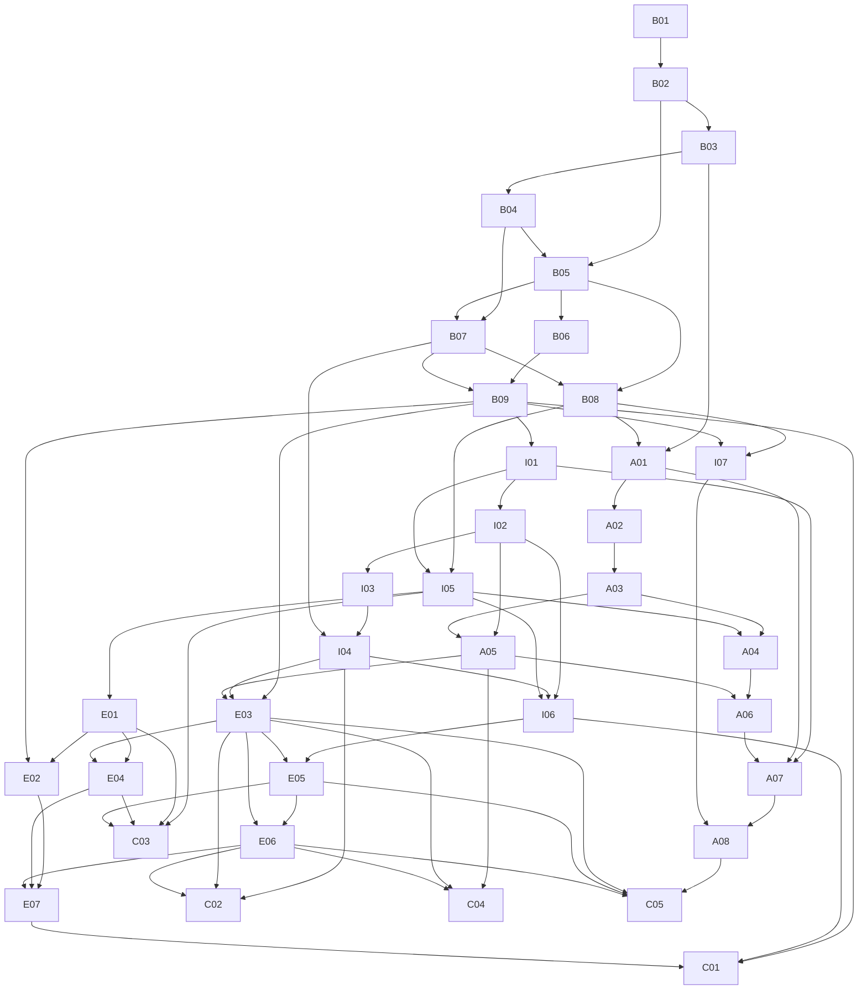

# State-of-the-art enterprise computer vision and multimodal AI curriculum architecture

> Research and tooling review date: **2026-08-31**. This document defines the course architecture; it intentionally does not generate every course yet.

## Design decisions

The proposed sequence is improved in four ways:

1. Classical image mechanics remain a short diagnostic foundation, not the center of the program.
2. Self-supervised representations precede vision foundation models, so learners understand where transferable embeddings come from.
3. Geometry begins before spatial foundation models and embodied AI, preventing language-model fluency from substituting for coordinate, camera, and scene reasoning.
4. Evaluation, security, privacy, and observability are introduced inside earlier courses, then consolidated as enterprise disciplines before any capstone can act on tools or physical systems.

The capability arc is:

```text
Perception → Representation → Vision Foundation Models
→ Vision-Language Understanding → Multimodal Reasoning
→ Spatial Intelligence → World Modeling → Planning → Action
```

“Beginner” means beginner in modern computer vision. Learners already know Python, NumPy/Pandas, basic machine learning and deep learning, and basic PyTorch.

---

## A. Technology landscape

### 2026 classification

| Classification | Technologies | Evidence and curriculum interpretation |
| --- | --- | --- |
| Established | CNN/transformer backbones, transfer learning, DETR/YOLO-style detection, semantic/instance segmentation, tracking, contrastive image-text embeddings, PyTorch training, ONNX interchange, task-specific evaluation | These are widely implemented, deployed, and supported by mature libraries. Teach mechanisms and trade-offs, then use them as baselines for newer systems. |
| Growing | Self-supervised universal backbones, open-vocabulary recognition, promptable concept segmentation/tracking, VLMs, document VLMs, multimodal retrieval, long-video understanding, Gaussian scene representations, edge accelerators | [DINOv3](https://ai.meta.com/research/publications/dinov3/), [SAM 3](https://ai.meta.com/research/publications/sam-3-segment-anything-with-concepts/), and the [Qwen3-VL report](https://arxiv.org/abs/2511.21631) show active scaling and capability expansion. These deserve hands-on comparison with fixed-task baselines and explicit licensing/compute review. |
| Frontier | Spatial foundation models, agentic vision, world foundation models, VLA policies, dynamic 4D representations, embodied reasoning, multimodal test-time reasoning | [Cosmos](https://research.nvidia.com/labs/cosmos-lab/), [GR00T N1.6](https://research.nvidia.com/labs/gear/gr00t-n1_6/), [Gemini Robotics](https://deepmind.google/models/gemini-robotics/), and current spatial-reasoning benchmarks indicate substantial research and platform investment. Teach in bounded simulations with reproducibility and safety caveats. |
| Experimental | Codec-native streaming VLMs, generative 4D worlds, action-conditioned learned simulators, whole-body generalist policies, multi-robot foundation agents, multimodal reasoning optimized mainly by reinforcement learning | Sources such as [Mage-VL](https://arxiv.org/abs/2607.24904) and [Open Vision Reasoner](https://arxiv.org/abs/2507.05255) provide early evidence, not settled practice. Treat these as critical-reading and replication topics rather than default enterprise recommendations. |

### What is becoming less strategic

- Long sequences of hand-engineered-feature tutorials: retain convolution, edges, keypoints, geometry, and matching where they reveal invariants or provide robust baselines.
- Closed-set classification as the default framing for vision: retain it as a diagnostic primitive, then progress to embeddings, grounding, open vocabularies, structured outputs, video, and action.
- Single-image accuracy as sufficient evaluation: require slice, calibration, grounding, temporal, spatial, latency, memory, and operational measures.
- One-model API demos: compare representations, data contracts, adaptation strategies, failure modes, and deployment paths.
- Visual agents authorized only by prompts: authorization, tool schemas, approvals, budgets, idempotency, and result verification stay outside the model.

### Source discipline

Every state-of-the-art lesson must date its review; cite primary papers, official technical reports, model cards, code and datasets; reproduce a relevant result when feasible; and separate author-reported evidence from local evidence. The repository-wide rules are in [ROADMAP.md](../ROADMAP.md#how-a-lesson-may-claim-state-of-the-art).

---

## B. Curriculum map

### Beginner — modern perception and representation

`B01 Modern CV foundations → B02 Modern CNNs/efficient vision → B03 Vision transformers → B04 Self-supervised learning → B05 Object detection → B06 Segmentation/promptable segmentation → B07 Embeddings/metric learning/retrieval → B08 Tracking/keypoints/pose → B09 Vision foundation models/open-vocabulary vision`

### Intermediate — multimodal understanding and agents

`I01 VLM architecture → I02 Visual grounding/reasoning → I03 Document intelligence → I04 Multimodal RAG → I05 Video intelligence → I06 Visual agents`

`I07 Synthetic data and dataset engines` branches from B08/B09 and supports advanced/enterprise work.

### Advanced — spatial and embodied intelligence

`A01 Geometry/depth/pose → A02 3D representations → A03 Reconstruction → A04 Dynamic 4D scenes → A05 Spatial intelligence → A06 World models → A07 VLA systems → A08 Embodied simulation`

### Enterprise / production

`E01 Streaming architecture → E02 efficient/edge inference → E03 evaluation/assurance → E04 observability/data engines → E05 security/robustness → E06 privacy/governance → E07 platform lifecycle`

Enterprise topics are cross-cutting gates, not an afterthought. Their dedicated courses consolidate patterns already introduced earlier.

### Capstones

- C01 Enterprise visual inspection platform
- C02 Multimodal enterprise knowledge system
- C03 Video intelligence platform
- C04 Spatial intelligence system
- C05 Embodied vision agent

---

## C. Course table

| # | Course | Level | Core concepts | Primary technologies | Practical lab | Prerequisites |
| --- | --- | --- | --- | --- | --- | --- |
| B01 | Modern Computer Vision Foundations | Beginner | Task taxonomy, image contracts, convolution, receptive fields, CNNs, transfer, embeddings, augmentation, leakage, metrics, shift, failure analysis | NumPy, Pillow, PyTorch, torchvision, scikit-learn | Five-class visual inspection: scratch CNN vs frozen ResNet/ConvNeXt vs partial fine-tuning | Python/NumPy/basic ML/PyTorch |
| B02 | Modern CNN Architectures & Efficient Vision | Beginner | Residual/ConvNeXt/efficient/hybrid design, scaling, profiling, adaptation depth, export constraints | PyTorch, torchvision, timm, profiling/export tools | Reproducible backbone benchmark on target-quality and latency budgets | B01 |
| B03 | Vision transformers | Beginner | Patches, positions, attention, hierarchy, CNN/ViT/Swin trade-offs | PyTorch, torchvision, timm/Transformers review | Industrial inspection benchmark under patch-size, source, and resolution shift | B02 |
| B04 | Self-Supervised Visual Representation Learning | Beginner | Contrastive learning, masked modeling, collapse, probing, embeddings | PyTorch, Transformers/timm, FAISS | Product-image similarity with frozen encoders | B03 |
| B05 | Object Detection | Beginner | Anchor/anchor-free prediction, assignment, DETR matching, NMS, AP, error decomposition and open-set transition | torchvision, Detectron2/OpenMMLab, Ultralytics comparison | Warehouse package detector with small-object and occlusion slices | B02, B04 |
| B06 | Segmentation & Promptable Segmentation | Beginner | Semantic/instance/panoptic masks, losses, boundaries, prompts and mask quality | torchvision, OpenMMLab, SAM-family comparison | Segment conveyor parts and compare task-specific with promptable baselines | B05 |
| B07 | Visual Embeddings, Metric Learning & Retrieval | Beginner | Siamese models, contrastive/triplet objectives, similarity search, re-identification, hard-negative mining, retrieval metrics | PyTorch, FAISS/Qdrant comparison, FiftyOne optional | Product retrieval and duplicate/mislabel/OOD discovery | B04, B05 |
| B08 | Tracking, Keypoints & Pose | Beginner | Association, temporal identity, occlusion, keypoints, pose, temporal metrics | torchvision, OpenCV, reviewed tracking/pose toolkits | Track and estimate pose for warehouse people/packages through occlusion | B05, B07 |
| B09 | Vision Foundation Models & Open-Vocabulary Vision | Beginner | Frozen backbones, prompts, open-vocabulary detection, concept segmentation, open-world errors | DINO/CLIP/SAM-family, Grounding DINO/OWL-style models | Add a novel defect concept with minimal labels | B04, B06, B07 |
| I01 | Vision-language model architecture and adaptation | Intermediate | Encoders, projectors, tokens, cross-attention, instruction tuning, PEFT | Transformers, PyTorch, PEFT | Adapt an open VLM to inspection explanations | B09 |
| I02 | Visual grounding and reasoning | Intermediate | Regions, referring expressions, counting, comparison, charts, evidence | Transformers, task evaluators | Evidence-backed reasoning over dashboards and site images | I01 |
| I03 | Enterprise document intelligence | Intermediate | OCR, layout, tables, charts, diagrams, structured extraction | PyMuPDF/Docling, OCR, LayoutParser, VLMs, Pydantic | Insurance loss-report extraction with provenance | I01, I02 |
| I04 | Multimodal retrieval and RAG | Intermediate | Page/region/image/video embeddings, late interaction, reranking, grounding | Transformers, FAISS/Qdrant, document tooling | Search manuals, diagrams, tables, and inspection images | B07, I03 |
| I05 | Video intelligence and temporal reasoning | Intermediate | Sampling, action/event recognition, localization, tracking, long video | PyTorchVideo/torchvision, decord/OpenCV, video VLMs | Logistics event search and temporal QA | B08, I01 |
| I06 | Visual agents and tool use | Intermediate | Perception-tool loops, multimodal memory, plans, approvals, verification | VLM SDKs, typed Python tools, retrieval, workflow graphs when justified | Factory anomaly agent with ticket draft and human gate | I02, I04, I05 |
| I07 | Synthetic data and dataset engines | Intermediate | Generation, simulation, domain randomization, rare events, sim-to-real | Blender/Isaac Sim where justified, Albumentations, FiftyOne | Rare warehouse hazard dataset with reality-gap audit | B08, B09 |
| A01 | Camera geometry, depth, and pose | Advanced | Calibration, epipolar geometry, depth, pose, odometry, uncertainty | OpenCV, Kornia, PyTorch | Calibrate cameras and estimate depth/pose for a workcell | B03, B08 |
| A02 | 3D representations and neural rendering | Advanced | Point clouds, meshes, voxels, implicit fields, NeRF, Gaussians | Open3D, PyTorch3D, Nerfstudio, gsplat | Compare representations for a scanned asset | A01 |
| A03 | 3D reconstruction systems | Advanced | SfM, MVS, camera estimation, fusion, quality metrics | COLMAP, Open3D, Nerfstudio | Reconstruct a construction site from images/video | A01, A02 |
| A04 | Dynamic and 4D vision | Advanced | Scene flow, dynamic reconstruction, temporal consistency, dynamic Gaussians | PyTorch, Open3D, research implementations | Model moving equipment in a dynamic scene | I05, A03 |
| A05 | Spatial intelligence and memory | Advanced | Relations, scene graphs, navigation, reachability, spatial memory | VLMs, Open3D, graph tooling | Answer auditable spatial questions over a warehouse twin | I02, A03 |
| A06 | World models and learned simulation | Advanced | Latent dynamics, video prediction, action conditioning, planning models | PyTorch, Cosmos/open research models, simulators | Predict workcell futures and test planning usefulness | A04, A05 |
| A07 | Vision-language-action systems | Advanced | Observations/actions, behavior cloning, diffusion policies, VLA adaptation | LeRobot, PyTorch, open VLA checkpoints | Language-conditioned manipulation from demonstrations | I01, A01, A06 |
| A08 | Embodied AI in simulation | Advanced | Closed-loop policies, navigation/manipulation, feedback, recovery, sim-to-real | MuJoCo, ManiSkill; Habitat/Isaac Lab by scenario | Observe-plan-act-correct warehouse task | A07, I07 |
| E01 | Production and streaming vision architecture | Enterprise | RTSP, ingestion, queues, async/batching, storage, lineage, SLOs | GStreamer/OpenCV, Kafka where justified, cloud-neutral services | Multi-camera inspection pipeline under backpressure | I05 |
| E02 | Efficient inference and edge vision | Enterprise | Profiling, compilation, quantization, distillation, power/memory | ONNX Runtime, TensorRT/Triton, OpenVINO/Core ML alternatives | Export and benchmark on a defined edge target | B09, E01 |
| E03 | Evaluation and assurance | Enterprise | Task/VLM/RAG/3D/agent metrics, slices, calibration, uncertainty, gates | pytest, FiftyOne, MLflow/W&B optional, custom evaluators | Versioned evaluation harness and release gate | B09, I04, A05 |
| E04 | Vision observability and data engines | Enterprise | Camera/image/embedding drift, clusters, latency/GPU/cost, safe samples | OpenTelemetry, Prometheus/Grafana, FiftyOne, data stores | Detect lighting/camera drift and open a review queue | E01, E03 |
| E05 | Security and robustness | Enterprise | Patches, spoofing, poisoning, visual/multimodal injection, unsafe tools | Adversarial test harnesses, sandboxed tools, policy layer | Red-team a visual maintenance agent | I06, E03 |
| E06 | Privacy, governance, and responsible vision | Enterprise | Biometrics, consent, retention, provenance, copyright, bias, audit | Datasheets/model cards, policy-as-code, access/audit controls | Governance pack and demographic/slice review | E03, E05 |
| E07 | Enterprise CV platform lifecycle | Enterprise | Registry, CI/CD, staged rollout, rollback, fleet/device identity, FinOps | Containers, model registry, orchestration, IaC concepts | Canary a multimodal service with rollback and cost SLO | E02, E04, E06 |
| C01 | Enterprise visual inspection platform | Capstone | Anomaly, segmentation, VLM evidence, history, review, observability | Selected stack from B–E | Production-style manufacturing inspection platform | B09, I06, E07 |
| C02 | Multimodal enterprise knowledge system | Capstone | Documents/images/charts/video RAG, attribution, authorization | Document AI, embeddings, vector store, VLM | Governed multimodal knowledge assistant | I04, E03, E06 |
| C03 | Video intelligence platform | Capstone | Events, tracking, temporal reasoning, search, alerts | Video stack, VLM, retrieval, streaming | Auditable logistics video operations platform | I05, E01, E04, E05 |
| C04 | Spatial intelligence system | Capstone | Reconstruction, objects, relations, questions, spatial memory | COLMAP/Open3D/Nerfstudio, VLM, graph store | Queryable construction-site spatial twin | A05, E03, E06 |
| C05 | Embodied vision agent | Capstone | Observe, reason, plan, act, verify, recover, approve | LeRobot + selected simulator, VLM/VLA, traces | Safe simulated warehouse manipulation agent | A08, E03, E05, E06 |

---

## D. Course specifications

### Beginner

#### B01 — Modern Computer Vision Foundations

- **Why it matters:** every later architecture relies on correct task framing, image contracts, useful representations, honest evaluation, and controlled decisions.
- **Objectives/concepts:** classify vision tasks by output contract; inspect and deliberately break image-tensor boundaries; verify convolution; calculate and probe receptive fields; train a compact CNN; compare frozen and partially fine-tuned pretrained encoders; use embeddings for dataset intelligence; detect leakage and shortcuts; measure source shift and calibration; analyse failures with bounded Grad-CAM; define cost-aware abstention and monitoring.
- **Technologies:** NumPy, Pillow, Matplotlib, pandas, scikit-learn, PyTorch, torchvision.
- **Research:** CNN/ResNet/ConvNeXt foundations, shortcut learning and distribution shift, plus an orientation map to ViT, DINOv3, CLIP/SigLIP, SAM-family, spatial, world-model, and VLA systems.
- **Lab/deliverable:** a five-class enterprise visual-quality inspection experiment with a generated multi-source dataset, tensor-contract fault injection, manual/framework convolution equivalence, learned-filter and receptive-field inspection, scratch CNN, real ResNet-18 and ConvNeXt-Tiny weights, embedding triage, calibration and reliability plots, shift stress test, Grad-CAM, cost-aware abstention curves, optional VisA adapter, and JSON decision record.
- **Enterprise relevance/prerequisites:** establishes the evidence and risk vocabulary used throughout the curriculum; Python, NumPy, basic ML, introductory PyTorch.

#### B02 — Modern CNN Architectures & Efficient Vision

- **Why it matters:** the foundations course introduces representation and transfer; this course makes architecture selection a controlled quality/latency/memory experiment.
- **Objectives/concepts:** residual and ConvNeXt blocks, compound scaling, efficient/hybrid networks, profiling, adaptation depth, compilation/export constraints, and target-hardware benchmarking.
- **Technologies:** PyTorch, torchvision, timm, `torch.profiler`, ONNX Runtime where justified.
- **Research:** ResNet, EfficientNet, ConvNeXt/ConvNeXt V2, representative efficient and hybrid architectures, and current model documentation.
- **Lab/deliverable:** reproducible backbone benchmark with frozen, partial, and full adaptation under fixed data, resolution, latency, and memory budgets.
- **Enterprise relevance/prerequisites:** defensible architecture selection and cost control; B01.

#### B03 — Vision transformers *(available)*

- **Why it matters:** transformers underpin modern vision and multimodal foundation models.
- **Objectives/concepts:** patch embeddings, positional information, manual and multi-head attention, pre-norm blocks, hierarchy, token scaling, CNN/ViT/Swin trade-offs, attention-distance diagnostics, and resolution interpolation.
- **Technologies:** PyTorch and torchvision in the executable lab; timm, Transformers, profiling, and deployment runtimes in the tooling review.
- **Research:** ViT, DeiT, Swin, FlexiViT, NaViT, attention-interpretability limits, and the transition to self-supervised foundation backbones.
- **Lab/deliverable:** source-aware industrial inspection experiment with patchification, linear/Conv2d equivalence, manual attention verification, a tiny ViT, four official pretrained encoders, patch-size and resolution studies, attention diagnostics, systems profiling, and a JSON decision record.
- **Enterprise relevance/prerequisites:** architecture selection under data/compute constraints; B02.

#### B04 — Self-Supervised Visual Representation Learning

- **Why it matters:** transferable embeddings reduce dependence on task labels and power retrieval/foundation systems.
- **Objectives/concepts:** contrastive objectives, masked modeling, teacher-student learning, collapse, probing, dense vs global features.
- **Technologies:** PyTorch, Transformers/timm, FAISS.
- **Research:** CLIP, MAE, DINO/DINOv2 and [DINOv3](https://ai.meta.com/research/publications/dinov3/).
- **Lab/deliverable:** product-similarity system comparing a text-aligned encoder and self-supervised encoder across domain slices.
- **Enterprise relevance/prerequisites:** search, few-label adaptation, drift representations; B03.

#### B05 — Object Detection

- **Why it matters:** localization is the bridge from image-level decisions to counting, inspection, safety, video, and robotics.
- **Objectives/concepts:** anchor and anchor-free prediction, assignment, DETR matching, NMS, AP, localization/classification error decomposition, small-object evaluation, and the closed-set-to-open-set transition.
- **Technologies:** torchvision plus a reviewed Detectron2/OpenMMLab/Ultralytics path.
- **Research:** Faster R-CNN, DETR-family, modern YOLO-family documentation, and current detector model cards.
- **Lab/deliverable:** warehouse detector baseline with small-object, occlusion, source, and confidence failure slices.
- **Enterprise relevance/prerequisites:** inventory, safety, logistics, and defect localization; B02, B04.

#### B06 — Segmentation & Promptable Segmentation

- **Why it matters:** masks support precise measurement and evidence, while promptable segmentation changes how new concepts are introduced.
- **Objectives/concepts:** semantic/instance/panoptic tasks, mask losses, class imbalance, boundary quality, prompts, zero/few-shot transfer, and open-world errors.
- **Technologies:** torchvision/OpenMMLab and SAM-family comparison.
- **Research:** Mask R-CNN, modern mask transformers, and the SAM 2/3 evolution.
- **Lab/deliverable:** segment conveyor parts and defects; compare task-specific and promptable baselines with mask/boundary metrics.
- **Enterprise relevance/prerequisites:** precise evidence, editing, and inspection; B05.

#### B07 — Visual Embeddings, Metric Learning & Retrieval

- **Why it matters:** embeddings turn visual data into searchable structure and expose duplicates, mislabels, hard examples, and source clusters.
- **Objectives/concepts:** Siamese encoders, contrastive/triplet objectives, positive and negative sampling, re-identification, approximate nearest neighbours, retrieval metrics, and embedding-space dataset intelligence.
- **Technologies:** PyTorch, FAISS/Qdrant comparison, and FiftyOne as an optional inspection layer.
- **Research:** metric-learning foundations, modern retrieval encoders, and current vector-search documentation.
- **Lab/deliverable:** product retrieval and re-identification system with duplicate, mislabel, OOD, and hard-negative discovery.
- **Enterprise relevance/prerequisites:** catalog search, data quality, identity, and drift analysis; B04, B05.

#### B08 — Tracking, Keypoints & Pose

- **Why it matters:** temporal identity and structured landmarks are essential for video analytics, ergonomics, robotics, and spatial systems.
- **Objectives/concepts:** detection association, occlusion, track lifecycle, temporal consistency, keypoint heatmaps, pose metrics, identity switches, and uncertainty.
- **Technologies:** torchvision, OpenCV, and a reviewed tracking/pose toolkit path.
- **Research:** modern tracking-by-detection, transformer trackers, keypoint and pose-estimation references.
- **Lab/deliverable:** track warehouse people/packages and estimate pose through occlusion with identity and keypoint metrics.
- **Enterprise relevance/prerequisites:** safety, logistics, video search, and human/object motion; B05, B07.

#### B09 — Vision Foundation Models & Open-Vocabulary Vision

- **Why it matters:** promptable and open-vocabulary models change adaptation from fixed taxonomies to reusable perception components.
- **Objectives/concepts:** frozen encoders, prompts, zero/few-shot transfer, concept segmentation, open-vocabulary detection, open-world errors, and adapters.
- **Technologies:** CLIP/DINO/SAM-family, Grounding DINO/OWL-style models, Transformers.
- **Research:** [DINOv3](https://ai.meta.com/research/publications/dinov3/), [SAM 3](https://ai.meta.com/research/publications/sam-3-segment-anything-with-concepts/) and primary open-vocabulary references.
- **Lab/deliverable:** add a novel defect concept with minimal labels; compare task-specific and foundation approaches.
- **Enterprise relevance/prerequisites:** faster adaptation with governance/licensing review; B04, B06, B07.

### Intermediate

#### I01 — Vision-language model architecture and adaptation

- **Why it matters:** VLMs connect perception to language interfaces but introduce grounding and hallucination risks.
- **Objectives/concepts:** vision encoders, projectors, multimodal tokens, fusion, instruction tuning, PEFT, native resolution.
- **Technologies:** PyTorch, Transformers, PEFT, representative open checkpoints.
- **Research:** LLaVA-style adapters, Flamingo-style cross-attention, current open VLM reports including [Qwen3-VL](https://arxiv.org/abs/2511.21631).
- **Lab/deliverable:** adapt and compare VLMs for inspection explanations with evidence fields.
- **Enterprise relevance/prerequisites:** explainable multimodal interfaces and model selection; B09.

#### I02 — Visual grounding and reasoning

- **Why it matters:** fluent answers are not useful unless they are spatially and visually supported.
- **Objectives/concepts:** referring expressions, boxes/masks/points, counting, relations, charts, multi-image reasoning, calibration.
- **Technologies:** Transformers, grounding models, structured evaluators.
- **Research:** primary grounding and multimodal-reasoning benchmarks; current RL-for-reasoning work as frontier reading.
- **Lab/deliverable:** dashboard/site-image QA with region evidence and categorized failures.
- **Enterprise relevance/prerequisites:** trustworthy decisions over visual evidence; I01.

#### I03 — Enterprise document intelligence

- **Why it matters:** real enterprise vision is often documents, layouts, tables, charts, and diagrams rather than photos.
- **Objectives/concepts:** OCR, layout graphs, tables, charts, reading order, schema extraction, provenance.
- **Technologies:** PyMuPDF/Docling, OCR engines, LayoutParser, VLMs, Pydantic.
- **Research:** LayoutLM/Donut-style architectures, document VLM reports, official parsing/OCR docs.
- **Lab/deliverable:** loss-report pipeline producing validated JSON with page/region citations and abstention.
- **Enterprise relevance/prerequisites:** claims, finance, compliance, operations documents; I01, I02.

#### I04 — Multimodal retrieval and RAG

- **Why it matters:** enterprise answers must find and cite evidence across text, pages, regions, images, charts, and video.
- **Objectives/concepts:** cross-modal embeddings, page/region indexing, late interaction, reranking, authorization, grounding evaluation.
- **Technologies:** Transformers, FAISS/Qdrant, document tools, VLMs.
- **Research:** CLIP-style retrieval, late-interaction research, multimodal RAG evaluation sources.
- **Lab/deliverable:** manuals/diagrams/inspection-image assistant with evidence attribution and permission filters.
- **Enterprise relevance/prerequisites:** governed multimodal knowledge systems; B07, I03.

#### I05 — Video intelligence and temporal reasoning

- **Why it matters:** events, actions, and causality live across time, not isolated frames.
- **Objectives/concepts:** decoding/sampling, temporal features, localization, tracking, memory, long-video QA, event detection.
- **Technologies:** OpenCV/decord, torchvision/PyTorchVideo where maintained, video VLMs.
- **Research:** video transformers, SAM video memory, long-video and streaming multimodal work.
- **Lab/deliverable:** logistics event index with temporal evidence, missed-event analysis, and throughput profile.
- **Enterprise relevance/prerequisites:** operations, safety, media, and monitoring; B08, I01.

#### I06 — Visual agents and tool use

- **Why it matters:** perception becomes operational only through bounded retrieval, reasoning, tools, decisions, and verification.
- **Objectives/concepts:** typed perception outputs, tool routing, multimodal memory, plans, approvals, idempotency, receipts, stop conditions.
- **Technologies:** VLM SDKs, Pydantic, retrieval, narrow Python tools, workflow graphs only where durable state adds value.
- **Research:** visual-agent and computer-use benchmarks, multimodal injection literature, official agent/tool safety guidance.
- **Lab/deliverable:** factory anomaly agent that gathers evidence and drafts—but cannot autonomously submit—a maintenance ticket.
- **Enterprise relevance/prerequisites:** controlled automation and auditability; I02, I04, I05.

#### I07 — Synthetic data and dataset engines

- **Why it matters:** rare events, privacy constraints, and embodiment make synthetic data attractive but realism gaps can mislead.
- **Objectives/concepts:** procedural generation, simulation, domain randomization, synthetic labels, rare events, sim-to-real, quality tests.
- **Technologies:** Blender/Isaac Sim by scenario, Albumentations, FiftyOne.
- **Research:** domain-randomization, synthetic-to-real and data-engine primary studies; world-model generation as frontier.
- **Lab/deliverable:** rare warehouse-hazard dataset plus provenance, coverage, bias, and reality-gap report.
- **Enterprise relevance/prerequisites:** scalable data acquisition with validation; B08, B09.

### Advanced

#### A01 — Camera geometry, depth, and pose

- **Why it matters:** spatial systems fail when coordinate frames and camera assumptions are implicit.
- **Objectives/concepts:** camera models, calibration, epipolar geometry, triangulation, depth, pose, odometry, uncertainty.
- **Technologies:** OpenCV, Kornia, PyTorch.
- **Research:** foundational multiview geometry plus current monocular depth/pose foundation work.
- **Lab/deliverable:** calibrated workcell with depth/pose estimates, uncertainty, and known-degeneracy tests.
- **Enterprise relevance/prerequisites:** robotics, measurement, mapping, AR; B03, B08.

#### A02 — 3D representations and neural rendering

- **Why it matters:** representation choice controls editability, rendering, geometry, memory, and downstream reasoning.
- **Objectives/concepts:** point clouds, meshes, voxels, implicit fields, NeRFs, Gaussian splats, differentiable rendering.
- **Technologies:** Open3D, PyTorch3D, Nerfstudio, gsplat.
- **Research:** NeRF and [3D Gaussian Splatting](https://repo-sam.inria.fr/fungraph/3d-gaussian-splatting/) primary work.
- **Lab/deliverable:** representation comparison for a scanned asset using geometry, rendering, memory, and latency metrics.
- **Enterprise relevance/prerequisites:** digital twins, inspection, simulation, media; A01.

#### A03 — 3D reconstruction systems

- **Why it matters:** reconstruction is an end-to-end estimation pipeline, not a viewer demo.
- **Objectives/concepts:** SfM, MVS, poses, depth fusion, loop/scale issues, coordinate alignment, completeness/accuracy.
- **Technologies:** COLMAP, Open3D, Nerfstudio.
- **Research:** COLMAP references, neural reconstruction and geometry-aware foundation work.
- **Lab/deliverable:** construction-site reconstruction with camera/geometry diagnostics and provenance.
- **Enterprise relevance/prerequisites:** site capture and asset monitoring; A01, A02.

#### A04 — Dynamic and 4D vision

- **Why it matters:** real scenes deform and move; static reconstructions erase operational behavior.
- **Objectives/concepts:** 3D + time, scene flow, motion separation, dynamic reconstruction, temporal consistency, 4D Gaussians.
- **Technologies:** PyTorch, Open3D, carefully selected research implementations.
- **Research:** scene-flow/dynamic-NeRF work and [4D Gaussian Splatting](https://arxiv.org/abs/2310.08528).
- **Lab/deliverable:** dynamic equipment scene with motion/temporal metrics and failure analysis.
- **Enterprise relevance/prerequisites:** operations replay, sports, robotics, simulation; I05, A03.

#### A05 — Spatial intelligence and memory

- **Why it matters:** recognizing objects does not imply reliable relations, reachability, navigation, or persistent scene understanding.
- **Objectives/concepts:** frames, relations, containment, distance, scene graphs, navigation, affordances, spatial memory.
- **Technologies:** Open3D, VLMs, graph tools, vector/relational stores where justified.
- **Research:** current [object-centric spatial reasoning benchmarks](https://arxiv.org/abs/2509.21922) and 3D-language grounding.
- **Lab/deliverable:** auditable warehouse spatial QA with geometry-backed answers and memory updates.
- **Enterprise relevance/prerequisites:** digital twins, field service, navigation; I02, A03.

#### A06 — World models and learned simulation

- **Why it matters:** predictive models connect perception to future states, planning, and data generation.
- **Objectives/concepts:** latent dynamics, video prediction, action conditioning, uncertainty, controllability, planning usefulness.
- **Technologies:** PyTorch, simulators, selected [Cosmos](https://research.nvidia.com/labs/cosmos-lab/) or open research models.
- **Research:** Dreamer-style latent models, video world models, current physical-AI reports.
- **Lab/deliverable:** future-state predictor evaluated for both visual fidelity and downstream planning decisions.
- **Enterprise relevance/prerequisites:** robotics, autonomy, scenario generation; A04, A05.

#### A07 — Vision-language-action systems

- **Why it matters:** VLAs turn multimodal representations into policies, raising new data, control, generalization, and safety questions.
- **Objectives/concepts:** observations, action tokens/diffusion, behavior cloning, policy adaptation, embodiment transfer, feedback.
- **Technologies:** LeRobot, PyTorch, selected open VLA checkpoints.
- **Research:** RT-2, OpenVLA-family work, [GR00T N1.6](https://research.nvidia.com/labs/gear/gr00t-n1_6/), [Gemini Robotics](https://deepmind.google/models/gemini-robotics/).
- **Lab/deliverable:** simulated language-conditioned manipulation policy with held-out instruction/object evaluation.
- **Enterprise relevance/prerequisites:** flexible automation with strict action boundaries; I01, A01, A06.

#### A08 — Embodied AI in simulation

- **Why it matters:** closed-loop success depends on observation, planning, action, verification, recovery, and system timing.
- **Objectives/concepts:** navigation/manipulation environments, control loops, rewards/demonstrations, recovery, sim-to-real, safety envelopes.
- **Technologies:** MuJoCo + ManiSkill default; Habitat for navigation or Isaac Lab for GPU/synthetic-data scenarios after fit review.
- **Research:** benchmark/task papers for the selected simulator and embodied-policy evaluations.
- **Lab/deliverable:** observe-plan-act-correct warehouse task with bounded actions and intervention logs.
- **Enterprise relevance/prerequisites:** robotics prototyping without physical-hardware risk; A07, I07.

### Enterprise / production

#### E01 — Production and streaming vision architecture

- **Why it matters:** camera systems are distributed, bursty, stateful and failure-prone.
- **Objectives/concepts:** RTSP/media ingestion, queues, backpressure, async/batching, post-processing, storage, lineage, SLOs.
- **Technologies:** GStreamer/OpenCV, event streams, containers and cloud-neutral services.
- **Research/docs:** official media, streaming and serving documentation; measured architecture patterns.
- **Lab/deliverable:** multi-camera pipeline surviving disconnects, overload, duplicates, and delayed frames.
- **Enterprise relevance/prerequisites:** reliable real-time operations; I05.

#### E02 — Efficient inference and edge vision

- **Why it matters:** latency, memory, power, privacy, and connectivity determine whether models can operate at the edge.
- **Objectives/concepts:** profiling, export, operator parity, quantization, distillation, compilation, batching, thermal limits.
- **Technologies:** ONNX Runtime; TensorRT/Triton for NVIDIA; OpenVINO/Core ML alternatives by target.
- **Research/docs:** official runtime/export docs and MLPerf-style methodology where applicable.
- **Lab/deliverable:** source-vs-export accuracy and performance report on a named hardware target.
- **Enterprise relevance/prerequisites:** defensible deployment selection; B09, E01.

#### E03 — Evaluation and assurance

- **Why it matters:** one accuracy number cannot validate multimodal, spatial, video, or agent systems.
- **Objectives/concepts:** task metrics, retrieval/grounding, temporal/spatial consistency, calibration, uncertainty, slices, gates.
- **Technologies:** pytest, FiftyOne, portable metric code; MLflow/W&B optional.
- **Research/docs:** benchmark primary sources and evaluator limitations for every task.
- **Lab/deliverable:** versioned cross-task evaluation harness with regression and release gates.
- **Enterprise relevance/prerequisites:** release evidence and accountable decisions; B09, I04, A05.

#### E04 — Vision observability and data engines

- **Why it matters:** cameras, inputs, embeddings, dependencies and costs drift after deployment.
- **Objectives/concepts:** image-quality/camera/data/embedding drift, clusters, latency, GPU utilization, cost, safe samples.
- **Technologies:** OpenTelemetry, Prometheus/Grafana, FiftyOne, feature/metadata stores.
- **Research/docs:** official telemetry standards plus drift/evaluation research.
- **Lab/deliverable:** drift incident with privacy-safe review queue, diagnosis, mitigation and alert tuning.
- **Enterprise relevance/prerequisites:** operational feedback loops; E01, E03.

#### E05 — Security and robustness

- **Why it matters:** visual inputs can attack perception, VLM context, training data, tools and physical outcomes.
- **Objectives/concepts:** adversarial examples/patches, spoofing, poisoning, visual prompt injection, jailbreaks, tool misuse.
- **Technologies:** adversarial test harnesses, typed validators, sandboxing, policy/approval layers.
- **Research/docs:** primary adversarial-vision and multimodal-injection work; security standards/guidance.
- **Lab/deliverable:** red-team report and defense-in-depth controls for a maintenance agent.
- **Enterprise relevance/prerequisites:** prevent visual input from becoming unchecked action; I06, E03.

#### E06 — Privacy, governance, and responsible vision

- **Why it matters:** images may encode identity, biometrics, location, behavior, property and copyrighted material.
- **Objectives/concepts:** purpose/consent, minimization, retention, PII/biometrics, provenance, copyright, bias, cards, audit.
- **Technologies:** access/audit controls, dataset/model cards, policy-as-code and governance artifacts.
- **Research/docs:** applicable laws/standards must be researched for the deployment jurisdiction at lesson time.
- **Lab/deliverable:** data/model/system card, retention/access policy, slice report and approval record.
- **Enterprise relevance/prerequisites:** lawful, reviewable system operation; E03, E05.

#### E07 — Enterprise CV platform lifecycle

- **Why it matters:** models must be versioned, tested, promoted, observed, rolled back, secured and costed as a system.
- **Objectives/concepts:** registry, CI/CD, reproducibility, canaries, rollback, fleet/device identity, secrets, SLOs, FinOps.
- **Technologies:** containers, registries, orchestrators and infrastructure-as-code selected by deployment context.
- **Research/docs:** official platform docs, supply-chain standards, reliability practice.
- **Lab/deliverable:** staged multimodal-service rollout with evaluation gate, cost budget, telemetry and rollback drill.
- **Enterprise relevance/prerequisites:** operating model for all capstones; E02, E04, E06.

### Capstones

#### C01 — Enterprise visual inspection platform

- **Why/objectives:** unite anomaly detection, segmentation, foundation perception, history, VLM evidence and human review.
- **Technologies/research:** selected and justified from B09, I04/I06 and E01–E07; current primary model sources.
- **Lab/deliverable:** deployable manufacturing platform, evaluation pack, observability dashboard, threat model and review workflow.
- **Enterprise relevance/prerequisites:** end-to-end quality operations; B09, I06, E07.

#### C02 — Multimodal enterprise knowledge system

- **Why/objectives:** retrieve and cite PDFs, images, diagrams, charts, tables and videos under permissions.
- **Technologies/research:** document parsers, multimodal embeddings, vector/search store, VLM, reranker and evaluation.
- **Lab/deliverable:** governed assistant with region/page/time citations, abstention, audit and regression suite.
- **Enterprise relevance/prerequisites:** multimodal knowledge access; I04, E03, E06.

#### C03 — Video intelligence platform

- **Why/objectives:** turn continuous video into searchable events, tracks, temporal evidence and bounded alerts.
- **Technologies/research:** video ingestion/decoding, detection/tracking, video embeddings/VLM, event store.
- **Lab/deliverable:** logistics platform with temporal search, alert evidence, backpressure, drift and security tests.
- **Enterprise relevance/prerequisites:** operational video analytics; I05, E01, E04, E05.

#### C04 — Spatial intelligence system

- **Why/objectives:** reconstruct a scene, identify entities/relations, answer spatial questions and maintain memory.
- **Technologies/research:** COLMAP/Open3D/Nerfstudio, grounding/VLM, graph and spatial stores.
- **Lab/deliverable:** queryable site twin with coordinate contracts, evidence, geometry metrics and memory updates.
- **Enterprise relevance/prerequisites:** construction, logistics, field operations; A05, E03, E06.

#### C05 — Embodied vision agent

- **Why/objectives:** close the observe-understand-plan-act-verify-recover loop safely in simulation.
- **Technologies/research:** LeRobot, MuJoCo/ManiSkill or justified alternative, VLM/VLA policy and trace evaluator.
- **Lab/deliverable:** simulated warehouse agent with action bounds, intervention, recovery, evaluation and governance pack.
- **Enterprise relevance/prerequisites:** evidence-based embodied automation; A08, E03, E05, E06.

---

## E. Dependency graph



---

## F. Technology decisions

### Repository-wide primary stack

| Decision | Recommendation | Rationale |
| --- | --- | --- |
| Language/runtime | Python 3.11 baseline | Broad SDK support and reproducible notebooks; later versions can be added after compatibility checks. |
| Notebook contract | One self-contained `.ipynb` per course; all teaching code in the notebook | Preserves the complete narrative and avoids hidden helper modules. CI executes notebooks top-to-bottom. |
| Numeric/visual basics | NumPy, Matplotlib, Pillow; OpenCV when camera/classical/video functionality is material | Common, inspectable tools; OpenCV is a utility rather than the curriculum's organizing principle. |
| Training | PyTorch + torchvision | Primary learning/runtime path with broad model and deployment interoperability. |
| Model ecosystem | Hugging Face Transformers + timm | Common access to modern encoders, VLMs, processors, model cards and weights. Pin versions and review each checkpoint license. |
| Task frameworks | torchvision first; Detectron2 or focused OpenMMLab components for architecture comparisons; Ultralytics only with explicit licensing review | Avoids teaching three overlapping frameworks as defaults. GitHub status checked 2026-08-31: these repositories were unarchived; MMDetection showed a materially older last push than the others, so verify maintenance before selecting it for new labs. |
| Data/evaluation | CVAT or Label Studio for annotation; FiftyOne for visual dataset/evaluation analysis; portable metric code in notebooks | Covers annotation, sample-level diagnosis and reproducible metrics without locking evaluation to one hosted service. |
| Retrieval | FAISS for local teaching; Qdrant when filtering/service behavior matters | Moves from inspectable local retrieval to production-like metadata/permission patterns only when justified. |
| Spatial/3D | OpenCV + COLMAP + Open3D; Nerfstudio/gsplat for neural rendering; PyTorch3D only when differentiable operators add value | Separates camera estimation, geometry, visualization and neural rendering responsibilities. |
| Robotics | LeRobot + MuJoCo/ManiSkill default; Habitat for navigation; Isaac Lab when GPU simulation/synthetic data specifically matters | Open, actively maintained core path with scenario-specific alternatives; no physical hardware required. |
| Portable inference | ONNX Runtime baseline | Cross-platform reference for export fidelity and execution-provider comparison. |
| NVIDIA inference | TensorRT for optimization; Triton only when a serving system is part of the lesson | TensorRT teaches compilation/runtime constraints; Triton adds operational weight that is unnecessary in basic notebooks. |
| Other edge targets | OpenVINO for Intel; Core ML for Apple; target-specific alternatives only with actual hardware constraints | Prevents an NVIDIA-only definition of edge deployment. |
| Observability | OpenTelemetry metrics/traces + Prometheus/Grafana patterns; FiftyOne for visual failure clusters | Separates system telemetry from visual sample analysis and keeps standards-based instrumentation. |

### Notebook SDK rules

1. Use common, maintained SDKs named in the course table; do not recreate entire frameworks for pedagogy.
2. Implement the core primitive visibly before invoking the framework abstraction when that reveals mechanics.
3. Print or record important library/model versions and deterministic seeds.
4. Keep a CPU/offline path whenever the learning objective permits; clearly isolate optional GPU/model-download cells.
5. Never require credentials for the default execution path.
6. Validate shapes, dtype/range, coordinate frames, tokenizer/processor settings and exported-model parity.
7. Pin per-course dependencies in `requirements.txt`; avoid installing packages from inside executed notebook cells.
8. Treat remote code, checkpoints, datasets and model artifacts as supply-chain inputs requiring source, revision, license and checksum/provenance review.
9. Keep action/tool integrations simulated or read-only by default; require explicit approval boundaries for external side effects.
10. Use the [tooling review](../TOOLING.md) criteria and update it when a course reveals a new repository-wide decision.

### Tool status snapshot

Repository metadata was checked on 2026-08-31 for PyTorch/torchvision, OpenCV, Transformers, timm, MMDetection, Detectron2, Ultralytics, ONNX Runtime, TensorRT, Triton Server, Open3D, PyTorch3D, LeRobot, MuJoCo, ManiSkill and Habitat-Lab. None was archived at review time. This is only a maintenance signal—not proof of API stability, security, license compatibility, production support, or fitness for a particular course. Recheck the exact release and artifact at implementation time.
